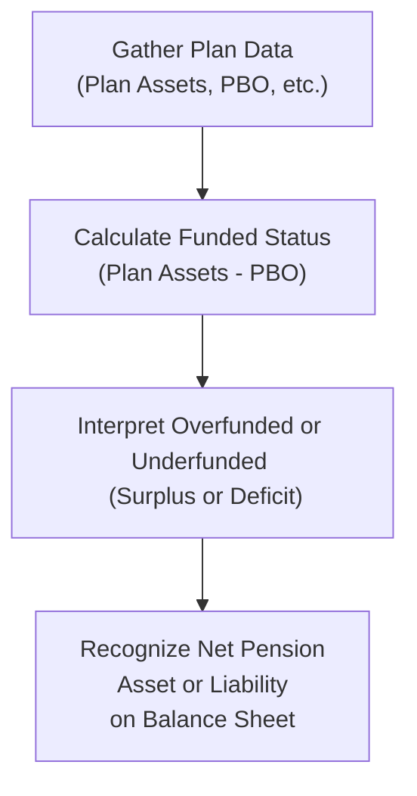

## Overview
So, let's say you’re sitting down to review a company's footnotes on their defined benefit pension plan, and you see a mountain of numbers: plan assets, a projected benefit obligation (PBO), expected returns, contributions... and you’re thinking, “Um, so how do I figure out if this plan is actually well-funded or if it’s going to drain the company’s cash flows in the near future?” Many of us have been there—feeling slightly overwhelmed and possibly missing that direct link between the balance sheet, liquidity, and solvency concerns. Well, you’re in the right place. In this section, we’ll dissect a hypothetical pension scenario step-by-step. By the end, you should be able to pinpoint the plan’s funded status, interpret how this shows up on the financial statements, and evaluate how IFRS vs. US GAAP might generate subtle differences for year-end reporting.

## Understanding Funded Status
The funded status of a defined benefit plan is essentially:

$$
\text{Funded Status} = \text{Plan Assets} - \text{Projected Benefit Obligation (PBO)}
$$

• A positive funded status means the plan’s assets exceed the obligations (often termed overfunded).  
• A negative funded status means the obligations are higher than the assets (underfunded).  

It’s a straightforward formula, but the context around it—like how the numbers change when contributions are made or when plan assumptions get tweaked—can be a bit tricky.

### Why Does This Matter?
• Liquidity Implications: If a plan is underfunded, the company might have to pump in extra cash. That can affect everything from day-to-day operations to the ability to invest in growth.  
• Solvency Measures: Analysts often adjust financial ratios to account for underfunded pension obligations, which may alter debt-to-equity or coverage ratios.  
• Risk Perception: Pension deficits sometimes raise red flags among lenders, creditors, and equity investors.  
• Balance Sheet Presentation: Depending on the standards, you might see a net pension liability or net pension asset recognized. Understanding these lines can be pivotal in evaluating a firm’s overall financial position.

## A Hypothetical Scenario
Imagine a company called Bright Horizons Corp. (totally fictional, but let’s pretend it’s a mid-sized manufacturer). They’ve got a defined benefit pension plan for their long-serving employees. The following data pertains to the end of the current fiscal year:

• Fair Value of Plan Assets (FVPA): $575 million  
• Projected Benefit Obligation (PBO): $600 million  
• Employer Contribution Made Late in the Year: $20 million  
• Expected Return on Plan Assets: 7%  
• Discount Rate Used for PBO: 5%  

Now, you’re tasked with figuring out:  
1) How funded or underfunded are they at year-end?  
2) Whether they report a net pension asset or liability on the balance sheet.  
3) The immediate effect of that $20 million contribution.  
4) Potential IFRS vs. US GAAP differences in the presentation.

### Quick Anecdote
I once analyzed a company’s quarterly report and saw a huge difference between the PBO and plan assets in the footnotes. At first glance, everything looked fine—until I realized they had just done a major plan amendment that increased benefits. That single footnote drastically changed my perspective on the company’s solvency. So always read those pension footnotes carefully.

## Step-by-Step Calculation

### Step 1: Gather the Required Inputs
You typically need: (a) Fair Value of Plan Assets, and (b) Projected Benefit Obligation. Bright Horizons gives us:

• Plan Assets = $575 million  
• PBO = $600 million  

### Step 2: Compute the Funded Status
Using the formula:

$$
\text{Funded Status} = 575 \text{ million} - 600 \text{ million} = -25 \text{ million}
$$

A negative $25 million indicates the plan is underfunded by that amount. 

### Step 3: Recognize the Net Pension Liability or Asset
Under both IFRS and US GAAP, the funded status must generally be recognized on the balance sheet as a net pension liability if it’s negative. So we have:

• Net Pension Liability = $25 million  

Now, that’s the essential recognition. In the old days, there might have been corridor approaches or partial deferrals in some frameworks, but the current standards push you to show the net funded status. If the plan assets were higher, you’d post a net pension asset—subject to possible limits on recognizing pension assets (particularly under IFRS, which restricts recognition of assets to the amount you can realize).

### Step 4: Consider the Impact of the $20 Million Contribution
Here’s where nuance creeps in. Let’s say the contribution was made very late in the year. In practice, that contribution might increase plan assets or reduce the plan’s net liability. But from an accounting perspective, the exact timing of recognition can hinge on the measurement date. If the plan assets figure of $575 million already includes the $20 million, then your underfunded status remains $25 million. If the $20 million was contributed after the official measurement date for year-end, it might show as a subsequent event in the notes and not be fully reflected in this year’s final plan assets on the balance sheet—although it might reduce net liability going forward.

Anyway, understanding that timing is important. For the sake of this example, let’s assume that $575 million is after they made the $20 million contribution (which means that even after that big chunk of money, the plan is still underfunded by $25 million).

### Step 5: Reflect on IFRS vs. US GAAP Differences
Under both IFRS and US GAAP, the funded status concept is essentially the same: you put recognized plan assets minus the defined benefit obligation on the balance sheet. But the differences might pop up in how remeasurements (that is, actuarial gains and losses, return on plan assets, changes in discount rates) are handled:

• IFRS: Remeasurements go straight to other comprehensive income (OCI) and are not recycled into profit or loss.  
• US GAAP: Remeasurements are also recognized in OCI, but historically, there have been corridor approaches and amortization into profit or loss over time. Current GAAP essentially requires the entire funded status on the balance sheet, though you might still see amortization of prior service costs or changes in assumptions.  

No matter the framework, the net pension liability or asset has to appear on the face of the balance sheet. For your exam, watch for subtle differences in the vignettes—like how IFRS might show a big immediate effect in OCI, whereas US GAAP might mention “unrecognized actuarial losses asset” or partial amortizations.

### Step 6: Evaluate the Effect of an Underfunded Plan on Solvency Ratios
A $25 million net pension liability might look minor or major depending on the size of the company’s total assets and equity. Some possible impacts:

• Debt-to-Equity Ratio: If you treat the underfunded portion like a liability, total liabilities go up, equity might remain the same, so the ratio rises.  
• Coverage Ratios: If large contributions are needed in the future, you might have less operational cash flow for debt service.  
• Liquidity: Significant future pension contributions reduce free cash flow available for expansion, dividends, or general working capital needs.

## Diagram: Funding Status Flow
Below is a simple flowchart demonstrating how to arrive at funded status, interpret it, and carry it through to the balance sheet. This is just to give you a quick visual of the typical steps:

## Practical Example with Simple Numbers
Just to make it crystal clear, let’s introduce an easy extension of the scenario:

• Beginning of Year Plan Assets: $550 million  
• Beginning of Year PBO: $580 million  
• Contributions During Year: $20 million  
• Service Cost + Interest Cost on Obligation: $10 million  
• Actuarial Gain on Assets: $5 million  
• Benefit Payments to Retirees: $25 million  

By the end of the year, you might see something like:  
• Plan Assets = $550 million + $20 million (contribution) + $5 million (gain) – $25 million (payments) = $550 million  
  (Interestingly, that gets us back to $550 million, because the net effect is zero with these numbers. This can happen if the gain offsets the difference between contributions and payments, but let's keep going for illustration.)  
• PBO = $580 million + $10 million (service + interest) – $25 million (payments) = $565 million  

Hence,  
• Funded Status = $550 million – $565 million = -$15 million  

In a real scenario, we also consider changes to discount rates or changes in assumptions about mortality or salary growth. But the net effect is a negative funded status of $15 million—so you’d see a $15 million net pension liability. Bear in mind, IFRS vs. US GAAP differences might revolve around how the $5 million actuarial gain is accounted for in the income statement vs. other comprehensive income, but the final funded status recognized on the balance sheet is typically the same under both standards.

## Reading Footnotes Effectively
Exam Tip: Don’t skip those pension disclosures. If you see the phrase “plan amendments” or a big jump in discount rates year over year, that can heavily influence obligations and the resulting funded status. 

Typical footnote elements to look for:  
• Components of net periodic pension cost (service cost, interest cost, expected return on assets, etc.).  
• Actual return on assets vs. expected returns.  
• Actuarial assumptions (discount rate, salary growth rate, mortality tables).  
• Reconciliations of the starting and ending balances of PBO and plan assets.

## Common Pitfalls
• Mixing Up ABO and PBO: PBO stands for Projected Benefit Obligation and typically factors in future salary increases. ABO (Accumulated Benefit Obligation) is sometimes used under US GAAP, but PBO is more standard for IFRS-based measurement.  
• Ignoring Timing of Contributions: A last-minute contribution might reduce your net liability on paper, but if it happens after the measurement date, you might not see that impact in the current period.  
• Overlooking Plan Amendment Costs: Retroactively increasing benefits can balloon the PBO overnight.  
• Not Checking IFRS vs. US GAAP Subtleties: They’re close, but not identical in how changes in assumptions flow through OCI or the income statement.

## Encouraging a Critical Mindset
Perhaps you’ve seen an annual report where the funded status lurks deep in the footnotes. Don’t just take the executive summary at face value. Ask:  
• How might an underfunded plan strain the next year’s cash flow?  
• Does the company expect to make large pension contributions soon?  
• Are there new plan amendments on the horizon that could drastically change these numbers?

When you approach your item set questions on exam day, that’s the kind of critical thinking you want. 

## Conclusion and Next Steps
At this stage, you should be able to:  
• Identify the plan’s surplus or deficit by comparing plan assets to the PBO.  
• Show how that difference transforms into a net pension asset or liability on the balance sheet.  
• Recognize the immediate effect of any extra contributions or large plan amendments.  
• Understand how IFRS vs. US GAAP standards might lead to slightly differing presentations, especially concerning remeasurements.  

This foundation is crucial. Pension accounting can get more elaborate with interest cost components, curtailments, settlements, or advanced management strategies. But if you nail the basic funded status concept, you'll handle the more complex nuances more confidently. In the next chapter, we’ll explore how advanced aspects of pension accounting (like actuarial assumptions and reporting in OCI vs. Income Statement) push the analysis further.

## Glossary
• Funded Status: The difference between plan assets and the PBO (Plan Assets – PBO).  
• Net Pension Asset/Liability: The balance sheet line item representing the funded status (an asset if overfunded, a liability if underfunded).  
• Plan Amendment: A change in plan terms that can immediately affect the level of benefits, thus increasing or decreasing the PBO.  
• Footnotes: Detailed disclosures in financial reports where companies explain the assumptions, results, and potential future impacts of their pension plans.

## References & Further Reading
• CFA Institute: Pension accounting case study resources (see official CFA Institute publications).  
• “Corporate Finance: A Valuation Approach” – for deeper discussions on pension risk analysis.  
• Leading Accounting Firm White Papers: “Analyzing Corporate Pension Obligations for Investment Decisions.”

--------------------------------------------------------------------------------

## Test Your Knowledge: Determining Funded Status in Pension Plans



### 1. Which of the following best describes the funded status of a defined benefit pension plan?
- [ ] The difference between service cost and interest cost only.
- [ ] The difference between total contributions and total benefit payments made during the year.
- [x] The fair value of plan assets minus the projected benefit obligation.
- [ ] The accumulated benefit obligation plus plan assets.

> **Explanation:** Funded status is calculated as Plan Assets minus the Projected Benefit Obligation (PBO). A negative result indicates an underfunded plan, while a positive result indicates an overfunded plan.

### 2. If a company’s plan assets are $1,000,000 and its PBO is $1,200,000, how should the firm report its net pension item under both IFRS and US GAAP (assuming no further adjustments)?
- [ ] A net pension asset of $200,000 on the balance sheet.
- [ ] A net pension expense of $200,000 in the income statement.
- [x] A net pension liability of $200,000 on the balance sheet.
- [ ] No reporting is needed unless there is a plan amendment.

> **Explanation:** Since plan assets ($1,000,000) are lower than the PBO ($1,200,000), the plan is underfunded by $200,000, which should be recognized as a net pension liability on the balance sheet under both IFRS and US GAAP.

### 3. Under IFRS, which of the following is typically correct about remeasurements of the net defined benefit liability?
- [ ] They must be recognized immediately in profit or loss.
- [ ] They are recognized through retained earnings.
- [x] They appear in other comprehensive income (OCI) and are not recycled.
- [ ] They are capitalized as part of intangible assets.

> **Explanation:** IFRS requires remeasurements (including actuarial gains/losses) to be recognized directly in OCI. They remain there without subsequent reclassification to profit or loss.

### 4. A company contributes $50 million to its defined benefit pension plan on the last day of the fiscal year. If the plan assets at year-end are reported as $600 million, how might this late contribution affect the funded status reported under IFRS or US GAAP?
- [ ] It will not affect the funded status because such contributions do not impact plan assets.
- [x] It might be fully reflected in the plan assets if included in the year-end measurement, thereby reducing any pension liability.
- [ ] The funded status calculation is always deferred until the following year.
- [ ] Late contributions are only recognized once benefit payments are made.

> **Explanation:** If the contribution is made before the measurement date, it increases the plan assets, potentially reducing a net pension liability (or increasing a net pension asset). Timing is critical: if it’s after the valuation date, it may fall into disclosures only.

### 5. Which of the following factors most directly increases a firm's projected benefit obligation (PBO)?
- [x] A decrease in the discount rate used to measure the PBO.
- [ ] An increase in the actual return on plan assets.
- [ ] A decrease in contributions to the plan.
- [x] A plan amendment that enhances future benefits.

> **Explanation:** The PBO rises if the discount rate used to measure future payments decreases (makes future obligations look bigger) or if the plan provides more generous benefits. Actual returns on plan assets and contributions directly affect plan assets, not the obligation.

### 6. Why is an underfunded pension plan potentially harmful to a company’s liquidity?
- [ ] Because it lowers the firm’s discount rate.
- [ ] Because net periodic pension cost never flows through operating cash flow.
- [x] Because the firm might need to make additional cash contributions, reducing available resources for other uses.
- [ ] Because it forces the company to shift to a defined contribution plan.

> **Explanation:** An underfunded pension plan can compel the company to allocate more cash to cover the shortfall, thus reducing liquidity for other corporate needs or opportunities.

### 7. How does a net pension liability generally affect a firm’s solvency ratios?
- [ ] It decreases total liabilities, thereby boosting equity.
- [x] It increases total liabilities, potentially weakening measures like debt to equity.
- [ ] It has no impact unless the liability exceeds total assets.
- [ ] It permanently reduces current assets.

> **Explanation:** Adding a net pension liability means higher total liabilities, and that generally worsens debt-to-equity and other leverage-based ratios.

### 8. If a pension plan’s funded status is positive, what might the company show on its balance sheet?
- [x] A net pension asset, subject to any recognition ceiling under IFRS.
- [ ] A net pension liability, offset by intangible assets.
- [ ] A net intangible asset representing prior service costs.
- [ ] No disclosure is required if the plan is overfunded.

> **Explanation:** Overfunded plans typically present a net pension asset. However, IFRS may limit the recognized asset if it cannot be fully realized.

### 9. Which piece of information in the footnotes is most critical for analyzing changes in the PBO due to a plan amendment?
- [ ] The ratio of retirees to active employees.
- [ ] The actual return on plan assets in the previous period.
- [ ] The discount rate used for the PBO.
- [x] The description of the nature and financial impact of the plan amendment.

> **Explanation:** When a plan is amended (for instance, offering higher benefits or changing eligibility), the PBO can change drastically. Reading the details of the amendment helps analysts interpret how much the obligation has increased or decreased.

### 10. True or False: Under US GAAP, remeasurement of the defined benefit obligation and plan assets can lead to a large immediate effect on the income statement.
- [x] True
- [ ] False

> **Explanation:** While current US GAAP continues to show the net funded status on the balance sheet immediately, remeasurements generally go to OCI. However, certain elements (like prior service costs) might be amortized into the income statement, which can create significant swings in reported pension expense. Immediate recognition can occur, for instance, at settlement or curtailment events, though typically the biggest remeasurement components themselves are in OCI.


