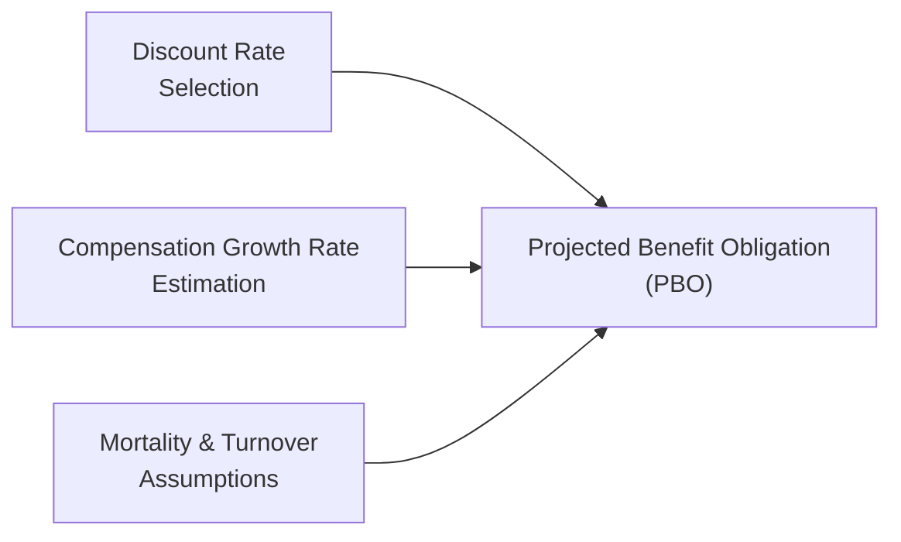

Actuarial assumptions can feel a bit like the hidden gears inside a watch: they do the heavy lifting behind the scenes, even though we mostly see what’s on the surface—namely, the company’s reported pension costs and funding status. But peek beneath that surface, and you’ll see how subtle changes in discount rates or assumptions about employees’ future salaries might lead to hefty shifts in a company’s financial statements. In this section, we’ll dig into these gears, shining light on each major assumption, exploring IFRS vs. US GAAP implications, spotting potential pitfalls, and identifying best practices for analysts.

The Importance of Actuarial Assumptions  
Sometimes, I remember working with a CFO who was fixated on the discount rate. He used to joke, “Raise it a percent, and I can buy dinner for the whole board—drop it a percent, and we might have to cancel the holiday party!” It always reminded me of how much a single assumption can swing a balance sheet. Indeed, the present value of future pension payments depends on a chosen discount rate—usually guided by the yield on high-quality bonds. But that’s not all: you also need estimates of how long employees will live (mortality assumptions), how quickly salaries will rise (compensation growth), and how many folks will stick around until retirement (turnover estimates). Each of these, if chosen optimistically or pessimistically, can tilt the reported pension expense and the firm’s funded status in ways that matter to analysts and shareholders alike.

Key Actuarial Inputs  
• Discount Rate  
  The discount rate is critical because it’s used to convert future benefit payments into present values. When the discount rate goes up, the present value of obligations goes down (and vice versa). If you’ve seen a firm’s projected benefit obligation (PBO) drop dramatically from year to year, chances are the discount rate might have changed—perhaps due to movements in the bond market or a fresh perspective on risk.

• Compensation Growth Rate  
  Plans that base retirement benefits on final or average salaries need to project how fast employees’ wages will grow. If management assumes a swift annual pay increase—say, 4% or 5%—the future obligations will be higher. If they guess 2%, it dampens future pension payments, shrinking the obligation on the books. Because wage inflation can vary across industries and regions, analysts look out for clues that a firm might be using old or unrealistic growth assumptions.

• Expected Return on Plan Assets  
  Under US GAAP, the expected long-term return on plan assets is a separate piece of the pension expense (though IFRS might handle it differently by showing a net figure). A higher expected return will reduce current pension expense. Yes, that sounds convenient for short-term earnings—unless it’s too aggressive, leading to future shortfalls if actual performance disappoints.

• Employee Turnover and Mortality  
  Mortality tables estimate how long individuals are likely to live. The longer your employees live, the more years of pension payouts. Turnover assumptions can also have a big effect: If employees leave the company earlier, they might forfeit certain benefits, lowering the plan’s cost. But if turnover is lower than predicted, future pension payouts could exceed what the company anticipated.

Below is a visual snapshot of how these assumptions feed into the overall PBO calculation:

IFRS vs. US GAAP Differences  
While both IFRS (IAS 19) and US GAAP (ASC 715) hinge on these same broad assumptions, they diverge in presentation and certain disclosures:

• Net Interest vs. Separate Components  
  IFRS lumps interest cost on the liability and the expected return on plan assets into a single net interest figure. The intention is to streamline the reporting. US GAAP, by contrast, separates interest cost from the expected return on plan assets, which can provide more detail to analysts but can also create additional volatility in reported figures.

• Actuarial Gains and Losses  
  Under IFRS, actuarial gains and losses are recognized in Other Comprehensive Income (OCI) immediately, but they’re not recycled back into the income statement in subsequent periods. US GAAP also places these gains and losses in OCI but then amortizes them back into the income statement over time (the “corridor method,” if not elected out). This difference can alter how quickly pension-related swings show up in the bottom line.

• Sensitivity Disclosures  
  Both IFRS and US GAAP now require sensitivity analysis in the notes. You might see statements like: “A 1% decrease in the discount rate would increase the PBO by $XX million.” However, IFRS can sometimes be a bit more prescriptive on how these disclosures are presented, requiring a comprehensive table of impacts to key plan metrics.

From an analyst’s standpoint, it’s helpful to track these differences when comparing companies across borders. A US firm might show a higher pension expense in the income statement than an equivalent IFRS firm simply due to the reporting structure, even if the underlying assumptions are identical.

Sensitivity Analyses—Why They Matter  
If you dig into the pension footnotes and see a table that tinkers with the discount rate or compensation growth by 50 or 100 basis points, it can be eye-opening. You might discover that a 1% shift in the discount rate changes the PBO by tens (or hundreds) of millions of dollars. This tells you everything you need to know about how assumptions feed directly into earnings volatility. If management is setting borderline “optimistic” assumptions, you might want to adjust your own financial models to see how a more conservative approach could affect the firm’s future obligations.

Impact on Earnings Volatility  
Ever notice how a company’s pension expense can jump or drop unpredictably from year to year? That’s the effect of actuarial assumptions intersecting with changing market conditions. A random fluctuation in bond yields might force the firm to dial the discount rate up or down, which then alters pension obligations. Meanwhile, if plan assets underperform, the difference between expected and actual returns can produce immediate or delayed hits to the income statement (depending on IFRS vs. US GAAP). The upshot is that pension items can generate earnings volatility—sometimes overshadowing the operational performance that management might prefer to emphasize.

Best Practices for Analysts  
A healthy dose of skepticism always helps when evaluating pension disclosures. In particular:

• Compare to Industry Norms  
  If every competitor is using a 3% discount rate but your firm sports 4.5%, dig deeper. Maybe they have a legitimate reason—like operating in a different region with higher bond yields. Or maybe they’re trying to dial down current pension costs. Keep an eye on the underlying logic.

• Adjust for Reality  
  Some analysts create an “adjusted net income” metric that uses more standardized or conservative assumptions. If the difference between reported pension expense and your adjusted estimate is large, that’s a red flag—or at least something to watch.

• Watch for Changes in Methodology  
  If you see a firm frequently shifting from one set of actuarial assumptions to another, that could be a sign of “earnings management.” Understand the rationale. Are demographics truly changing, or is this an effort to smooth out pension costs?

• Review the Footnotes Thoroughly  
  Sometimes, that’s where the best details hide: the sections on sensitivity analyses, mortality tables, or turnover rates. If you see a footnote that says “We updated our mortality tables in line with current longevity expectations,” that might signal an increase to pension obligations (which might weigh on future earnings).

Evaluating Management Ethics  
Management’s latitude in setting assumptions can create ethical concerns. Overly optimistic assumptions artificially reduce the present obligations and show a lower pension cost, which can fluff up earnings. More conservative assumptions do the opposite—perhaps leading to less risk of shortfalls but making current profits look weaker. Analysts should question whether a systematic bias exists. Are assumptions always skewed in the company’s favor? Or do they align with realistic norms?

Integration with Other Financial Metrics  
Pension assumptions don’t just stay in the footnotes and the retirement line item. They flow into equity (in the form of OCI adjustments), can affect net income (which might feed into trends like earnings per share), and even influence leverage ratios when the pension liability is large enough. For instance, if the discount rate is lowered, the PBO might balloon, which can push up the liabilities side of the balance sheet and elevate the debt-to-equity ratio. Consequently, a firm’s cost of capital could change if credit agencies see a heavier pension load.

Practical Example:  
Let’s say a manufacturing company, Maple Inc., uses a 4% discount rate at year-end. Next year, interest rates globally plunge, and Maple’s chosen discount rate has to fall to 3.2%. That 0.8% difference might raise Maple’s PBO by a hefty margin. Maple’s CFO might shift the compensation growth assumption from 3% to 2.75% to soften the blow—but analysts will be reading the footnotes carefully, making sure Maple’s not using unrealistic estimates. If Maple’s actual wage inflation runs at 3.5%, the mismatch will eventually catch up, resulting in a bigger shortfall down the road. This is a prime example where the footnotes and an unbiased, critical look at the assumptions become vital to anticipating true long-term pension costs.

Common Pitfalls and Strategies  
• Overlooking Plan Asset Strategy  
  It’s easy to fixate on the obligation side and forget to check if the plan assets are allocated to something appropriate. If the plan invests heavily in equities, that might justify a higher expected return. Just remember: higher risk can mean bigger losses in a downturn.

• Glossing Over Mortality Trends  
  Life expectancies have been inching upward in many regions. Using older mortality tables might understate how long retirees will draw benefits. This kind of oversight can store up big funding gaps for the future.

• Not Recognizing the Impact on Liquidity  
  If a company suddenly has to contribute more to the pension plan thanks to revised assumptions or regulations, that’s cash going out the door—potentially reducing liquidity for growth projects or dividends.

Below is a small table summarizing some IFRS vs. US GAAP contrasts. Don’t treat this as an exhaustive list, but more like a handy reference:

| Aspect                          | IFRS (IAS 19)                                                                                    | US GAAP (ASC 715)                                                                                                         |
|--------------------------------|--------------------------------------------------------------------------------------------------|---------------------------------------------------------------------------------------------------------------------------|
| Interest & Expected Return      | Combined into a single net interest figure recognized in profit or loss.                        | Separately identifies interest cost and expected return on plan assets.                                                   |
| Actuarial Gains/Losses         | Recognized immediately in OCI, never recycled to the income statement.                           | Recognized in OCI, but typically amortized back into the income statement through the corridor approach (unless “corridor” is bypassed). |
| Sensitivity Disclosures        | Requires explicit sensitivity analysis for each significant actuarial assumption.                | Also mandates disclosures, but format can differ; in practice, both IFRS and US GAAP offer multiple sensitivity scenarios. |
| Presentation of Expense        | Net interest may lead to a simpler, consolidated pension cost figure in the income statement.     | Multiple components are presented, which can provide more detail but can also make comparison across firms more challenging. |

Glossary  
• Actuarial Assumptions: Estimates used in calculating pension obligations, including discount rates, salary growth, turnover, and mortality.  
• Projected Benefit Obligation (PBO): The present value of future pension payments, incorporating expected future salary increases.  
• Mortality Table: Statistical table used to project the likelihood of individuals living to various ages.  
• Sensitivity Disclosures: Footnote details showing how changes in key assumptions (e.g., ±1% discount rate) affect the pension obligation and cost.  
• Discount Rate: The rate used to discount future pension payments to their present value.  
• Compensation Growth Rate: The expected annual increase in employees’ salaries, influencing projected pension benefits.  
• Aggressive Assumptions: Choices that minimize reported pension costs or liabilities, potentially inflating near-term earnings.  
• Conservative Assumptions: Choices that inflate current costs or liabilities, often to reduce the risk of underfunding in future periods.

Final Thoughts  
So, how should you handle this stuff in your analysis or in an exam scenario? First, gather the facts: the discount rate, the growth assumptions, the footnote sensitivities, and the plan’s actual performance. Next, see how that data ties to the broader financial statement picture—like how changes could hit net income or shift the liability structure. Finally, don’t forget to keep an eye on whether these assumptions are in line with the firm’s peers and current market conditions. That’s the gist: bridging the technical details of pension accounting with the real-world, big-picture perspective that helps you spot opportunities or red flags.

References & Further Reading  
• IAS 19: Employee Benefits (International Accounting Standards Board)  
• ASC 715: Compensation—Retirement Benefits (Financial Accounting Standards Board)  
• Kaplan Schweser CFA® Level II Notes on Pension Accounting  
• CFA Institute’s Official Curriculum (Employee Benefits Section)  

Remember, a firm’s pension plan can appear healthy or teetering on the edge—sometimes it’s genuinely one or the other, or sometimes it’s all about how the decimals line up on a discount rate. Keep questioning, keep investigating, and you’ll be well on your way to unpacking even the trickiest pension footnotes.

## Test Your Knowledge: Actuarial Assumptions and Pension Accounting



### Which of the following best describes how actuarial assumptions are used in pension accounting?
- [ ] They are only used when a company is setting its contribution policy.  
- [x] They determine the current value of future pension obligations based on expected factors like discount rates, salary growth, and mortality.  
- [ ] They ensure that the company’s pension plan meets IRS contribution limits each year.  
- [ ] They primarily affect only the plan’s asset allocation decisions.  

> **Explanation:** Actuarial assumptions drive the measurement of future pension obligations (e.g., discount rates, salary growth, mortality). They do not just affect contributions or asset allocation.  

### Under US GAAP (ASC 715), which component of pension expense is presented separately from the interest cost?
- [ ] Amortization of prior service cost.  
- [ ] Actuarial gains and losses.  
- [x] Expected return on plan assets.  
- [ ] Discount rate changes.  

> **Explanation:** US GAAP typically presents the interest cost and the expected return on plan assets as separate line items. IFRS, however, tends to combine these into one net interest figure.  

### A company with a defined benefit pension plan lowers its discount rate from 5% to 4%. Which effect is most likely?
- [x] An increase in the present value of the projected benefit obligation.  
- [ ] A decrease in the projected benefit obligation due to interest cost reclassification.  
- [ ] No impact on future pension expense.  
- [ ] A random effect on the plan assets’ fair value.  

> **Explanation:** Lowering the discount rate generally increases the present value of future obligations, thus raising the PBO.  

### Which assumption would reduce current pension expense, assuming all else is held constant?
- [ ] Increasing the turnover rate.  
- [ ] Lowering the expected return on plan assets.  
- [ ] Lowering the discount rate.  
- [x] Increasing the expected return on plan assets.  

> **Explanation:** Increasing the expected return on plan assets directly lowers pension expense under US GAAP. A higher discount rate or turnover rate can also reduce obligations but in different reporting components.  

### Under IFRS, how are actuarial gains and losses typically presented?
- [ ] Amortized through profit or loss in subsequent periods.  
- [x] Recognized immediately in OCI with no subsequent recycling.  
- [ ] Fully recognized in current period net income.  
- [ ] Deferred until management elects to recognize them.  

> **Explanation:** IFRS sends actuarial gains/losses straight to OCI, where they remain. There is no recycling back into profit or loss as in certain US GAAP approaches.  

### An analyst realizes that a firm’s assumption for annual salary growth is much lower than that of its industry peers. This is most likely to:
- [ ] Make the company’s net income appear understated.  
- [ ] Have no measurable effect because salary growth is a non-cash item.  
- [x] Understate projected benefit obligations and potentially inflate current earnings.  
- [ ] Reflect conservative management practices, consistent with IFRS guidelines.  

> **Explanation:** A lower assumed salary growth rate reduces the estimated future benefits and thus lowers the present value of the obligation, which can inflate current earnings.  

### If a firm updates its mortality assumptions to reflect increased life expectancies, which outcome is most likely?
- [ ] A reduction in the firm’s pension obligations.  
- [x] An increase in the firm’s pension obligations, as benefits are paid out for more years.  
- [ ] A decrease in the compensation growth rate assumption.  
- [ ] No material impact on either the PBO or pension expense.  

> **Explanation:** Longer life expectancies imply that benefits are paid for a longer period, increasing the PBO.  

### A 1% shift in the discount rate can sometimes translate into a multimillion-dollar adjustment to the PBO. This highlights the:
- [ ] Irrelevance of discount rates for pension valuation.  
- [ ] Inability of IFRS or US GAAP to mandate consistent disclosures.  
- [x] High sensitivity of pension obligations to small changes in actuarial assumptions.  
- [ ] Limited role of discount rates in year-to-year pension accounting.  

> **Explanation:** Pension obligations can be highly sensitive to even fractional changes in key actuarial assumptions, including the discount rate.  

### Which action may indicate potential earnings management in pension accounting?
- [ ] The firm’s discount rate moves in line with current bond yields.  
- [ ] The firm discloses that it follows local mortality guidelines for each region.  
- [ ] The firm’s turnover rate changes after a large restructuring.  
- [x] The firm frequently modifies assumptions to reduce pension expense when facing earnings pressure.  

> **Explanation:** Regularly adjusting key assumptions in a way that lowers pension expense in suspect times could suggest that management is using pensions to manage the bottom line.  

### Actuarial assumptions primarily affect a company’s financial statements in the form of:
- [x] True  
- [ ] False  

> **Explanation:** True. Actuarial assumptions can alter pension expense, the projected obligation on the balance sheet, and even parts of OCI. These effects in turn cascade through various financial performance metrics.  


