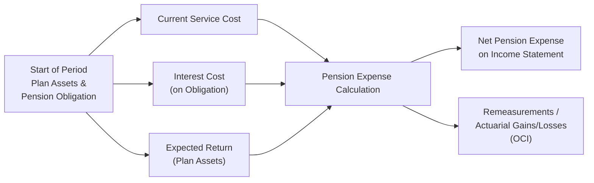

## Overview of Pension Expense Components

Pensions, especially defined benefit plans, can sometimes feel like a maze of numbers. Whenever I think about them, I recall a conversation I had with a former colleague who was absolutely baffled by how a company could post a certain pension expense when the plan assets had soared in the market that year. If you find this scenario familiar, trust me, you’re not alone.

In Chapter 7, we discussed the difference between defined contribution (DC) plans and defined benefit (DB) plans. For DB plans, the sponsoring employer carries the risk of ensuring benefits are funded properly. Because the sponsor is on the hook for the final payouts, accounting for these obligations can get tricky. That’s where concepts like interest cost, expected return, and the net pension expense come into play.

Net pension expense typically includes three major components:  
• Current service cost (the cost of benefits earned in the current period).  
• Interest cost (the “unwinding” of the discount on the pension obligation).  
• Expected return on plan assets (the offset to some of the expense, at least in US GAAP).  

Of course, there can be other items like past service cost or amortized actuarial gains/losses. But at the heart of it, those three are your bread and butter.

## Interest Cost: Unwinding the Discount

### Why Do We Have an Interest Cost?

When a company has a pension obligation—often referred to as the projected benefit obligation (PBO) under US GAAP or the defined benefit obligation (DBO) under IFRS—this obligation reflects the present value of future payments. Because time moves forward, that present value has to grow at the discount rate used to compute it. That growth is the interest cost (sometimes called the unwinding of the discount), reflecting that we’re one year closer to paying out the pension benefits.

### How It’s Measured

• Under IFRS: The interest on the net defined benefit liability (or asset) is calculated using the same discount rate used to measure the defined benefit obligation.  
• Under US GAAP: A similar principle applies, though it’s traditionally calculated on the PBO.  

Conceptually, think of interest cost like interest on a loan: as time passes, you owe more interest. But instead of paying this interest to a bank, you’re essentially “paying” it into the obligation—recognized in the pension expense.

## Expected Return on Plan Assets

### US GAAP Focus

Under US GAAP, companies typically estimate a long-term expected rate of return on plan assets. If you have $100 million in plan assets, and your long-term expected return is 7%, then you anticipate earning $7 million in investment returns in a given year. This expected return reduces the pension expense recognized in the income statement. So, in a somewhat counterintuitive way, a higher expected return on plan assets translates into a lower recognized pension expense (all else being equal).

But suppose the actual return on those plan assets is either way above or below 7%. That difference is referred to as an actuarial gain or loss, or specifically in the realm of IFRS, a remeasurement. While US GAAP might let you amortize part of that difference over time—subject to the “corridor approach” or some other method—IFRS typically keeps those remeasurements in other comprehensive income (OCI) without amortizing them directly through profit or loss.

### IFRS Net Interest Approach

IFRS takes a slightly different tack. Rather than showing an explicit line for “expected return,” companies using IFRS report a single net interest cost (or net interest income if the plan is overfunded) on the net defined benefit liability (or asset). The calculation basically says: “Take the net position (obligation minus assets) at the start of the period, multiply it by the discount rate, and that’s your interest expense (or interest income).” Any difference between the actual return on plan assets and this calculated interest portion is dumped into remeasurements, which stay in OCI.

Sometimes that can be more straightforward: there’s no separate “expected return” in the income statement. But behind the scenes, the concept is very similar—IFRS is using the discount rate to determine how your net pension liability/asset changes due to the passage of time.

## Actual Return vs. Expected Return

This concept can feel a bit weird (I know I was initially confused, thinking, “Why do we even talk about an expected return when we can measure the actual return?”). The idea is to smooth out volatility. Pension plans can experience big swings in returns from year to year, and aligning a portion of that to a “long-term expectation” can help limit big jumps in reported net income.

• Under US GAAP, the actual return minus the expected return hits OCI as a gain or loss.  
• Under IFRS, the difference between the actual return and the interest income on plan assets is a remeasurement taken directly to OCI. No direct amortization through profit or loss.  

Companies, of course, can’t use just any random expected return. It has to be realistic—a process that presumably involves input from actuaries and other finance professionals. Nevertheless, you might guess there are incentives to keep that rate high, to reduce ongoing pension expense. That’s why many analysts prefer to back out management’s assumptions and impose a standardized discount rate or even the actual return to better compare companies’ financial statements.

## Components of Net Pension Expense

Let’s walk through the logic of net pension expense—particularly for US GAAP, where the line items are more visibly broken out:

1. Current Service Cost:  
   This is what employees earn in benefit terms for the current year’s service.

2. Interest Cost:  
   This is the growth in the PBO due to the unwinding of the discount rate.  
   
3. Expected Return on Plan Assets:  
   This reduces pension expense (the logic being that the plan is “earning” investment returns).  
   
4. Amortization of Past Service Cost:  
   If the plan was amended or initiated and employees got retroactive benefits for prior service, US GAAP might require that cost to be spread out, typically through OCI at inception but then amortized through pension expense over time (unless recognized immediately).  
   
5. Amortization of Actuarial Gains/Losses:  
   If you’re using the corridor approach or another recognized method, you’d amortize the portion of gains/losses that exceed certain thresholds.  

Summing all those up yields the net pension expense that companies report in the income statement. Under IFRS, the end result is similar—but the distinct line items are somewhat collapsed into “service cost” in profit or loss and a net interest on the net defined benefit liability/asset. Remeasurements (i.e., differences from actuarial assumptions or actual/expected return on plan assets) go through OCI and never return to the income statement.

## Illustration: Quick Numerical Example (US GAAP)

Imagine you have the following situation for a single year:  
• PBO at beginning of year: $500 million  
• Plan assets at beginning of year: $400 million  
• Discount rate: 6%  
• Expected long-term return on plan assets: 8%  
• Current service cost: $12 million  

Here’s how you’d get net pension expense:

1. Current service cost = $12 million  
2. Interest cost = PBO * discount rate = $500 million * 6% = $30 million  
3. Expected return on plan assets = $400 million * 8% = $32 million  

Net pension expense before any amortizations = (12 + 30) − 32 = $10 million  

If there is any amortization of prior service cost or amortization of gains/losses, you add or subtract those as needed. Let’s say you have $2 million of amortized prior service cost for the year and no other components:

Net pension expense = $10 million + $2 million = $12 million  

That $12 million is recognized on the income statement. Note that if the actual return on plan assets was $40 million (rather than the $32 million expected), the $8 million difference would go through OCI as part of the actuarial gain.

## Financial Statement Variations: IFRS vs. US GAAP

It’s common to see differences in the presentation of pension costs under the two frameworks. The following table offers a concise comparison:

| Element                         | US GAAP                                           | IFRS                                                                            |
|---------------------------------|---------------------------------------------------|----------------------------------------------------------------------------------|
| Interest Cost                   | Calculated on the PBO at the discount rate        | Calculated on net defined benefit liability/asset at the discount rate           |
| Expected Return on Plan Assets | Reported as a separate component of pension expense, offsetting interest cost | Part of the net interest on net liability/asset (no separate presentation)       |
| Remeasurements (Actuarial Gains/Losses) | Recognized in OCI; can be amortized (corridor or other method) | Recognized in OCI as remeasurements, not reclassified to profit or loss          |
| Past Service Cost               | Amortized over remaining service life or recognized immediately in some cases | Recognized in profit or loss when plan amendment arises (no “corridor approach”) |

Under IFRS, you will see a single line item in profit or loss for “net interest,” which uses the discount rate applied to the net pension liability/asset. The actual difference between the return on plan assets and that book interest is recognized as a remeasurement in OCI. It’s simpler to look at, but you still have to examine footnotes for the details.

## Merits of Adjusting Pension Expense

If you’re an analyst aiming to compare firms across borders or industries, you might consider making adjustments. Often, a firm’s chosen expected return (US GAAP) could be more optimistic or conservative than another firm’s. Maybe you want to assume plan assets earn the same rate as the discount rate or the long-term yield of a broad market index, just for consistency’s sake. This approach is something you’ll see in many M&A deals or credit analyses, where it’s crucial to standardize assumptions across multiple targets.

In forecasting future cash flow and expense, focusing on the discount rate can be helpful—especially since that rate factors into the PBO. Also, keep in mind that if a company significantly changes its expected return assumption in one year (under US GAAP), it can meaningfully shift net pension expense. IFRS is more consistent, but there’s still wiggle room in choosing the discount rate.

## Diagram: Key Flows in Pension Accounting

Below is a simple Mermaid diagram illustrating the flow among plan assets, the pension obligation, interest cost, expected returns, and net pension expense.

## Forecasting and Analytical Perspectives

One reason we delve into interest cost and expected returns on plan assets is to forecast future pension expense. For instance, if you know the discount rate is trending downward, expect higher interest cost (because the present value of the obligations rises). Or if you anticipate the plan sponsor to revise the expected return downward, net pension expense might jump significantly.

• Lower discount rates mean a higher PBO, which can create a larger interest cost number.  
• Lower expected returns (under US GAAP) mean smaller offsets to the pension expense.  

Pension contributions also affect cash flows. But remember: taxes, regulatory requirements, and the plan’s funded status can all push a company to contribute more or less than you’d expect from the pure accounting perspective. So it’s wise to check the footnotes for pension contribution schedules.

## Practical Guidance: Best Practices & Pitfalls

• Don’t rely blindly on management’s expected return. They have reason to keep that assumption high.  
• Keep an eye on discount rate changes year to year. It has a direct effect on the PBO and, by extension, interest cost.  
• For IFRS statements, make sure you don’t miss that net interest number. It’s easy to skip over it because it’s not broken out like the US GAAP “interest cost and expected return.”  
• When in doubt, consult the footnotes—pension disclosures can be complex, but they often contain all the details about assumptions, remeasurements, and funded status.  
• In your analysis, you might want a more “economic” pension expense. Some analysts will recast the statements to use the actual return on plan assets or to unify the discount rate for both the liability side and the expected return side.

## Brief Glossary

• Current Service Cost: The present value of benefits earned by employees during the current period of service.  
• Interest Cost (Unwinding): The increase in the obligation as we move one year closer to the benefit payout.  
• Expected Return on Plan Assets: The estimated long-term rate of return used under US GAAP to reduce the pension expense.  
• Net Pension Expense: The total expense recognized in the income statement, typically including service costs, interest cost, and the offset for expected return on assets.  
• Remeasurement: The IFRS term for capturing the difference between actual and expected performance on plan assets plus actuarial changes in the obligation, recognized in OCI.  
• Amortization of Actuarial Gains/Losses: Under US GAAP, a corridor or other method can be used to spread large mismatches over time. IFRS doesn’t reclassify them from OCI to the income statement.  
• Prior Service Cost: Cost arising from plan amendments that grant benefits for prior periods of service.  

## References & Further Reading

• IAS 19: Employee Benefits. Detailed IFRS guidance on how to compute net defined benefit liability/asset and net interest.  
• ASC 715: Compensation—Retirement Benefits. The US GAAP standard that outlines how to account for defined benefit pension plans, including expected return on plan assets.  
• Wiley’s CFA® Program Review. Contains examples of pension expense calculations, plus practice problems perfect for exam preparation.  
• Journal of Accounting Research. Several articles offer deeper dives into how the markets respond to firms’ pension assumptions and how management might manipulate them.

## Exam Tips & Strategy

• Carefully watch the exam’s item sets: Typically, a vignette will give you the discount rate, beginning obligations, plan assets, and possibly some remeasurement info.  
• Distinguish IFRS vs. US GAAP. Sometimes the trick is in how they label the pension cost components.  
• Remember to check if they mention “net interest” (IFRS) or “expected return” (US GAAP). The question might ask you to compute net pension expense using a specific method or partial data.  
• If you see question prompts about the difference between actual and expected return, be ready to place that difference in OCI under either standard. Under IFRS, they’ll refer to it as a remeasurement, and under US GAAP it’s an actuarial gain/loss, which might be amortized over time if it exceeds the corridor.  
• Don’t forget that prior service costs under IFRS are generally recognized immediately in profit or loss, whereas US GAAP typically defers and amortizes them. This can change net pension expense in the period of a plan amendment.  

Anyway, that’s the gist of it. If you’re feeling a bit swamped by all the details, don’t worry. The more you practice with item sets and real-life financial statements, the more intuitive it becomes. Pension accounting, especially interest cost and expected returns, might seem complex, but with a solid grasp of these moving parts, you’ll be better equipped to anticipate how they affect net income and forecasting. Good luck, and keep an eye on those footnotes!

## Test Your Knowledge: Interest Cost, Expected Returns, and Net Pension Expense



### Which of the following components does NOT typically appear separately within pension expense under US GAAP?

- [ ] Current service cost
- [x] Net interest on the net pension liability/asset
- [ ] Interest cost
- [ ] Expected return on plan assets

> **Explanation:** Under US GAAP, “net interest on the net pension liability/asset” is not typically shown as a separate line; that’s an IFRS concept. US GAAP breaks out interest cost and the expected return on plan assets separately.

### Under IFRS, where is the difference between the actual return on plan assets and the net interest recognized?

- [ ] Entirely in the income statement
- [ ] Immediately in retained earnings
- [x] In other comprehensive income (OCI) as a remeasurement
- [ ] Capitalized as an intangible asset

> **Explanation:** IFRS recognizes differences between actual returns on plan assets and the interest component in remeasurements, which flow through OCI.

### A company has beginning Plan Assets of $300 million and an expected return on plan assets of 9%. How much does this expected return reduce the pension expense under US GAAP?

- [ ] $27 million
- [x] $27 million (assuming no partial adjustments)
- [ ] It remains in OCI
- [ ] $0, since no return is applied

> **Explanation:** 9% of $300 million is $27 million, which is deducted from pension expense under the US GAAP model for the expected return on plan assets.

### When a company amends its pension plan to grant additional benefits for past employee service, how is the prior service cost treated under IFRS?

- [x] Recognized immediately in profit or loss
- [ ] Amortized over the remaining service lives of employees
- [ ] Capitalized as a deferred cost
- [ ] Offsetting interest cost on the PBO

> **Explanation:** Under IFRS, any prior service cost is recognized immediately in profit or loss when the plan amendment occurs.

### In comparing IFRS and US GAAP treatments of pension accounting, which statement is most accurate?

- [x] US GAAP uses an expected return on plan assets, while IFRS uses a net interest rate applied to the net liability/asset.
- [ ] Both IFRS and US GAAP exclude remeasurements from OCI.
- [ ] IFRS permits the corridor approach for actuarial gains/losses, while US GAAP does not.
- [ ] IFRS requires companies to report actual return on plan assets, while US GAAP only allows expected return.

> **Explanation:** The primary difference is that US GAAP offsets pension expense with an expected return on plan assets whereas IFRS calculates a net interest on the net liability/asset and places differences into OCI as remeasurements.

### A firm’s pension expense includes a $20 million interest cost, a $15 million current service cost, and a $10 million expected return on plan assets under US GAAP. Ignoring other factors, what is the net pension expense?

- [x] $25 million
- [ ] $20 million
- [ ] $15 million
- [ ] $45 million

> **Explanation:** Net pension expense = Current service cost ($15M) + Interest cost ($20M) − Expected return ($10M) = $25M.

### Under IFRS, if a company experiences higher actual returns on plan assets than the net interest component, how is the difference accounted for?

- [ ] Subtracted from interest cost in the income statement
- [ ] Recognized as immediate income
- [x] Classified as a remeasurement in OCI
- [ ] Deferred to future years and amortized

> **Explanation:** IFRS channels any difference between actual and net interest amounts straight to OCI as a remeasurement.

### Why do some analysts replace the expected return on plan assets with the discount rate or actual returns when analyzing pensions?

- [ ] They aim to eliminate amortization
- [ ] To follow IFRS more closely
- [x] To reduce potential management bias and enhance comparability
- [ ] They are required by ASC 715

> **Explanation:** Many analysts use either the discount rate or the actual return to avoid subjective or overly optimistic assumptions that can influence reported earnings.

### On which financial statement line would you typically see net pension expense recognized?

- [x] Income statement operating expenses (or sometimes recognized in a specific compensation cost line)
- [ ] Directly in retained earnings
- [ ] Within other comprehensive income
- [ ] Only in the statement of cash flows

> **Explanation:** Net pension expense is usually a cost recognized in the income statement, often reflected in operating expenses or as part of compensation costs. Portions of the pension accounting, such as remeasurements, appear in OCI, but the net pension expense itself is in the income statement.

### True or False: Under US GAAP, the difference between the actual return on plan assets and the expected return immediately flows to the income statement.

- [ ] True
- [x] False

> **Explanation:** The difference (actual minus expected) is recorded in OCI as part of actuarial gains/losses and is not immediately recognized in the income statement, though it may be amortized under certain circumstances.


