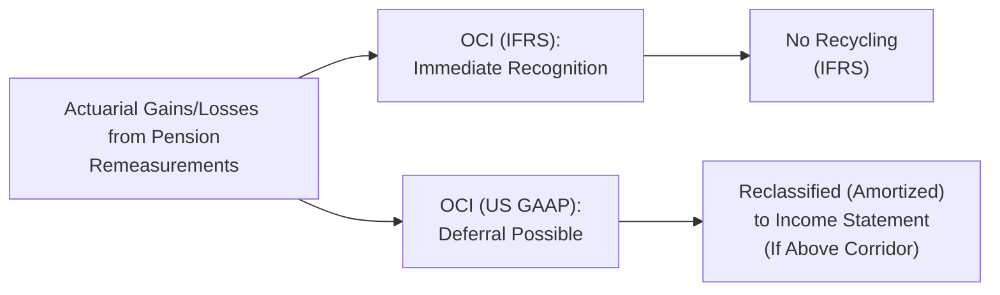

## Introduction
So, let’s talk about pensions—again. I remember back in my early days as an analyst, I was sometimes baffled by why companies would report these massive actuarial gains or losses in some obscure section called “OCI.” Honestly, I used to shrug it off and think, “Look, net income is what really matters, right?” But, well, that was before I realized how crucial Other Comprehensive Income (OCI) can be in reflecting the real economic impact of pension plans. If you’re getting a bit anxious about diving into pensions, trust me, you’re not alone. Let’s just say once you decode the differences between IFRS and US GAAP in pension accounting, you’ll spot a whole new layer of detail that can greatly shift a firm’s reported performance and even its capital structure ratios.

This section explores how these pension costs and remeasurements flow either through the income statement or land squarely in OCI. We’ll dig into IFRS vs. US GAAP differences, the corridor approach, reclassification (a.k.a “recycling”), and how all these shape fundamental analysis. Sure, it might feel complicated, but we’ll break it down in a straightforward, step-by-step manner—hopefully with a dash of personality. Let’s get started.

## Income Statement vs. OCI: Key Concepts
Under both IFRS and US GAAP, sponsoring a defined benefit pension plan cranks out numerous financial statement line items. Some get posted straight to net income, while others are recognized in OCI. The main reason for this bifurcation is that regulators want to separate the company’s core operating or recurring pension expenses from the more volatile actuarial gains and losses that spring from changes in assumptions (like discount rates, expected mortality, or plan asset returns).

• Service Cost: This typically appears in net income.  
• Interest Cost: Also recognized in net income, representing the unwinding of the discount on the pension obligation.  
• Expected Return on Plan Assets: Under US GAAP, you typically subtract an estimated return on plan assets from pension expense in net income. IFRS calls it “net interest on the net defined benefit liability (asset).”  
• Actuarial Gains/Losses: IFRS calls these “remeasurements” and requires they be recognized immediately and permanently in OCI. US GAAP, on the other hand, often defers these items through the corridor approach—unless they break a threshold—then they might get “amortized” (i.e., recycled) into net income.  

Why does it matter? Well, let’s say a company has big swings in asset returns. Under IFRS, you’ll see an immediate impact in OCI. Under US GAAP, you might see only a fraction show up in net income if it’s beyond the corridor threshold, or you might see it remain stuck in OCI for years. Obviously, that difference can drastically alter reported net income, so plan sponsors sometimes structure assumptions carefully—particularly if they’re worried about capital market perceptions or loan covenants that hinge on certain profit metrics.

## IFRS vs. US GAAP: Who Puts What Where?
Under IFRS, remeasurements—essentially the lumps of actuarial gains and losses—are recognized immediately in OCI and are never reclassified back into net income in later periods. So they go straight to equity. This approach fosters transparency and immediate reflection of changes in actuarial estimates. But it also means IFRS-based financial statements may contain bigger year-to-year volatility in shareholders’ equity due to these remeasurements.

Under US GAAP, companies enjoy a bit of “smoothing,” typically in the form of the corridor approach or other techniques, so that large sudden shifts don’t all get dumped at once into current earnings. Essentially, GAAP tries to dampen the immediate effect on net income. The downside? Potentially lower transparency, because some of these large gains or losses remain buried in OCI and only gradually trickle into net income. For an analyst or investor, it can feel like rummaging through the footnotes to discover what’s really going on.

## The Corridor Approach
Here’s the big star of the US GAAP approach: the corridor. Picture a corridor in a building: any large lumps of actuarial gains or losses within that corridor remain in OCI, but once they spill outside the corridor, they start getting recognized in net income.

Mathematically, you calculate the corridor threshold each year:


\text{Corridor Threshold} = 0.10 \times \max(\text{Beginning PBO}, \text{Beginning Plan Assets})


If the cumulative net actuarial gain or loss at the start of the year (sitting in accumulated OCI) is bigger than that corridor threshold, you must amortize (recycle) the excess amount over the average remaining service life of employees (or some other measure). This amortized portion hits net income, effectively “reclassifying” from OCI. IFRS, however, bans such an approach and demands that all remeasurements be recognized right away in OCI, never to see the light of net income. So, IFRS is more of an “in-your-face” approach to pension volatility, while GAAP tries to cushion the blow with corridor-based deferrals.

## Comprehensive Income and Statement of Changes in Equity
We talk about net income a lot, but remember, total “comprehensive income” includes net income plus all the other items recognized in OCI. Because IFRS lumps remeasurements fully into OCI, you can see big swings in the statement of comprehensive income from year to year. Over time, these remeasurements accumulate in equity under something like “Accumulated Other Comprehensive Income” (AOCI).

Under US GAAP, you might see smaller short-term swings in net income because large changes are temporarily parked in OCI. But each year, a portion might be reclassified to the income statement once the total unrecognized amount crosses the corridor threshold (or if management chooses to accelerate recognition). In either scenario, you’ll want to monitor the firm’s statement of changes in equity to gauge the cumulative effects of these remeasurements and how they could eventually flow through net income or remain trapped in OCI.

## Real-World Implications for Analysis
You might be reading all this and thinking, “Okay, so IFRS lumps it all in OCI, US GAAP defers it, big deal.” Actually, it is a big deal. I recall analyzing two large industrial companies—one under IFRS, one under US GAAP—that had very comparable pension assumptions. The IFRS company’s equity fluctuated wildly in bad markets because its remeasurements arrived in OCI right away. The US GAAP company’s net income looked “calmer,” but a little footnote detective work showed it was riding on unrecognized losses. So, from a fundamental perspective, they weren’t on the same playing field.

Here are some areas where these differences matter:

• Equity Ratios and Leverage: Accumulated OCI is part of shareholders’ equity. If a company’s pension plan experiences substantial losses under IFRS, you’ll see an immediate hit to equity. This can affect debt-to-equity ratios, potentially violating loan covenants. Meanwhile, a US GAAP company might keep those losses in OCI for years, deferring the equity hit’s effect on leverage.  
• Comparability: If you’re a portfolio manager comparing global peers, these differences can skew your cross-company ratio analysis. You might need to adjust for pension-related items to get a meaningful apples-to-apples comparison.  
• Forecasting and Modeling: When modeling future cash flows or solvency, big swings in OCI could indicate potential future net income hits (under US GAAP) or immediate volatility in equity. IFRS-based statements show you the volatility up front, while US GAAP may trickle it out over time.  

## Example of Corridor Amortization
Let’s take a tiny numeric example—sometimes that clarifies everything. Suppose a firm’s projected benefit obligation (PBO) is \$100 million, and the plan assets are \$95 million at the beginning of the year. An actuarial loss of \$20 million is recognized but is sitting in OCI, unamortized. Let’s see how we handle it under the corridor approach.

1. Calculate the corridor threshold:
   Corridor Threshold = 0.10 × max(100, 95) = 0.10 × 100 = \$10 million

2. Compare the unrecognized loss (\$20 million) to the corridor threshold (\$10 million). The difference is \$10 million (\$20m – \$10m = \$10m).

3. The \$10 million above the corridor is subject to amortization. Let’s assume the average remaining service life is 10 years. So the annual amortization is \$10m ÷ 10 years = \$1 million.

4. This \$1 million is reclassified from OCI into the income statement every year for 10 years—affecting net income. The other \$10 million within the corridor remains parked in OCI, for now.

Under IFRS, that entire \$20 million actu arial loss would be recognized immediately in OCI with no subsequent reclassification to net income. So as an IFRS analyst, you see the entire hit to equity promptly.

Below is a short Python snippet that shows a tiny simulation of corridor approach calculations. It’s just a toy example but might help illustrate how the threshold is checked each year if new actuarial gains/losses emerge:

```python

pbo = 100_000_000
plan_assets = 95_000_000
actuarial_loss = 20_000_000
remaining_service_years = 10

corridor_threshold = 0.10 * max(pbo, plan_assets)
excess_loss = max(0, actuarial_loss - corridor_threshold)

if excess_loss > 0:
    annual_amort = excess_loss / remaining_service_years
else:
    annual_amort = 0

print(f"Corridor Threshold: ${corridor_threshold:,.0f}")
print(f"Excess Loss to Amortize: ${excess_loss:,.0f}")
print(f"Annual Amortization: ${annual_amort:,.0f}")
```

The key takeaway here is that under the corridor approach, not all of that \$20 million bridging the difference between your plan assets and obligations hits net income at once.

## Management’s Policy Choices
It might sound cynical, but companies do juggle assumptions—like the discount rate, expected return on assets, mortality rates—to manage net periodic pension cost or keep corridor-based deferrals in check. IFRS’s immediate recognition approach suggests its financial statements could show bigger year-to-year fluctuations, whereas US GAAP’s corridor approach can stage-manage some of that volatility. Some managers prefer to front-load “bad news” to wipe the slate clean; others prefer to nibble at losses to keep net income stable.

## Diagram: Pension Flow Under IFRS & US GAAP
Below is a Mermaid.js diagram summarizing how actuarial gains/losses progress under IFRS versus US GAAP.



In IFRS, it’s straightforward: the remeasurement goes right to OCI and remains there. In US GAAP, part of that remeasurement might eventually flow into the income statement if it exceeds the corridor threshold.

## Best Practices and Common Pitfalls
• Always read the pension footnotes. They typically include a reconciliation of plan assets and obligations, as well as details on how much of the recognized pension cost made it to net income vs. OCI.  
• Watch out for cumulative unrecognized actuarial losses. They can drastically lower a company’s equity if recognized all at once—particularly under IFRS.  
• Don’t assume two companies applying IFRS vs. US GAAP are truly comparable on reported pension expense. You might need to adjust for corridor deferrals.  
• Pay attention to changes in assumptions. Management might tweak discount rates up or down—especially in times of economic uncertainty—and that can have a sudden large effect on the recognized pension liabilities (and thus on net income or OCI).  
• Model the potential future amortization from deferred gains or losses under US GAAP. For IFRS, anticipate the equity swings that can occur from year to year.

## Final Exam Tips
• For the CFA exam, you could see vignettes that detail changes in discount rates, mortality, or return assumptions. They might show you a footnote with a thick table of pension data and ask how it affects equity vs. net income. Keep IFRS’s immediate recognition policy versus GAAP’s corridor approach top of mind.  
• Practice corridor threshold calculations (like the example above). The exam might give you the PBO, plan assets, and ask how much must be amortized.  
• Don’t forget that IFRS does not allow the corridor approach—so watch for clues in the item set or question stem about which standards the firm applies.  
• Time management. Pension questions can get dense if you’re not careful; zero in on key figures like PBO, plan assets, net period pension cost, and the location of the gains/losses (net income or OCI).

## References & Further Reading
• Official CFA Institute curriculum: Provides side-by-side examples of IFRS vs. US GAAP OCI treatment and sample footnotes.  
• Revsine, Collins, Johnson, and Mittelstaedt, Financial Reporting and Analysis: Offers deep dives into pension note disclosures.  
• PwC Pension Accounting Guide: Useful for corridor approach specifics, IFRS remeasurement, and bridging the differences between the two standards.

-----

## Test Your Knowledge: Pension Reporting – OCI vs. Income Statement



### In IFRS, actuarial gains and losses are typically:
- [ ] Initially recognized in net income and then reclassified to OCI. 
- [x] Recognized in OCI with no subsequent reclassification. 
- [ ] Recorded in a special reserve that is not part of equity. 
- [ ] Recognized in both net income and OCI proportional to their magnitude.

> **Explanation:** IFRS requires immediate recognition of actuarial gains/losses in OCI without reclassifying them to net income in future periods.

### Under US GAAP, the “corridor approach” exists to:
- [ ] Immediately transfer pension gains and losses from OCI to retained earnings. 
- [x] Defer recognition of large net actuarial gains/losses until they exceed a threshold. 
- [ ] Eliminate the reclassification of actuarial gains/losses from OCI. 
- [ ] Match IFRS in real-time recognition of all pension remeasurements.

> **Explanation:** The corridor approach lets companies defer some actuarial gains/losses in OCI, only amortizing them into net income when they exceed 10% of the larger of beginning PBO or plan assets.

### Which of the following is TRUE regarding remeasurements under IFRS and US GAAP?
- [ ] US GAAP recognizes all remeasurements immediately in net income. 
- [ ] IFRS allows reclassifications of remeasurements once they exceed the corridor. 
- [x] IFRS keeps remeasurements in OCI permanently; US GAAP may amortize them into net income over time. 
- [ ] Both IFRS and US GAAP prohibit any recognition of remeasurements in OCI.

> **Explanation:** IFRS retains remeasurements in OCI with no reclassification, while US GAAP may allow partial reclassification (via amortization) into net income over time.

### What is the main driver for using the corridor approach under US GAAP?
- [x] Smoothing the volatility in reported earnings. 
- [ ] Enhancing transparency and comparability for international investors. 
- [ ] Complying with IFRS guidelines explicitly. 
- [ ] Removing all pensions from the balance sheet.

> **Explanation:** A primary reason for the corridor approach is to smooth short-term volatility in net income arising from large or unexpected actuarial gains/losses.

### When IFRS requires immediate recognition of pension remeasurements in OCI, it results in:
- [x] Higher volatility in equity. 
- [ ] A consistent offset in net income for the same period. 
- [x] No subsequent reclassification to net income. 
- [ ] A smaller reported pension obligation on the balance sheet.

> **Explanation:** Because remeasurements go straight to OCI under IFRS, shareholders’ equity can experience significant volatility, and there is no reclassification to net income.

### The corridor threshold is:
- [ ] 5% of the total pension expense for the period. 
- [ ] 10% of net income. 
- [x] 10% of the greater of the PBO or plan assets at the beginning of the year. 
- [ ] A ratio determined by management’s discretion.

> **Explanation:** Under US GAAP, the corridor threshold is set at 10% of the greater of the plan’s PBO or the fair value of plan assets at the start of the year.

### When cumulative actuarial gains/losses exceed the corridor threshold:
- [x] The excess is amortized into the income statement over future periods. 
- [ ] The entire balance is transferred immediately to net income. 
- [x] IFRS requires immediate recycling of the excess to net income. 
- [ ] They stay in OCI in perpetuity.

> **Explanation:** In US GAAP, only amounts that exceed the corridor threshold must be amortized into the income statement. IFRS does not use the corridor concept, so any reference to IFRS “requiring immediate recycling” is incorrect.

### A significant long-term effect of large unrecognized pension losses in OCI under US GAAP is:
- [ ] Decreased transparency but no effect on equity. 
- [x] A potential reduction in future net income if losses are eventually amortized. 
- [ ] A lesser volatility in cash flow from operations. 
- [ ] An immediate negative impact on net income.

> **Explanation:** Large unrecognized losses sitting in OCI may eventually be amortized into net income, reducing future profitability.

### Analysts comparing an IFRS-reporting firm and a US GAAP-reporting firm should:
- [ ] Focus solely on net income, ignoring OCI. 
- [ ] Assume both sets of standards effectively produce identical measures of pension costs. 
- [x] Adjust for differences in the treatment of actuarial gains/losses to facilitate comparability. 
- [ ] Ignore corridor thresholds, as they are the same under IFRS and US GAAP.

> **Explanation:** Because IFRS and US GAAP treat actuarial gains/losses differently, thorough adjustments are necessary for apples-to-apples comparability between firms.

### True or False: Under IFRS, large changes in plan asset values lead to immediate swings in net income.
- [ ] True
- [x] False

> **Explanation:** IFRS recognizes these remeasurement effects in OCI, not in net income.


