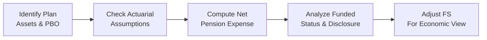
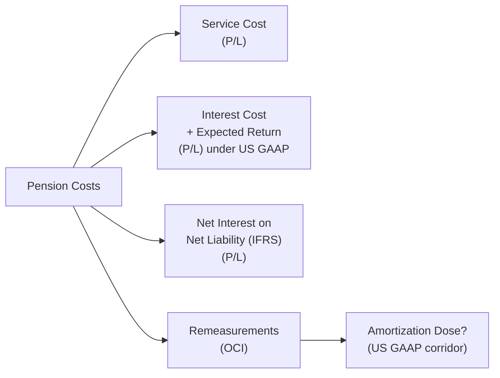

## Introduction and Overview

Pension disclosures can feel like a maze. I remember years ago (and yes, I promise I’ll keep this anecdote short) when I encountered my first remeasurement item buried in the middle of a 40-page footnote. It was like searching for a needle in a haystack—except that needle was driving big swings in net income and didn’t show up clearly unless you really knew where to look! So, let’s talk about how to handle these scenarios in an exam context, especially in the typical vignette format. 

In this section, we’ll walk through the sorts of data you can expect in a pension footnote, how to parse it quickly, and the adjustments you might need to make to get at an “economic” pension expense. We’ll also cover IFRS vs. US GAAP differences and how they might appear in exam scenarios. By the end, you’ll be able to spot manipulations, tie pension data to broader financial ratio impacts, and feel confident heading into any exam question that challenges your pension-knowledge prowess.

## Understanding the Vignette Approach

When the CFA exam presents a pension-benefit vignette, it typically includes (sometimes confusing) data about the firm’s pension benefits table. Some of the crucial information you might see:

• Service cost, interest cost, and the fair value of plan assets.  
• The projected benefit obligation (PBO) and how it changed from last period to this period.  
• Infamous actuarial assumptions: discount rate, expected long-term return on plan assets, wage growth, mortality, etc.  
• Additional notes that might hint at changes to the discount rate or the plan’s expected return.  
• Potential references to corridor approaches (US GAAP), immediate recognition vs. amortization, or IFRS’s “net interest” concept.  

Below is a quick visual summary of the typical steps you’d take to analyze pension footnotes in a vignette. Feel free to glance at the flowchart for a broad context before diving into details:



## The Key Steps in Analyzing Pension Data

### Step 1: Identify the Pension Obligation (PBO) and Plan Assets

First things first: figure out the magnitude of the pension plan’s obligations versus the plan’s assets. The difference between the projected benefit obligation (often the largest measure under US GAAP) and the plan assets is the funded status. 

Sometimes the exam question will highlight:

• PBO at the beginning of the year and changes throughout the year (due to service cost, interest cost, actuarial gains/losses, etc.).  
• Fair value of plan assets at the beginning of the year plus contributions or actual returns.  

You want to confirm the final funded status: is the plan underfunded, overfunded, or roughly at equilibrium?

### Step 2: Verify Actuarial Assumptions

Next, watch carefully for discount rates, expected return on plan assets, wage growth assumptions, and mortality rates. Under IFRS, the discount rate is also used to compute the net interest on the net pension liability or asset. Under US GAAP, you might see interest cost applied to the PBO, while a separate expected return is applied to plan assets. 

Keep an eye out for any red flags:  
• Sudden big changes in discount rates year-over-year.  
• Notably high or low expected returns.  
• Shifts in wage growth assumptions that are out of line with industry norms.

The exam could trick you by providing partial data. Perhaps you see a line stating “Discount rate increased from 3.5% to 4.2%,” but nowhere else do they mention the effect on pension expense. They might expect you to connect the dots that this reduces the PBO and also changes interest cost.

### Step 3: Compute or Cross-Check the Net Pension Expense

Under US GAAP, net periodic pension cost (simplified) can break down as:

(Service Cost) + (Interest Cost) – (Expected Return on Plan Assets) ± (Amortization of Prior Service Cost) ± (Amortization of Actuarial Gains/Losses) … and so forth.

Under IFRS, the main components are:  
• Service cost recognized in profit or loss.  
• Net interest on the net defined benefit liability (or asset), also in profit or loss.  
• Remeasurement items recognized in other comprehensive income (OCI).

Here’s a quick snippet that might help you conceptualize the net pension expense in a US GAAP–style setup:

```python
service_cost = 1_000_000
interest_cost = 80_000
expected_return = 60_000
amortization_of_prior_service_cost = 20_000

net_pension_expense = service_cost + interest_cost - expected_return + amortization_of_prior_service_cost
print("Net Pension Expense:", net_pension_expense)
```

By the way, in real-life footnotes (and your exam question vignettes), the numbers get bigger, and there might be additional layers of amortizations—like for net losses from prior periods. Don’t forget to keep them all in your calculation, or you risk messing up your final figure.

### Step 4: Determine How the Plan’s Funded Status Is Reported

Under both IFRS and US GAAP, the net funded status (fair value of assets minus PBO or DBO) should show up on the balance sheet as a net pension liability (if underfunded) or a net pension asset (if overfunded). The difference is that IFRS lumps more items directly into OCI under a category called “Remeasurements,” which are not recycled back to the income statement. 

In contrast, US GAAP might have corridor approaches for unrecognized gains/losses, but it still requires recognition of the net funded amount on the balance sheet. This is where you keep an eye out for any footnote shenanigans that might bury the actual net pension liability or confuse you with partial disclosures.

### Step 5: Check for Unrecognized Gains/Losses in OCI or Footnotes

Here’s one of the biggest areas for exam questions: IFRS vs. US GAAP treatments of remeasurements and the corridor approach. IFRS recognizes remeasurements immediately in OCI (and never reclassifies them back to profit or loss). US GAAP uses the corridor approach, meaning large swings might be slowly amortized into pension expense over time.  

Your mission—should you choose to accept it—is to figure out what portion of the unrecognized gains/losses will eventually end up in net income. For US GAAP, once the net unrecognized gains/losses exceed the corridor (10% of the larger of PBO or plan assets), you start amortizing in subsequent periods. The exam might test your ability to figure out how that partial amortization hits the next year’s pension expense.

## Adjusting Financial Statements for “Economic” Pension Costs

Analysts frequently adjust a company’s reported numbers to reflect what they consider a more realistic or “economic” pension cost. Common adjustments include:

1. Replacing the expected return on plan assets with the actual return or the discount rate to avoid potentially inflated expected returns that artificially reduce pension expense.  
2. Moving certain remeasurement items or amortizations from OCI to the income statement if they are believed to reflect ongoing operating costs.  

An example is adjusting net income upward if the corridor approach is deferring large amounts of losses that some analysts believe should be recognized. Another might be reclassifying a portion of the interest component out of operating expenses if you want to compare it with other finance costs.

In an exam context, you might be asked: “Based on the following data, how would you adjust the company’s net income to reflect more economic pension costs?” or “Which ratio is most affected by adjusting out the difference between actual and expected return on plan assets?”

## Spotting Manipulations

Remember that small changes in assumptions can have big impacts on pension expense and funded status. If a company’s under pressure to show higher earnings, they might quietly raise the expected return on plan assets from, say, 6% to 7.5%, or reduce the discount rate. On the flip side, if they’re trying to “kitchen sink” their numbers in a bad year, they might lower the discount rate or use more conservative rates to balloon the PBO, so that future years look better by comparison. 

Be on the lookout for unusual swings from period to period and ask yourself: “Does this change make sense given market conditions? Or does it look like management is artificially sweetening their short-term net income?” The exam might test you on which assumption changes are the most suspicious and how you’d factor that into your analysis.

## Real-World Integration and Ratios

Let’s bring the real world in. Credit analysis often prioritizes how well-funded a pension plan is because if a plan is severely underfunded, that liability effectively competes with bondholders (and others) for the company’s resources. Unexpected changes in discount rates have triggered real covenant breaches in many industries when the pension obligations soared or assets unexpectedly tanked.

Under IFRS, you might discover that remeasurements aren’t going through net income, so net income might look stable while comprehensive income is plummeting. As an analyst, you’d consider whether the economic reality is more accurately captured by comprehensive income. Similarly, under US GAAP, big swings could be sheltered by the corridor approach. Always keep an eye on the statement of comprehensive income (if provided) or the footnotes to see the total effect.

## Exam Pitfalls and Practical Tips

• Not reading footnotes thoroughly: In an exam vignette, they might bury one key figure or assumption that changes your entire calculation.  
• Mixing IFRS and US GAAP: If you see “net interest” recognized in the income statement, that’s IFRS. If you see corridor wording, that’s definitely US GAAP. Keep them straight!  
• Missing partial-year effects: The exam might present only half-year data or a plan that started or ended mid-year. Double-check the timeline.  
• Overlooking derivatives or special “liability hedges” that the pension plan may have. Usually advanced, but in the real world, it’s big.  
• Failing to incorporate your adjustments into ratio analysis: If you adjust net income for “economic cost,” that may also shift your ROA, profit margin, or coverage ratios.  

## Diagram of Multiple Pension Cost Components

Below is a quick conceptual diagram to highlight how the various cost components under IFRS and US GAAP can be mapped into either profit/loss or OCI:



## Wrap-Up and Final Exam Thoughts

This topic is challenging, no doubt, but the payoff is huge when you can confidently dissect a footnote and just “get” how it’s impacting the statements. On exam day, read carefully and keep a systematic approach:

• Identify the amounts for PBO vs. plan assets.  
• Distinguish which framework is used (US GAAP or IFRS).  
• List out the components of pension expense or net defined benefit cost.  
• Recognize manipulations in assumptions or footnote disclaimers.  
• Adjust net income and balance sheet items if asked for an “economic” view.

Once you internalize these steps, you’ll be able to quickly move through the data in a vignette and tackle any question they throw your way. 

## References and Further Reading

• CFA Institute Level II Curriculum, Pension Accounting Sections  
• “The Handbook of Financial Analysis for Corporate Pension Plans,” multiple authors, for advanced real-world case studies.  
• “IFRS vs. US GAAP: Balance Sheet and Pension Reporting” by KPMG for a deep side-by-side comparison.  

CFA Institute does not endorse, promote, or warrant the accuracy or quality of the products or services offered by external entities. “CFA®” and “Chartered Financial Analyst®” are trademarks owned by CFA Institute.

## Practice Exam: Vignette Drills on Pension Disclosures and Adjustments



### A company reports a pension expense of $10 million, which includes $6 million of service cost, $3 million of interest cost, and a $2 million expected return on plan assets. How much is the net periodic pension cost under US GAAP if there is also an amortization of prior service cost of $1 million?

- [ ] $9 million
- [x] $12 million
- [ ] $8 million
- [ ] $10 million

> **Explanation:** Under US GAAP, net periodic pension cost is service cost ($6M) + interest cost ($3M) – expected return on assets ($2M) + prior service cost amortization ($1M) = $8M + $4M = $12M. The question’s “includes $6 million of service cost” etc. might be partially misleading if you read it too quickly. You have to add the amortization of prior service cost.

### A firm using IFRS lumps interest cost on the liability and the expected return on plan assets into a single line called “net interest.” If the discount rate is 5%, the net pension liability is $200 million, and service cost is $7 million, which of the following is the most likely net interest expense for the period?

- [ ] $14 million
- [ ] $7 million 
- [x] $10 million 
- [ ] $3 million

> **Explanation:** IFRS calculates net interest by applying the discount rate (5%) to the net pension liability ($200M). 5% × $200M = $10M. Service cost is accounted for separately in operating costs, so total expense would be $7M + $10M = $17M—though the problem only asked for net interest.

### Where are pension “remeasurements” under IFRS typically recorded?

- [ ] In the income statement under “operating expenses.”
- [ ] Disclosed as a separate footnote but recognized in retained earnings.
- [x] In other comprehensive income (OCI), not recycled back to profit or loss.
- [ ] Partially in the income statement and partially in OCI.

> **Explanation:** IFRS places remeasurements (including actuarial gains and losses) in OCI and they remain there without reclassification back to profit or loss later. This is a critical difference from US GAAP.

### Under US GAAP, if the unrecognized net actuarial loss grows beyond the “corridor,” what happens?

- [ ] The entire unrecognized loss is immediately recognized in net income.
- [x] The excess over the corridor is amortized into pension expense over time.
- [ ] All remeasurements are reported in OCI with no recycling to profit/loss.
- [ ] The company must restate prior years’ financials.

> **Explanation:** The corridor approach means if actuarial gains/losses exceed 10% of the higher of PBO or plan assets, the excess is amortized over time (often over the employees’ remaining service lives).

### A firm’s PBO is $500 million, fair value of plan assets is $520 million, and unrecognized actuarial losses are $30 million. What is the reported funded status under US GAAP?

- [x] $20 million net pension asset
- [ ] $50 million net pension asset
- [ ] $10 million net pension liability
- [ ] $30 million net pension liability

> **Explanation:** Funded status = Fair value of plan assets ($520M) – PBO ($500M) = +$20M. The unrecognized losses affect pension expense in future periods but do not change the immediate measurement of the funded status on the balance sheet.

### A company decides to raise its expected return on plan assets from 6% to 8% during a year of poor equity performance. What is the main effect on the firm’s pension expense calculations under US GAAP?

- [x] Pension expense decreases because the higher expected return offsets cost.
- [ ] Pension expense increases because interest rates are going up.
- [ ] No net effect because the corridor approach neutralizes the change.
- [ ] Pension expense remains unchanged under US GAAP.

> **Explanation:** US GAAP uses expected return on plan assets to reduce pension expense. If management arbitrarily increases the expected return, it reduces pension expense on paper, though the economic reality may differ if the plan assets underperform.

### Which cost component is not explicitly recognized under IFRS in the profit and loss statement?

- [x] Expected return on plan assets, shown as a separate item
- [ ] Service cost
- [ ] Net interest on net pension liability
- [ ] Past service cost

> **Explanation:** Under IFRS, net interest on the net defined benefit liability (or asset) is recognized as a single figure. Expected return is not recognized separately as under US GAAP. Instead, IFRS uses the discount rate to figure net interest.

### Under US GAAP, a “settlement” or “curtailment” typically results in:

- [ ] Recognition of remeasurements only in OCI.
- [x] Immediate recognition in earning(s) of prior unrecognized gains or losses.
- [ ] No immediate effect until next actuarial valuation.
- [ ] Automatic reversal of prior service costs to zero.

> **Explanation:** Under US GAAP, a curtailment or settlement of a pension plan triggers immediate recognition of any previously unrecognized prior service costs or net actuarial gains/losses related to that portion of the obligation.

### If a company wants to show a more “economic” pension cost for analysis, it might do which of the following?

- [x] Substitute the actual return on plan assets for the expected return 
- [ ] Reduce the discount rate to match market-based yields
- [ ] Consolidate the pension plan as a subsidiary
- [ ] Eliminate any corridor-based amortizations from net income

> **Explanation:** Many analysts replace the expected return on assets with either the actual return or the discount rate to see what the “true” cost might have been without the smoothing effect of the expected return.

### A change in the discount rate from 4.0% to 3.5% most likely causes:

- [x] An increase in the projected benefit obligation (PBO)
- [ ] A reduction in amortization of prior service cost
- [ ] No material effect on funded status
- [ ] A direct increase in plan assets

> **Explanation:** Lower discount rates increase the present value of future obligations, hence raising the size of the PBO.  


