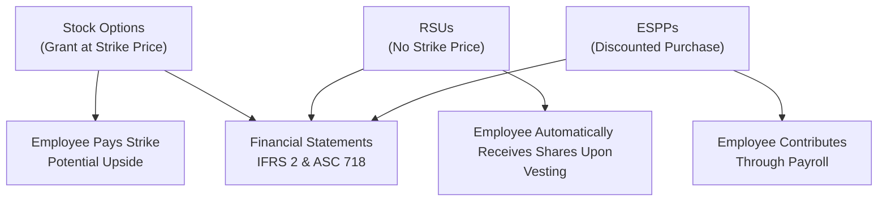

## Overview

Equity compensation is one of those topics that can feel both exciting and confusing at the same time. You know, it’s fun to think that employees can get a stake in the firm through various types of share-based compensation, but the accounting treatment is not always straightforward. This section explores three of the most common equity compensation vehicles—stock options, restricted stock units (RSUs), and employee stock purchase plans (ESPPs)—and provides an in-depth look at their features, regulatory frameworks, and typical exam pitfalls. Along the way, we’ll highlight key differences between IFRS and US GAAP, discuss real-world examples, and share some best practices for analyzing them in a financial statement context.

## Stock Options

Stock options grant employees the right, but not the obligation, to purchase a company’s shares at a predetermined price (often called the strike or exercise price) within a fixed period. At an exam level (and in the real world), the fair value at grant date is recognized as an expense over the vesting period. If you’ve ever encountered a long vesting schedule and wondered how on Earth to expense it, well, that’s the core challenge. Under both IFRS and US GAAP, valuation typically uses an option-pricing model such as Black-Scholes or a binomial (lattice) model.

• Strike Price and Grant Date Fair Value  
  The strike price is usually set at the current market price of the stock on the grant date or sometimes at a small discount. IFRS 2 and ASC Topic 718 both require companies to measure the fair value of options on the grant date. This fair value becomes the basis for expense recognition.

• Vesting Schedules  
  – Cliff Vesting: All options vest at once, say after three years.  
  – Graded Vesting: A portion vests each year (e.g., 25% of the total award every year over four years).  

  Under IFRS, each portion of options in a graded vesting schedule is treated as a separate grant with its own fair value and vesting period. US GAAP also allows a similar approach, but some companies opt for straight-line recognition. On exam day, watch out for the difference in annual expense recognition methods, because IFRS can lead to accelerated expense in early years.

• Exercise and Dilution  
  Once employees exercise their options, the company typically issues new shares—thus diluting current shareholders’ equity. For an analyst, it’s essential to consider the potential dilutive effect on EPS calculations.

Below is a simplified timeline of a stock option from grant to exercise:

## Restricted Stock Units (RSUs)

RSUs are essentially a promise to deliver shares at a future date once certain conditions—like continued employment or performance metrics—are satisfied. Unlike stock options, RSUs do not require an employee to pay a strike price. Instead, the employee receives shares outright upon vesting.

• Key Points  
  – Lower Risk for Employees: Because RSUs have an intrinsic value as long as the stock price is above zero (and the employee meets the conditions), RSUs often feel less risky than options.  
  – Service vs. Performance Conditions: RSUs typically have vesting based on service conditions (time) or performance targets (financial or operational goals).  
  – Fair Value Measurement: IFRS 2 and ASC 718 usually measure the fair value of an RSU at the grant date, with the expense recognized over the vesting period. For performance-based RSUs, the probability of meeting performance conditions affects the expense recognition schedule.  

• Accounting Example  
  Suppose an RSU grant is valued at $40 per share on the grant date, and the total award is for 1,000 shares vesting over two years. The total fair value so recognized is $40,000, which is expensed over the two-year period. If the employee leaves six months in, any unvested shares are typically forfeited, so the firm might reverse the previously recognized expense (depending on the details of the plan and local GAAP or IFRS requirements).

• Dilution Considerations  
  RSUs usually represent fewer shares than an equivalent stock option package, because each RSU is effectively “in the money” from day one. While it reduces risk for the employee, it can translate into a more predictable and immediate issuance of shares upon vesting.

## Employee Stock Purchase Plans (ESPPs)

Employee Stock Purchase Plans are a popular way for employees to accumulate shares through payroll deductions. Typically, these plans let employees buy stock at a discount (e.g., 15% off market price_) during an offering period. Some ESPPs have a look-back feature, meaning employees get to purchase shares at the lower of the price at the start or the end of the offering period—potentially increasing the discount value.

• Common Features  
  – Contribution Period: Employees set aside a portion of their paycheck during the contribution period.  
  – Discounted Purchase: At the end of the period, the accumulated funds automatically buy shares at the discounted price.  
  – Look-Back Provision: If the stock price at the beginning of the period was significantly lower, employees can effectively lock in a greater discount.  

• Accounting Implications  
  Under both IFRS and US GAAP, the discount portion (beyond a typical employee discount) is generally recognized as compensation expense. The fair value estimate for ESPPs can be done via an option-pricing model if there’s a look-back feature.

• Real-World Example  
  Picture an employee with $300 withheld per month for six months, totaling $1,800. At the start of the offering period, the share price was $20, and the end price was $25. With a 15% discount and a look-back to the lower of $20 or $25, the purchase price ends up being $17. So the employee can buy about 105 shares ($1,800 / $17). The difference between the fair market value per share and the purchase price is compensation expense.

## IFRS vs. US GAAP Considerations

While IFRS 2 and ASC 718 share the same conceptual foundation—fair-value-based accounting—subtle differences can appear, especially around vesting schedules and performance or market conditions. Let’s highlight a few key points:

• Graded Vesting:  
  – IFRS: Each vesting tranche is accounted for as a separate award with its own fair value and vesting period, often leading to front-loaded expense.  
  – US GAAP: Allows either the IFRS approach or a straight-line method, but the total recognized expense ends up the same over the entire vesting period (though the timing may differ year to year).

• Modifications and Cancellations:  
  – IFRS tends to require immediate recognition of any incremental fair value upon modification.  
  – Under US GAAP, the accounting can be similar, but there can be more specific guidance on whether the modification is beneficial to the employee.

• Performance Conditions vs. Market Conditions:  
  – Both IFRS and US GAAP treat performance conditions as adjustments to the number of shares expected to vest. Market conditions (e.g., a target stock price) are included in the initial fair value calculation and are not subsequently adjusted for actual attainment.

## Key Pitfalls and Best Practices

Whether you’re studying for an exam or analyzing real company footnotes, these are some common hot spots:

• Forgetting the Distinction between Service and Performance Conditions  
  Service conditions only involve the passage of time and continued employment. Performance conditions usually hinge on a stated metric (e.g., EPS growth). Make sure you handle each appropriately for expense recognition.

• Mixing Up Cliff Vesting and Graded Vesting  
  Misallocation of expense is a frequent exam trap. IFRS demands an accelerated approach if awards are graded. US GAAP might permit a simplified straight-line method.

• Overlooking the Impact on Diluted EPS  
  Stock options, RSUs, and ESPPs can all increase the denominator in EPS calculations. Don’t forget to test whether options or RSUs are dilutive or antidilutive using the treasury stock method (for options) or other relevant approaches.

• Getting Confused about Look-Back Provisions  
  If your mind is spinning with the start date vs. end date of an ESPP, just remember: employees typically benefit from the lower of the two (and that difference is recognized as compensation).

• Missing Footnote Disclosures  
  A lot of the details (and the exam answers!) live in the footnotes. Pay attention to how the firm’s footnotes discuss fair value assumptions, volatility estimates, expected life of the options, and any performance or market conditions.

## Practical Example

Imagine a company, BluePeak Corp., that grants 100,000 stock options at $30/share on May 1 with a three-year graded vesting schedule (33% each year) under IFRS. The company uses a Black-Scholes model, finding a grant-date fair value of $8 per option. Because IFRS treats each tranche separately, you might see front-loaded expense recognition in the statement of profit and loss:

• Year 1 might capture almost half of the total option expense because the 33% vesting for year 1 is recognized over a shorter time slice.  
• Years 2 and 3 feature smaller incremental recognition because part of the vesting from earlier tranches has already been recognized.

## Visual Summary

Here’s a quick conceptual map of the three main vehicles:

## Glossary

• Grant Date: The date on which an entity and an employee agree to the terms of a share-based payment arrangement.  
• Strike Price (Exercise Price): The set price at which an option holder can purchase underlying shares.  
• Vesting Period: The length of time over which an employee must fulfill conditions (service or performance) to earn rights to exercise or to receive actual shares.  
• Look-Back Provision: A feature in some ESPPs allowing employees to buy shares at the lower of the price at the start or the end of the offering period.  
• Cliff Vesting: All awarded shares or options vest simultaneously after a specified period.  
• Graded Vesting: Portions of the awarded shares or options vest incrementally over multiple periods.  
• Performance Conditions: Conditions based on certain financial or operational goals, such as revenue growth.  
• Service Conditions: Conditions related to continued employment over time.

## References and Further Reading

• IFRS 2 – Share-Based Payment  
• ASC 718 – Compensation—Stock Compensation (US GAAP)  
• Titlebaum & Smith, “Employee Stock Options and Equity Valuation,” Journal of Applied Corporate Finance  
• Practice with prior exam item sets from reputable prep providers  

## Test Your Knowledge: Equity Compensation Quiz



### Which of the following best describes a key characteristic of a stock option?
- [ ] It never has an expiration date.
- [ ] Employees pay a premium above the market price to exercise.
- [x] Employees have the right, but not the obligation, to purchase shares at the strike price.
- [ ] The fair value of the option is always equal to its intrinsic value.

> **Explanation:** A stock option grants employees the right, but not the obligation, to purchase shares at a predetermined strike price. The grant date fair value incorporates time value, volatility, and other factors that can differ from the intrinsic value.

### Under IFRS, how are graded vesting stock options typically accounted for?
- [x] Each tranche is treated as a separate award with its own vesting period and fair value.
- [ ] A single average fair value is recognized evenly over the entire vesting schedule.
- [ ] No expense is recognized until the final tranche vests.
- [ ] A single fair value is recognized only if the employee exercises the options.

> **Explanation:** IFRS requires that each vesting tranche be treated as a separate award with distinct service periods, resulting in accelerated expense recognition.

### In an ESPP with a look-back provision, which price is used to determine the purchase price for the employee?
- [ ] The highest price during the offering period.
- [x] The lower of the beginning or ending stock price.
- [ ] An average price over the entire offering period.
- [ ] Always the price at the end of the offering period.

> **Explanation:** Many ESPPs allow participants to buy shares at the lower of the price at the beginning or end of the offering period to maximize their discount.

### Which of the following statements is correct about RSUs?
- [x] RSUs usually have an intrinsic value as soon as they are granted, subject to vesting conditions.
- [ ] RSUs require employees to pay a strike price upon vesting.
- [ ] RSUs are never subject to performance conditions.
- [ ] RSUs always result in immediate dilution.

> **Explanation:** RSUs confer rights to shares that have a measurable value from the outset, although they may still be subject to time or performance vesting before employees actually receive the shares.

### Under US GAAP, companies accounting for a graded vesting schedule:
- [x] May choose to apply an accelerated method similar to IFRS or a straight-line allocation of expense.
- [ ] Must apply only straight-line expense recognition.
- [ ] Must never expense RSU awards.
- [ ] Are not allowed to recognize expense until the final tranche vests.

> **Explanation:** US GAAP allows more flexibility for graded vesting than IFRS, permitting either a tranche-by-tranche approach or a straight-line approach.

### A key difference between performance conditions and market conditions is that:
- [x] Performance conditions adjust the number of shares expected to vest, whereas market conditions are factored into the initial fair value.
- [ ] Market conditions do not affect grant-date fair value, whereas performance conditions do.
- [ ] Performance conditions must always be ignored in expense recognition.
- [ ] Market conditions must be reassessed at each reporting date.

> **Explanation:** Under both IFRS and US GAAP, performance conditions affect the quantity of awards expected to vest; by contrast, market conditions (like a target share price) are typically baked into the grant-date valuation assumptions.

### Which of the following is a common pitfall when analyzing share-based compensation?
- [x] Failing to account for the dilution effect on earnings per share.
- [ ] Recognizing share-based compensation expense at grant date only.
- [x] Mixing up the difference between cliff and graded vesting schedules incorrectly.
- [ ] Always treating option exercise as a cash inflow in financing activities.

> **Explanation:** Two major pitfalls are underestimating dilution impact on EPS and mixing up cliff vs. graded vesting in the expense schedule.

### A “cliff vesting” schedule means:
- [x] All shares or options vest at a single point in time after a specific period.
- [ ] Shares or options vest monthly in small increments.
- [ ] Half of the shares vest immediately, and the rest vest over time.
- [ ] The employee must sell all vested shares at once upon vesting.

> **Explanation:** In a cliff vesting arrangement, the entire award vests at once, typically after a set time (e.g., three years).

### Why might a company choose RSUs instead of stock options?
- [x] RSUs guarantee some value for employees, which aids in retention, especially if the stock price is volatile.
- [ ] RSUs do not require expense recognition under IFRS or US GAAP.
- [ ] RSUs always pay dividends before vesting.
- [ ] RSUs eliminate the need for a vesting schedule.

> **Explanation:** RSUs tend to offer lower risk for employees compared to options because they retain some value even if the stock price declines (as long as it remains above zero). This can be beneficial for retention.

### True or False: Both IFRS and US GAAP require the use of fair value at grant date for share-based compensation.
- [x] True
- [ ] False

> **Explanation:** Both IFRS (IFRS 2) and US GAAP (ASC 718) mandate a fair-value-based approach to measuring share-based compensation at the grant date.


