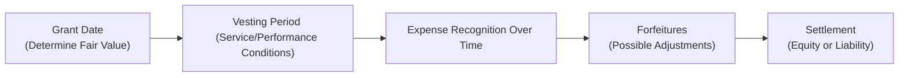

## Introduction
So, you’re probably wondering how companies manage all those dazzling stock options and restricted stock units (RSUs) they hand out like candy to employees and executives. Let me tell you, it’s not quite as simple as, “Here are some shares—enjoy!” The process of recognizing the expense for share-based awards, especially under IFRS and US GAAP, is loaded with subtlety. The main idea is this: at the grant date, you figure out how much that stock-based award is worth, and then you typically record that value over the period the employees work to earn it. 

But the details? Ah, that’s where things get interesting. Because different awards come with different strings attached—some require just sticking around (service conditions), while others demand that the employee (and the company) hit specific performance targets. And then there are the occasional swirl-ups like employees leaving early or performance targets being reworked. We’ll break it all down step by step.

## Grant-Date Fair Value
First, the bedrock principle: the fair value of share-based compensation is typically determined at the grant date. At this point, you might see the company break out an options-pricing model—perhaps the Black-Scholes-Merton model—to arrive at an estimated fair value. Or if it’s restricted stock, they may just look at the stock’s market price on that day. IFRS (under IFRS 2) and US GAAP (under ASC 718) are conceptually aligned here: measure the award at fair value at the time it’s granted, then spread that cost over the service period.

Let’s say you’re the CFO of a growing tech startup (I once talked to someone in that exact scenario who was so excited about giving employees “skin in the game” that they forgot how complicated the accounting could get!). You would want to note the key assumptions that go into your option-pricing model: volatility, expected term, risk-free interest rate, and so on. Analysts reviewing these assumptions pay special attention to see if you’re too optimistic or, in some cases, suspiciously conservative.

## Service Conditions vs. Performance Conditions
Share-based compensation awards typically carry two main types of conditions:

• Service Conditions: These require the employee simply to remain employed through a particular date. No special sales target or profit threshold is necessary. If the employee stays, the award vests.

• Performance Conditions: These hinge on specific metrics, like earnings per share (EPS) achievements or cost-saving goals. If the performance target is met, the award vests. But if the performance target is not met, the grant is forfeited (or partially forfeited, depending on the arrangement).

### Impact on Expense Recognition
For service-conditioned awards, the total fair value determined at grant is recognized over the likely vesting period—often on a straight-line basis unless it’s a graded schedule. By contrast, performance-conditioned awards might have a “cliff” moment if it shows that a performance target won’t be met. In that case, you’d reverse previously recognized compensation expense. IFRS and US GAAP both say: recognize the expense only if the performance condition is probable (US GAAP) or that it’s expected to be met (IFRS). If the company modifies that target along the way—e.g., lowers the performance bar to something easier—then any incremental fair value from that modification is recorded as additional expense.

## IFRS vs. US GAAP: Graded Vesting Schedules
Things get a bit spicier with graded vesting schedules. A graded vesting schedule means employees earn portions (tranches) of the award at different times. For example, 25% of an award might vest after one year, another 25% after two years, and so on. 

• Under IFRS, each tranche must be treated like a separate award. That usually results in accelerated expense recognition because the earlier tranches vest sooner, so you charge more in the early periods.

• Under US GAAP, you have the option to do the same (accelerated approach), or you can use a straight-line approach over the total vesting period. However, even under straight-line, you can’t ignore the total expense that must be recognized by each vest date. Essentially, if you pick straight-line, you’ll still wind up with some front-loading in the early stages, but not quite as pronounced as the IFRS approach.

Imagine awarding 1,000 share options that vest 250 per year over four years. IFRS says: treat each 250-block as if it’s its own separate award with its own vesting timeline. You measure the fair value of each block and expense accordingly, so more expense hits in the first year because some tranches are effectively “fully” recognized. Meanwhile, US GAAP might allow you to say “the total vesting horizon is four years,” so you can spread the cost fairly evenly—although you still need to meet minimum distribution thresholds to avoid under-recognition early on.

## Accounting for Forfeitures
Forfeitures happen if employees leave before they earn their share-based awards, or if performance conditions fail to materialize. Two approaches emerge:

• Under US GAAP, you generally estimate the expected forfeiture rate upfront. You reduce the recognized expense accordingly. If your estimate was off, you true up the difference later.  
• Under IFRS, you can estimate forfeitures at grant date or wait to recognize forfeitures as they occur. Many entities choose to estimate, but IFRS offers the policy choice. If you decide to account for forfeitures only when they happen, then you basically record full expense initially and reverse it when a forfeiture actually takes place.

From an analyst’s perspective, the big question is whether a company’s forfeiture estimates are realistic. Are they painting a rosy picture of employee retention to keep recognized expense low, or are they being prudent?

## Equity or Liability Classification
Now, let’s say your share-based award can be settled in cash or shares at the employee’s request (or maybe there’s some mandatory cash requirement). That changes the classification:

• Equity Classification: If the entity will settle the award with its own shares and the employee cannot force a cash payout, it’s typically equity.  
• Liability Classification: If the employee can insist on cash, or if certain triggers force a cash payment (maybe the board decides to redeem options for cash), then the award is a liability. That means the fair value of the award must be remeasured at each reporting date until settled, introducing more earnings volatility.

**Tip for the exam:** Keep an eye out for small details about settlement features. A single phrase in a vignette saying “employees can elect to receive cash” can flip the classification, and you might see big swings in recognized expense due to remeasurement each period.

## Modification Accounting and Incremental Fair Value
Getting an equity award right the first time is great. But what if the company modifies it down the road, maybe because the exercise price is no longer realistic—like in a recession? Under IFRS and US GAAP, if an award is modified and the total fair value goes up, that difference is called “incremental fair value.” You tack that extra onto your existing compensation expense. 

If the value goes down, you typically don’t reduce the expense recognized to date (unless the employee loses some beneficial right). The logic is that the employee had certain rights under the original instrument, so you can’t simply say “Never mind” for recognized compensation. But if you do reduce the terms, you might see partial reversals of expense for the portion the employee effectively loses. Each modification scenario can get tricky, so the exam will often highlight the new fair value, the old fair value, and how many options remain, letting you compute that incremental piece of compensation.

## Significance of Disclosures
Analysts absolutely should comb through footnotes for share-based compensation details. Key disclosures often include:

• Total share-based compensation expense for the period.  
• Unrecognized compensation cost at period-end (and the weighted-average period over which it’ll be recognized).  
• Key valuation assumptions for option pricing (volatility, expected term, dividends, risk-free rates).  
• Vesting terms, performance conditions, and the number of awards outstanding.  
• Forfeiture policy (estimate or record as incurred).  

If disclosures are incomplete or glossed over, it can be a warning sign. Maybe the company’s trying to mask the real cost of employee incentives.

## Visual Overview

This flowchart shows how an award moves from being granted (calculating its fair value) through the vesting period, with ongoing expense recognition, culminating in either equity issuance or a cash settlement—while also considering forfeitures that might occur along the way.

## Practical Example: Straight-Line vs. Accelerated Approach
Let’s imagine your firm grants 3,000 RSUs. They vest 1,000 each year over three years. The total fair value is $60,000 at the grant date, implying $20 per RSU. Under IFRS, you treat each 1,000-block as a unique award. The first block vests in one year, the second in two years, and the third in three years. Since that first 1,000 vests fastest, it’s front-loaded. By the time you reach the end of year one, you will have recognized the full $20,000 for that first block.

Under US GAAP (straight-line), you might simply record $20,000 per year for three years, adding up to the same $60,000 total. However, you must ensure that by the end of year one, you have accounted for at least $20,000. By the end of year two, you must have recognized at least $40,000. And, obviously, $60,000 by the end of year three.

## Glossary
• Requisite Service Period: The length of time the employee must remain with the company or fulfill certain requirements for the award to vest.  
• Accelerated Expense Recognition: An approach that recognizes more expense in earlier periods, particularly relevant in IFRS’s separate-tranche method.  
• Straight-Line Method: Evenly spreading compensation expense across the entire vesting period.  
• Forfeitures: Occur when employees depart or fail to meet performance requirements before vesting, reducing or eliminating their share-based awards.  
• Modification Accounting: Accounting for changes to an award’s terms (e.g., lowering exercise price). If the fair value increases, that extra portion is recognized as new expense.  
• Incremental Fair Value: The added fair value stemming from a modification versus the award’s original fair value.

## Common Pitfalls
• Mixing up IFRS and US GAAP approaches on graded vesting can lead to exam mistakes. Make sure you know IFRS requires the accelerated approach, while US GAAP offers a choice.  
• Overlooking settlement features that trigger liability classification, which leads to remeasurement.  
• Failing to reevaluate the likelihood of satisfying performance conditions—compensation expense might need to be reversed if the performance criteria becomes improbable.  
• Missing disclosure details. The footnotes in real financial statements can reveal a lot about how the company accounts for forfeitures and modifications.

## Conclusion
Recognizing and measuring share-based compensation might sound like an arcane practice, but it has a direct impact on the bottom line. From fair value measurements at grant date to carefully factoring in the intricacies of service and performance conditions—these choices significantly affect reported earnings. IFRS and US GAAP each have their quirks, so you’ll want to keep a watchful eye for small details. 

If you’re new to this, don’t panic. It may feel complicated at first, but if you tackle it piece by piece—grant date fair value, vesting conditions, forfeitures, classification, and modifications—it all starts to hang together. And from an analyst’s viewpoint, a strong understanding of share-based compensation is critical for detecting potential red flags and making more accurate earnings projections. 

## References & Further Reading
• CFA Institute 2025 Level II Curriculum, Share-Based Compensation Readings  
• IFRS 2 Implementation Guidance (particularly Appendix B for practical examples)  
• ASC 718-20, Compensation—Stock Compensation, for US GAAP guidelines  
• “Equity Compensation for the Corporate Executive,” Stewart & Brown, Corporate Finance Review

---

## Share-Based Compensation Knowledge Check



### Under both IFRS and US GAAP, at what point is the fair value of a share-based award generally measured?

- [x] At the grant date.
- [ ] At the vesting date.
- [ ] At each reporting date.
- [ ] At the forfeiture date.

> **Explanation:** Both IFRS 2 and ASC 718 stipulate that the fair value of share-based awards typically gets measured on the grant date, which then anchors the total compensation expense to be recognized over the vesting period.

### Which of the following best describes the main difference in expense recognition for graded vesting schedules between IFRS and US GAAP?

- [x] IFRS requires separate vesting tranches be accounted for individually, whereas US GAAP permits either the accelerated or a straight-line approach.
- [ ] US GAAP prohibits a straight-line approach for all share-based awards.
- [ ] IFRS allows straight-line approach for all share-based awards.
- [ ] Both IFRS and US GAAP require the same approach for graded vesting.

> **Explanation:** IFRS typically treats each vesting tranche as a separate award (leading to an accelerated pattern), whereas US GAAP allows a choice between the accelerated method or a straight-line approach.

### What happens when a performance condition linked to share-based compensation is no longer considered probable under US GAAP?

- [ ] The compensation expense recognized to date is automatically doubled in the next period.
- [ ] The compensation expense is deferred to the next reporting period.
- [x] The previously recognized expense is reversed.
- [ ] There is no impact if the company uses straight-line recognition.

> **Explanation:** If a performance condition becomes improbable, US GAAP requires reversing previously recognized compensation expense because the condition to vest the award is no longer likely to be met.

### If an employee can demand settlement in cash for their share-based compensation award, how is this award classified?

- [ ] Always as equity.
- [ ] As assets held for sale.
- [x] As a liability.
- [ ] As a residual instrument.

> **Explanation:** When the award includes a mandatory or employee-driven cash settlement feature, it generally must be classified and accounted for as a liability, subject to remeasurement at each reporting date.

### Under IFRS, which of the following statements is correct regarding forfeiture accounting?

- [ ] IFRS requires immediate recognition of full expense with no adjustments for forfeitures.
- [ ] IFRS mandates forfeitures be ignored.
- [x] IFRS allows companies to estimate forfeitures at grant date or recognize forfeitures as they occur.
- [ ] IFRS prohibits any future adjustments for forfeitures.

> **Explanation:** IFRS 2 provides a policy choice: an entity can choose to estimate forfeitures at grant date or recognize them when they occur, adjusting total compensation expense accordingly.

### If a company modifies an equity award in a way that increases its fair value, which term describes the difference between the modified award’s fair value and the original award’s fair value?

- [ ] Noncontrolling interest
- [ ] Residual method
- [ ] Service cost
- [x] Incremental fair value

> **Explanation:** The incremental fair value is the portion representing the increase in fair value due to the modification. This incremental amount is recognized as additional compensation expense.

### Which approach does IFRS commonly use for expense recognition of share-based awards that vest in tranches over multiple periods?

- [ ] Straight-line for all tranches combined.
- [x] Treat each tranche as a separate award with accelerated recognition.
- [ ] Lump-sum expense at the end of vesting.
- [ ] Retroactive recognition after the final vesting date.

> **Explanation:** IFRS usually treats each separate vesting tranche as an individual award, resulting in an accelerated expense pattern (often referred to as the “accelerated method”).

### Which piece of information is most critical for analysts to review in the footnotes for share-based compensation?

- [ ] Auditor's personal opinions on executive behavior.
- [ ] Number of employees receiving options.
- [x] Unrecognized compensation costs and the valuation assumptions used.
- [ ] Executive flight risk data.

> **Explanation:** Footnote disclosures commonly detail the total compensation expense, unrecognized cost, and significant valuation inputs (e.g., volatility, risk-free rate, expected term). These factors can significantly impact an analyst’s evaluation of a firm’s future earnings.

### When a share-based award has purely service-based conditions, what is the standard treatment of the compensation expense over the vesting period?

- [ ] It's recorded entirely at the grant date.
- [ ] It's recognized only when the service period is completed.
- [x] It's recognized ratably (straight-line or accelerated, depending on the vesting design) over the service period.
- [ ] It's reversed at each reporting date.

> **Explanation:** Service-based awards are generally expensed over the service or vesting period, typically using either a straight-line or an accelerated approach (depending on graded schedules, US GAAP vs. IFRS).

### Under US GAAP, which of the following statements is TRUE regarding forfeitures?

- [x] A company may estimate expected forfeitures and record compensation cost net of that estimate.
- [ ] A company is not permitted to estimate forfeitures.
- [ ] Forfeiture accounting applies only to debt instruments.
- [ ] Forfeitures must be recognized only at the final vesting date.

> **Explanation:** US GAAP typically requires management to estimate forfeitures and adjust the total expense recognized to reflect the likelihood of employees leaving before vesting.


