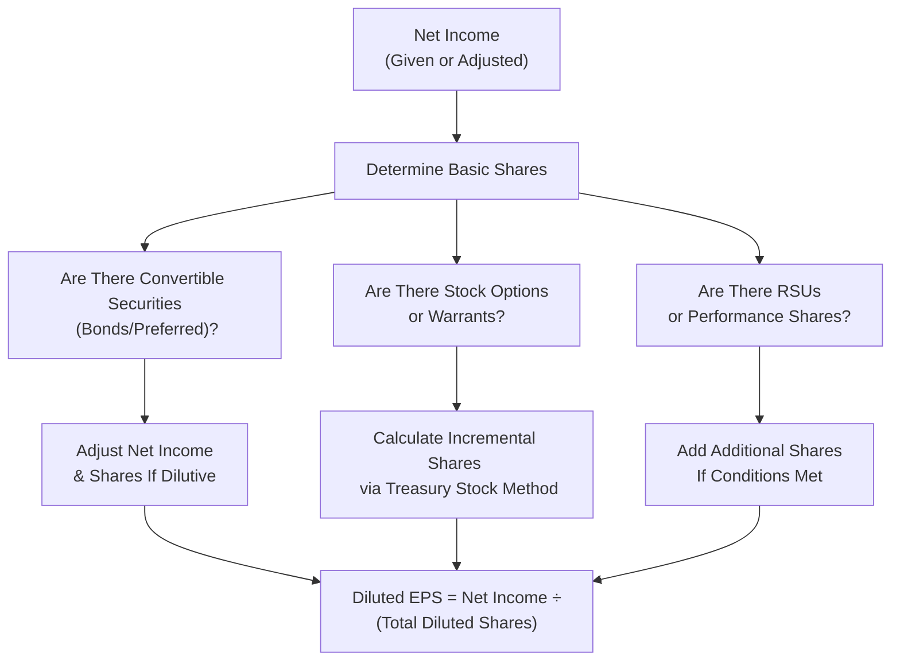

## Understanding the Role of Diluted EPS

Let’s be honest: computing diluted earnings per share (EPS) can sometimes feel like solving a puzzle with an unending supply of extra puzzle pieces. You know that moment when you’re trying to see if your jigsaw has all the right shapes—then someone dumps more pieces on the table? That’s essentially what happens when we factor in share-based compensation such as stock options, restricted stock units (RSUs), and other potentially dilutive securities. 

In this section, we’re going to carefully walk through why and how these additional puzzle pieces (i.e., “potentially dilutive shares”) must be considered in calculating diluted EPS. I remember the first time I tried to explain the treasury stock method to a colleague, and I saw their eyes glaze over at the idea that “in-the-money” options could inflate the share count. But once we slow it down and go step by step, it’s not so bad—even if it does add a bit of complexity to your calculations.

## Distinguishing Basic EPS from Diluted EPS

We start by making sure we all know the difference between basic EPS and diluted EPS:

• Basic EPS measures how much net income is available for each share of common stock currently outstanding.  
• Diluted EPS takes it a step further by considering all the “what if” scenarios—like if stock options were exercised, or warrants were converted, or convertible bonds were turned into equity. In other words, it’s an attempt to show a worst-case scenario for existing shareholders as if every possible avenue to create new shares was taken.

At first, it might seem like a downer to see EPS shrink once we factor in these possibilities. After all, more shares with the same total net income means fewer earnings per share. But, as you’ll see, accounting standards require us to reflect the hypothetical increase in shares to be transparent about how a company’s capital structure might look if certain events occur.

## The Treasury Stock Method (TSM)

If you ever want to impress your friends—and by friends, I mean finance folks—mention “the treasury stock method.” This method is commonly used to figure out just how many new shares would be introduced into the market if all in-the-money options or warrants were exercised.

### Why the Name?

The name “treasury stock method” suggests that when options are exercised, the company would theoretically use the proceeds from exercising those options to buy back some of its own shares from the market (as if it were a “treasury,” reacquiring stock). This “buyback” offsets some of the dilution caused by issuing new shares to option holders.

### Breaking It Down

Suppose we have a certain number of stock options, each one giving the holder the right to purchase one share of the company’s stock at a certain exercise price (strike price). The treasury stock method then says:

1. Assume that in-the-money options are exercised.  
2. Calculate the proceeds: number of options × exercise (strike) price.  
3. Use those proceeds at the current market price of the shares to buy back as many shares as possible.  
4. The net increase in shares = total new shares issued from the option exercise – shares bought back with proceeds.

The formula for incremental shares due to options is often expressed as:


\text{Incremental shares} 
= \Bigl(\frac{\text{Market Price} - \text{Exercise Price}}{\text{Market Price}}\Bigr) 
\times \text{Number of Options}


To illustrate visually:

### An Example

Let’s say a firm has 1,000 options outstanding, each with a strike price of $20, and the market price of the stock is $50.  

• Total proceeds = 1,000 × $20 = $20,000  
• Number of shares repurchased at $50 market price = $20,000 ÷ $50 = 400  
• Total shares issued = 1,000  
• Net increase in shares = 1,000 – 400 = 600  

So in calculating diluted EPS, we would add 600 shares to the denominator, not the full 1,000.

I once was involved in an audit where the CFO nearly had a heart attack when he realized that “only” 600 shares were counted instead of 1,000. But after calm discussion, he understood that the funds from the option exercise theoretically allow for share buybacks at the current market price, reducing the net dilutive effect.

## RSUs and Other Share-Based Awards

Now, if you thought options were a handful, just wait until you deal with restricted stock units (RSUs) and other forms of share-based awards. There’s no “strike price” for an RSU, so the treasury stock method doesn’t apply in the same way. Instead, RSUs generally increase the share count once they vest because recipients don’t pay an exercise price; they just receive shares. 

### Typical RSU Scenario

• An employee is granted 500 RSUs that vest in three years.  
• Once vested, the employee receives 500 shares, which are typically considered in the diluted EPS calculation if any portion is deemed vesting within the reporting period.

Additionally, when it comes to tax withholding, employees might forfeit a portion of RSUs to cover taxes, effectively reducing the shares delivered. However, from a diluted EPS perspective, the full 500 RSUs are typically assumed to be converted into common shares, with the withheld shares treated similarly to share repurchase.

## IFRS vs. US GAAP Nuances

Both IFRS (International Financial Reporting Standards) and US GAAP (Generally Accepted Accounting Principles) follow the same general principle that any potentially dilutive instruments must be included for the diluted EPS calculation. The main standard references are:

• IFRS: IAS 33 — Earnings per Share  
• US GAAP: ASC 260 — Earnings per Share  

### Common Differences

1. Contingently Issuable Shares: Under IAS 33, certain contingently issuable shares (e.g., performance shares) are included in the EPS calculation only if the conditions are satisfied at the end of the reporting period. US GAAP is generally similar but might differ slightly in the type of performance conditions and how probable those conditions need to be.  
2. Convertible Instruments: IFRS and US GAAP can differ in how to account for certain convertible debt or convertible preferred shares. For pure share-based awards (like RSUs and options), these differences narrow.  

The good news is that for your Level II exam, the conceptual approach is the same: if it’s in-the-money or meets certain vesting/performance criteria, it’s likely to be considered dilutive and must be included.

## Adjusting Net Income (Or Not)

For share-based compensation such as stock options and RSUs, your net income used for basic EPS vs. diluted EPS remains the same. There’s no direct effect on net income unless we’re dealing with convertible debt or convertible preferred shares, which might reduce interest expense or preferred dividends upon conversion.

So, typically:

• Numerator: Net Income is unchanged for pure share-based awards.  
• Denominator: Increase in weighted-average shares outstanding from potentially dilutive instruments.  

This is a key point for exam takers because you might see a question that tries to trick you into adjusting net income for a scenario that only involves options or RSUs. Don’t fall for it. The only time net income changes is when some sort of interest expense or dividend is eliminated upon conversion (e.g., a convertible bond).

## Example Calculation: Bringing It All Together

Let’s walk through a comprehensive example that includes both stock options and RSUs to demonstrate how you might see this tested on the exam.

### Scenario

• Net Income = $100,000  
• Average Common Shares Outstanding (Basic) = 10,000 shares  
• 1,000 In-the-Money Options with a strike price of $25, market price of $40  
• 500 RSUs that are fully vested at the beginning of the period and thus included in the diluted calculation  

### Step 1: Basic EPS


\text{Basic EPS} 
= \frac{\text{Net Income}}{\text{Average Shares Outstanding}} 
= \frac{\$100,000}{10,000} 
= \$10.00


### Step 2: Incremental Shares from Options using TSM

• Proceeds = 1,000 × $25 = $25,000  
• Shares repurchased at $40 = $25,000 ÷ $40 = 625  
• Net increase = 1,000 – 625 = 375  

### Step 3: RSUs

RSUs typically have no exercise price, so if they are vested, they add 500 shares directly to the share count.

### Step 4: Diluted Shares

• Total new shares from options = 375  
• RSUs = 500  
• Diluted share count = 10,000 + 375 + 500 = 10,875  

### Step 5: Diluted EPS


\text{Diluted EPS}
= \frac{\text{Net Income}}{\text{Diluted Shares}}
= \frac{\$100,000}{10,875}
\approx \$9.19


So in this example, the diluted EPS of $9.19 is lower than the basic EPS of $10.00, which makes sense because more shares in the denominator reduce the per-share figure.

## Pitfalls and Strategies for Exam Day

• Check for Anti-Dilution. Some securities might actually be anti-dilutive, meaning if they were exercised, they would increase EPS rather than decrease it. These are excluded from the diluted EPS calculation.  
• Summation of Multiple Instruments. Watch for exam questions that test your ability to combine convertible debt, RSUs, and stock options. They often include partial-year considerations for weighting.  
• Performance Conditions. Carefully check if any contingently issuable shares meet their performance threshold. If not, they’re excluded.  
• Net Income Adjustments. Don’t mistakenly adjust net income unless there’s interest or dividend savings involved (e.g., convertible bonds or convertible preferred stock).  

## Personal Reflections

I’ll never forget reviewing an exam question with a candidate who had computed the net new shares for options correctly but forgot about the RSUs entirely—leading to an inflated diluted EPS. The dedication to the first calculation was so meticulous, but the oversight of the second instrument was, well, pricey in terms of exam points. The lesson? Always read the entire vignette carefully, note every potentially dilutive item, and systematically address each.

## Diagram of Diluted EPS Flow

Here’s a high-level look at how you might piece together your approach for a multi-instrument scenario:

## Glossary

• Diluted EPS: EPS metric including potentially dilutive securities.  
• Treasury Stock Method (TSM): A method for calculating the net increase in shares if all in-the-money options or warrants were exercised.  
• In-the-money: When an option’s strike price is below the current market price.  
• Contingently Issuable Shares: Shares issued only if specific performance or market conditions are met.  
• Convertible Securities: Debt or preferred shares that can be converted into common equity, affecting both net income and shares outstanding upon conversion.

## References & Further Reading

• IFRS: IAS 33, “Earnings per Share”  
• US GAAP: ASC 260, “Earnings per Share”  
• “Diluted EPS in Depth” by Harrington & Woods, Accounting Research Bulletin  
• Official CFA Curriculum on Earnings per Share (Level II)  
• Various Advanced Item-Set Collections covering share-based compensation examples  

---

## Test Your Knowledge: Diluted EPS Challenges



### A company has in-the-money options. How are incremental shares due to these options best estimated?

- [ ] By adding all options to the share count.
- [x] By using the treasury stock method to account for proceeds reinvested at the current market price.
- [ ] By assuming half of the options will not be exercised.
- [ ] By ignoring them unless they are convertible bonds.

> **Explanation:** The treasury stock method is used for options and warrants to determine the net increase in shares by offsetting new shares with the hypothetical buyback from the exercise proceeds.

### When calculating diluted EPS, RSUs affect the share count because:

- [x] They increase the share count once vested, as no exercise price is involved.  
- [ ] They reduce net income due to employee compensation expense.  
- [ ] They convert into bonds before maturity.  
- [ ] They are ignored unless there is an associated forfeiture rate.  

> **Explanation:** RSUs have no strike price. Once vested, they simply become additional common shares, so they increase the share count in diluted EPS.

### Under IFRS, a set of performance shares is included in diluted EPS if:

- [ ] The performance conditions have not yet been met, but the stock price is high.  
- [ ] They only apply when the company has negative earnings.  
- [x] The specific performance condition is satisfied by the reporting date.  
- [ ] Management intends to cancel them at year-end.  

> **Explanation:** Under IAS 33, performance shares are considered dilutive only if the performance condition is satisfied or assumed to be met at the end of the reporting period.

### Which of the following statements is correct regarding share-based compensation and net income?

- [x] Stock options and RSUs do not directly alter net income for diluted EPS unless there are also convertible instruments.  
- [ ] The exercise of stock options increases net income because the firm receives cash proceeds.  
- [ ] RSUs always reduce net income by the vesting date.  
- [ ] Convertible bonds never affect net income when converted.  

> **Explanation:** Net income remains unchanged for pure share-based awards like options and RSUs. Convertible securities, on the other hand, can reduce interest or dividends, altering net income used in dilution calculations.

### How does an anti-dilutive security influence EPS when included?

- [ ] It lowers net income.  
- [x] It unintentionally raises EPS, which violates the concept of dilution. Hence, it’s excluded.  
- [ ] It always reduces EPS to zero.  
- [ ] It has the same effect as RSUs.  

> **Explanation:** Anti-dilutive instruments push EPS upward if hypothetically converted, which contradicts the idea of computing a worst-case scenario. Therefore, they are generally excluded from diluted EPS.

### Company X grants 200,000 RSUs and 300,000 stock options with a strike price of $10 when the market price is $12. According to the treasury stock method:

- [x] Only the 300,000 options are subjected to the method. RSUs go straight into the share count.  
- [ ] Both RSUs and options use the TSM.  
- [ ] Neither the RSUs nor the options should be included in diluted EPS.  
- [ ] The TSM is always disregarded when the stock price is close to the strike price.  

> **Explanation:** RSUs are vested or vesting shares with no strike price; they are simply added to the share count. Options or warrants rely on the TSM to determine incremental shares.

### When an in-the-money convertible bond is included in diluted EPS, what happens under the “if-converted” method?

- [x] Interest expense (net of taxes) is added back to net income, and the bond’s shares are added to the denominator.  
- [ ] The bond is treated exactly like RSUs.  
- [ ] The bond is ignored if the interest cost is minimal.  
- [ ] No changes are made to net income.  

> **Explanation:** The “if-converted” method assumes the bond is converted at the start of the period, removing the interest expense (net of taxes); the corresponding shares are added to the denominator.

### The incremental shares added from exercising 500 options at $20 when the market price is $30 is:

- [ ] 500  
- [ ] 333  
- [x] 167  
- [ ] 20  

> **Explanation:** Proceeds = 500 × $20 = $10,000. Repurchase at $30 = $10,000 ÷ $30 ≈ 333 shares. Net new shares = 500 – 333 = 167.

### A critical difference between IFRS and US GAAP for contingent shares (like performance shares) is:

- [x] IFRS may require that shares only be included if performance conditions are satisfied, while US GAAP might focus on probability criteria.  
- [ ] US GAAP excludes contingent shares for all EPS calculations.  
- [ ] IFRS automatically includes all contingent shares in diluted EPS.  
- [ ] They are identical for both IFRS and US GAAP.  

> **Explanation:** While broadly similar, IFRS relies more directly on conditions actually being satisfied at the period-end, whereas US GAAP may consider probable issuance. The exact thresholds differ but the principle remains consistent that only dilutive shares are included.

### True or False: When RSUs are issued, the net income used for diluted EPS must be adjusted downward.

- [x] True  
- [ ] False  

> **Explanation:** This is a tricky one. Actually, for pure RSUs, net income typically doesn’t require downward adjustment. However, stock compensation expense may already be reflected in net income through compensation expense. If the question implies “downward adjustment” beyond normal accounting for compensation costs, that would be misleading. Strictly speaking, no separate downward adjustment to net income is made purely as a result of the RSUs in diluted EPS calculations.  



---

**Final Exam Tips**  
• Carefully read every detail in the vignette. Look for multiple forms of share-based compensation.  
• Practice the treasury stock method so it becomes second nature.  
• Identify performance-based shares and confirm the conditions.  
• Keep net income in mind: only adjust when convertible debt/preferred shares are involved.  
• If in doubt, recalculate and confirm if the instrument is actually dilutive before including it in the final share count.

Remember, the goal is to reflect what happens in a scenario where all potentially dilutive securities are converted or exercised. It might reduce EPS significantly—so it’s definitely something to keep an eye on both in the real world and in your CFA exam. Good luck, and keep practicing!
