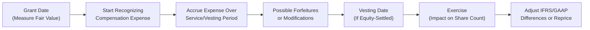

Let’s dive into a realistic exam-style vignette: you’re given a set of share-based compensation awards—options, restricted stock units (RSUs), an employee stock purchase plan (ESPP), and a modification scenario. Our objective is to identify and properly account for the compensation expense, ensure that we handle forfeiture estimates correctly, and compute the diluted EPS impact.

Before we dig into the vignette, I want to share a personal memory that always pops up whenever share-based compensation comes up: a few years back, I remember dealing with a startup that sprang option grants on employees like confetti. The CFO printed out endless spreadsheets trying to track vesting periods and modifications. Everyone was excited about “free shares,” but the accounting side—wow—was tricky. It was a crash course in IFRS 2 (Share-Based Payment) and ASC 718 (Compensation—Stock Compensation) all at once. And that’s kind of how I learned to systematically dissect each award. 

Below, we’ll walk through each type of award step by step, discussing the recognition of compensation expense, the effect on the income statement and balance sheet, and how IFRS may differ slightly from US GAAP. We’ll also look at how modifications can alter everything, from vesting schedules to strike prices.

Let’s get started with the vignette scenario.

––––––––––––––––––––––––––––––

VIGNETTE SCENARIO

A growing consumer tech company—SimpliCharge, Inc.—is offering multiple share-based compensation awards to retain and motivate its employees. As of January 1, Year 1, the following awards are granted:

• Stock Options (Cliff Vesting):  
  – 20,000 stock options granted with an exercise price of $50.  
  – All options cliff-vest at the end of two years, contingent on continued employment.  
  – The estimated grant-date fair value (using an appropriate option pricing model) is $8 per option.  
  – The expected forfeiture rate is 5% per year.  

• RSUs (Ratable Vesting):  
  – 15,000 RSUs granted.  
  – Vest ratably over three years: 1/3 each year on December 31 of Year 1, Year 2, and Year 3.  
  – The fair value per RSU at grant date is $55.  
  – Expected forfeiture rate: 2% per year.  

• ESPP with Look-Back Feature:  
  – The ESPP allows employees to purchase shares at a 15% discount off the lower of the share price at the beginning or end of each six-month offering period.  
  – The company stock was trading at $50 on January 1, Year 1.  
  – By June 30, Year 1, the price is $60. So employees can buy shares at 15% off $50 (because the look-back picks the lower price, which is $50).  
  – The maximum shares purchasable under the plan for the period are 3,000.  
  – The fair value of this look-back feature (computed via a binomial model or other method) is $10 per share.  

• Modification (Option Repricing):  
  – On July 1, Year 2, after a steep decline in the stock price to $40, SimpliCharge decides to reprice the outstanding options (originally granted at $50) down to a $42 strike to re-incentivize employees.  
  – At the modification date, 70% of those original stock options are still outstanding (net of forfeitures that actually occurred).  
  – The incremental fair value from this modification is estimated at $3 per remaining option.

Your tasks:  
1) Determine the annual compensation expense for each award under IFRS and US GAAP (noting minor differences around forfeiture estimates).  
2) Show the adjustments to the income statement and balance sheet, recognizing that some compensation cost remains unrecognized at each balance sheet date.  
3) Calculate the incremental shares included in diluted EPS.  
4) Reflect on the repricing modification and any changes resulting from liability vs. equity classification, if applicable.

––––––––––––––––––––––––––––––

ANALYSIS AND STEP-BY-STEP APPROACH

Identify Award Types and Vesting Conditions  
We have four categories:  
(1) Cliff-vesting options,  
(2) RSUs vesting ratably,  
(3) An ESPP with a look-back (treated as compensatory if the discount is generally over 5% or includes other features), and  
(4) A modification scenario with repriced options.

This alone tells us the timeline we’ll be dealing with, as the expense recognition depends on how awards vest over time and whether there are any additional performance conditions. For everything except the ESPP, we typically allocate expense over the explicit vesting periods. The ESPP expense is recognized in the purchase period, but we still have to measure it at fair value.

Calculate Grant-Date Fair Value  
Under IFRS and US GAAP, share-based compensation is measured at the grant-date fair value for equity-settled awards. For the stock options, it’s $8 per option. For RSUs, it’s $55 each, and for the ESPP, the fair value of the discount (and the look-back feature) is $10 per share.

For a quick formula, if you’d like to illustrate the annual expense in a straightforward manner for an award with uniform vesting, you might do:

$$
\text{Annual Expense} = \frac{\text{Grant-Date Fair Value} \times \text{Number of Awards (adjusted for forfeitures)}}{\text{Vesting Period in Years}}.
$$

But pay close attention to the details of each vesting schedule. For example, cliff vesting means you typically spread the expense evenly over the entire service period until the vest date. Ratable vesting (like those RSUs) might involve front-loading or straight-lining depending on the policy.

Allocate Expense Over the Vesting Schedule (Including Forfeitures)  
IFRS vs. US GAAP primarily differ in how they handle estimated forfeitures. Under US GAAP, you typically estimate forfeitures upfront and adjust compensation expense over time if actual forfeitures differ from the initial estimate. IFRS allows you to account for forfeitures as they occur or estimate them. The standard practice under IFRS 2 is to estimate forfeitures unless a policy choice is made otherwise. So effectively they’re not drastically different, but IFRS standards sometimes prefer looking at actual forfeitures rather than the “expected” method, if an entity chooses that approach.

Below is a rough breakdown:

1) Cliff-Vesting Stock Options (2-Year Vest):
   • Total awards granted: 20,000.  
   • Grant-date fair value per option: $8.  
   • Fair value for all options at grant: 20,000 × 8 = \$160,000.  
   • Expected forfeiture rate: 5% annually. But remember, if cliff vesting is at the end of Year 2, employees who leave in Year 1 or Year 2 lose everything.  
   • If we incorporate an expectation of 5% forfeiture each year for two years, the expected portion to vest might be around 20,000 × (0.95²) = 18,050 options.  
   • So the total “expected” fair value is 18,050 × 8 = \$144,400.  
   • Annual expense for two years (straight-line) = \$144,400 ÷ 2 = \$72,200 per year, absent any adjustments if forfeiture rates actually differ.

2) RSUs (3-Year Ratable Vesting):
   • Grant-date fair value per RSU: \$55.  
   • 15,000 total RSUs, vesting 1/3 each year at Dec. 31 of Year 1, Year 2, and Year 3.  
   • Annual forfeiture rate: 2%. But since it’s ratable, we consider the portion that vests each year. Let’s just keep it simple by applying a straight-line approach for the portion that’s expected to vest.  
   • Each year, about 5,000 RSUs are scheduled to vest (barring forfeitures). If 2% are expected to forfeit annually, the actual portion vesting each year might be slightly under 5,000—for instance, something like 4,900 or so, depending on the exact approach to compounding forfeitures.  
   • For an approximate method, you might say the expected total is 15,000 × (0.98³) over the entire vesting period if 2% of the entire pool is lost each year. But a more precise approach is to handle each year’s 1/3 chunk separately, factoring in who remains.  
   • For simplicity here: 15,000 × \$55 = \$825,000 total fair value. If you assume a stable 2% forfeiture each year, you might end up expecting around 14,120 units to vest in total. So that’s about \$776,600 total. Then you break that into three slices for the three vesting tranches.  
   • Typically, if each tranche is considered a separate award, you’d record 1/3 of that expense in each year. Alternatively, some companies do a simplified approach and just straight-line the total. So roughly \$258,867 per year over three years.

3) ESPP with a Look-Back:  
   • On June 30, employees get to purchase shares at 15% off \$50 (the lower of \$50 at the start vs. \$60 at the end), so effectively \$42.50.  
   • The plan maximum is 3,000 shares. The fair value of that discount plus look-back is estimated at \$10 per share.  
   • The total value given to employees is 3,000 × \$10 = \$30,000 for that six-month period. Because it’s a six-month offering period, you typically recognize the \$30,000 evenly from Jan. 1 to June 30. That’s \$5,000 per month for six months for the “compensatory component.”  
   • Then for the subsequent cycles (July–December), new fair value calculations might apply, but that depends on changes in stock price, volatility, etc.

4) Modification (Repricing from \$50 to \$42 Strike):
   • Happens on July 1, Year 2. At that point, 70% of the 20,000 initial options are still outstanding (so 14,000, net of forfeitures).  
   • Incremental fair value is \$3 per option from the modification.  
   • The additional expense from the modification is 14,000 × \$3 = \$42,000. This incremental amount is recognized over the remaining service period if employees must continue providing service to earn the repriced options. If they’ve already vested, you might have to expense it immediately.  
   • In many real-world situations, if a portion has vested already, you’d book that portion’s incremental fair value at the modification date, and the unvested portion’s incremental fair value would continue to be recognized over the new or remaining vesting period.  

The footnotes would typically reveal these modifications, and you’d see a line item for “additional compensation expense recognized upon repricing.” That’s your clue to adjust your total recognized expense in Year 2 and beyond.

Compute Incremental Shares for Diluted EPS  
When we talk about diluted EPS, we’re focusing on:

• Options: Use the treasury stock method—if the current share price is above the strike, we assume options are exercised, proceeds are used to buy back shares at the current market price, and the net difference is the “incremental” shares.  
• RSUs: Typically included in fully diluted shares as of the date they vest or based on the portion of the vesting that has been completed.  
• ESPP: The incremental shares from the discount are effectively the compensation portion. For instance, if employees buy shares at \$42.50 while the market’s \$60, you can compute how many additional shares are theoretically “granted” to them net of the proceeds you’d get at \$42.50.  
• Modification: If the stock price is below \$42, the options might not be in-the-money. If above \$42, recalculate the incremental shares with the new strike.

Evaluate Footnotes and Classification  
Finally, check the footnotes to see if any portion of these awards might be classified as liability awards—for instance, if employees can demand cash settlement or if there are certain performance conditions that result in a cash payout. The majority of typical share-based plans remain equity-classified, but watch out for unique features. Under IFRS, a plan that calls for certain settlement in cash triggers liability accounting for that portion, with remeasurement each period.

––––––––––––––––––––––––––––––

ILLUSTRATIVE DIAGRAM

Below is a Mermaid diagram showing a simplified flow of share-based compensation recognition:



This high-level view isn’t exhaustive, but it helps visualize the typical timeline: from grant date measurement all the way to exercise, with potential modifications or forfeitures that require remeasurement or additional expense if the award changes significantly.

––––––––––––––––––––––––––––––

BEST PRACTICES, COMMON PITFALLS, AND STRATEGIES

Best Practices  
• Keep an organized spreadsheet or software system that tracks each grant’s vesting schedule, expected and actual forfeitures, and modifications.  
• Disclose, disclose, disclose. Footnotes are your friend. The exam might emphasize reading those footnotes carefully.  
• Align IFRS vs. US GAAP policies for global comparability. If you’re analyzing a multinational, consistent application is vital for easy cross-border comparisons.

Common Pitfalls  
• Forgetting to incorporate ongoing forfeiture estimates or ignoring actual forfeitures and not “trueing up” expense.  
• Missing the immediate catch-up expense on modifications for awards that have already vested.  
• Overlooking the possibility that an ESPP could be non-compensatory (under US GAAP) if the discount is minimal.  
• Mistaking the incremental fair value from a modification as an entirely new grant rather than layering it on top of the existing cost basis.

Strategies for Overcoming Challenges  
• Lay out each award in a timeline—who vests when, what portion is unvested, which portion’s forfeiture experienced or expected, etc.  
• For the exam, break out your calculations by year. Show partial-year expense if vesting starts in the middle of a year or ends partway through.  
• For EPS, carefully compute the in-the-money portion for each equity instrument using the treasury stock method.  

––––––––––––––––––––––––––––––

PRACTICAL EXAMPLE USING PYTHON (OPTIONAL DEMO)

If you’re comfortable with basic Python, here’s a snippet illustrating how you might calculate a quick annual expense for multiple awards (purely for demonstration):

```python

def annual_sbc_expense(num_awards, grant_fv, vest_years, annual_forfeiture_rate, cliff=False):
    """
    Returns estimated annual share-based compensation expense
    for a single award category, factoring in a simple forfeiture approach.
    """
    # basic forfeiture calculation
    # if cliff = True, apply forfeiture rate cumulatively for entire vest period
    # if ratable = not cliff, apply it each year
    import math
    
    if cliff:
        # total fraction that will vest after vest_years
        fraction_vesting = (1 - annual_forfeiture_rate)**vest_years
        total_vesting_awards = num_awards * fraction_vesting
        total_fv = total_vesting_awards * grant_fv
        return total_fv / vest_years
    else:
        # simple approach: each year is separate
        total_exp = 0
        for y in range(vest_years):
            # fraction that remains at year y
            fraction_remaining = (1 - annual_forfeiture_rate)**(y+1)
            # portion vesting in that year
            awards_that_vest = num_awards/vest_years * fraction_remaining
            total_exp += awards_that_vest * grant_fv
        # or you can rework the math, but let's just get an average
        return total_exp / vest_years

year1_expense_options = annual_sbc_expense(20000, 8, 2, 0.05, cliff=True)
print(f"Year 1 SBC Expense for Cliff Options: {year1_expense_options:.2f}")

year1_expense_rsus = annual_sbc_expense(15000, 55, 3, 0.02, cliff=False)
print(f"Year 1 SBC Expense for RSUs: {year1_expense_rsus:.2f}")
```

While you wouldn’t do this in an exam setting, it underscores how you might systematically break down share-based compensation if you’re building a model. In an actual exam scenario, you’d do these calculations with scratch paper and a designated financial calculator.

––––––––––––––––––––––––––––––

CONCLUSION

Understanding how to identify and measure share-based compensation costs under IFRS and US GAAP is essential for analyzing a company’s labor cost structure, equity accounts, and diluted EPS. Many shortfalls in analysts’ models stem from misapplying forfeiture rates, ignoring modifications, or skipping the treasury stock calculations for diluted share counts.

When faced with share-based comp in a CFA® exam item set, remember to:

• Carefully read the vignette footnotes for vesting schedules, forfeitures, modifications, classification details, and performance conditions.  
• Use a clear sequence: measure fair value, allocate to each year, adjust for forfeitures, and finally figure out the EPS impact.  
• Pay special attention to the difference between IFRS and US GAAP on forfeiture estimates.  

With these tools, you’ll be ready to tackle share-based compensation questions confidently, highlight potential red flags in real financial statements, and interpret the diluted EPS with a finer lens.

––––––––––––––––––––––––––––––

REFERENCES & FURTHER READING

• Practice mock item-sets from diverse CFA prep providers that cover share-based compensation scenarios.  
• KPMG and Deloitte publications on share-based compensation accounting in a global context.  
• Morris & Quinn (Journal of Corporate Accounting & Finance): “Equity Compensation: Practical Situations in Valuation and Accounting.”  
• IFRS 2 and ASC 718 official standards.  

Remember, the more you practice dissecting footnotes and layering in each step of the vesting schedule, the smoother it becomes. Once you’ve got the hang of it, share-based comp might even feel a bit fun—like unraveling a puzzle. Maybe.

## Test Your Knowledge: Share-Based Compensation Vignette



### 1. Under IFRS and US GAAP, what is typically used to measure the fair value of equity-settled awards at the grant date?
- [x] The grant-date fair value determined by an acceptable pricing model
- [ ] The intrinsic value at the exercise date  
- [ ] The average market price across the vesting period  
- [ ] The market price at the end of the vesting period  

> **Explanation:** Both IFRS and US GAAP require companies to measure the fair value of equity-settled awards at the grant date using an option-pricing model (such as Black-Scholes or a binomial model).

### 2. How does US GAAP commonly handle forfeiture estimates for share-based compensation?
- [ ] No forfeiture estimates are ever included; they are ignored until vesting  
- [x] Forfeitures are estimated at grant date and adjusted as actual forfeitures differ  
- [ ] Forfeitures are never estimated and are recognized entirely upon vesting  
- [ ] Only actual forfeitures are used at the end of the service period  

> **Explanation:** US GAAP typically requires estimating forfeitures at grant date and adjusting compensation expense if the actual forfeiture rate differs from initial estimates.

### 3. Which of the following is true regarding cliff-vesting stock options?
- [x] The compensation expense is usually recognized straight-line over the entire vesting period  
- [ ] The compensation expense is accelerated in the first year  
- [ ] Portions vary monthly based on the changing fair value  
- [ ] They are automatically considered liability-classified awards  

> **Explanation:** Under a typical cliff-vesting arrangement, total compensation cost is recognized evenly over the requisite service period until the single vest date.

### 4. In the treasury stock method for diluted EPS, which shares count as incremental shares?
- [ ] Shares that are bought back with the proceeds from the option exercise  
- [ ] The total number of shares originally granted  
- [x] The net shares issued after hypothetical exercise proceeds are used to buy back shares at the market price  
- [ ] The shares that remain after applying a forfeiture rate  

> **Explanation:** The treasury stock method recognizes that the exercise proceeds are used to purchase shares at the current market price, so only the remainder (net shares issued) is counted as incremental.

### 5. A company grants 15,000 RSUs vesting over three years. If the projected forfeiture rate is 2% annually, how might the analyst compute the first-year expense?
- [x] Estimate the portion of RSUs expected to vest for that first year and multiply by the grant-date fair value  
- [ ] Multiply 15,000 by 2% and expense that total  
- [x] Treat each tranche of RSUs separately or straight-line the total adjusted fair value  
- [ ] Defer recognition until the RSUs vest in full at the end of year three  

> **Explanation:** The analyst would consider the portion of units vesting each year, adjusted for the estimated forfeiture, then apply the grant-date fair value of those RSUs.

### 6. Which factor is most crucial when determining whether an ESPP is compensatory or non-compensatory under US GAAP?
- [ ] The number of participants in the plan  
- [x] The size of the discount and whether there are other substantive features (like a look-back)  
- [ ] The employer’s total market capitalization  
- [ ] The plan’s vesting period  

> **Explanation:** Under US GAAP, an ESPP is typically non-compensatory only if the discount is minimal (usually 5% or less) and there are no other option-like features. Otherwise, it’s compensatory and requires expensing.

### 7. How does a stock option’s repricing typically affect the related compensation expense?
- [ ] It completely eliminates the original expense if the market price has declined  
- [ ] It merges the original and incremental fair values into a single expense recognized only at modification  
- [x] It adds an incremental fair value, which is recognized either immediately or over the remaining service period  
- [ ] It has no impact because repricing is not allowed under IFRS  

> **Explanation:** Repricing generally creates an incremental fair value that needs to be recognized. If some portion of the re-priced options is already vested, that portion’s incremental fair value is recognized immediately.

### 8. Under IFRS, which of the following statements is correct about forfeiture estimates?
- [x] Firms can elect to estimate forfeitures or account for forfeitures as they occur  
- [ ] Firms are not permitted to estimate forfeitures prior to vesting  
- [ ] Firms must reflect a 0% forfeiture rate unless proven otherwise  
- [ ] IFRS does not allow expense adjustments for forfeitures  

> **Explanation:** IFRS 2 allows companies to either estimate forfeitures or account for them as they happen. Many companies choose to estimate at grant date for consistency.

### 9. Which method is most commonly used to determine the number of incremental shares from stock options for diluted EPS?
- [x] Treasury stock method  
- [ ] If-converted method  
- [ ] Book value method  
- [ ] Par value method  

> **Explanation:** Stock options typically use the treasury stock method for calculating increments to the denominator of the diluted EPS calculation.

### 10. When an award is classified as a liability, which scenario typically occurs under IFRS or US GAAP?
- [x] The award is remeasured at fair value each reporting period through the income statement  
- [ ] The fair value is locked at grant date with no subsequent changes  
- [ ] The employees do not receive any actual equity  
- [ ] The award is not expensed until the actual payout date  

> **Explanation:** Liability-classified awards must be remeasured each period, and changes in fair value flow through the income statement until the award is settled.


