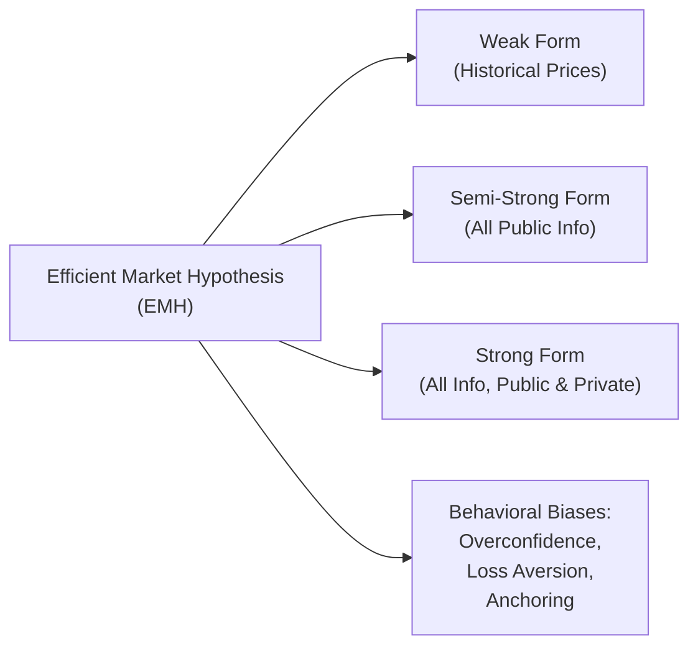
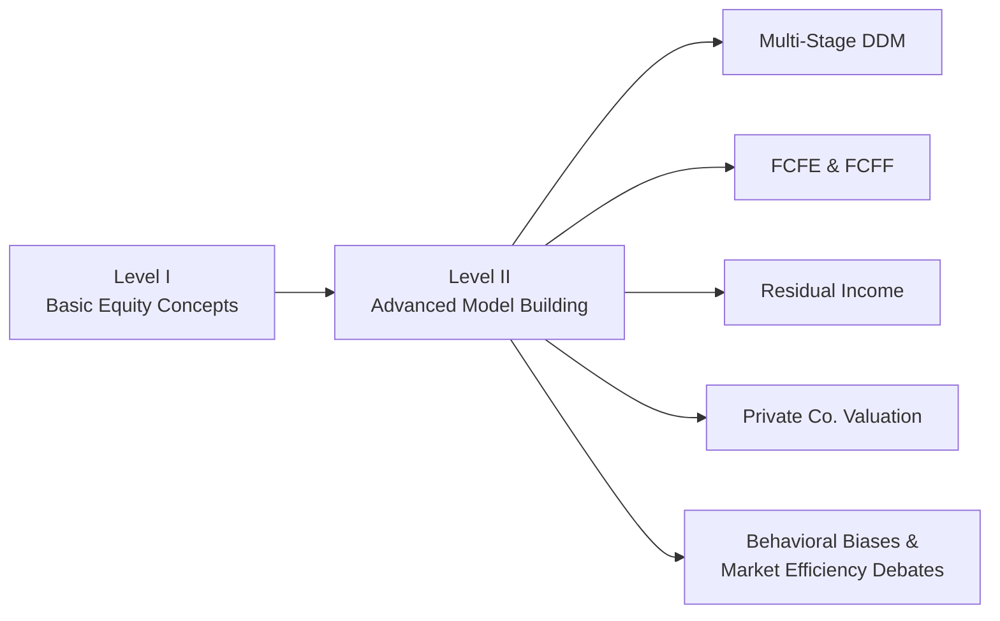

## Overview

If you’re gearing up for Level II of the CFA® Program and you’re thinking, “So, I’ve got the basics from Level I—now what?” then you’re definitely not alone. I remember looking at all the advanced valuation frameworks—multi-stage dividend discount models, free cash flow approaches, private company valuation, you name it—and thinking, “Whoa, this is next-level stuff.” But with the right mindset, it’s not just doable; it’s downright fascinating.

Equity Investments at Level II goes well beyond simple ratios or one-stage dividend discount formulas. Instead, it dives into the gritty details of how to dissect financial statements for hidden insights, factor in off-balance-sheet items, or build multi-stage cash flow projections. You’ll see that everything ties together: macroeconomic analysis, industry structural analysis, and company-specific evaluation converge to help you develop a robust equity valuation viewpoint. The key addition at Level II, though, is using real-world data, scenario-based thinking, and advanced models to reach an investment decision. 

The exam is also heavier on item-set (vignette) questions, so you’ll need to synthesize lots of information in a short amount of time. In other words, you might find yourself reading a mini “story” about a company’s finances, industry outlook, and management commentary. Then you’ll answer several questions testing all angles of that scenario—like calculating the free cash flow to equity or adjusting the capital structure to reflect intangible assets.

## Key Themes and Emphases

### Advanced Valuation Approaches

One of the main draws of Level II Equity Investments is the chance to apply advanced valuation frameworks. In Level I, you might have stuck to a single-stage DDM or a quick multiple approach. Now, you’re tasked with multi-stage dividend discount models, free cash flow (FCFF and FCFE) approaches, and residual income methods that incorporate systematic adjustments for intangible assets and special situations. Expect to see:

• Two-Stage, Three-Stage, or H-Models, which layer in different growth phases.  
• Residual Income Valuation for companies with intangible-dominant balance sheets.  
• Advanced FCFF and FCFE modeling, requiring forecasts of capital expenditures and working capital changes.

These advanced frameworks demand a deeper understanding of a company’s real-life growth cycle and risk profile. Perhaps the business is in a fast-growth phase transitioning to a stable phase. Or maybe there’s a major R&D investment coming that affects future cash flows. You’ll need to keep track of these details for accurate valuations.

### Real-World Data and Scenario-Based Analysis

At Level II, you’ll see that applying your knowledge to realistic data sets is a key skill. The exam vignettes typically incorporate snippets from annual reports, conference calls, or macroeconomic forecasts. You’ll be asked to:

• Identify appropriate discount rates for companies in emerging markets.  
• Incorporate intangible assets or partially recognized liabilities into revised financial statements.  
• Tweak forecasted growth rates based on a shift in the company’s business strategy.  

Yes, the calculations matter, but the approach matters even more. By the end, you should be comfortable diagnosing which valuation technique is best suited to the given scenario. 

### Private Company and Special Situations

Private company valuation is another big focus at Level II. By “private,” we mean firms that don’t have publicly traded stocks—where it’s trickier to find comparable multiples and your discount rate might need different “add-ons” (like a lack of marketability discount). You’ll also encounter special situations such as mergers and acquisitions, distress valuations, or intangible-asset-heavy firms. All these contexts force you to refine your approach:

• How do you factor in a control premium if you’re valuing a private target firm for acquisition?  
• Do you need to make adjustments for synergy in M&A scenarios?  
• What about intangible assets that never show up on the balance sheet but are crucial to the firm’s success?

A lot of these complexities tie back to building a thorough discount rate or adjusting your cash flows to remove “accounting noise.”

### Market Efficiency vs. Behavioral Biases

Level II also addresses market efficiency: how quickly and accurately market prices reflect available information. The coverage sometimes stirs up nice debates—are markets really efficient, or do behavioral biases muddy the waters? Don’t be surprised if you see item sets where investor sentiment leads to mispricing. Your job is to identify instances where bias might lead to an undervalued or overvalued position. 

Below is a quick depiction of different market efficiency layers and behavioral biases that can creep in:

In practice, you might see a situation where a stock’s price runs up too high too fast, or conversely plummets without fundamental justification. Behavioral aspects are often used to explain these anomalies.

### Exam Relevance and Item-Set Format

The exam’s item-set format is all about efficiency when you read and interpret data. Each vignette might provide:

• A mini case describing the macro environment (interest rates, GDP growth), the industry outlook, and the firm’s financial status.  
• Information about the firm’s capital structure, intangible assets, or off-balance-sheet obligations.  
• A scenario in which you must choose the appropriate valuation method—DDM, FCFE, or maybe a market multiple approach—and then perform quick calculations.

It’s not enough just to know the formula; you must also understand in which context it applies best. And yes, the question might throw a twist like a convertible bond or an impending lawsuit, so be ready to adapt your approach.

## Building a Holistic Understanding

### Integrating Macroeconomic and Industry Analysis

Picture yourself analyzing a consumer electronics firm in an emerging market with high inflation. You’d have to link your equity valuation approach to currency risk and inflation forecasts. Or if you’re valuing a commodity producer, you have to tie it in with global supply and demand trends, regulatory shifts, and cyclical price patterns. 

This means you can’t just memorize a formula for discount rates; you have to know where the inputs come from and what might cause them to shift. For instance, a stable economy might use a CAPM-based discount rate, whereas a volatile emerging economy might add a country risk premium. These real-world nuances are tested frequently at Level II.

### Off-Balance-Sheet and Complex Items

Sometimes the standard financial statements don’t tell the whole story—especially if the firm uses leases or special-purpose vehicles that remain off the main balance sheet. You might have to do detective work, reading footnotes to find obligations and add them back to the valuation model. This is where intangible assets, R&D expenditures, or contingent liabilities can drastically change your valuation assumptions. The exam loves testing these adjustments because they show whether you truly know how to handle the real complexities of finance.

### Practical Example

Let’s take a simple scenario: Suppose you have a mid-cap technology firm that’s privately owned, but it’s seeking capital from new investors. The firm invests heavily in software development (most of which is expensed, not capitalized). Here are some key points you’d need to dissect:

• Historical Financials: Because intangible-focused companies often reinvest a large portion of their proceeds into R&D, net income might be consistently low, yet the real growth potential is huge. You might choose a multi-stage FCFE model to factor in the near-term R&D spending spike and the eventual payoff as the new software solutions scale.  
• Marketability Discount: Being a privately held technology firm, its shares aren’t publicly traded, so you might impose a discount for lack of marketability.  
• Off-Balance-Sheet Items: The footnotes reveal a major software licensing agreement with huge future commitments. That needs to be brought into the cash flow calculation.  

At Level II, you’d expect to see multiple questions from a single item set— maybe one about calculating the discount rate, another about adjusting the firm’s financial statements for intangible assets, and a third about computing final FCFE per share. If you can come at those questions from different angles, weaving together the data, you’ll do great.

## Best Practices

• Stay Organized: You’ll be taking in a lot of data all at once. Highlight or note key elements—like the required rate of return, projected growth rates, or unusual expenses—before crunching numbers.  
• Practice “Mental Math” Shortcuts: The exam is timed, and while you have your calculator, it’s helpful to recognize approximate relationships (e.g., doubling times, approximate present values) quickly.  
• Ask the Right Questions: Before performing any calculation, ask yourself: “Which model is best here?” or “Are there intangible assets that need to be accounted for?” or “Do we expect multiple growth phases?”  
• Factor in Behavioral Elements: Don’t ignore the possibility that certain biases could be at play. This might affect the risk perception or the growth expectations that you plug into your models.

## Common Pitfalls

• Overlooking Footnote Disclosures: If you skip footnotes describing off-balance-sheet leases or intangible rights, your valuation could be significantly off.  
• Using a Single-Stage Model When Multi-Stage Is Required: A growing tech startup rarely fits a constant-growth model. Watch out for those high-growth periods.  
• Mixing Valuation Methods Incorrectly: It’s possible to combine DDM insights with multiples incorrectly if you’re not consistent with assumptions.  
• Failing to Adjust for Market Volatility or Currency Risk: Particularly relevant for emerging markets or if the vignette explicitly mentions macroeconomic uncertainties.

## Diagram: How Equity Topics Expand at Level II

Below is a conceptual map showing how foundational Level I concepts broaden into deeper, more application-focused topics at Level II.

## Conclusion

All in all, the equity segment of the CFA Level II curriculum challenges you to refine and deepen what you learned at Level I. You’ll incorporate everything from economic forecasts to intangible assets into a single cohesive valuation. Honestly, it can feel like a lot, but trust me—not only does it make you a much sharper analyst, but it also seeds valuable skills for real-world application. Keep practicing, stay organized, and, above all, remember to read carefully and interpret the data given. That’s the name of the game for these item-set questions.

## References and Further Exploration

• CFA Institute (Official Curriculum) – Equity Investments readings for Level II.  
• Damodaran, A. (NYU Stern), “Damodaran on Valuation”: https://pages.stern.nyu.edu/~adamodar/  
• McKinsey & Company, “Valuation: Measuring and Managing the Value of Companies.”  
• Industry-Specific Journals and Online Resources: For staying updated on real-world market efficiency debates and emerging-market considerations.

## Practice Questions: Evaluate Your Understanding of Level II Scope



### In analyzing a firm with significant off-balance-sheet leases, which statement is most accurate?

- [ ] These leases typically have no impact on the firm’s valuation if the interest rate is stable.
- [x] Capitalizing these leases could substantially alter the firm’s debt-to-equity ratio.
- [ ] Off-balance-sheet leases are always beneficial for improving liquidity ratios.
- [ ] The CFA curriculum does not require the capitalization of leases for valuation.

> **Explanation:** When you capitalize leases, you move them onto the balance sheet, often significantly changing leverage and valuation metrics.

### Which of the following best describes the approach to valuations at CFA Level II compared to Level I?

- [x] Level II integrates multi-stage valuation techniques and scenario-based analyses.
- [ ] Level II eliminates the need for any multiples-based valuation.
- [ ] Level II relies solely on a constant-growth dividend discount model.
- [ ] Level II focuses on short-term trading strategies, ignoring fundamentals.

> **Explanation:** At Level II, you go beyond basic single-stage methods, using multi-stage models and real-world data for scenario analysis.

### A private technology firm invests heavily in R&D, incurring large expenses that reduce net income. Which valuation approach is likely most appropriate?

- [ ] Single-stage DDM because the firm has consistent dividend payouts.
- [ ] P/E multiple because net income fully reflects future growth prospects.
- [x] Multi-stage FCFE or FCFF to account for varying growth rates due to R&D investments.
- [ ] EV/EBITDA because intangible investments can be easily incorporated here.

> **Explanation:** Companies with heavy R&D often experience multiple growth phases, so multi-stage cash flow models are more suitable than a single-stage approach.

### What is a primary characteristic of item-set (vignette) questions on the CFA Level II exam?

- [x] They present detailed scenarios requiring integrated analysis from various angles.
- [ ] They focus only on testing definitions and formulas in isolation.
- [ ] They separate qualitative from quantitative data in different segments.
- [ ] They are always limited to 3–4 lines of text to save exam time.

> **Explanation:** Item sets combine narrative and data in a single scenario, requiring test-takers to apply concepts holistically.

### Which of the following factors may lead to adjustments in a free cash flow forecast for a company with significant intangible assets?

- [x] R&D expenses that must be treated partially like capital expenditures.
- [ ] No future capital expenditures because intangible assets are not depreciated.
- [ ] Historical cost accounting that always eliminates intangible considerations.
- [ ] Automatic reclassification of intangible assets as inventory.

> **Explanation:** Some intangible-centered R&D outlays can function similarly to capital investments in the valuation model, prompting adjustments.

### In the context of emerging markets, which adjustment is often most relevant for determining a firm’s cost of equity?

- [ ] Eliminating the country risk premium if inflation is below 5%.
- [x] Adding a country risk premium to account for political and market volatility.
- [ ] Assuming a 0% risk-free rate due to currency fluctuations.
- [ ] Ignoring default spreads when the government has an investment-grade rating.

> **Explanation:** Emerging markets sometimes exhibit higher political and market risks, leading to an added premium in the discount rate.

### Why might a simple P/E ratio be insufficient for valuing a company undergoing significant corporate restructuring?

- [ ] Because the P/E ratio is not allowed by IFRS for such firms.
- [x] Ongoing restructuring may cause short-term earnings distortions, rendering the ratio less meaningful.
- [ ] P/E ratios are only valid for growth companies.
- [ ] The P/E ratio is too complex and requires intangible asset adjustments.

> **Explanation:** During restructuring, short-term earnings can be erratic. Multi-stage models or adjusted earnings might be more informative.

### Which statement accurately reflects how behavioral biases can affect market efficiency?

- [x] Behavioral biases can cause temporary mispricing, presenting investment opportunities.
- [ ] Markets are fully efficient, so behavioral biases are not relevant to valuation work.
- [ ] Behavioral insights are limited to academic research and have no practical relevance.
- [ ] Price anomalies corrected by behavioral biases remain in the long term, negating efficient markets.

> **Explanation:** Behavior-driven mispricing can deviate from fundamental values, creating chances for skilled analysts to capitalize on inefficiencies.

### How might you evaluate a firm’s intangible assets that rarely appear on the balance sheet?

- [ ] Disregard them unless National GAAP mandates recognition.
- [x] Examine footnotes and segment data to estimate their impact on cash flow and future growth.
- [ ] Assume intangible assets have zero value due to high uncertainty.
- [ ] Immediately expense them to reduce the firm’s tax burden.

> **Explanation:** A proper valuation approach considers intangible drivers behind the scenes. Footnotes often provide clues about these assets’ potential value.

### Real-world data and scenario-based approach at Level II primarily involves:

- [x] Integrating macro, industry, and company-specific information into valuation models.
- [ ] Using only one consistent growth assumption for all firms.
- [ ] Avoiding data from footnotes due to complexity in the exam setting.
- [ ] Focusing on short-term technical indicators over fundamental data.

> **Explanation:** A scenario-based method at Level II weaves together macroeconomic, sector, and firm-level data for a holistic valuation.


