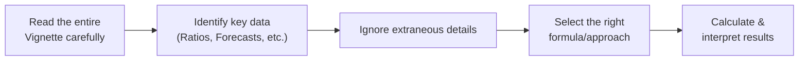

## Understanding the Vignette Format and Its Challenges
If you’re new to CFA Level II, it’s totally normal to feel a bit overwhelmed when you first see the vignette-style items. Each vignette is like a mini case study: you’re given a detailed scenario—maybe it’s about a growth-stage energy firm, or a software company pivoting to subscriptions. Then you get a bunch of data, some of which is super relevant (like next year’s capital expenditure or discount rate assumptions) and some of which feels—well—useless. It’s kind of like grocery shopping with a gigantic list but only needing half the items.

These vignettes often involve multiple concepts at once. You might be asked to calculate a price multiple, judge a required rate of return, and interpret a tricky ratio adjustment, all in the same item set. Don’t panic. Instead, develop strong reading skills, a structured approach, and finely tuned time management. That’s what we’ll be talking about in this section.

## Step-by-Step Reading Approach
One of the most common mistakes I see is reading the first paragraph of a vignette, then rushing straight to the questions, only to realize you missed half the relevant data. Let me tell you a quick anecdote: When I took Level II, I once spent nearly two minutes rummaging around a single paragraph, only to find that the key detail I needed was in the last paragraph, stating an entirely different discount rate. Not fun!

To avoid this, here’s a practical reading strategy:

• Skim First. Quickly scan the entire vignette. Notice any headings, data tables, or big numeric points (like interest rates, debt levels, or forecasted earnings).  
• Flag Key Details. Highlight or jot down vital info such as share count, given ratio results, or assumptions about growth.  
• Revisit for Clarity. After the skim, read more carefully. Where are the traps? Is there any mention of inflation adjustments or updated forecasts that override old data?

## Distinguishing Relevant vs. Extraneous Information
Let’s be honest: not every piece of data in a CFA vignette is crucial. They often include side details—maybe the CEO’s anecdotal remarks on corporate culture or a short quote referencing an unrelated venture. While that stuff might be interesting, it’s rarely needed for the calculation at hand.

### What’s Relevant?
• Data that directly influences a formula (e.g., cost of equity, EPS growth, or next year’s CapEx).  
• Ratios provided that tie into your equity valuation approach, such as P/E or EV/EBITDA (covered in detail in Chapters 10 and 11).  
• Macroeconomic figures—like GDP or inflation—if the question is about adjusting discount rates or real vs. nominal cash flow forecasts (see Chapter 3 for deeper coverage on required rates of return).  

### What’s Extraneous?
• “Fluff” about management personality, or any idle commentary that doesn’t link to a numeric or conceptual input.  
• Historical tidbits that are obviously out of date, especially if a newer forecast is provided.  
• Very general statements about the industry that aren’t connected to a question’s variable (like a random reference to market sentiment if the actual question is purely about dividend discount modeling).

## Timing and Efficiency
Time is precious, especially in the exam setting. You need to handle multiple vignettes in a row. If there’s a five-question item set, you don’t want to bury yourself in reading the same paragraph repeatedly. Here’s a quick rule of thumb:

• Allocate about 2–3 minutes to the initial read. That’s your quick scan pass.  
• Immediately check what each question is asking. Mark which question might be more calculation-heavy versus interpretation-based.  
• Decide on the order to tackle questions. Sometimes the question that seems simpler can be answered right away without re-reading. That might give you momentum.  

I remember once thinking, “Oh, let me do the big calculation question last.” But I discovered that big question actually hinged on the same ratio analysis as a simpler question. Doing them in tandem ended up saving me a re-read. So be flexible.

## Evaluating Analyst Commentary and Assumptions
Often, each vignette includes an analyst’s take—like “Management’s revenue forecast for next year is 15%, while the industry average is 5%.” This difference might be key. Are you expected to accept the 15% figure, or to question it?

Look out for disclaimers or contradictory statements. For instance, the vignette could note that the company has flat to declining sales over the past three years, so a 15% forecast might be suspicious. Depending on the question, you might be asked to:

• Justify whether the growth assumption is realistic.  
• Recalculate equity value using the “standard” industry growth assumption.  
• Critique the logic behind the company’s optimistic forecast.

## Integrating Multiple Topics into a Single Vignette
Level II is famous for throwing multi-dimensional questions at you. For example, you might see a single vignette that tests:

• Free Cash Flow calculations (FCFE vs. FCFF, referencing Chapter 8 and Chapter 9).  
• Dividend discount model variations (Chapters 6 and 7).  
• Adjusting the financials for off-balance-sheet items before you apply your valuation model (Chapter 4 or Chapter 13 for residual income considerations).  

When you notice that the item set touches on multiple areas—like an FCF question followed by a ratio interpretation question—remember that the data all belongs to the same scenario. This connection can guide you: if a certain ratio looks peculiar, it might hint that your cash flow approach needs to account for an unusual capital expenditure pattern or an intangible asset write-down.

## Real-World Reasoning and Practical Interpretation
Even though we’re in an exam environment, try to think like a real-world analyst. Ask yourself: does the final suggested stock price even make sense given the company’s fundamentals? If the question states the firm’s current stock price is $30 and your calculation yields a value of $900, that might signal a misread or an assumption that’s far too aggressive.

• Compare your results to typical market norms.  
• Use your financial intuition—if something is off by a large magnitude, recheck the data.  
• Remember, some vignettes intentionally set up unrealistic forecasts or ratios to see if you’ll blindly accept them or notice the discrepancy.

## Common Pitfalls and How to Avoid Them
• Overlooking the Weighted Average Cost of Capital (WACC) update in the last line of the vignette.  
• Confusing historical growth rates with the forecast growth rate.  
• Misreading currency conversions or ignoring foreign exchange adjustments (especially relevant for multinational firms).  
• Skipping the footnotes, where the real disclaimers or fine-print changes may be hiding.  

## Glossary of Key Terms
• **Vignette-Style Format**: A written scenario blending textual description, financial data, and analyst commentary.  
• **Extraneous Details**: Data within the vignette that doesn’t directly support or relate to the question’s requirements.  
• **Analyst Commentary**: Subjective opinions, forecasts, or assumptions provided in the vignette, often requiring scrutiny.  
• **Integrated Topics**: Multiple curriculum areas (e.g., ratio analysis, valuation, macro) tested together in a single item set.  
• **Practical Interpretation**: The real-world lens you apply when evaluating assumptions, results, and your final answer.

## Visualizing Your Vignette Strategy
Sometimes a simple flow diagram helps keep the approach organized. Here’s a quick snapshot of a possible thought process:

Use this as a mental map: read carefully, pick out relevant numeric and qualitative tidbits, sideline the fluff, then jump into your calculations.

## Brief Example: A Quick Case Illustration
Let’s say you’ve got a vignette about GreenPower Inc., a mid-cap renewable energy firm. The vignette offers:

• Historical Sales Growth (5% annually)  
• Forecast Sales Growth (12% next year)  
• Current Share Price: $42  
• Next Year’s Projected Dividends: $2/share  
• Cost of Equity: 8% per the CFO, but 10% per the external analyst  
• Anecdotal mention: The CEO believes the industry is “ripe for major expansions.”

Now, the question might ask: “Based on these assumptions, which discount rate is most appropriate for valuing next year’s dividend?” You might spot the CFO’s 8% is not supported by industry data, and the external analyst’s 10% might be more in line with sector risk. Always link assumptions back to the broader scenario. Are we in a high-volatility environment that justifies a higher discount rate?

## Practical Time Management Tips
• **Tackle straightforward calculations first.** If the question only needs plugging numbers into a known formula (say the Gordon Growth Model from Chapter 6), do it.  
• **Bookmark complex items.** If a question demands 2–3 steps across multiple locations in the vignette, mark it and move on, returning after the simpler tasks.  
• **Watch the clock.** In an exam with multiple item sets, don’t let one vignette devour your precious minutes. If you’re stuck, make your best guess and move forward.

## Tying Into the Bigger Picture
• Chapter 2 will discuss equity valuation processes in more depth, showing how to connect intrinsic value concepts with practical applications.  
• Chapter 4 highlights the importance of analyzing industry structures and how that data feeds back into the vignettes you’ll see on the exam.  
• Chapters 6 and 7 deep-dive into DDM models—very common in vignettes.  
• Chapter 8 and 9 tackle free cash flow valuations; these get tested heavily in item sets.  

Vignettes often combine these areas, so don’t silo your knowledge. Instead, practice weaving them together under the time constraints and style of the exam.

## Final Exam Pointers
• **Stay Calm Under Pressure**: A single confusing piece of data doesn’t mean you’re off track.  
• **Double-Check**: If something looks incredible or unbelievably large, do a quick re-check.  
• **Be Systematic**: Follow the same reading pattern for each vignette so you don’t miss details.  
• **Look for Clues**: Watch how questions interrelate. Sometimes one question’s answers or steps can help with another.  
• **Practice**: Seriously, do as many practice item sets as you can. That’s the fastest route to confidence and exam-day efficiency.

## References & Further Reading
• CFA Institute Official Curriculum – Sample item sets and recommended best practices for reading and analyzing vignettes.  
• Schweser, Kaplan, and Other CFA Prep Providers – Offer practice vignettes with advanced equity topics.  
• Stake, R. E. (1995). “The Art of Case Study Research.” Sage Publications – Excellent for learning how to dissect complex written scenarios at a deeper level.  

-----------------------  

## Test Your Knowledge: Vignette-Style Question Strategies



### 1. What is the primary purpose of including extraneous details in a CFA Level II vignette?

- [ ] To ensure candidates can recall minor historical facts.
- [x] To test the candidate’s ability to discern relevant data from irrelevant data.
- [ ] To supply necessary footnotes for advanced computations.
- [ ] To highlight the CEO’s personal management style.

> **Explanation:** Extraneous details are intentionally placed to see if you can filter out the irrelevant information and focus on what truly matters for the question.

### 2. Which of the following best describes an effective first step when approaching a new vignette?

- [ ] Scan the provided data tables only.
- [ ] Skip reading the analyst commentary to save time.
- [x] Conduct a quick skim to identify major themes and numerical highlights.
- [ ] Immediately attempt to solve the first question in detail.

> **Explanation:** A brief initial read or skim helps you catch major data points and context before diving into individual questions. This approach reduces re-reads and missed details.

### 3. In a vignette where the analyst’s growth projection appears inconsistent with historical data, what should a test-taker do?

- [x] Note the discrepancy and be prepared to adjust the assumption if required by the question.
- [ ] Accept the growth projection without question to save time.
- [ ] Assume management must have compelling reasons for the higher growth.
- [ ] Reject the entire vignette as flawed.

> **Explanation:** Analyst commentary could be too optimistic (or pessimistic). The exam often tests whether you can critically evaluate assumptions and decide whether to adopt or modify them.

### 4. If you estimate a fair value of $90 for a stock currently trading at $40 after carefully reviewing the vignette data, what might this discrepancy suggest?

- [ ] That your approach was definitely correct.
- [x] Possible misinterpretation of data or extremely aggressive assumptions.
- [ ] That the stock is obviously a buy without further consideration.
- [ ] That the exam expects you to find significant mispricing in every vignette.

> **Explanation:** A large discrepancy should prompt you to double-check your calculations and assumptions—maybe the 90 indicates an unrealistic forecast or an overlooked data point.

### 5. Which of the following is the best time management tip for tackling a vignette item set?

- [x] Briefly identify the easy, straightforward questions first.
- [ ] Start with the most complex question right away.
- [x] Mark complex computations and come back to them.
- [ ] Spend half your available exam time reading the entire vignette in depth.

> **Explanation:** Efficient time management involves scanning for “quick-win” questions and marking the tougher ones to tackle afterward. This ensures you don’t get bogged down in one segment.

### 6. How should a candidate approach multiple topics (e.g., free cash flow, ratio analysis, discount rate) within the same vignette?

- [ ] Focus on only one aspect to avoid confusion.
- [ ] Guess on any question involving complicated calculations.
- [x] Recognize they are part of the same scenario and see if any results or data can be applied across questions.
- [ ] Assume the exam incorrectly combined unrelated topics.

> **Explanation:** Level II item sets often mix multiple areas. The data from one question can impact another, so it’s key to integrate the knowledge rather than view each question in isolation.

### 7. Which of these details is most likely extraneous in a vignette about calculating a firm’s FCFE?

- [x] A paragraph discussing the CEO’s leadership style and philanthropic interests.
- [ ] The firm’s projected net income and capital expenditures.
- [x] A sentence describing how employees feel about the new open-office plan.
- [ ] Expected changes in working capital for the next fiscal year.

> **Explanation:** The philanthropic detail and open-office mention generally don’t affect FCFE. Projected net income, CapEx, and changes in working capital are vital data points for your calculation.

### 8. What is a practical benefit of reading all the questions for a vignette before doing detailed calculations?

- [ ] It wastes time you could spend reading the vignette deeper.
- [ ] It confuses you with too many details at once.
- [x] It helps you focus on the specific data you know you’ll need and skip irrelevant text.
- [ ] It is not recommended; you should never look at the last questions first.

> **Explanation:** Scanning the questions early clarifies which data points are crucial, streamlining your reading and ensuring you don’t get sidetracked by irrelevant paragraphs.

### 9. Why might a vignette provide both a CFO’s discount rate and an external analyst’s discount rate?

- [ ] To test your knowledge of advanced mathematics.
- [x] To see if you can evaluate differing assumptions and decide which is more appropriate.
- [ ] To ensure a longer vignette that appears more realistic.
- [ ] To trick you into using the wrong rate for every question.

> **Explanation:** The exam wants to assess your ability to reconcile or choose between conflicting inputs. In some questions, you’ll justify which discount rate is more logical.

### 10. True or False: Each Level II vignette typically focuses on a single area of equity valuation, with no extraneous topics included.

- [ ] False
- [x] True

> **Explanation:** This question is tricky because it might seem false is correct. However, some vignettes do try to keep the focus narrower. Many vignettes do integrate multiple topics, but there are cases where a vignette focuses primarily on one approach. Always be prepared for either possibility.


