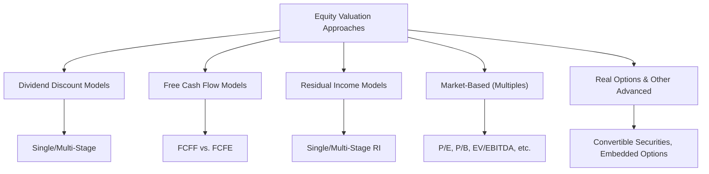

## Overview and Why It Matters  
You know that moment (maybe over a cup of coffee with your study buddies) when someone casually mentions “intrinsic value” or “free cash flows” and you realize there’s a whole nest of definitions you need to keep straight? Well, that’s exactly why we compiled this Essential Terms and Concepts Review. Our mission is to help you smoothly transition from Level I’s fundamentals to the deeper, more analytical demands of Level II. Let’s clarify the jargon, review the formulas, and ensure that you can confidently tackle the exam’s item-set vignettes without stumbling on the basics.

## Building a Vocabulary That Works for You  
Sometimes, a big part of mastering finance is simply learning how to speak “financial analyst.” Clarity in terminology can help you avoid embarrassing slip-ups come exam time. More importantly, consistent use of the right terms (like FCFF vs. FCFE) signals that you’re a pro. In the real world, whether you’re explaining valuations to clients, colleagues, or your boss, you’ll want them to trust your command of the material.  

Below, we’ll revisit fundamental concepts like intrinsic value and CAPM, and then connect them to more advanced ideas like emerging market risk premiums, multi-stage valuation parameters, and the impact of option pricing on equity value. Think of it like polishing off a strong foundation (Level I) and then adding a second, more impressive story (Level II).  

## Core Definitions and Their Advanced Twists  

### Intrinsic Value  
At Level I, we talked about Intrinsic Value as the theoretical or “true” value of a security, calculated based on expected future cash flows. In a nutshell, if you discount all projected future cash flows back to the present at an appropriate discount rate, you’re getting pretty close to the stock’s intrinsic value.  

• Why It’s Important:  
  - Helps identify mispricing. A stock is “cheap” if its market price is below its intrinsic value and “expensive” if above.  
  - Forms the backbone of all fundamental valuation models, including Dividend Discount Models (DDM), Free Cash Flow models, and Residual Income models.

• Advanced Angle: Intrinsic Value Under Multi-Stage Models.  
  - At Level II, you’ll likely see multi-stage valuations: for instance, a high-growth phase followed by a stable-growth phase. These models refine the estimate of Intrinsic Value by recognizing that not all future years look the same.  

### CAPM (Capital Asset Pricing Model)  
Let’s say you’re analyzing a new tech start-up. If your required return is, oh, about 15%, that required return can be estimated via the CAPM equation:


R_\text{required} = R_f + \beta \bigl( E(R_m) - R_f \bigr),


where:  
• Rᵣₑqᵤᵢᵣₑd is the required rate of return on equity.  
• R_f is the risk-free rate (often proxied by Treasury yields).  
• β is the stock’s sensitivity to market movements.  
• (E(R_m) - R_f) is the equity risk premium.  

• Why It’s Important:  
  - CAPM provides a straightforward method to estimate the discount rate for equity.  
  - Central to all discounted cash flow (DCF) models, including your standard Dividend Discount Model or Free Cash Flow approach.  

• Advanced Angle: So-called “Expanded CAPM.”  
  - At Level II, you’ll encounter additional factors or adjustments (e.g., size premium, or a country risk premium for emerging markets). The basic framework remains CAPM plus something, but it acknowledges that markets are rarely one-size-fits-all.  

### Residual Income  
Residual Income is the firm’s net income after deducting the cost of all capital, including equity. In other words, it’s that “excess” above the required return on the firm’s equity.  

• Why It’s Important:  
  - Residual Income Valuation is particularly helpful if a company doesn’t pay dividends or free cash flows are tough to predict.  
  - Targets how well a company’s management is using shareholder capital. You can see if they’re generating returns above their cost of equity.  

• Advanced Angle: Multi-Stage Residual Income Models.  
  - Expect to see multi-stage versions, in which you project residual income over an initial period, then shift to a continuing residual income for subsequent years.  

### WACC (Weighted Average Cost of Capital)  
WACC is your go-to measure for the firm’s overall cost of capital, combining both debt and equity costs. Suppose a company that has a market value of equity of $1 million, plus $500K in debt. If the cost of equity is 12%, the cost of debt is 6%, and the tax rate is 25%, the WACC can be computed as:


\text{WACC} = \bigl(\frac{E}{E + D}\bigr) \times R_e + \bigl(\frac{D}{E + D}\bigr) \times R_d \times (1 - \text{Tax Rate}).


• Why It’s Important:  
  - Often used in discounted cash flow (particularly Free Cash Flow to the Firm) as the discount rate.  
  - Higher WACC = higher hurdle for a project or investment to be profitable.  

Here’s a short Python snippet just for fun:

```python
equity_market_value = 1_000_000
debt_market_value = 500_000
cost_of_equity = 0.12
cost_of_debt = 0.06
tax_rate = 0.25

wacc = (equity_market_value / (equity_market_value + debt_market_value)) * cost_of_equity + \
       (debt_market_value / (equity_market_value + debt_market_value)) * cost_of_debt * (1 - tax_rate)

print(f"WACC: {wacc:.2%}")
```

Run it, and you should see something like 10.50%.  

### Trailing vs. Forward P/E  
• Trailing P/E uses the past 12 months’ earnings.  
• Forward P/E uses forecasts of future earnings.  

It might sound like a small difference, but in practice, a forward P/E ratio can signal what the market expects about future profitability—useful if you’re analyzing a high-growth stock.  

• Why It’s Important:  
  - Demonstrates how market expectations (forward) compare to historical performance (trailing).  
  - Helps identify potential over- or under-valuation based on how well a company meets future earnings expectations.  

### FCFF (Free Cash Flow to the Firm) vs. FCFE (Free Cash Flow to Equity)  
• FCFF is the cash flow available to all capital providers—both equity holders and debt holders.  
• FCFE is the leftover for equity holders after you’ve satisfied debt obligations.  

Which do you discount at WACC and which do you discount at the cost of equity?  
• FCFF → WACC  
• FCFE → Cost of equity (Rₑ)  

### Enterprise Value (EV)  
Enterprise Value is basically the total value of a company from the perspective of all investors. In formula form:

Enterprise Value = Market value of equity + Market value of debt + Minority interest + Preferred shares – Cash & cash equivalents.  

• Why It’s Important:  
  - EV helps you compare companies with different capital structures.  
  - Metrics like EV/EBITDA are often a go-to in leveraged firms because they’re less skewed by debt interest payments than P/E might be.  

### Emerging Market Risk Premiums  
If you remember that CAPM assumes a single market risk premium, then you’ll see how an additional “country risk premium” is used to adjust for the sometimes more volatile economic environment in emerging markets.  

• Why It’s Important:  
  - Investors expect higher return for higher risk.  
  - Valuations for companies in frontier or emerging markets might incorporate a specialized risk factor or premium, effectively raising the discount rate.  

### Option Pricing Influences on Equity Valuation  
Sometimes, especially with companies that have convertible bonds or warrants outstanding, the equity can behave like an option. As you approach Level II, you realize that the presence of embedded options can significantly affect a stock’s valuation—dilution risk, volatility changes, etc.  

• Why It’s Important:  
  - Option-like features can boost or reduce the effective value to shareholders, depending on conditions.  
  - Understanding how these instruments might convert or be exercised helps to avoid surprise changes in share counts or capital structure.  

## Visual Concept Map  
Below is a quick conceptual map (in Mermaid) to illustrate the major valuation approaches and how they interrelate:



Reading this from left to right, you see how each approach sits under the broader umbrella of equity valuation. At Level II, you’ll go deeper into multi-stage DDM or the nuances of residual income, adjusting for off-balance sheet items, and so forth.  

## Practical Tips and Examples  
So, how do all these concepts connect in practice? Here’s a quick real-world-ish scenario:

• Suppose you’re valuing a manufacturing firm in a frontier market. You identify a higher cost of equity due to political instability, so you add a small country risk premium of, say, 3% to your standard CAPM output. This raises your discount rate from 10% to 13%. That single change can have a pronounced effect on your DCF calculations, dropping the present value of future cash flows by a noticeable margin.  

• Next, you realize the firm is heavily leveraged and has multiple lines of credit. A simple P/E ratio might be misleading because interest costs are huge, so you turn to EV/EBITDA to compare the company with peers.  

• Finally, you note that the firm has an embedded call option on a key resource, which might theoretically add upside potential if that resource hits a certain price. Factoring in that added optionality can elevate the equity value further—though it gets complicated quickly.  

## Common Pitfalls  
• Mixing FCFF and FCFE incorrectly. (If you discount FCFF by the cost of equity, you’re making a mismatch—yikes.)  
• Using a trailing P/E for a company that’s had a big jump (or fall) in earnings—your ratio might be outdated.  
• Applying CAPM in an emerging market without adjusting for extra volatility and risk.  
• Forgetting to adjust your discount rate when the capital structure changes. WACC is not set in stone!  

## Study Tip: Organize a Reference Guide  
One strategy is to build flashcards or a digital concept map that includes:  
• The name of the concept (e.g., CAPM, WACC, Residual Income, etc.).  
• The formula, if applicable.  
• One sentence explaining why it matters (“WACC is used as the discount rate for FCFF because it reflects the blended cost of different sources of capital.”).  
• A small note on potential pitfalls or advanced uses (“For highly leveraged firms, consider enterprise-value-based multiples.”).  

This succinct approach helps you recall definitions fast under exam pressure and fosters a stronger intangible connection: you’ll remember not just the formula, but also the reason and context.  

## Final Exam Tips for Level II  
• Stay agile on definitions. The item-set format can slip in tricky references, such as “owner’s earnings,” that might echo FCFE.  
• Use consistent notation. For instance, if you see “r,” confirm whether it denotes the cost of equity or the WACC.  
• Show the formula, but also show your conceptual understanding. Many Level II questions reward the “why,” not just the “how.”  
• When in doubt, carefully re-check which discount rate or multiple is relevant for the scenario described.  

## References  
- CFA Institute (Official Curriculum) – Excellent detail on each model and its exam-relevant intricacies.  
- Aswath Damodaran, “Investment Valuation” – Comprehensive coverage of valuation theory and practice.  
- CFA Institute Investment Series, “Equity Asset Valuation” – Highly recommended for detailed deep-dives into DDM, FCF modeling, and more.  

## Test Your Mastery of Essential Equity Concepts



### A company reports a large portion of its capital structure as debt, leading to frequent interest payments. Which valuation metric might be most appropriate to compare it against its peers?
- [ ] Price-to-Earnings Ratio (P/E)
- [x] EV/EBITDA
- [ ] Forward Price-to-Cash Flow
- [ ] Trailing Price-to-Earnings

> **Explanation:** For highly leveraged firms, metrics like EV/EBITDA are often preferred because they neutralize the effect of capital structure on interest payments.

### When using a multi-stage dividend discount model, which primary component changes as you transition from high-growth periods to stable growth?
- [ ] The cost of equity
- [x] The growth rate assumption
- [ ] The tax rate
- [ ] The number of shares outstanding

> **Explanation:** A multi-stage DDM typically involves switching from an initial, higher growth rate to a lower, stable growth rate in the terminal phase.

### If you are valuing Free Cash Flow to the Firm (FCFF), which discount rate is most appropriate to use?
- [x] WACC
- [ ] Cost of Equity only
- [ ] Risk-free rate
- [ ] CAPM returns

> **Explanation:** FCFF pertains to all providers of capital, so the Weighted Average Cost of Capital is the correct discount rate.

### Which statement best describes the addition of a country risk premium for an emerging market stock?
- [x] It increases the discount rate to account for higher market volatility and political risk.
- [ ] It decreases the discount rate because of diversification benefits.
- [ ] It only applies if the company pays dividends.
- [ ] It only applies to sovereign debt, not equity.

> **Explanation:** An emerging market or country risk premium is used to raise the discount rate, reflecting the extra uncertainty and risk in that environment.

### An equity analyst uses the Residual Income Model. Which of the following would increase the projected residual income?
- [x] A higher return on equity than the required cost of equity
- [ ] A higher cost of equity than ROE
- [x] An increased net income and stable cost of equity
- [ ] A lower net income than the debt expense

> **Explanation:** Residual income grows when actual returns on equity exceed the required cost of equity.

### If a firm’s trailing P/E ratio is significantly higher than its forward P/E ratio, this most likely suggests:
- [x] Earnings are expected to grow and improve, reducing the future P/E.
- [ ] The company has no growth prospects.
- [ ] The market is ignoring historical performance.
- [ ] The value of shares has declined dramatically.

> **Explanation:** A lower forward P/E relative to trailing P/E generally indicates expectations of higher future earnings.

### In a real options context, the value of the equity might increase if:
- [x] The firm has a valuable option to invest in a project if certain conditions are met.
- [ ] The firm’s convertible bonds are never exercised.
- [x] Volatility in underlying project returns rises in a beneficial way.
- [ ] Interest rates remain constant.

> **Explanation:** Real options add optionality to pursue profitable ventures (or abandon unprofitable ones). Higher volatility often magnifies the upside of that option, increasing equity value.

### Which of the following is the most direct measure of excess returns generated after all capital costs (debt and equity) are accounted for?
- [ ] FCFE
- [x] Residual Income
- [ ] Gross Profit
- [ ] Net Income

> **Explanation:** Residual Income specifically deducts charges for equity capital, making it a direct measure of excess returns over all capital costs.

### To adjust the CAPM model for investing in a frontier market, an analyst adds 5% to the equity risk premium. This adjustment primarily reflects:
- [x] Additional geographic and political risk in that market.
- [ ] The availability of cheaper labor.
- [ ] A different approach for valuing convertible bonds.
- [ ] A short-term fluctuation in interest rates.

> **Explanation:** Adding a country risk premium is a direct reflection of extra geopolitical and market uncertainties present in frontier or emerging markets.

### A firm’s WACC is used as a discount rate for a FCFF valuation. Under typical assumptions, is this approach correct?
- [x] True
- [ ] False

> **Explanation:** FCFF is the cash flow available to all providers of capital. Accordingly, WACC is the appropriate discount rate that reflects both equity and debt holders’ required returns.


