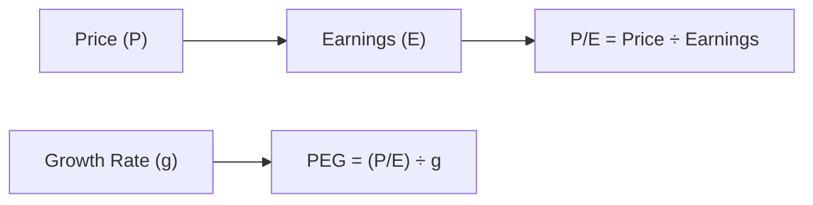

## Introduction

Price-to-Earnings (P/E) ratios are one of those metrics you can’t escape in the world of equity valuation. You’ll hear them quoted on financial news channels, whispered about by analysts in coffee shops, and discussed in academic circles trying to figure out whether markets are overpriced. And honestly, it’s no wonder. The P/E ratio is a compact way to gauge how expensive or cheap a stock might be relative to its earnings.

At the CFA Level II stage, we go a bit deeper than at Level I. It’s not just about memorizing P/E definitions anymore—we need to understand the different types (trailing vs. forward), how they connect to earnings growth (PEG ratio), and how we can adjust them to reflect real economic conditions. Let’s break it down step by step.

## Understanding P/E Ratios in Context

The P/E ratio starts with a simple premise: take the stock’s price per share and divide it by the company’s earnings per share (EPS). The resulting number is how many dollars investors are willing to pay for each dollar of the company’s earnings. High P/E multiples may suggest that investors have lofty growth expectations, while low P/E multiples can signal undervaluation or skepticism about future growth.

Below is a simple diagram to help you visualize how P/E is structured alongside growth rate (for PEG). Remember to note that in practice, the “E” can be historical or forward-looking:



The “E” you plug in can drastically alter the conclusion you draw. That’s why we parse P/E into trailing and forward variants, and why we also throw in the PEG ratio to factor in growth expectations.

## Trailing P/E (Historical)

• Definition: Trailing P/E = Current Stock Price ÷ EPS over the last 12 months.  
• Also called P/E (TTM), where TTM stands for “twelve months trailing.”

Using historical data generally makes sense if you want an objective figure free from forecast bias. A trailing P/E ratio doesn’t rely on forward-looking estimates that might be too optimistic or pessimistic. It’s “what actually happened” rather than “what we think will happen.”

That said, there’s always a catch:
1. If the company experienced a massive one-time gain or loss, historical EPS can be distorted.  
2. If the industry is cyclical, trailing earnings might not reflect the true earnings power across a full business cycle.

I remember analyzing a machinery manufacturing company several years ago. Their trailing earnings were heavily depressed due to a temporary economic downturn. On paper, the trailing P/E was sky-high, making the company look overvalued. But in reality, it was near the bottom of a cycle. If we’d bought on that “apparent” overvaluation signal, we probably would have ended up with a decent return when earnings reverted higher.

So, sure, trailing P/E is easy to calculate and is free from forecast error, but it can be misleading if the look-back period doesn’t reflect true, long-term earnings power.

## Forward P/E (Forecasted)

• Definition: Forward P/E = Current Stock Price ÷ Expected EPS over the next 12 months (or next fiscal year).

Forward P/E includes that dash of speculation: you have to trust your own or a consensus forecast for the upcoming period’s earnings. While forward P/E might be more relevant for growth companies (where historical earnings hardly represent the next phase of growth), it’s subject to analyst forecast bias, unexpected macro shocks, and changes in market sentiment.

One tiny revision in an analyst’s forecast can shift a forward P/E multiple quickly. For instance, if the forecasted EPS is revised downward, the forward P/E ratio automatically goes up, perhaps signaling overvaluation. On the bright side, forward P/E is more in sync with the market’s forward-looking nature. Investors buy future cash flows, not what the company already produced.

## The PEG Ratio (Price/Earnings-to-Growth)

• Definition: PEG = (Price ÷ Earnings) ÷ Earnings Growth Rate or (P/E) ÷ g.

At some point, people realized that a standalone P/E misses the notion of a company’s earnings trajectory. Enter the PEG ratio, which tries to incorporate expected growth by dividing the P/E by the company’s projected growth rate (usually as a percentage). 

So if a company has a P/E of 40 but is growing earnings at 40% per year, its PEG ratio is 1.0, which might be more reasonable than it first appeared. Another firm might have a P/E of 20 but is growing at only 5% per year; its PEG is therefore 4.0, which looks less attractive from a PEG perspective. 

Now, you’ll hear rules of thumb:  
• A PEG near 1 is often considered “fairly valued.”  
• Above 1 might be richly valued.  
• Below 1 might be a bargain.  

But these are not ironclad rules—this is the real world, after all, and actual valuations depend on a host of factors. Also, growth rates can change suddenly, so a PEG ratio can be out of date if your growth estimates miss the mark.

## Adjusting for Cyclical or Non-Recurring Earnings

Sometimes you hear about “smooth” earnings or “normalized” earnings. Analysts do this to address cyclical fluctuations or large, one-time items that distort EPS. If a company just sold a big property at a massive gain, that might juice up the trailing EPS artificially. If a major new competitor enters the market, it might slash your next-quarter forecasts. 

Possible ways to handle these:
1. **Averaging Earnings**: Use a multi-year average (e.g., 3–5 years).  
2. **Removing One-Time Items**: Exclude gains/losses that won’t recur.  
3. **Cyclical Adjustments**: Factor in where we are in the economic cycle, especially if the firm’s performance is highly sensitive to macro conditions.

These steps help ensure the “E” in your ratio is more representative of ongoing operations.

## Relationship Between P/E, Inflation, and Interest Rates

You’ll often hear that when interest rates are low, P/E ratios go higher. Why? Because the discount rate used in stock valuation goes down, inflating present values of future cash flows. Meanwhile, moderate inflation often supports stable corporate earnings growth and fosters higher P/E multiples, as there’s less concern about rapidly rising costs.

Alternatively, in a high-interest-rate environment or amid high inflation, investors demand higher returns, pushing discount rates up. High discount rates reduce the present value of future earnings, so P/Es tend to fall.

So if you see P/E ranges expanding across the board, don’t just assume every sector is overvalued. It could be that the risk-free rate has fallen substantially. On the other hand, if interest rates spike, watch out—those previously elevated P/E ratios may not hang around for too long.

## Sector Variations

In technology, it’s not unusual to see P/E multiples that seem sky-high compared to, say, traditional utilities or consumer staple companies. But a 30x P/E multiple in tech might not be “too high” if the company is truly doubling its earnings every couple of years and dominating its market niche.

Meanwhile, utilities often have stable (though slow-growing) earnings, resulting in lower P/E ratios. Banks and financials can have P/E fluctuations driven by interest margins and regulatory conditions. It’s all context. The key is to compare a company’s P/E to peers in the same industry as well as to its own historical range, not just to the entire market.

## Earnings Revisions in Forward P/E

The forward P/E can swing wildly with revisions to earnings estimates. An optimistic forecast can boost the denominator in your forward P/E calculation. When reality doesn’t match that optimism—like if an economic slowdown hits—analysts might slash their EPS expectations. Then, if the stock price hasn’t adjusted accordingly, the forward P/E shoots up and suddenly looks expensive.

From a CFA Level II perspective, keep an eye on consensus estimates. Look for potential catalysts such as a product launch, a big regulatory decision, or a macro event (like interest rate changes). Each can drive major changes in forward earnings estimates.

## Scenario Analysis: Seeing the Full Picture

One neat way to approach trailing P/E, forward P/E, and PEG is to create a few different scenarios:
1. **Base Case**: Standard consensus EPS forecast, standard GDP growth, no major disruptions.  
2. **Upside Case**: Above-average growth, cost efficiencies, or unforeseen synergy.  
3. **Downside Case**: Macroeconomic headwinds, supply chain issues, maybe a competitor stepping in.

By re-computing forward P/Es and PEG under each scenario, you’ll see how sensitive valuations are to changes in growth assumptions or discount rates. This is a big deal if you’re dealing with high-volatility industries or if you suspect the consensus might be too rosy.

## Practical Example

Let’s say we’ve got a stock trading at $50 per share. Its trailing twelve-month EPS is $2.00, and the consensus forward EPS is $3.00 since analysts expect a big bounce. We also project a 25% annual growth rate in earnings:

• Trailing P/E = $50 ÷ $2 = 25x  
• Forward P/E = $50 ÷ $3 = ~16.7x  
• PEG = 16.7 ÷ 25 = ~0.67  

At first glance, the trailing P/E may look a bit high. But once we factor in the anticipated earnings rebound and fairly robust growth, the forward P/E looks more modest, and the PEG ratio suggests a potentially attractive valuation. The real question? Will that growth forecast materialize as projected—and how might an economic slowdown or some adverse event reduce that rosy $3.00 EPS figure?

## Quick Python Snippet

If you’re curious about how you might quickly evaluate trailing and forward P/Es in a spreadsheet or programmatically, here’s a simple Python snippet:

```python
import pandas as pd

# We'll calculate the trailing and forward P/E ratios:

df['Trailing_PE'] = df['Price'] / df['EPS_TTM']
df['Forward_PE'] = df['Price'] / df['EPS_Forward']

print(df[['Date', 'Price', 'EPS_TTM', 'EPS_Forward', 'Trailing_PE', 'Forward_PE']])
```

This snippet gives you a quick readout of how price multiples are changing, assuming you keep the DataFrame updated with the most recent price and consensus earnings.

## Common Pitfalls and Best Practices

• **Pitfall: Over-Reliance on Forecasted Earnings**  
  – Forecasts can be downright wrong. Always keep a margin of safety and consider scenario analysis.

• **Pitfall: Not Normalizing Earnings**  
  – One-time gains and losses can magnify earnings. Remove those to get a realistic number for EPS.

• **Pitfall: Ignoring Sector Norms**  
  – Metal mining, banks, tech—each has unique drivers. Compare apples to apples.

• **Pitfall: Blindly Assuming PEG < 1 Is “Cheap”**  
  – Growth estimates might be off, or the ratio might not reflect the company’s risk profile.

• **Best Practice: Evaluate Historical P/E Ranges**  
  – Where does the company’s ratio stand relative to its own past? Has the business model changed?

• **Best Practice: Incorporate Macroeconomic Indicators**  
  – Interest rates, inflation, GDP growth, and consumer sentiment can all shift P/E multiples.

• **Best Practice: Maintain Consistency**  
  – If you’re using forward earnings for one ratio, do the same for other valuation methods or at least note the difference in approach.

## Conclusion

P/E ratios—especially trailing, forward, and PEG—remain staple tools in equity valuation. They provide quick snapshots of how the market is valuing a firm’s earnings power and growth prospects. However, they’re not perfect. Be mindful of the biases in forward estimates, the distortions from cyclical or one-time items, and the context of sector norms and macro conditions. 

At the CFA Level II level, your ability to adapt these multiples, factor in different assumptions, and reconcile them with other valuation methods (like DDM or FCFE) is crucial. Practice scenario analysis, keep a wary eye on forecast revisions, and remember that a “high” or “low” ratio is always relative. If you keep these nuances in mind, your analyses will go beyond the simple math and unlock deeper insights into how market participants price companies, which is exactly what examiners (and real-world employers) want to see.

## References

• Damodaran, A. (2012). Investment Valuation: Tools and Techniques for Determining the Value of Any Asset. Wiley.  
• CFA Institute. (2022). Equity Valuation: Concepts and Basic Tools.  
• Investopedia: “How to Use the PEG Ratio” – https://www.investopedia.com/articles/fundamental-analysis/11/how-use-peg-ratio.asp  
• Major Broker-Dealer Research (Earnings Surprises & Revisions)  

## Test Your Knowledge: P/E Ratios and Price Multiples



### Which of the following statements best describes the trailing P/E ratio?
- [ ] It relies solely on analyst estimates of future earnings.
- [x] It uses historical earnings per share (EPS) over the last 12 months.
- [ ] It excludes the effects of any economic cycles.
- [ ] It is based on forward-looking data and growth projections.

> **Explanation:** The trailing P/E ratio divides the current stock price by the actual EPS from the previous 12 months. No analyst forecast or forward-looking assumption is needed.

### Which of the following factors could cause the forward P/E ratio to increase abruptly?
- [x] A downward revision of future earnings estimates.
- [ ] A sudden jump in the company’s reported accounting earnings for the past year.
- [x] Interest rates spiking higher, reducing forward-looking valuations.
- [ ] A debt repayment that lowers interest expense in the trailing period.

> **Explanation:** The forward P/E ratio depends on future earnings estimates (the denominator). If analysts revise estimates downward or discount rates rise, the ratio will climb. The other items either affect trailing results or have less direct impact on forward EPS.

### Regarding the PEG Ratio, which statements are true?  
- [x] It is calculated as P/E ratio divided by the earnings growth rate.  
- [ ] It focuses solely on past earnings, ignoring future growth.  
- [x] It attempts to factor in expected growth when assessing valuation.  
- [ ] It automatically accounts for cyclical fluctuations in earnings.

> **Explanation:** The PEG ratio divides the P/E (price-to-earnings) ratio by the growth rate. It’s designed to incorporate expected growth into the valuation. It does not adjust for cyclical fluctuations by itself.

### What is the primary reason analysts prefer to adjust earnings before calculating a P/E multiple?
- [ ] To align P/E calculations with IFRS or US GAAP requirements.
- [x] To remove one-time or non-recurring items that distort the typical earnings power.
- [ ] To lower the overall P/E ratio in order to justify a stock purchase.
- [ ] To strictly focus on reported GAAP figures.

> **Explanation:** Common practice is to exclude one-time and nonrecurring items to get a clearer picture of the company’s sustainable earnings. This allows for a more realistic valuation multiple.

### If a technology firm has a P/E of 50 and is expected to grow its earnings at 50% annually, what would be its approximate PEG ratio?
- [x] 1.0
- [ ] 2.5
- [x] 1.7
- [ ] 0.5

> **Explanation:** The PEG ratio is P/E divided by growth rate. In this case, 50 ÷ 50 = 1.0. Some answer choices might also consider decimal expansions, but 1.0 is the correct approximation.

### Low interest rates generally lead to:
- [x] Higher P/E ratios because discount rates decrease.
- [ ] Lower P/E ratios because discount rates increase.
- [ ] No effect on P/E ratios, only bond prices.
- [ ] Immediate increase in reported EPS.

> **Explanation:** When interest rates fall, the required return on equities typically falls as well, supporting higher stock valuations and thus higher P/E ratios.

### Which of the following is a potential pitfall in using forward P/E ratios?
- [x] Analyst forecast bias or inaccurate earnings projections.
- [ ] They only use historical data, ignoring the future.
- [x] They are not influenced by changes in sector norms or growth rates.
- [ ] They already incorporate cyclical earnings smoothing.

> **Explanation:** Forward P/E depends on forecasts, so bias or lack of accurate modeling can mislead investors. They’re also influenced by sector norms, macro volatility, and growth expectations.

### Which statement about comparing P/E ratios across different industries is most accurate?
- [x] Directly comparing P/E across industries can be misleading due to unique business models and growth rates.
- [ ] Industries always share similar growth and risk profiles, making cross-industry comparisons straightforward.
- [ ] Banks and utilities traditionally have the highest P/E multiples due to stable earnings.
- [ ] Tech typically has lower P/E ratios because of higher reinvestment rates.

> **Explanation:** Each industry has specific risk factors and growth potentials, so a raw P/E comparison across industries can lead to incorrect inferences.

### When normalizing earnings for a cyclical firm, the most critical step is to:
- [x] Identify the average earnings level over a full business cycle.
- [ ] Eliminate all interest expenses from the income statement.
- [ ] Increase reported earnings by inflation each year.
- [ ] Use the highest earnings year to maximize the share price.

> **Explanation:** For a cyclical firm, an average or normalized earnings figure removes the short-term peaks or troughs that might skew the ratio.

### True or False: A PEG ratio of less than 1.0 conclusively indicates that a stock is undervalued.
- [x] True
- [ ] False

> **Explanation:** While a PEG under 1.0 often signals that a stock might be undervalued, it’s not conclusively so. Growth estimates could be wrong, or risks could be higher than investors realize. Still, the traditional viewpoint is that a PEG under 1.0 can be a potential sign of good value.


