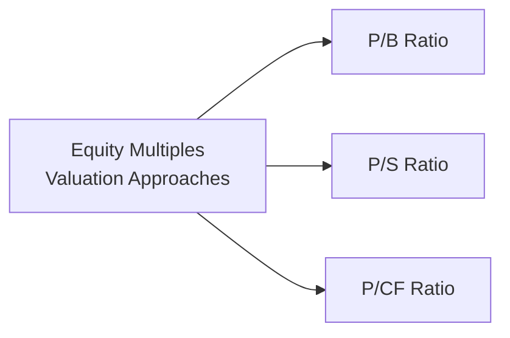

## Introduction

Let’s face it—earnings can sometimes play hide-and-seek with us, especially when accrual accounting or one-time items distort the picture. In these moments, market-based valuation multiples that don’t rely solely on net income can offer incredibly useful insights. Price-to-Book (P/B), Price-to-Sales (P/S), and Price-to-Cash Flow (P/CF) ratios bring clarity in scenarios where companies face negative earnings, volatile performance, or large depreciation and amortization charges. 

What follows is a closer look at the economic rationale behind these three multiples. We’ll see how they factor into everyday valuation choices, especially when earnings-based metrics (like Price-to-Earnings or P/E) just aren’t cutting it. We’ll also weave in a few personal anecdotes—like the time I encountered a budding tech startup whose net income seemingly evaporated each quarter, but whose sales soared—and how P/S became my go-to ratio to get a read on its prospects. 

## Why Alternative Multiples?

Before diving deeper, here’s a high-level perspective:  
• Sometimes, net income can be noisy. Accruals, write-downs, or big R&D expenses might bury the real operational pulse of a company.  
• Alternative multiples like P/B, P/S, and P/CF offer a well-rounded, albeit imperfect, lens. Each multiple captures value from a different angle, whether it’s the balance sheet (P/B), top-line revenue (P/S), or actual cash flow (P/CF).  
• Selecting which ratio to use typically depends on the company’s industry, life cycle stage, capital structure, and the reliability of its reported metrics.

Below is a quick diagram that shows how these three multiples fit into equity valuation:

## Price-to-Book (P/B) Ratio

### Defining the P/B Ratio
The P/B ratio is calculated as:


\text{P/B Ratio} = \frac{\text{Market Price per Share}}{\text{Book Value per Share}}


Where “book value of equity” is simply shareholders’ equity from the balance sheet (total assets minus total liabilities). 

### Economic Rationale
• The **P/B ratio** reflects how the market values a firm relative to its recorded net worth.  
• In industries like banking, insurance, or other financial services—with lots of financial assets and liabilities—book value tends to approximate actual economic value more closely than in, say, a software company.  
• P/B is a useful indicator of whether investors believe the firm’s net asset base can be deployed profitably. If P/B is consistently above 1.0, markets believe that each dollar of net assets is worth more than its recorded cost (i.e., the company either has intangible advantages or can generate stronger future returns).

### Key Considerations
1. **Intangibles and Off-Balance-Sheet Items**: High-tech or brand-driven businesses often have large intangible assets that are not fully captured on the balance sheet. In that sense, the P/B ratio can undervalue companies where intangible assets (patents, software code, trademarks) are a bigger growth driver than physical or financial assets.  
2. **Financial Sector Relevance**: For banks, book value is often close to the economic value of the bank’s loan portfolios, deposits, etc., after adjustments for credit losses or fair value estimates.  
3. **Distortions**: If a company undertakes share buybacks at a premium, or if write-downs occur sporadically, book value can shift in ways that might not align neatly with real operating potential.

### Example
Consider a regional bank with a stock price of $40 and a book value per share of $35—its P/B ratio is 1.14. Compare that to a tech firm with a stock price of $100 but a book value per share of $10, resulting in a P/B of 10.0. Immediately, you see the huge intangible factor in the tech stock: a large part of its value is intangible intellectual property, brand equity, or high growth expectations.  

## Price-to-Sales (P/S) Ratio

### Defining the P/S Ratio
The P/S ratio is:


\text{P/S Ratio} = \frac{\text{Market Price per Share}}{\text{Sales per Share}}


Total revenue (i.e., sales) is typically divided by the number of shares outstanding to get “sales per share.”

### Economic Rationale
• One big attraction of P/S is that “sales” tend to be more stable and less prone to manipulation than earnings. You might have observed cyclical or startup firms with negative net income. In those cases, P/S can be a lifeline in providing a baseline valuation.  
• Early-stage or growth companies often operate at a loss while spending heavily on R&D or marketing. Investors still want some anchor to measure performance, and top-line growth is frequently that anchor.  

### Key Considerations
1. **Sustainability of Sales**: Make sure the revenue composition is stable. If a chunk of sales comes from one-time licensing deals or short-term promotions, the P/S ratio might not reflect true ongoing market demand.  
2. **Industry Benchmarks**: Consumer staples, for instance, tend to have relatively stable sales and might exhibit lower P/S ratios. A "high" P/S ratio in consumer staples might mean the company is either priced for extreme future growth or potentially overvalued.  
3. **Operating Leverage**: If a company’s cost structure is precarious—say margins are razor-thin or the firm relies on significant variable costs—then a high P/S doesn’t necessarily guarantee profitability.

### Real-World Anecdote
I worked for a startup where net income was always overshadowed by large R&D expenses, making it look perpetually unprofitable. The board’s internal valuations gravitated toward P/S because we had strong, consistent revenue in a specialized niche. We compared ourselves to a small group of publicly traded biotech firms, each trading at around 8× to 10× P/S. Despite the negative net income, the robust top-line performance provided a clearer sense of our growth potential.

## Price-to-Cash Flow (P/CF) Ratio

### Defining the P/CF Ratio
The P/CF ratio is:


\text{P/CF Ratio} = \frac{\text{Market Price per Share}}{\text{Cash Flow per Share}}


“Cash Flow per Share” can be defined in a few ways—most commonly, operating cash flow or free cash flow to equity. Each definition has pros and cons, so consistency is important when you compare multiple companies.

### Economic Rationale
• Cash flow is king, right? By focusing on actual cash generated, you skip many of the distortions inherent in accrual-based earnings.  
• Firms heavy on depreciation (think large-scale manufacturing or mining) might show lower net income even though their operational cash flows remain steady. P/CF shines in these scenarios.

### Key Considerations
1. **Debt Intensity**: The presence of large amounts of debt means interest payments can eat into operating cash flow. Be mindful of how the firm’s capital structure influences its ability to generate and retain free cash flow.  
2. **Definition Consistency**: Some analysts use Funds From Operations (FFO) in real estate contexts, while others stick to CFO (operating cash flow). Whichever measure you choose, consistently apply it across peers.  
3. **Working Capital Variations**: If a company has large swings in inventory or receivables, operating cash flow can be volatile from quarter to quarter, which might distort your ratio in the short term.

### Example
Imagine a manufacturing firm that invests heavily in expensive machinery. Its net income is depressed by large depreciation charges, giving a P/E ratio that looks high. But if you check operating cash flow, the company is quite healthy. By using P/CF, you might find a more accurate valuation picture—possibly revealing that the stock is relatively cheap compared to peers that do not have the same depreciation profiles.

## Comparing the Three Multiples

Below is a simple table contrasting these three ratios:

|      Metric      | Key Indicator              | Major Pros                                         | Major Cons                                            |
|:----------------:|:---------------------------|:---------------------------------------------------|:------------------------------------------------------|
|       P/B        | Market vs. Net Assets      | Good for financials; stable for asset-rich sectors | Can miss intangible assets; book value can be outdated|
|       P/S        | Market vs. Top-Line Sales | Useful for startups, cyclical or negative earnings | Doesn’t address profitability or margin sustainability|
|       P/CF       | Market vs. Cash Flow      | Reduces accrual distortions; highlights solvency   | Sensitive to debt structure; definitional differences |

As with all metrics, context is everything. You’ll often look at more than one ratio when performing thorough due diligence.

## Common Pitfalls

• **Overreliance on One Ratio**: Don’t get lulled into thinking P/B or P/S alone solves all your valuation woes. Combining multiple approaches often gives a fuller perspective.  
• **Ignoring Capital Structure**: Two companies with the exact same P/CF might differ dramatically if one is debt-free and the other is highly leveraged.  
• **Failure to Normalize**: Abnormal revenue, one-time expenses, or off-balance-sheet items can warp a ratio so that it misrepresents true value.  
• **Incorrect Peer Group Comparisons**: Comparing a niche biotech’s P/S to a giant consumer electronics firm might lead to large misinterpretations. Stick to similar sectors, business models, and capital structures.

## Practical Tips for the CFA Exam

1. **Spot the Adjustments**: Exam vignettes may include subtle hints about intangible assets or major acquisitions that distort book value. Look for clues on whether you need to adjust the ratio inputs.  
2. **Assess Sales Quality**: Always ask whether the revenue is from recurring sources or if it’s a one-off.  
3. **Cash Flow Definitions**: In practice, watch out for how the question defines “cash flow.” For instance, if they specify CFO (operating cash flow) vs. FCFE (free cash flow to equity), your ratio and interpretation will differ.  
4. **Time and Pressure**: Under exam conditions, quickly identify which ratio is most relevant to the story in the vignette. If the company has negative earnings but stable revenues, P/S might be the best clue. If significant intangible assets are missing from the balance sheet, P/B might understate real value; note that in your analysis.

## Conclusion

Price multiples go beyond net income by focusing on different aspects of a firm’s financial profile—its balance sheet strength (P/B), revenue engine (P/S), or raw cash generation (P/CF). Each ratio has its quirks, which is why a comprehensive, context-driven approach is essential. As a Level II candidate, it’s super helpful to understand how to choose among these multiples and how to refine the data inputs to arrive at a more accurate reading of a company’s worth.

Keep in mind that real insights often emerge when you compare these multiples to each other and to a relevant peer group. International accounting standards, intangible assets, and capital structure intricacies all play a role. Above all, the exam often tests your ability to interpret, not just calculate—so always take a step back and ensure your valuations make sense in the broader context of the firm and industry.

## References and Further Reading

- Penman, S. H. (2013). Financial Statement Analysis and Security Valuation. McGraw-Hill.  
- White, G. I., Sondhi, A. C., & Fried, D. (2002). The Analysis and Use of Financial Statements. Wiley.  
- “Price-to-Book Ratio Basics” (Investopedia) - https://www.investopedia.com/articles/investing/062713/using-pricetobook-ratio-value-stocks.asp  
- “The Information Content of Sales Multiples,” top-tier finance journals.

--------------------------------------------------------------------------------

## Test Your Understanding: Price Multiples in Equity Valuation



### Which of the following best describes the primary advantage of using P/B ratios for banks and financial institutions?

- [ ] P/B ratios never require adjustments for intangible assets.  
- [x] Book value is often a good proxy for economic value in financial sectors.  
- [ ] Banks do not have intangible assets, so P/B is automatically accurate.  
- [ ] Banks prefer using revenue-based metrics over asset-based metrics.  

> **Explanation:** Financial firms tend to carry the majority of their assets at or near fair value on the balance sheet. As a result, “book value” is often a closer approximation of real economic value than it might be for companies in other industries.

### When might a high P/S ratio be most misleading?

- [ ] When the firm’s cost structure is extremely stable.  
- [x] When a significant portion of sales is non-recurring or one-off.  
- [ ] When the firm’s gross margins are increasing every quarter.  
- [ ] When the company has negative earnings.  

> **Explanation:** A P/S ratio can be inflated if a large portion of revenue is not sustainable (e.g., one-time promotions). This leads to an overestimation of the company’s real future value.

### A technology company that invests heavily in intangibles (such as R&D) might be undervalued by its P/B ratio because:

- [ ] R&D is fully capitalized on the balance sheet and raises book value.  
- [ ] Intangible assets do not affect the P/B ratio.  
- [x] Book value often omits or underrepresents internally generated intangible assets.  
- [ ] Technology companies always trade at low P/B ratios.  

> **Explanation:** The P/B ratio reflects recorded net assets. Internally generated intangible assets (like R&D breakthroughs) are often not captured on the balance sheet, potentially making the company’s actual economic value higher than book value suggests.

### In applying a P/CF ratio, you find that Company A has a higher ratio than Company B. Which scenario below could explain this difference?

- [ ] Company A has much lower depreciation, thus boosting its operating cash flow.  
- [ ] Company B’s operating cash flow is artificially inflated by an accounting error.  
- [x] Company A is more leveraged, so a higher portion of its cash flow goes to interest, reducing FCF.  
- [ ] Company B has intangible assets that are not reflected in book value.  

> **Explanation:** If Company A has a high debt burden, interest payments reduce its free cash flow, causing the denominator (cash flow per share) to be smaller relative to price. That results in a higher P/CF.

### A major impetus for using P/S ratios is that:

- [x] Sales figures are harder to manipulate than earnings.  
- [ ] Sales-based metrics better reflect intangible asset values.  
- [ ] Sales data is always normalized for accounting anomalies.  
- [ ] P/S ratios are unaffected by cyclical revenues.  

> **Explanation:** Sales are typically more resistant to direct manipulation compared to earnings, making a P/S ratio a helpful measure when net income is volatile or negative.

### If a firm with a consistently stable earnings outlook is showing a P/CF multiple well below its industry peers, which of the following might be a credible interpretation?

- [x] The market might be underestimating its future cash flow generation abilities.  
- [ ] The firm likely has large intangible assets on its balance sheet.  
- [ ] Its P/B ratio is irrelevant.  
- [ ] The company’s sales are overstated.  

> **Explanation:** A low P/CF relative to stable peers may indicate undervaluation, suggesting the market might be missing something positive about the firm’s cash flow prospects.

### An analyst is comparing the P/S ratio across four companies. In which scenario should the analyst be most cautious about the P/S comparison?

- [ ] Each company has minimal intangible assets.  
- [x] The companies have significantly different cost structures and profit margins.  
- [ ] All four companies belong to the same narrowly defined industry.  
- [ ] All four companies have well-established competitive moats.  

> **Explanation:** P/S ignores cost structure. If one company has extremely high costs relative to revenues, its apparently favorable P/S ratio might not translate into strong profitability.

### During a CFA exam item set, you note a firm with very large short-term liabilities that are not on its balance sheet. Which ratio would likely be most impacted by this off-balance-sheet situation?

- [x] P/B Ratio  
- [ ] P/S Ratio  
- [ ] P/CF Ratio  
- [ ] None of these, as liabilities do not affect valuation multiples.  

> **Explanation:** Off-balance-sheet liabilities can significantly affect the firm’s actual equity base and thus its book value. The P/B ratio would need to be re-examined after adjusting for these hidden liabilities.

### Which of the following statements about P/B and P/CF is most accurate?

- [x] P/B emphasizes net asset value, whereas P/CF focuses on the company’s ability to generate cash.  
- [ ] P/CF generally ignores capital structure, whereas P/B fully accounts for it.  
- [ ] Both are unaffected by off-balance-sheet items.  
- [ ] Both are more relevant for startup companies than for mature companies.  

> **Explanation:** P/B measures how the market values a firm’s recorded net assets. P/CF measures price relative to corporate cash generation. Each serves a distinct analytical purpose.

### Negative earnings for a startup biotech with steadily increasing revenue and cash flow might prompt an analyst to:

- [x] Rely more heavily on P/S to gauge valuation.  
- [ ] Immediately conclude that the company is overvalued.  
- [ ] Use a trailing P/E ratio to capture the firm’s true performance.  
- [ ] Disregard intangible assets because they do not appear on the balance sheet.  

> **Explanation:** With negative earnings but improving top-line growth, analysts often turn to P/S to understand how revenue performance might drive the future value of the company.


