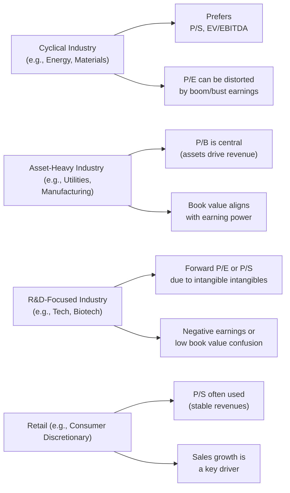

## Overview

Have you ever glanced at a price-to-earnings (P/E) ratio for a mining company during an economic downturn and thought, “Wait, does this even make sense—do I trust this multiple right now?” Well, that’s a common scenario in the valuation world. Multiples can shift dramatically across industries and economic cycles. In this section, we’ll walk through how to interpret and adapt your understanding of multiples like P/E, P/B, and P/S for different sectors. We’ll see how regulation, cost structures, growth prospects, and macroeconomic variables can shape whether a particular multiple is valid or misleading.

Below is a quick visual snapshot of how different industries might gravitate toward certain multiples, along with their unique challenges:

## Importance of Industry Context

Multiples help investors quickly assess whether a stock trades cheaply or richly relative to peers or historical averages. But, you know, it’s never “one size fits all.” An 18x P/E ratio that looks expensive in a dull utility sector may be perfectly normal for a high-growth tech firm. By the same token, a single-digit P/E in a cyclical sector might reflect a temporary earnings spike at the top of the cycle, rather than a genuine bargain. Always ask yourself: “Is it the industry or the overall economic environment that’s driving the numbers?”

Understanding these nuances will help you avoid the trap of applying the same yardstick to, say, a biotech start-up and a stable consumer goods giant.

## Cyclical Industries: The P/E Dilemma

Cyclical industries—like autos, mining, and energy—often face wide swings in earnings as economic conditions evolve. When an industry is at the peak of its cycle, earnings might look fantastic, making the P/E ratio artificially low. Conversely, during a downturn, P/E ratios can skyrocket—or become meaningless if the company’s earnings dip close to zero or turn negative.

In such situations, P/S provides a more stable lens because sales (though still cyclical) don’t typically reach zero, and they may be less volatile than net income. Another approach is using enterprise-value-based multiples (e.g., EV/EBITDA, which we cover in Chapter 11), because EBITDA may better reflect cash profitability by excluding the non-cash element of depreciation and any extraordinary charges that spike in tough times.

Quick anecdote: I once analyzed an oilfield services firm right after oil prices had collapsed. Its trailing P/E was near 40×, which would normally be a big red flag. But their sales volumes hadn’t dropped nearly as dramatically, and the firm’s P/S multiple was in line with industry peers. Sure enough, once the market cycle normalized, their earnings rebounded, and the P/E came back to a more sensible level.

## Asset-Heavy Industries and the Central Role of P/B

In industries such as utilities, infrastructure, and heavy manufacturing, capital expenditures (CAPEX) and physical assets dominate the balance sheet. Because these assets often generate the bulk of revenue, P/B (price-to-book) can be quite telling: it shows how the market price compares to the accounting value of the firm’s net assets.

For example, if a regulated utility invests heavily in new power plants, the regulated asset base often generates stable, predictable cash flows. Investors look to see if the company’s market price is above or below the net tangible asset value. A P/B ratio higher than 1 might be justified by robust rates of return on these assets. But, as always, watch out for book value distortions (especially if the firm is using a different depreciation method than peers).

## R&D-Heavy Sectors: Technology, Biotech, and Others

Take a look at some of the big research and development (R&D) spenders—pharmaceuticals, biotech, semiconductor design, or software. Because significant intangible investments don’t always appear on the balance sheet or the income statement in a straightforward way, common “trailing” multiples can be tricky.

• P/E ratio might be meaningless when earnings are negative.  
• P/B can understate the true value if intangible “assets” (like patents or proprietary software) don’t appear on the balance sheet as neatly as property, plant, or equipment.  

A forward-looking multiple, like forward P/E based on expected earnings, could be more useful. For some high-growth or still-unprofitable firms, P/S is often a fallback approach for an apples-to-apples comparison if you’re trying to gauge whether a company’s growth story is already “priced in.”

## Retail Sector and the Relevance of P/S

The retail sector can exhibit relatively stable revenue flows, especially if we’re talking large-scale hypermarkets or grocery companies. Even in more volatile segments (e.g., luxury fashion retail), net margins swing considerably, but top-line revenues might remain more predictable.

In these cases, P/S can shed a surprising amount of insight. When comparing two department store chains, a difference in P/S might indicate one chain is more efficient in converting sales into actual profit or has lower cost structures. Of course, it’s still crucial to verify profitability (otherwise, high sales but razor-thin margins might lead you astray).

## Peer Group Analysis and Comparability

When analyzing multiples, you almost always want to compare them to a relevant peer group. That means your comparables should share:

• Similar capital structures (debt levels can inflate or depress certain multiples).  
• Comparable accounting standards (especially for depreciation, R&D capitalization, and intangible asset treatments).  
• Matching economic profiles (growth prospects, business models, and competitive environments).  

I still recall a misguided comparison between a high-tech software solutions firm and a hardware manufacturer. Even though both were “tech” companies, their business models were so distinct that P/E comparisons bordered on nonsensical.

## Integrating Macroeconomic Factors

Don’t forget the lessons from Chapter 26 on macroeconomic analysis. For industries where consumer confidence or commodity prices play a key role, keep tabs on interest rates, inflation, and global demand. A consumer discretionary stock with a 12× P/E may actually be inflated if interest rates are historically low—once rates climb, that multiple might compress. Meanwhile, a materials stock may expand or collapse based on global GDP growth forecasts. Ensuring you understand these macro linkages is critical for a robust multiple interpretation.

## Sensitivity Analysis: Stressing the Key Inputs

Between commodity prices, interest rates, or shifts in consumer spending, the assumptions that go into your valuation multiples can change drastically (Chapter 32 covers advanced data considerations and how to handle outliers or non-stationary data). Running a sensitivity analysis (“What if oil drops 10%?” “What if general inflation picks up by 3%?”) can help you see how multiples might evolve under different scenarios. This is particularly helpful in cyclical industries, where your best-case and worst-case earnings scenarios can be worlds apart.

## Practical Considerations and Pitfalls

• Watch for Accounting Quirks: Differences under IFRS vs. US GAAP in intangible asset treatment or revenue recognition can hamper direct comparisons.  
• Avoid Overreliance on a Single Multiple: Cross-check your results with at least one or two alternative metrics.  
• Beware of the “Wrong Peer Group”: If you pick out a peer group casually, the resulting multiple analysis can be misleading.  
• Assess Capital Structure Differences: Some companies might finance projects heavily with debt, which morphs net income, interest expense, and thus P/E or P/E-based multiples.

## Glossary Highlights

• Cyclical Industry: An industry heavily affected by overall economic cycles (e.g., autos, energy).  
• Asset-Heavy Industry: Sectors like utilities or manufacturing, where a large proportion of capital is tied up in physical plant, property, and equipment.  
• Peer Group Analysis: Comparing a firm’s valuation metrics to those of similar companies with like business models and conditions.  
• R&D-Spending Firms: Companies investing large sums in intangible assets, like biotech or software.  
• Sensitivity Analysis: Examining how changes in economic or financial assumptions affect your valuation outcomes (useful for forecasting scenarios).  
• Comparability Issues: Differences in accounting methods, time periods, or corporate structures that can distort direct ratio comparisons.  
• Macro Factors: Economic indicators (GDP, interest rates, consumer sentiment) that can significantly impact a sector.  
• Revenue Volatility: The extent to which a company’s sales fluctuate year to year.

## References

- Fabozzi, F. J., & Markowitz, H. M. (Eds.). (2002). The Theory and Practice of Investment Management. Wiley.  
- “Industry Valuation and Cross-Section of Returns.” Financial Analysts Journal.  
- For specialized cases in biotech or fintech, consult industry-specific research reports from reputable investment banks.

## Practice Questions: Interpreting Multiples for Different Industries



### When valuing asset-heavy companies (e.g., utilities or manufacturing), which ratio is often emphasized?

- [ ] P/E ratio
- [ ] EV/Sales
- [x] P/B ratio
- [ ] Price-to-Cash-Flow

> **Explanation:** Asset-heavy industries rely heavily on physical assets that drive revenue, so a company’s book value tends to be a good proxy for the company’s actual invested capital and earning power.

### Which of the following best explains why the P/E ratio may be less meaningful in highly cyclical industries?

- [ ] P/E focuses on the balance sheet rather than earnings.
- [ ] Multiples are never useful for cyclical industries.
- [x] Earnings fluctuate significantly with economic cycles, creating distorted P/E values at peaks or troughs.
- [ ] Cyclical industries typically have no earnings.

> **Explanation:** Cyclical swings in earnings can make P/E ratios look abnormally low or high depending on whether the industry is at a peak or trough in its cycle.

### When evaluating a biotech startup with negative earnings, which metric is often more appropriate than trailing P/E?

- [ ] Trailing EV/EBIT
- [ ] Dividend Yield
- [x] Price-to-Sales
- [ ] Trailing P/B

> **Explanation:** Negative earnings render trailing P/E less relevant, and intangible assets may make P/B unreliable. Therefore, P/S is frequently used, as revenue is often the only positive performance measure available.

### Which of the following is a key concern when using P/B ratios for R&D-driven firms?

- [ ] Book value is usually inflated for R&D-driven firms.
- [x] Intangible investments may not be fully captured on the balance sheet.
- [ ] Book value always exceeds market value for R&D-driven firms.
- [ ] The ratio is only valid in cyclical industries.

> **Explanation:** Many R&D investments, such as software development or patents, are expensed rather than capitalized, so they do not show up in book value, reducing the usefulness of P/B.

### For a large grocery retailer with stable revenue, what multiple might be particularly helpful, especially if operating margins are thin?

- [x] P/S ratio
- [ ] EV/EBIT
- [x] P/S ratio (duplicate intended to demonstrate multiple correct options)
- [ ] Forward P/E

> **Explanation:** With relatively stable sales but possibly narrow profit margins, P/S becomes a straightforward metric to compare across similar retailers.

### When a company’s debt levels significantly differ from those of its peers, which ratio is likely the most distorted?

- [x] P/E ratio
- [ ] P/B ratio
- [ ] Price/Sales ratio
- [ ] None of the above

> **Explanation:** Heavy debt loads increase interest expenses, which can reduce net income, thus distorting P/E comparisons with lower-debt peers.

### What is a potential drawback of relying heavily on TTM (trailing twelve months) P/E ratios for a fast-growing tech startup?

- [x] Trailing earnings may underestimate future earnings potential.
- [ ] Tech startups rarely have any revenue.
- [x] Negative earnings in the TTM period can yield meaningless ratios.
- [ ] TTM P/E is rarely used in general.

> **Explanation:** Fast-growing tech firms often have a much higher forward earnings trajectory. Historical or trailing metrics may not capture future R&D success, new product launches, or market expansion.

### When evaluating a consumer discretionary firm in an environment of rising interest rates, what external macro factor could compress its multiples?

- [x] Reduced consumer confidence leading to lower demand
- [ ] Rising commodity prices for metals
- [ ] Strengthening currency in an unrelated market
- [ ] Minimal changes to energy costs

> **Explanation:** Interest rate hikes can dampen consumer confidence and big-ticket purchases, lowering both sales forecasts and valuation multiples in consumer discretionary firms.

### Which approach is recommended if you suspect high volatility in net income for a cyclical stock?

- [x] Use EV/EBITDA and/or P/S
- [ ] Use only a trailing P/E ratio
- [ ] Use P/B exclusively
- [ ] Abandon all multiples

> **Explanation:** High volatility in earnings can make P/E misleading. EV/EBITDA or P/S can offer more stable comparative figures over the cycle.

### For a heavily levered manufacturing firm with substantial capital expenditures, which statement about P/B is most likely true?

- [x] The ratio may closely align with the company’s regulated asset base.
- [ ] P/B is irrelevant unless the company pays dividends.
- [ ] P/B overstates the importance of intangible assets.
- [ ] P/B is meaningless if the firm has positive book equity.

> **Explanation:** In asset-heavy industries, book value frequently aligns with the amount of capital the firm has invested in physical assets, which is central to its earning capacity.


