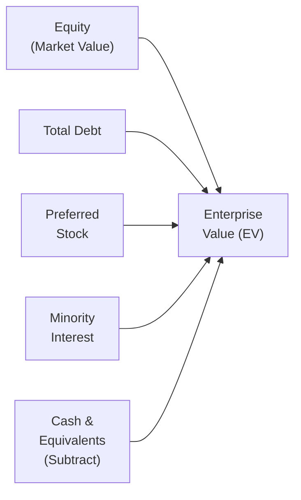

## Understanding Enterprise Value

Enterprise Value (EV) is a core concept that helps analysts gauge the value of a company’s entire business—its equity holders, debt holders, minority shareholders, and preferred stockholders. Sometimes, folks will say it’s “what the business would really cost you if you wanted to buy the whole thing,” because it captures more than just the market price of equity. 

Mathematically, EV is often calculated as:


\text{EV} = \text{Market Value of Equity} + \text{Total Debt} + \text{Preferred Stock} + \text{Minority Interest} - \text{Cash and Equivalents}.


This measure aims to reflect the total price tag for owning the firm’s operating assets (net of any ready cash you could apply to reducing liabilities). 

To visualize these components, it can be helpful to see a flowchart of how they come together:

As you move through your CFA Level II journey, you’ll see that EV-based multiples, such as EV/EBITDA and EV/EBIT, show up frequently in both exam questions and real-world equity research reports. They help us figure out if a company is “cheap” (potentially undervalued) or “expensive” (possibly overvalued) relative to peers or the market overall.

## EV/EBITDA and EV/EBIT: Core Definitions

Two popular enterprise-value multiples are:

• EV/EBITDA = EV ÷ EBITDA  
• EV/EBIT = EV ÷ EBIT  

EBITDA stands for Earnings Before Interest, Taxes, Depreciation, and Amortization, while EBIT is Earnings Before Interest and Taxes. Both measure operational performance, but they differ subtly—EBIT accounts for depreciation and amortization, while EBITDA strips out those expenses.

You might wonder: “Why bother with two versions of this multiple?” Well, each one can highlight different things about a company’s cost structure and efficiency. Here’s a quick snapshot:

• EV/EBITDA: Emphasizes a firm’s performance before non-cash expenses like depreciation. It’s often used to compare companies with different capital structures or big differences in depreciation methodology.  
• EV/EBIT: Takes depreciation into account. This can be a good measure for capital-intensive businesses, where depreciation can indicate the true economic cost of long-lived assets.

In typical market practice, you’ll see both multiples used side by side to get a sense of how big an impact depreciation and amortization are having on earnings.

## Why Use EV/EBITDA?

It’s common to see EV/EBITDA in analyst reports, especially for industries like telecommunications, utilities, energy, or other sectors that have large asset bases and potentially different depreciation schedules. Some reasons:

• It Captures the Value to All Providers of Capital: EV combines debt, equity, and other claim holders. EBITDA likewise represents an income stream for all capital providers, before interest or other financing costs.  
• Minimizes Accounting Differences: Because EBITDA excludes depreciation, it can reduce distortions from differences in depreciation methods or intangible amortization practices across companies.  
• Often a Proxy for Operating Cash Flow: EBITDA is no perfect stand-in for actual free cash flow, but it’s easier to calculate from standard income statement data. Many analysts use it as a quicker benchmark for comparing profitability across firms.

Of course, “EBITDA” isn’t a magical metric. If a company’s assets are aging and require major capital expenditures, high EBITDA might not translate into actual free cash flow. For instance, I recall analyzing a shipping company that looked cheap on an EV/EBITDA basis—until we realized they were about to spend massive sums replacing an aging fleet. So always be cautious.

## Why Use EV/EBIT?

EV/EBIT can, in many respects, feel a bit more conservative because it acknowledges depreciation and amortization as a reality in everyday operations, rather than ignoring them. This multiple is sometimes more telling for industries like industrial manufacturing, automotive, or heavy equipment—places where depreciation might be a huge line item. Consider these points:

• Complements EV/EBITDA: By comparing both EV/EBITDA and EV/EBIT, you get a good sense of how big the depreciation/amortization gap is.  
• Reflects True Cost Structure: When depreciation represents a genuine economic cost for maintaining and replacing equipment, EBIT is a more accurate measure of ongoing operating profit.  
• Avoids Overstating Operating Cash Flow: If intangible assets or capital assets degrade over time, merely looking at EBITDA can paint an overly rosy view of profitability.

That said, if depreciation is artificially high or unusual in a particular year—for instance, if there’s a big impairment charge—using EV/EBIT might understate the ongoing performance. Understanding these nuances is crucial.

## When to Choose EV/EBITDA vs. EV/EBIT

Analysts typically look at both multiples side by side. But if you have to pick one, consider:

• Capital-Intensive Firms: EV/EBITDA might be more comparable among firms that have different asset ages or unique depreciation schedules.  
• Depreciation Relevance: If depreciation truly aligns with a firm’s cost of using and replacing assets (e.g., heavy machinery, airline fleets), EV/EBIT might be more meaningful.  
• Industry Norms: Some sectors favor one multiple over the other. Tech and telecom analysts often default to EV/EBITDA, while old-school industrial analysts may rely more on EV/EBIT. If you see wide disparities between the two multiples, dig into why depreciation is so different from company to company.

Ultimately, no single ratio is a silver bullet. The more context you have, the better your sense of a company’s fair valuation.

## Forward vs. Trailing Multiples

You might see EV/EBITDA or EV/EBIT on a trailing (historical) or forward (projected) basis:

• Trailing Multiples (e.g., TTM or LTM, for “Last Twelve Months”): Use actual results over the most recent four quarters.  
• Forward Multiples: Use analyst estimates or company guidance for the upcoming year (or another future time horizon).

Forward multiples can be more reflective of future reality—especially if the company’s results are changing quickly—but they’re only as good as the forecasts underlying them. If you suspect the forward estimates are off by a wide margin, the ratio becomes less reliable. Meanwhile, trailing multiples are based on hard data, but may not capture future inflection points, like major expansions or cyclical downturns.

## Example: Calculating EV/EBITDA and EV/EBIT

Let’s do a quick hypothetical so it feels more concrete. Suppose we have a company, ABC Industrial:

| Item                                | Value (in $ millions) |
|-------------------------------------|-----------------------|
| Market Cap (equity)                | 500                   |
| Total Debt                          | 300                   |
| Preferred Stock                     | 50                    |
| Minority Interest                   | 20                    |
| Cash & Equivalents                 | 50                    |
| EBIT                                | 100                   |
| EBITDA                              | 150                   |

First, compute enterprise value:

\text{EV} = 500 \;(\text{equity}) + 300 \;(\text{debt}) + 50 \;(\text{preferred}) + 20 \;(\text{minority}) - 50\;(\text{cash}) = 820.


Then:

\text{EV/EBIT} = \frac{820}{100} = 8.2, 
\quad
\text{EV/EBITDA} = \frac{820}{150} \approx 5.47.


At first glance, EV/EBIT indicates investors are willing to pay 8.2 times “pure” operating earnings for ABC Industrial, while EV/EBITDA suggests about 5.47 times operating earnings before depreciation. The difference (8.2 vs. 5.47) likely reflects the significant depreciation or amortization embedded in ABC’s results.

## Interpretation and Practical Insights

So, how do you use these multiples for actual investment decisions or exam scenarios? Generally:

• Compare with Peers: If ABC trades at EV/EBIT of 8.2 while similar companies trade at 10, ABC might be undervalued. Of course, there could be reasons for the gap: maybe ABC’s management is less experienced, or its capitalization structure is riskier.  
• Watch for Extremes: If a ratio is very high or very low, question whether it’s driven by one-time earnings events, cyclical swings, or some big changes in capital structure.  
• Consider Normalized Earnings: One-time charges or unsustainably high short-term earnings can skew your multiples. Normalizing EBIT or EBITDA for non-recurring items (litigation charges, asset impairments, etc.) can help you make a fair comparison.

And in the real world, analysts make plenty of adjustments—like adding back certain items to EBITDA or excluding certain forms of debt or intangible assets—so the multiple accurately mirrors the company’s operating performance.

## Best Practices and Common Pitfalls

• Check the Numerator: Make sure you’re using the correct total debt figure. Some vignettes in the CFA exam might provide “net debt” but forget to clarify the available cash. Always confirm whether you should add or subtract anything.  
• Consistent Time Periods: If you’re using forward EBITDA (like next 12 months) in the denominator, try to align that with a forward EV that factors in expected changes to net debt. If that’s not feasible, be sure you note the mismatch.  
• Industry Differences: A “low” EV/EBIT multiple might be perfectly normal for a commodity chemical firm but might signal a red flag for a high-growth tech company.  
• Don’t Ignore Quality: Some companies with higher multiples might have stronger competitive advantages—like a brand moat or premium pricing—that justify a higher multiple. Conversely, cheap might not always mean good if there are underlying structural problems.

## Points for CFA Exam Practice

In your item-set questions, pay attention to:

• Adjusting EV for Off-Balance-Sheet Items: Occasionally you’ll see mention of operating leases (though IFRS 16 and other standards have changed how we do this), special purpose vehicles, or intangible liabilities.  
• Minority Interests: Some companies don’t fully own their subsidiaries, so you’ll need to add or subtract that minority interest portion accurately.  
• One-Time Gains/Losses: The exam might throw in a scenario where EBIT includes a large one-time write-down. Evaluate whether that distorts the multiple.  
• Confidence in Forecasts: When a question states “Analyst A forecasts,” watch for signals that the forecast is over-optimistic or based on shaky data.

Remember, at Level II, they love to test whether you can pick up subtle differences from the vignette. 

## Glossary

• Enterprise Value (EV): A valuation measure that encompasses market value of equity, total debt, minority interest, and preferred stock, minus cash and equivalents.  
• EBIT: Earnings before interest and taxes, reflecting core operating income after depreciation and amortization.  
• EBITDA: Earnings before interest, taxes, depreciation, and amortization, often used as a stand-in for operating cash flow.  
• Trailing Multiple (TTM or LTM): A ratio based on historical reported data over a recent twelve-month period.  
• Forward Multiple: A ratio based on analyst forecasts or company guidance for the upcoming period.  
• Market Capitalization: The total value of outstanding shares (price per share × number of shares).  
• Net Debt: Total debt minus cash and equivalents.  
• Preferred Stock: A security that ranks ahead of common stock in dividend payments and liquidation.  
• Minority Interest (Non-Controlling Interest): The portion of a subsidiary not wholly owned by the parent firm.

## References

• Damodaran, A. (2012). Investment Valuation: Tools and Techniques for Determining the Value of Any Asset.  
• CFA Institute, “Equity” topic readings for market-based and advanced valuation techniques.  
• Graham, B., & Dodd, D. (2009). Security Analysis.  

If you want to get more into the nitty-gritty, you might enjoy reading about how different depreciation methods can affect EBIT, or reviewing how advanced accounting treatments can inflate or deflate EBITDA. The best approach is to practice with real data and see how the numbers vary among companies in the same sector.

Now, let’s put it all into practice with a few targeted questions so you can keep your exam skills sharp.

## Test Your Knowledge: EV/EBITDA and EV/EBIT Valuation Quiz



### Which of the following statements best describes why many analysts prefer using EV/EBITDA instead of P/E?

- [ ] EV/EBITDA is always lower than the P/E ratio for growth companies.
- [x] EV/EBITDA reflects value to all capital providers and excludes the effect of capital structure differences.
- [ ] EV/EBITDA is more stable because EBITDA never changes significantly from year to year.
- [ ] EV/EBITDA automatically adjusts for all off-balance-sheet items.

> **Explanation:** EV/EBITDA combines enterprise value (market value of equity plus net debt, plus other capital) with a measure of earnings before interest, taxes, depreciation, and amortization. It avoids distortions from capital structure differences—unlike P/E, which focuses only on equity value and net income.

### Which of the following scenarios would most likely favor using EV/EBIT over EV/EBITDA?

- [ ] A rapidly growing technology startup with minimal physical assets.
- [ ] A diversified services firm with intangible asset amortization that is nearly zero.
- [ ] A utilities company with significant differences in capital structures among peers.
- [x] A manufacturing company where depreciation costs are indicative of the economic cost of maintaining assets.

> **Explanation:** EV/EBIT accounts for depreciation, which makes it particularly relevant when depreciation is a material reflection of the company’s spending on assets. This scenario describes a manufacturing company, where significant machinery and equipment often mean depreciation is a real economic cost.

### Analyzing trailing versus forward EV/EBIT: The major advantage of forward multiples is that they:

- [x] Incorporate expected future earnings, reflecting the firm’s outlook more accurately.
- [ ] Are always easier to calculate, since historical data could be restated.
- [ ] Completely eliminate one-time items that affect past results.
- [ ] Do not depend on analysts’ assumptions or forecasts in any way.

> **Explanation:** Forward multiples depend on projections of future earnings. This can be more relevant if you expect significant changes in performance. However, they do rely heavily on the quality of analyst forecasts.

### A company shows $200 million in market cap, $50 million in total debt, $10 million in minority interest, and $20 million in cash. EBIT is $30 million, and EBITDA is $40 million. Calculate EV.

- [ ] $260 million
- [ ] $220 million
- [x] $240 million
- [ ] $280 million

> **Explanation:** EV = 200 (equity) + 50 (debt) + 10 (minority interest) – 20 (cash) = $240 million.

### Using the same numbers as the previous question (EV = $240 million, EBIT = $30 million, EBITDA = $40 million), what are the EV/EBIT and EV/EBITDA multiples?

- [ ] 8.0 and 10.7, respectively
- [x] 8.0 and 6.0, respectively
- [ ] 6.0 and 8.0, respectively
- [ ] 10.7 and 8.0, respectively

> **Explanation:** EV/EBIT = 240 ÷ 30 = 8.0, and EV/EBITDA = 240 ÷ 40 = 6.0.

### If a company’s EV/EBITDA ratio is significantly lower than its peer average, which of the following could be a valid reason?

- [ ] The company’s depreciation is substantially higher than average.
- [ ] The company has zero debt and thus a lower EV.
- [x] The company’s EBITDA might be temporarily inflated due to a one-time gain.
- [ ] The company holds a large amount of cash that has not been subtracted from EV.

> **Explanation:** A one-time boost to EBITDA (e.g., a special gain) can artificially lower the EV/EBITDA multiple. Always check the source of earnings to ensure they’re recurring.

### In an exam vignette, an analyst adds back certain impairment charges to EBIT. Which multiple is the analyst likely trying to normalize?

- [ ] EV/EBITDA
- [ ] P/E
- [x] EV/EBIT
- [ ] P/B

> **Explanation:** Adding back impairment charges affects EBIT. The analyst may be attempting to present a more “normalized” operating profit, which directly impacts EV/EBIT.

### Which of the following best explains why EV/EBIT and EV/EBITDA are both considered “enterprise value” multiples?

- [ ] They only measure the value of common shareholders.
- [x] They evaluate value relative to a pre-interest earnings measure, reflecting all capital providers.
- [ ] They exclude the effect of depreciation and amortization, unlike EPS.
- [ ] They account for changes in stock price but not for changes in debt.

> **Explanation:** Both EBIT and EBITDA are pre-interest (and pre-tax) measures, which correspond to value for all providers of capital. Hence, combining them with EV (which includes debt and equity) creates a consistent measure.

### Which condition might make EV/EBIT less useful compared to EV/EBITDA?

- [x] Significant intangible amortization that doesn’t reflect actual ongoing expenditures.
- [ ] The firm has stable depreciation policies aligned with peer standards.
- [ ] The firm has major capital expenditures that replace income-producing assets.
- [ ] The firm’s capital structure is changing rapidly.

> **Explanation:** If a company has large intangible amortization that doesn’t represent a real cash outflow, EBIT might understate ongoing profitability. EBITDA adds that expense back, providing an alternative view of core operating performance.

### EV/EBIT is often preferred over EV/EBITDA for capital-intensive industries because it:

- [x] Factors in depreciation as an ongoing economic cost of doing business.
- [ ] Eliminates all financing and structural differences among peer companies.
- [ ] Is simpler to calculate in every instance.
- [ ] Ignores interest and taxes, thereby capturing net income.

> **Explanation:** The rationale is that capital-intensive industries have significant depreciation reflecting real usage of assets. EV/EBIT includes that depreciation figure, providing a closer approximation of true economic cost.


