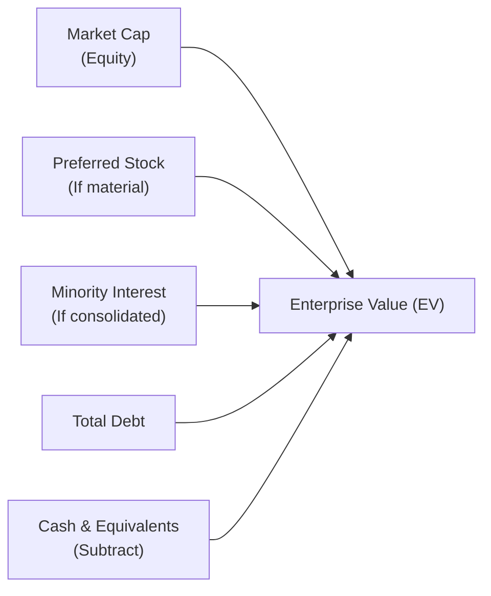
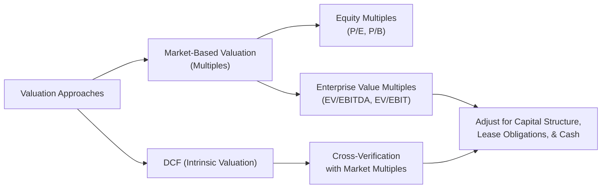

## Introduction
Market-based valuation techniques rely on financial ratios that compare a company’s value to a relevant measure of operating performance. Enterprise Value (EV) multiples—such as EV/EBIT or EV/EBITDA—play a major role in comparing companies with different capital structures, or in bridging the gap between equity and debt influences on valuation. Now, the first time I ran into these EV multiples, I honestly found them sort of magical... because they let you compare everything on a more “apples-to-apples” basis without fully ignoring debt. But, as I soon learned, they’re not without quirks.

Below, we’ll explore why EV multiples are widely used, how they’re calculated, and, of course, their strengths and weaknesses. We’ll also highlight best practices for analyzing exam vignettes, drawing attention to details like off-balance-sheet items and changes in accounting standards.

## Quick Recap of Enterprise Value
Let’s start with the foundation. Enterprise Value attempts to represent the entire market value of a firm’s operating business. A standard formula for EV is:


\text{EV} = \text{Market Capitalization} 
          + \text{Total Debt} 
          + \text{Preferred Stock} 
          + \text{Minority Interest}
          - \text{Cash & Cash Equivalents}


Under IFRS and updated U.S. GAAP rules, operating leases and certain other liabilities may also be included in the calculation, depending on whether they’re recognized on the balance sheet. The ultimate aim is to capture all capital claims on the firm (both equity and debt holders) but net out surplus cash that’s not required in operations.

Here’s a quick mermaid diagram that illustrates a high-level view of how EV is typically computed:

## Strengths of EV-Based Multiples
EV-based multiples focus on a consistent measure of the company’s capital structure and core business performance. These multiples come in particularly handy when you’re evaluating companies that may have vastly different debt levels or intangible assets on their balance sheets. Let’s examine the main strengths:

• Capital Structure-Neutral. An EV multiple attempts to look at the entire enterprise, including debt, equity, minority interests, and more. Compared to, say, P/E alone, EV-based multiples do a better job comparing two businesses that might have sharply different leverage. This is super handy if you’re trying to evaluate a highly leveraged telecom company side-by-side with a relatively debt-free software firm.

• Less Affected by Accounting Policies. EV/EBITDA (and, to a lesser extent, EV/EBIT) neutralizes some of the noise created by depreciation, amortization methods, or asset lifecycles. So if one firm is using straight-line depreciation but another uses an accelerated method, EBITDA can reduce the immediate differences in reported profit.

• Better Focus on Core Operations. By subtracting “excess” cash and adding debt and other claims, enterprise value zeroes in on what’s truly at risk in the business. In theory, it backs out large piles of idle cash that may distort the valuation. That way, you don’t overvalue a company just because it’s sitting on an inflated cash balance, which can happen when you look at equity multiples.

• Widely Recognized. Because they are among the most commonly reported multiples across industries, both EV/EBIT and EV/EBITDA are well-understood by analysts, investors, and corporate finance professionals. This fosters consistency in the marketplace and helps when you’re looking for comps or building a pitch book.

## Weaknesses of EV-Based Multiples
So what’s the downside? Though EV-based multiples can be powerful, there’s a reason no single ratio solves all your valuation woes. A few pitfalls to keep on your radar:

• Non-Operating Items Can Create Confusion. Operating leases, pension liabilities, underfunded retirement obligations, or special-purpose minority interests all complicate the picture. Determining whether these items should be added to enterprise value, or accounted for in a different manner, can become complicated—particularly under evolving accounting standards like IFRS 16, which capitalizes most leases on the balance sheet.

• EBITDA Is Not True Cash Flow. The classic EV/EBITDA multiple can gloss over important details, such as ongoing capital expenditures, working capital requirements, and taxes, none of which are captured by EBITDA. This can result in an overestimate of a company’s ability to produce free cash flow and, hence, to service its debt or distribute dividends.

• Negative or Very Low EBITDA. Many early-stage or distressed companies have negative EBITDA. Um, that means you can’t even calculate EV/EBITDA without getting something nonsensical or clearly unhelpful. Even a near-zero EBITDA leads to suspiciously large multiples. So you might look at these uncomfortably large or meaningless figures and wonder, “What now?”

• Industry-Specific Issues. Certain sectors—like financial institutions—find EBITDA relatively meaningless because the nature of a bank’s “operations” is interest-based. Traditional EV multiples, which rely on EBIT or EBITDA, aren’t that useful for banks, insurance carriers, or asset managers, because those companies’ entire business model flows through interest and investment income lines.

• Ignores Timing of Cash Flows. Market-based multiples (including EV-based ones) generally look at a “snapshot” rather than the scheduling of future cash flows. They don’t differentiate between a company whose cash flows are front-loaded versus one that has them drip in gradually over time. If you have two firms with the same current EBITDA but drastically different growth or capital expenditure needs, an EV-based multiple might treat them as if they were equals.

## Practical Considerations for EV Multiples
Let’s say you’re analyzing a health care device manufacturer with moderate debt and a stable, predictable growth path, side by side with a faster-growing, heavily leveraged biotech. How do you approach them with EV multiples?

• Cross-Sector Comparisons. Sure, EV multiples reduce some differences in capital structure, but comparing a pharma firm to a software firm is still tricky. Good practice generally calls for focusing on comparable companies in the same (or closely related) sector. Even within a single sector, intangible asset treatment and R&D costs can vary widely.

• Quality of Earnings. EBITDA is an accounting measure, so it’s subject to potential manipulations—aggressive revenue recognition, unsustainable cost cuts, or ignoring major one-time charges. If a company artificially inflates EBITDA (e.g., by cutting essential R&D), you’ll wind up with a misleadingly rosy multiple.

• Item-Set Exam Tips. 
  – Keep an eye on whether the question states market value of debt or book value of debt in calculating EV. In the exam’s vignette, the footnotes often have the juicy details: new leases, intangible write-downs, or an upcoming debt issuance.  
  – Carefully parse the text to see if the company in question has negative or near-zero EBITDA. That’s your red flag to rely on a different multiple or consider a second approach (like P/S or a DCF method).  
  – Pay attention to any mention of operating vs. capital leases—under IFRS 16 or updated GAAP rules, operating leases often appear as a right-of-use asset and lease liability on the balance sheet, impacting net debt.

• Industry Nuances. In capital-intensive industries (think utilities, manufacturing, or airlines), ignoring depreciation can be super risky because real capital expenditures are significant. Higher capex means EBITDA can paint an inflated view of profitability. Meanwhile, in intangible-intensive sectors such as software, acquisitions can introduce large intangible write-offs that distort EBIT or EBITDA from one period to the next.

## Diagram: Overview of EV Multiples in Valuation
Sometimes it helps to visualize how EV multiples fit into the valuation process alongside other metrics. The quick diagram below shows how EV multiples often complement other valuations, such as P/E or discounted cash flow (DCF) projections.

In practice, you might use a DCF model to get your baseline intrinsic valuation and then cross-check your results with market multiples. If there’s a big discrepancy, you dig deeper to isolate the differences—maybe you made an overly optimistic revenue forecast, or maybe the company’s net debt was understated.

## Best Practices and Potential Pitfalls
Below are a few guidelines to keep you on track:

• Always Double-Check Non-Operating Items. Pension liabilities, off-balance-sheet debt, or minority interests in joint ventures might need to be added back to your EV calculation. Overlooking them can lead to underestimating actual enterprise value.

• Factor in Capex Intensity. If you’re using EV/EBITDA for a company with large recurring capital expenditures (like an airline that needs planes), remember that EBITDA is ignoring those costs. A multi-year perspective—where ratio analysis is combined with a free cash flow discussion—helps you avoid illusions.

• Understand the Industry Norms. Tech start-ups often focus on user growth and intangible value. Traditional manufacturing might revolve around tangible asset utilization. Knowing how the sector typically measures profitability (e.g., EV/EBIT vs. EV/EBITDA vs. EV/Sales) ensures your analysis is relevant.

• International Accounting Differences. Under IFRS or U.S. GAAP, newly capitalized leases can balloon the “debt” portion of EV. If you’re reviewing a firm adopting IFRS 16 for the first time, watch how that changes their liabilities and recorded assets, and see if the exam question wants you to treat the lease liability as part of net debt.

• Scenario Analysis for Negative EBITDA. If you see negative or very small EBITDA, consider using EV/Sales or other metrics. Alternatively, you can perform a multi-stage analysis anticipating when EBITDA might become positive in the future.

## Exam Relevance and Tips
CFA Level II item sets often present you with a mini-case about a company’s capital structure, mixing in details about recently issued debt, share buybacks, or intangible write-downs. Effective exam strategy:

• Read the Vignette Closely. Mark where it talks about intangible assets, leases, or any mention of “operating vs. capital leases.”

• Identify the Numerator. Are they giving you a clue that you need to adjust the market capitalization or the debt figure? Check if the footnotes specify “fair value of debt is X, but the book value is Y.” That difference can matter for your EV calculation.

• Compare Ratios With & Without Adjustments. Sometimes you’ll be asked to recalculate an EV/EBITDA ratio after factoring in a new lease standard. The question might read: “If operating leases are now required to be capitalized, what’s the new EV/EBITDA?” That’s where you show your deftness in adjusting net debt and possibly EBITDA (due to reclassification of lease expense to depreciation and interest).

• Keep Your Eye on the Time. Don’t get overly bogged down in micro details if the question is straightforward. The exam is about applying your knowledge quickly and accurately.

## References and Further Reading
• Koller, T., Goedhart, M., & Wessels, D. (2020). Valuation: Measuring and Managing the Value of Companies.  
• CFA® Program Curriculum (Level II readings on equity valuation) for practice items and real-world examples.  
• McKinsey & Company articles on analyzing high-growth tech firms with negative EBITDA.  

## Test Your Knowledge: EV Multiples Essentials



### Which of the following is generally included when calculating enterprise value (EV)?
- [ ] Accounts payable
- [x] Preferred stock
- [ ] Trade receivables
- [ ] Deferred tax assets

> **Explanation:** The standard EV formula incorporates equity market cap, all forms of debt, preferred stock, and minority interests, minus cash. Preferred stock represents an additional claim on the firm’s assets.

### A major strength of EV/EBITDA compared to a P/E ratio is that EV/EBITDA:
- [ ] Adjusts for timing of cash flows.
- [ ] Is simpler to calculate in most contexts.
- [x] Takes into account leverage differences among firms.
- [ ] Eliminates accrual-based earnings.

> **Explanation:** EV/EBITDA includes both debt and equity in the numerator, making it less sensitive to different capital structures compared to P/E.

### An analyst is comparing two manufacturing firms. Firm A has significant long-term leases and Firm B does not. Which of the following is an appropriate consideration when using EV-based multiples?
- [x] Firm A’s lease liabilities should be included in the measurement of debt for EV.
- [ ] Firm A’s EBITDA figure is likely higher due to lease capitalization.
- [ ] EV is not affected by lease liabilities at all.
- [ ] EV-based multiples should be avoided in this situation.

> **Explanation:** Under IFRS 16 and updated GAAP standards, operating leases may become liabilities on the balance sheet. Including these lease obligations can significantly affect the EV calculation.

### Negative or near-zero EBITDA can make which multiple unusable or misleading?
- [ ] EV/EBIT
- [x] EV/EBITDA
- [ ] P/B
- [ ] P/E

> **Explanation:** EV/EBITDA requires a positive EBITDA in the denominator. Negative or near-zero EBITDA would lead to meaningless or extremely high multiples.

### Which of the following industries might find EV/EBITDA least relevant?
- [ ] Retail
- [ ] Telecommunications
- [x] Banking
- [ ] Automobile manufacturing

> **Explanation:** Banking is heavily driven by interest spread revenues and has unique accounting treatment for assets and liabilities. EBITDA is not as meaningful in this context.

### One key drawback of EBITDA as used in EV/EBITDA is that it:
- [ ] Ignores non-operating revenue streams.
- [ ] Includes depreciation.
- [ ] Cannot be used for high-debt companies.
- [x] Omits capital expenditures and thus can overstate cash flow.

> **Explanation:** EBITDA ignores capital expenditures, working capital changes, and debt service, which can paint an overly rosy view of a firm’s operating cash flows.

### A reason some analysts favor EV/EBIT over EV/EBITDA is that:
- [x] EBIT captures depreciation and thus preserves some sense of capital intensity.
- [ ] EBIT can be negative, which makes the ratio more meaningful.
- [ ] EBIT numbers are typically unaffected by a firm’s accounting practices.
- [ ] EBIT-based multiples ignore taxes, simplifying analysis.

> **Explanation:** EV/EBIT includes depreciation and amortization, reflecting a portion of the company’s capital expenditure requirements. This can provide a more realistic picture of ongoing costs than EBITDA alone.

### Analysts need to adjust enterprise value (EV) to account for:
- [ ] Revenue recognition timing.
- [ ] R&D expenses.
- [x] Off-balance-sheet items like large pension liabilities.
- [ ] Seasonal fluctuations in inventory.

> **Explanation:** Off-balance-sheet liabilities, including pension deficits or certain lease obligations, should be factored into the debt portion of the EV calculation to reflect the total financing obligations.

### In the context of exam item sets, a red flag for using EV/EBITDA is:
- [x] The firm has negative EBITDA from early-stage losses.
- [ ] The firm has a moderate debt-to-equity ratio.
- [ ] The firm operates in a stable manufacturing sector.
- [ ] The question footnotes do not mention any leases.

> **Explanation:** Negative EBITDA makes the EV/EBITDA ratio either meaningless or very high (and thus misleading). Alternative metrics might be more appropriate in such a scenario.

### If Enterprise Value is calculated as $10 million, EBITDA is $1.0 million, and half of that EBITDA is artificially inflated by a one-time accounting benefit, the EV/EBITDA ratio when adjusted for this benefit is:
- [x] 20
- [ ] 10
- [ ] 15
- [ ] Cannot be determined with the given information

> **Explanation:** If half of the $1.0 million EBITDA is artificially inflated, the true recurring EBITDA is $0.5 million. So $10 million / $0.5 million = 20.


