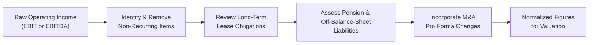

## Introduction and Rationale

Ever peek at a company’s EBITDA and think, “Wait a second, this number looks suspiciously high,” then discover a giant lawsuit settlement or big asset sale skewing the results? You’re not alone. Normalization—removing one-time items or non-operational events—is a crucial step in market-based valuation. This is especially important when using Enterprise Value (EV) multiples like EV/EBITDA or EV/EBIT, because one bad (or good) quarter can hush the real story about a firm’s ongoing performance.

Below, we’ll explore the most common adjustments analysts perform to get to a fairer representation of a firm’s earnings and capital structure. We’ll also sprinkle in some first-hand tips—they’re things I wish someone had hammered into my head back when I first fiddled with messy financial statements. 

## Adjusting for One-Time Items

One-time or non-recurring items can turn an otherwise stable performance metric into something that looks completely off. Here are the usual suspects:

### Restructuring Charges, Lawsuit Settlements, and Impairments 
• Restructuring Charges: You might see these when a company reorganizes divisions or shutters certain operations. Although restructuring might be part of common business strategy, large lump-sum hits are often treated as non-recurring.  
• Lawsuit Settlements: A single major legal settlement (for example, an antitrust penalty) can hammer operating income.  
• Impairments: Goodwill or asset impairments can arise from economic turbulences or M&A flops. Treating them as one-off charges helps smooth the historical data for future valuation.

From a practical standpoint, analysts often “add back” these charges to EBIT or EBITDA to see what the numbers look like under normal conditions. Or, in the event of a one-time gain, the costs might be “subtracted out” if that gain artificially boosts results. And yes, the hardest part can be deciding whether an item is genuinely non-recurring or part of the business’s ongoing operational risk.

### Non-Recurring Revenue Spikes (e.g., Asset Sales)
If a company is in the steel industry but suddenly sells real estate from a dormant facility, the one-time gain is not representative of the ironclad operation’s usual performance. Unless they repeatedly sell off assets as part of their normal business model (which is rare), you’ll want to exclude that spike from any EV multiple calculations.

Take it from personal experience: a small shipping enterprise I evaluated had a banner year solely because they sold several older vessels at well above book value. If I hadn’t removed that $100 million gain, their EV/EBITDA multiple would have looked abnormally cheap—leading to a misleading investment conclusion.

## Lease Accounting Impact

Newer accounting standards under IFRS 16 and US GAAP (ASC 842) require that many operating leases show up on the balance sheet. But the underlying economics can still vary, pushing analysts to consider “traditional” or “capitalized” approaches when adjusting EV and EBITDA:

### Operating vs. Finance Leases
Historically, operating leases rarely appeared as liabilities. Under IFRS 16, most leases must be capitalized. However, some short-term or low-value leases can remain off-balance-sheet. For valuation, the main question is whether we treat operating leases like debt (with interest expense and depreciation) or keep them purely as rent expense.

### Lease Capitalization
If the lease is basically a financing arrangement, many analysts capitalize it by estimating the present value of future lease payments. This sum is then added to net debt to form a “full” EV. Meanwhile, the associated rental expense that was previously operating expense might be split into interest and depreciation. That can boost EBITDA (since EBITDA excludes interest and depreciation) and raise the EV figure. The net effect on EV/EBITDA can vary, but if you’re ignoring large lease obligations, you might incorrectly label a company as less leveraged.

Below is a quick visual outline of how updating the enterprise value calculation might work:

## Treatment of Pension Liabilities and Other Off-Balance-Sheet Items

Off-balance-sheet items can stealthily hide from standard metrics. If they represent real claims on a business’s future cash flows, ignoring them can bloat valuations.

### Pension Underfunding
A chronically underfunded defined-benefit pension plan is effectively a liability, possibly a large one. Some analysts approximate the underfunded portion as “debt” and add it to EV. If a company has a $500 million shortfall in its pension plan, it’s wise to view that as an economic liability that competes for the firm’s cash flows.

### Environmental Liabilities or Legal Contingencies
Companies in mining, oil and gas, or chemicals may be subject to enormous cleanup costs or contamination liabilities. Similarly, big unresolved lawsuits can lead to major payouts. Including these off-balance-sheet exposures in EV (or at least disclosing them prominently for an adjusted measure) offers a clearer representation of the firm’s capital obligations.

## Revenue or EBITDA Normalization for Cyclical Industries

Some industries are famously cyclical: steel, shipping, airlines, semiconductors, you name it. If you take the EV/EBITDA ratio during a massive upswing, you might conclude: “This company is cheap!” Then, during a downturn, you might conclude “This company is expensive!”—while both times missing the big cyclical context.

### Peak vs. Trough Earnings
When a firm’s earnings are near a cycle peak, the EV/EBITDA ratio might look artificially low. At the cycle trough, the ratio might seem excessively high. Neither multiple fairly represents the firm’s normalized state over time.

### Formula or Weighted Average Approaches
Many analysts compute an average EBITDA (or revenues) over a specified period (e.g., 3–5 years) or adopt a mid-cycle estimate. You might see something like:

(EBITDA_Year1 + EBITDA_Year2 + EBITDA_Year3) / 3

or a more nuanced approach that weights each year differently if the cycle had unusual macro conditions (like the global financial crisis). This is sometimes called “mid-cycle normalization.”

## Impact of Mergers and Acquisitions

M&A transactions can produce funky swings in reported earnings or assets, especially if integration is ongoing. Here’s how to handle it:

### Pro Forma Adjustments
A recent acquisition might not fully show up in the historical financial statements. Alternatively, large synergy estimates could remain absent from reported EBITDA. Analysts often present “pro forma” financials that assume the acquisition or merger occurred at the start of the period, capturing the combined firm’s full-year effect.

### Purchase Price Accounting (PPA)
After an acquisition, intangible assets (e.g., trademarks, patents) might be written up to fair value. Depreciation and amortization expenses can shift significantly, causing short-term distortions in EBIT. If intangible amortization drastically changes the income statement, you may want to adjust EBIT or EBITDA to reflect a more stable, long-term level of expense.

## Exam and Item-Set Reminders

On a CFA Level II equity vignette, you might see a question about calculating EV/EBITDA. The twist could be whether you’re expected to adjust for:

1. Non-recurring items (like a settlement).  
2. Lease liabilities under IFRS 16 or US GAAP standards.  
3. Pension shortfalls.  
4. Pro forma M&A adjustments.  

A top tip: Always keep consistency. If you add back a restructuring charge to EBITDA, check whether that same item needs to be reflected on the balance sheet—perhaps as a liability or a use of cash—to properly adjust EV. Similarly, if you add lease liabilities to your EV, examine whether you need to adjust the EBITDA to remove rent expense or recharacterize it.

## Visualizing the Normalization Process

To see how these adjustments flow, check out the diagram below:

In practice, each of these steps can involve a fair bit of detective work, rummaging through footnotes, management discussions, and notes to the financial statements.

## Best Practices and Common Pitfalls

• Do your homework on footnotes: A company’s footnotes contain essential hints about one-time charges or incremental liabilities. Don’t skip them.  
• Keep track of materiality: Not every small item needs an exhaustive adjustment. Focus on the big-ticket anomalies that actually distort the numbers.  
• Inconsistent adjustments: Adding back a one-time charge to EBITDA but forgetting to handle the associated cash or debt on EV can produce a mismatched multiple.  
• Over-adjusting: Resist the temptation to label everything “non-recurring.” Some industries have constant “restructurings.” That might be recurring in disguise.

## Glossary of Key Terms

• Normalization: Adjusting reported financial metrics to remove unusual or non-recurring items that can distort the firm’s ongoing economic reality.  
• Off-Balance-Sheet Items: Obligations (or assets) that do not appear directly on the balance sheet under certain accounting policies but still represent real economic exposures.  
• Mid-Cycle Normalization: Estimating an average level of performance for cyclical industries, typically using average or “through-the-cycle” metrics.  
• Pro Forma Adjustments: Adjustments to historical or forecast financial statements to include or exclude significant, recent events (e.g., acquisitions).  
• Purchase Price Accounting (PPA): Revaluation of the acquired firm’s assets and liabilities to fair value at the acquisition date, potentially altering future expense patterns.

## References and Further Reading

• IFRS 16 (Leases) and US GAAP ASC 842 (Leases) for in-depth guidance on capitalization of operating leases.  
• International Financial Reporting Standards (IFRS) and US GAAP references for pension accounting and environmental liabilities.  
• Journal of Applied Corporate Finance articles exploring cyclical normalization and sector-specific adjustments.  
• Advanced equity valuation textbooks that cover “Normalization and Adjustments” in detail.  

## Test Your Knowledge: Unusual Adjustments & Normalization



### A company recognizes a large legal settlement expense in its current EBIT. According to normalization best practices, how should an analyst treat this expense when calculating EV/EBIT?

- [x] Add it back to current EBIT if deemed non-recurring  
- [ ] Keep it in current EBIT because all expenses must be reflected  
- [ ] Treat it as operating interest expense  
- [ ] Reclassify it from EBIT to other non-operating expenses  

> **Explanation:** Legal settlements that are genuinely non-recurring are typically treated as one-time charges. Analysts often add back such charges to EBIT to stabilize the metric, provided it is truly non-recurring.

### Under IFRS 16, many operating leases appear on the balance sheet. When capitalizing operating leases for valuation, how should analysts generally adjust EBITDA?

- [x] Increase EBITDA by removing rent expense and adding depreciation+interest instead  
- [ ] Decrease EBITDA to account for lease expense  
- [ ] Recognize the full lease expense as a non-operating item  
- [ ] Eliminate all depreciation expenses related to leases  

> **Explanation:** Capitalizing leases typically reclassifies rent expense into depreciation and interest. Since EBITDA excludes both interest and depreciation, EBITDA goes up.

### In evaluating a cyclical steel producer whose EBIT swings widely, which approach best represents normalized earnings?

- [ ] Use the most recent EBIT, as it reflects current market conditions  
- [x] Use a mid-cycle or multi-year average EBIT to smooth out volatility  
- [ ] Pick the largest EBIT in the cycle to remain conservative  
- [ ] Eliminate cyclical industries from your portfolio entirely  

> **Explanation:** For cyclical industries, mid-cycle or multi-year averaging is critical to avoid overestimating or underestimating the firm’s sustainable earnings.

### A high-tech firm sells a patent for $300 million, recorded as a one-time gain in operating income. What is the recommended normalization adjustment?

- [x] Subtract the $300 million gain when evaluating EBIT  
- [ ] Add $300 million to EBIT for a conservative approach  
- [ ] Pro-rate the gain over five years  
- [ ] No adjustment needed, as all gains are part of normal business  

> **Explanation:** Proceeds from a patent sale are typically non-recurring unless the firm regularly sells patents. Subtracting the gain helps present a more accurate operating result.

### Pension liabilities are underfunded by $100 million. Which is the most common adjustment in an EV-based valuation?

- [x] Add $100 million to enterprise value as a debt-like item  
- [ ] Subtract $100 million from enterprise value to reflect future returns  
- [x] Add $100 million to shareholders’ equity  
- [ ] Ignore the underfunding because it’s a non-cash item  

> **Explanation:** An underfunded pension can be treated like debt; many analysts add it to EV to reflect the economic claims on the company.

### In post-merger financial statements, intangible asset amortization dramatically reduces EBIT. What normalization can an analyst consider?

- [x] Adjust EBIT to reflect a more stable amortization expense  
- [ ] Eliminate all intangible amortization  
- [ ] Add back depreciation and interest expense  
- [ ] Reverse the entire acquisition entry  

> **Explanation:** A spike in intangible amortization following acquisition can temporarily distort EBIT. Analysts often adjust EBIT to account for a more sustainable amortization pattern.

### If a firm boosts EBITDA by removing a large lawsuit settlement, but fails to adjust the associated cash outflow when calculating EV, what is the result?

- [x] The EV/EBITDA multiple is understated, leading to potential misvaluation  
- [ ] The EV/EBITDA multiple is overstated, leading to potential misvaluation  
- [x] No impact, as both adjustments cancel each other  
- [ ] The firm’s debt ratio is unaffected  

> **Explanation:** Proper normalization requires consistency. Adding back a one-time expense raises EBITDA but also needs to reflect any related cash or liability on the EV side; otherwise, the multiple looks artificially low.

### An analyst wants to determine the best “through-the-cycle” EBITDA for a shipping company. Which data should they primarily rely on?

- [x] A multi-year EBITDA average that encompasses both market upturns and downturns  
- [ ] Q1 data from the current year, assuming it’s representative  
- [ ] The highest EBITDA posted over the past decade  
- [ ] A simple sum of all recorded EBITDA without weighting  

> **Explanation:** Cyclical industries require an average figure over multiple years to reflect typical performance—especially shipping, which sees booms and busts.

### How should environmental cleanup costs that are likely to occur in the near future be treated for EV calculations?

- [x] They should be treated as a liability and potentially added to EV  
- [ ] They should be ignored if they don’t appear as debt  
- [ ] Deduct them from cash in the final EV calculation  
- [ ] Include them in revenue normalization  

> **Explanation:** Environmental cleanup costs that represent significant obligations effectively function as liabilities. Many analysts either add them to net debt or adjust the enterprise value to reflect the probable cash outflow.

### True or False: Normalization is only necessary for companies in cyclical industries.

- [x] True  
- [ ] False  

> **Explanation:** It’s actually false in strict sense—but be careful. Normalization is used for all kinds of businesses that have non-recurring items; cyclical industries merely present a common scenario. Some might consider it “True” in a loose sense if they misread the question. The correct concept is that normalization applies broadly whenever unusual or one-time items distort metrics.


