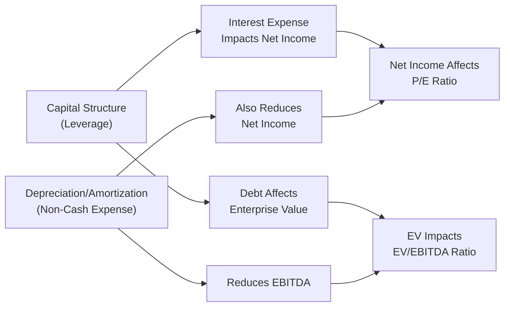

## Introduction: Understanding the Two Valuation Lenses

Ever looked at a company and wondered, “Gosh, why is its Price-to-Earnings (P/E) ratio so high while its Enterprise-Value-to-EBITDA (EV/EBITDA) is quite low?” You’re not alone. The interplay between EV/EBITDA and P/E can be downright confusing, especially when you throw in different capital structures, depreciation schedules, and corporate strategies.

This vignette exercise explores two hypothetical industrial equipment manufacturing companies—Company A and Company B—that share a similar market capitalization but differ in debt levels and depreciation approaches. By walking you through a real-life style scenario, we’ll see how these contrasts can make one company’s P/E look misleadingly rich (or cheap) while its EV/EBITDA tells a different story. After all, the ultimate goal is to avoid valuation traps that might derail your investment thesis.

## The Scenario: Two Industrial Equipment Manufacturers

Imagine you’re analyzing Company A and Company B. They both build specialized machinery for construction and infrastructure projects. On the surface, they might look similar—both have roughly the same market cap and operate in the same industry. But their financial footprints diverge when it comes to capital structure, depreciation, and how they direct free cash flow.

### Company A’s Traits
• High leverage: They’ve been taking on debts aggressively, resulting in a large interest expense.  
• Moderate capital expenditures (capex) but relatively low depreciation.  
• Minimal dividend payouts: Management is more focused on meeting debt obligations than distributing cash.  
• EBITDA stands tall relative to net income, mainly because the interest expense heavily reduces net income.  

### Company B’s Traits
• Primarily equity-financed, which means less interest expense but a potentially higher tax burden.  
• Significantly higher depreciation expense thanks to large capex in prior years.  
• Stable free cash flow: Lower debt service costs, but the depreciation lowers reported net income.  
• Profit metrics are more “hit” by intangible accounting items like depreciation than by interest expenses.  

If you compare these two side by side, you’ll see a clash of capital structure and depreciation. That’s where EV/EBITDA and P/E become immensely relevant.

## EV/EBITDA vs. P/E: Distinguishing the Two

We know from earlier chapters that market-based valuation hinges on ratios that quickly convey how a company’s stock price relates to its fundamentals. Let’s do a quick refresher on why these two multiples differ so much.

### EV/EBITDA

Enterprise Value (EV) is the sum of the company’s market capitalization plus outstanding debt, minus cash and cash equivalents. It’s a more capital-structure-neutral view because it includes debt holders and equity holders. EBITDA (Earnings Before Interest, Taxes, Depreciation, and Amortization) ignores depreciation and interest expenses.  

• Strengths:  
  – Captures the total value attributed to both debt and equity claims.  
  – Strips out depreciation and amortization, making comparisons among firms with different depreciation methods somewhat fairer.  
  – Less sensitive to leverage decisions on the earnings side (interest expense is excluded).  

• Weaknesses:  
  – Ignores legitimate costs such as depreciation (which, for some industries, is large and very relevant).  
  – Can underrepresent capital-intensive companies where depreciation is a substantial portion of costs.  
  – Fails to reflect how significant debt obligations might weigh on the future.  

### P/E (Price-to-Earnings)

P/E is the ratio of a firm’s share price to its earnings per share. In other words, it’s how much investors pay for each dollar of net income.  

• Strengths:  
  – Intuitive and easy to communicate to a broad audience.  
  – Useful when interest expense, tax rates, and capital dynamics are stable or broadly comparable.  

• Weaknesses:  
  – Highly sensitive to leverage (more debt can depress net income and inflate the P/E ratio).  
  – Can be prone to distortion when non-cash items like depreciation or amortization significantly affect earnings.  
  – If net income is near zero (or negative), the P/E ratio can be extremely volatile or meaningless.  

## Key Analysis Points: A Tale of Two Capital Structures

### Capital Structure Influence

• Company A, with high debt, faces notable interest expenses that reduce net income. This scenario often leads to a higher P/E ratio—simply because net income is deflated (the denominator in P/E shrinks). However, the massive interest doesn’t affect EBITDA, so the EV/EBITDA ratio might look appealingly low. On the surface, you might think, “Wow, Company A is cheap based on EV/EBITDA,” but be cautious: that high leverage introduces more risk, and that’s not always visible in the EV/EBITDA multiple.

• Company B, with low debt, sees less interest expense. Net income is higher, which can lower P/E. If you just glanced at the P/E between both firms, you might assume that Company B is “cheaper,” without realizing the big chunk that depreciation takes out of its EBITDA. So, for B, EV/EBITDA ends up looking somewhat high. 

### Depreciation Impact

Depreciation is a non-cash expense representing the consumption of fixed assets over time. Yet it’s still an expense that reflects real economic wear and tear on assets:

• Company A’s depreciation is low (and capex is moderate). That keeps EBITDA close to operating income, arguably making EV/EBITDA a more favorable figure.  
• Company B has high depreciation from its prior heavy capex. This drags down EBITDA, making EV/EBITDA look high. But in reality, the company has physically upgraded its infrastructure, which might keep future expenses lower down the line.  

### Growth Prospects and Timing

Don’t forget the timeline factor. If Company B’s heavy depreciation is mostly front-loaded and will taper in future years, forward-looking EBITDA could spike. Meanwhile, Company A might face ballooning interest payments or have to refinance debt at higher rates, changing the picture entirely. This is why forward multiples or a dynamic model (like two-stage or three-stage DDM or FCFE) can be super helpful in bridging discrepancies.

### Vignette Examination

In a CFA exam context, you’ll typically see a story about how each company’s reported multiples appear at first glance. The exam might ask which firm is truly undervalued or to explain why a ratio is misleading. Always keep an eye out for:  
• Debt levels and repayment schedules.  
• Capex patterns, depreciation schedules, and how these shift net income or EBITDA over time.  
• Possibly intangible factors like brand recognition, R&D expenses, or patent amortizations that can further cloud net income calculations.  

Often, a question can revolve around explaining the difference between “apparent undervaluation” and the “normalized picture.” Make sure you adjust or interpret the ratios in a way that aligns with the companies’ unique capital structures and depreciation realities.

## Best Practices and Pitfalls in Using EV/EBITDA vs. P/E

• Look at Both: It might sound obvious, but it’s easy to latch onto a single multiple that appears telling. In practice, combining EV/EBITDA and P/E can serve as a checks-and-balances approach.  
• Adjust When Necessary: For instance, if a company’s depreciation is “unusually” high for just a year or two, consider normalizing it or looking forward. Similarly, if interest expense is temporarily low, remember it could jump once variable rates adjust.  
• Study the Trend, Not Just the Snapshot: Historically, has a particular firm always had a high P/E or low EV/EBITDA? There might be structural reasons. Understanding these reasons can help you avoid over- or underestimating a firm’s performance.  
• Mind the Sector Differences: Debt usage and depreciation schedules can vary by industry. Industrial equipment manufacturing companies typically have more significant capital expenditures than, say, software firms. So what’s “normal” for one sector can be extreme for another.

## Visualizing EV/EBITDA vs. P/E

Below is a simple Mermaid diagram illustrating the conceptual interplay between EV/EBITDA and P/E, demonstrating how leverage and depreciation might funnel into different ratios:

• Notice how both capital structure (which shapes EV and interest expense) and depreciation can affect the EBITDA and net income lines differently.  
• The result is two different pictures provided by EV/EBITDA vs. P/E.

## Practical Example: Hypothetical Numbers

Let’s do a quick numeric illustration, focusing on a single year. (Just watch for the oversimplification, though—it’s mainly to get the point across.)

• Company A (High Debt):  
  – EBITDA = $200M  
  – Interest Expense = $50M  
  – Depreciation = $30M  
  – Taxes = 25% of (EBIT)  
  – Assume Market Cap = $1B, Net Debt = $500M  

  Let’s compute net income quickly:  
  EBIT = EBITDA – Depreciation = $200M – $30M = $170M  
  EBT = $170M – $50M = $120M  
  Taxes = 25% × $120M = $30M  
  Net Income = $120M – $30M = $90M  

  P/E = Market Cap / Net Income = $1B / $90M ≈ 11.1×  
  EV = Market Cap + Net Debt = $1B + $500M = $1.5B  
  EV/EBITDA = $1.5B / $200M = 7.5×  

• Company B (Low Debt, High Depreciation):  
  – EBITDA = $160M  
  – Interest Expense = $10M  
  – Depreciation = $60M  
  – Taxes = 25% of (EBIT)  
  – Market Cap = $1B, Net Debt = $50M  

  EBIT = $160M – $60M = $100M  
  EBT = $100M – $10M = $90M  
  Taxes = 25% × $90M = $22.5M  
  Net Income = $90M – $22.5M = $67.5M  

  P/E = $1B / $67.5M ≈ 14.8×  
  EV = $1B + $50M = $1.05B  
  EV/EBITDA = $1.05B / $160M ≈ 6.6×  

Notice something? Company B’s P/E of 14.8× looks less attractive (i.e., higher multiple) than Company A’s 11.1×, mainly because Company B’s net income is somewhat constrained by large depreciation. On the other hand, Company B’s EV/EBITDA of 6.6× is actually lower (suggesting “cheaper”) than Company A’s 7.5×, reflecting that the high depreciation is taking a bigger bite out of B’s EBITDA. Meanwhile, Company A looks better on a P/E basis but is saddled with significantly higher debt. Would you rather hold the leveraged entity or the equity-financed one? That’s the art (and risk) of interpreting multiples.

## Conclusion: Tying It All Together

The driving lesson here is that multiples are just signposts. They don’t “prove” anything alone, but they do guide us toward key questions about a firm’s capital structure, depreciation methods, capex, and more. For an exam or real-world scenario, the best approach is to be aware of the differences, interpret them carefully, and cross-check with additional data (like free cash flow or forward earnings).

At Level II of the CFA® Program, you’ll see item sets that make you weigh these complexities under exam pressure. The temptation might be to pick whichever ratio “looks best”—but deeper analysis is crucial. Ask yourself: “Is that ratio telling the full story, or is it overshadowed by intangible ‘wrinkles’ in the company’s financials?” In short, evaluate them both. Then decide which one best suits the underlying realities of the business.

## References and Further Reading

• S&P Global Market Intelligence: Case Studies on Comparing EV/EBITDA vs. P/E in Industrial Sectors  
• CFA Institute, “Financial Reporting and Analysis”  
• Damodaran, A., “Investment Valuation: Tools and Techniques for Determining the Value of Any Asset”  
• Corporate Finance lectures and resources on capital structure effects on valuation  

---

## Test Your Knowledge: EV/EBITDA vs. P/E in Practice



### Which statement best characterizes EV/EBITDA compared with P/E?

- [ ] EV/EBITDA always yields higher valuation multiples.  
- [ ] EV/EBITDA only applies to companies with no debt.  
- [x] EV/EBITDA includes the value to both debt and equity holders, while P/E focuses only on equity holders.  
- [ ] They are essentially the same and only differ in how they are written.  

> **Explanation:** EV/EBITDA considers total capital (debt plus equity), whereas P/E only captures the equity portion.  

### In comparing two industrial equipment manufacturers, which factor most significantly inflates P/E but not EV/EBITDA?

- [ ] High depreciation.  
- [x] High interest expense.  
- [ ] Low share-price growth.  
- [ ] Positive foreign exchange gains.  

> **Explanation:** Interest expense reduces net income, making the P/E ratio higher. EV/EBITDA excludes interest expense, so it won’t be directly affected by leverage costs.  

### When analyzing depreciation’s effect on EV/EBITDA and P/E:

- [ ] Depreciation lowers net income but not EBITDA, thereby decreasing P/E swiftly.  
- [x] Depreciation lowers EBITDA and net income, but its impact on net income can be more visible in P/E.  
- [ ] Depreciation is a cash expense that inflates EBITDA.  
- [ ] Depreciation only affects EV, not EBITDA or earnings.  

> **Explanation:** Depreciation is excluded from EBITDA, but it will reduce EBITDA if you consider the full “E” as EBIT minus Depreciation + Amortization. Also, it has a direct impact on net income, making it particularly relevant for the P/E ratio.  

### What is the main pitfall of using P/E for a heavily levered firm?

- [x] Interest expense significantly reduces net income, potentially distorting the multiple.  
- [ ] The higher debt levels make the book value unreliable.  
- [ ] P/E fails to reflect leverage in any way.  
- [ ] The ratio becomes negative.  

> **Explanation:** Interest expense can make net income appear anemic, thus driving the P/E ratio higher and potentially misleading investors who don’t factor in the debt load.  

### Which scenario will make EV/EBITDA look artificially “cheap”?

- [x] When a company has very high EBITDA due to low depreciation and minimal interest impact on EBITDA.  
- [ ] When a company’s market cap is inflated but its debt is minimal.  
- [ ] When net income is extremely large.  
- [ ] When tax rates unexpectedly decline.  

> **Explanation:** Because EBITDA is higher when depreciation (and interest) is low, EV/EBITDA might seem undervalued—even if the underlying capital structure introduces risk.  

### Analyzing a capital-intensive business with outdated equipment:

- [ ] P/E will always be more reliable if interest expense is high.  
- [x] EV/EBITDA might fail to capture the real, ongoing costs of equipment replacement.  
- [ ] EV/EBITDA is irrelevant; P/E is the only measure that matters for capital-intensive firms.  
- [ ] Both metrics will be unaffected by large capex.  

> **Explanation:** Since EV/EBITDA excludes depreciation and only accounts for capital structure in a static way, it may miss the real cost of maintaining or replacing outdated equipment.  

### A firm expects depreciation to decrease significantly next year. How could this affect its forward P/E ratio relative to the current ratio?

- [x] The forward P/E ratio could decline if net income is projected to rise.  
- [ ] The forward P/E ratio will remain unchanged because depreciation does not affect net income.  
- [ ] The forward P/E ratio will increase because net income will get smaller.  
- [ ] It has no impact on P/E ratio because depreciation is a non-cash item.  

> **Explanation:** Lower future depreciation means higher future net income, typically driving the forward P/E down.  

### Which item is excluded from both EV/EBITDA and P/E calculations?

- [ ] Depreciation  
- [x] Capital expenditures  
- [ ] Net income  
- [ ] Market value of equity  

> **Explanation:** Neither EV/EBITDA nor P/E explicitly includes capital expenditures in the ratio—a key reason certain capital-intensive firms may appear undervalued.  

### In a vignette, you see that Company A reports a lower EV/EBITDA than Company B. Before concluding Company A is undervalued, which detail should you examine most closely?

- [ ] The firm’s dividend payout ratio.  
- [x] The firm’s debt obligations and interest payment schedule.  
- [ ] The prevailing interest rates in international markets.  
- [ ] The intangible assets on its balance sheet.  

> **Explanation:** Company A’s low EV/EBITDA might be driven by a high debt load and interest expense that doesn’t affect EBITDA. You want to confirm whether that leverage amplifies risk.  

### True or False: P/E and EV/EBITDA are equally sensitive to leverage.

- [ ] True  
- [x] False  

> **Explanation:** P/E is highly sensitive to leverage because interest expense reduces net income. EV/EBITDA, however, excludes interest expense from the “earnings” figure, making it less sensitive to leverage.  


