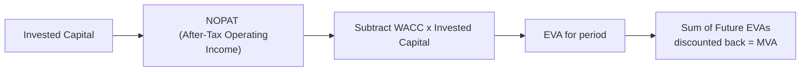

## Setting the Stage

I can still remember the first time someone told me, “Just because a company posts positive net income doesn’t mean it’s really creating value.” It surprised me, because for the longest time I’d looked at the income statement in a pretty straightforward way—revenue minus expenses equals net profit, so what else is there to talk about? Then I discovered that equity investors also charge a “fee,” in a sense, for the funds they commit. The same goes for bondholders. And if a company isn't generating returns above everyone’s required cost of capital, well, it might actually be eroding value.

That’s where Economic Value Added (EVA) comes in. It’s basically a way to measure how much extra economic profit a firm is actually earning after covering the cost of using both equity and debt capital. We’ll talk about how to calculate EVA, why it matters, and how it connects directly with Market Value Added (MVA)—the measure of how a firm’s overall value (from the market’s perspective) compares to the capital that investors have put in over time.

## Why Traditional Accounting Profit May Not Tell the Full Story

Traditional measures, like net income or even operating income, can be a bit misleading in evaluating how effectively management is using capital. Sure, if net income is positive, the company is above that zero line. But net income ignores the opportunity cost of the capital deployed. For a well-rounded view, we have to incorporate the Weighted Average Cost of Capital (WACC).

WACC represents a blended cost of the funding sources: equity and debt. If a company fails to earn returns above its WACC, it might squeak out a net profit, but in the bigger picture, it isn't compensating its shareholders and bondholders for the risk they took on. That’s the puzzle that EVA attempts to solve.

## EVA: A Measure of Real Economic Profit

At its core, EVA is computed as:


\text{EVA} = \text{NOPAT} - (\text{WACC} \times \text{Invested Capital})


where:

• NOPAT (Net Operating Profit After Taxes) is the company’s operating income adjusted for taxes, excluding interest expense. It reflects the core operating performance, free from financing effects.  
• WACC (Weighted Average Cost of Capital) is the overall required rate of return demanded by debt holders and equity holders.  
• Invested Capital is the total amount of money that has been put into the business by both shareholders and creditors. One common definition is total assets minus non-interest-bearing current liabilities. Another approach is the sum of the book value of debt and equity.

### Breaking Down the Components

1. NOPAT:  
   NOPAT often starts with EBIT (Earnings Before Interest and Taxes). Then you apply the corporate tax rate. Because interest expenses are excluded, NOPAT is purely about the firm’s operating performance and does not incorporate capital structure choices.

   Sometimes there are adjustments to EBIT (like adding back R&D expenses if we think of them as investments rather than expenses), or we might handle certain nonoperating items. The goal is to get a clean figure that reflects the ongoing, sustainable earning power of the core business.

2. WACC:  
   The Weighted Average Cost of Capital is critical. You blend the cost of equity and cost of debt in proportion to their respective weights in the firm’s capital structure. For instance:

   
   \text{WACC} = \left(\frac{E}{D + E}\right)\times r_e + \left(\frac{D}{D + E}\right)\times r_d \times (1 - t)
   

   where E = market value of equity, D = market value of debt, \\( r_e \\) = cost of equity, \\( r_d \\) = cost of debt, and \\( t \\) = statutory tax rate. 

   By factoring in the after-tax cost of debt (because interest is tax-deductible) and the required return on equity, WACC gives a single percentage that tells us how much return the firm’s assets must generate to satisfy all providers of capital.

3. Invested Capital:  
   The exact definition can vary. A straightforward method is total assets minus non-interest-bearing current liabilities, but many analysts prefer focusing on how much has actually been provided by creditors and shareholders. That means:

   
   \text{Invested Capital} = (\text{Book Value of Equity}) + (\text{Book Value of Debt}) \pm \text{Adjustments}
   

   Because we only want to measure capital that has a cost associated with it, we exclude items like accounts payable (if they are effectively interest-free).  

### EVA in Practice

When EVA is positive, it means the firm has gone beyond covering its WACC. Essentially, the firm is generating returns above the minimum threshold. You might hear folks say, “EVA is the real bottom line.” That’s why some companies (like certain industrials or conglomerates) tie executive bonuses to EVA improvements—because it forces managers to think about whether new projects or expansions will deliver returns in excess of the cost of capital.

When EVA is negative (which, to be honest, happens a lot more often than companies would like to admit), it indicates the firm’s net operating profit is insufficient to cover the capital costs. So even though a firm might be profitable in an accounting sense, it’s actually destroying value from an economic standpoint.

## Managerial Performance and Incentive Structures

EVA has become really popular as a metric baked into executive compensation because it aligns the managers’ incentives with shareholders’ goal: earn a higher rate of return than the cost of the capital. If I’m a CFO focusing on EVA during capital budgeting, I’m naturally going to ask: “Will this project add to or subtract from EVA next year and beyond?” Projects that would hamper the overall corporate EVA might be reevaluated or scrapped, while projects that add incremental EVA get the green light.

## Market Value Added (MVA): The Big Picture

While EVA is typically computed for a specific period (quarterly, annually, etc.), Market Value Added (MVA) goes beyond that single window and focuses on the cumulative effect over time. Specifically, MVA is:


\text{MVA} = \text{Market Value of the Firm (equity + debt)} - \text{Total Capital Contributed}


• Market Value of the Firm includes the market cap of the equity plus the market value of debt.  
• Total Capital Contributed is all the money that shareholders and creditors have injected into the business over time.

You can think of MVA as the difference between what the market thinks the operations are worth right now and what actually went into the firm. If the difference is positive, the market is effectively saying, “This firm’s prospects and residual income potential are higher than what was spent to get it rolling.” If negative, the market is indicating that the business has used more resources than it has created—at least, in the eyes of investors.

## Linking EVA and MVA

It’s helpful to see how EVA influences MVA. Essentially, MVA can be viewed as the present value of all future EVAs the company is expected to generate. If the market believes that your firm will keep producing a strong positive EVA, your stock and bond prices likely will rise, which boosts the market value of the firm. Hence, MVA is a forward-looking reflection of the market’s stance on the firm’s ability to generate positive EVA.

You might notice a time-lag dimension here: MVA is dynamic and changes with market expectations about future returns. EVA, on the other hand, measures actual performance for a particular period. But if you string together multiple periods of strong EVA, guess what? More often than not, MVA goes up.

## A Quick Mermaid Diagram

Below is a simplified flow that shows how EVA fits into the broader concept of MVA:

This diagram is obviously a simplification—real-world calculations often involve numerous adjustments—but it helps you visualize how each concept connects.

## Practical Challenges in Calculating EVA

1. Accounting Adjustments:  
   Companies might adjust NOPAT for items like R&D, which is typically expensed under GAAP/IFRS. If R&D is truly an investment in future growth, many prefer to turn it into a capital expenditure (as a “capitalized intangible”), which also affects your invested capital.

2. Determining the “Right” Cost of Capital:  
   WACC is not always straightforward—especially if you have different business units with varying risk profiles. Assigning each division its own WACC can lead to more accurate performance measurement, but it complicates the calculations.

3. Non-Interest-Bearing Liabilities:  
   This can be tricky. For instance, if your suppliers give you trade credit, that’s effectively a financing source that might come with its own implicit cost. Some analysts treat it as part of total capital, while others do not.

4. Time Period of Measurement:  
   EVA is typically annual, but you can measure it quarterly or monthly. It just depends on the granularity you need. The shorter the measurement period, the more volatility you might see.

## Case Example: Simplified EVA Calculation

Let’s say you have a small manufacturing company, “WidgetCorp,” with the following stats for last year:

• NOPAT = $120 million  
• WACC = 10%  
• Invested Capital = $1 billion  

Then:


\text{EVA} = 120\text{ million} - (0.10 \times 1,000\text{ million}) = 120\text{ million} - 100\text{ million} = 20\text{ million}


WidgetCorp created $20 million of economic value after covering all capital costs. If you repeated that success for multiple years, you’d expect the market to recognize the ongoing ability to outpace the cost of capital, and that would likely increase the firm’s share price (and bond valuation if it has bonds outstanding), thereby lifting its Market Value Added over time.

## Linking EVA to Equity Valuation

In Level II equity, the fundamental question is: “How do we integrate these residual income metrics into our overall valuation approach?” If you recall from your earlier reading:

• Dividend Discount Models (DDM) rely on expected cash flows to equity.  
• Free Cash Flow Models (FCFF, FCFE) focus on cash-based measures.  
• Residual Income Valuation (where EVA is conceptually akin to residual income) calculates equity value by looking at the difference between net income and the cost of equity capital.

EVA specifically includes the weighted cost of debt and equity, so it ties in well when we want a broader perspective that includes the interests of all capital providers.

## Best Practices and Pitfalls

• Stay Consistent: Make sure the definitions of NOPAT, Invested Capital, and WACC are consistent with each other.  
• Avoid Over-Engineering: Some folks get deep into the weeds with too many adjustments. While it can refine accuracy, always remember that the more assumptions you bake in, the more you risk introducing subjectivity.  
• Use EVA Alongside Other Measures: EVA is powerful, but by itself it doesn’t reflect timing issues or intangible strategic value that might not appear in near-term cash flows or earnings. Use it in tandem with ratio analysis, growth projections, or scenario analyses to gain a richer picture.  
• Executive Compensation: If your firm links bonuses to EVA, watch for short-term gaming—like cutting R&D too aggressively. Vital intangible assets can get neglected if managers are overly focused on immediate EVA results.

## Final Thoughts for the Exam

EVA and MVA tend to be tested in item sets where you’re asked to compute either an EVA figure or interpret how changes in capital structure, cost of capital, or operating profit can affect it. MVA questions might show you a set of market data (equity market cap, book value of debt, etc.) and ask you to calculate the difference between that market valuation and total capital contributed. Pay attention to footnotes and subtle details around how “invested capital” is defined, or whether interest is included in NOPAT.

Ultimately, understanding EVA and MVA helps you see the deeper logic behind whether a firm is creating genuine economic profit or just squeaking by on an accounting basis. This is exactly the sort of insight the CFA Program emphasizes: bridging the gap between raw numbers and true economic reality.

## References and Further Reading

• Stewart, G. Bennett III. “The Quest for Value: A Guide for Senior Managers.”  
• Koller, Tim, Marc Goedhart, and David Wessels. “Valuation: Measuring and Managing the Value of Companies.”  
• Damodaran, Aswath. “Damodaran on Valuation.”  
• Pinto, Jerald E., Elaine Henry, Thomas R. Robinson, and John D. Stowe. “Equity Asset Valuation, 4th Edition (CFA Institute Investment Series).”

---

## Practice Questions: EVA and MVA Essentials



### A firm reports Net Operating Profit After Taxes (NOPAT) of \$500 million and has a Weighted Average Cost of Capital (WACC) of 8%. If the firm’s invested capital is \$5 billion, what is its EVA?

- [ ] \$60 million
- [x] \$100 million
- [ ] \$140 million
- [ ] \$160 million

> **Explanation:** EVA = NOPAT – (WACC × Invested Capital) = \$500 million – (0.08 × \$5 billion) = \$500 million – \$400 million = \$100 million.

### Which component is specifically excluded from NOPAT when calculating EVA?

- [ ] Income taxes on interest expense
- [ ] Cost associated with COGS
- [ ] Depreciation expense
- [x] Interest expense

> **Explanation:** NOPAT focuses on operating income and excludes interest expense, placing the focus on after-tax operating performance independent of the firm’s financing structure.

### Which statement best describes the relationship between EVA and MVA?

- [x] MVA represents the cumulative market assessment of the firm’s ability to generate future EVA.
- [ ] EVA is the present value of all future MVA.
- [ ] EVA is always equal to MVA absent any financial leverage.
- [ ] EVA and MVA are interchangeable metrics reporting the same figure.

> **Explanation:** MVA is the market’s cumulative assessment of the present value of expected future residual income (EVA). EVA is measured over a specific period, while MVA is the stock of value created or lost up to the present.

### If a firm’s EVA is consistently negative, which is most likely true regarding management’s performance?

- [ ] Management must be exceeding investor expectations.
- [x] The firm’s operating profit is insufficient to cover the cost of capital.
- [ ] It is automatically violating accounting regulations.
- [ ] The firm’s total capital is falling.

> **Explanation:** Negative EVA indicates that the firm’s returns are not covering its overall cost of capital, thereby destroying value from an economic standpoint.

### When calculating invested capital, which item would we generally exclude?

- [ ] Book value of common equity
- [ ] Long-term debt
- [x] Non-interest-bearing current liabilities
- [ ] Preferred stock

> **Explanation:** Non-interest-bearing current liabilities, like accounts payable, are not typically included since they do not require a return to capital providers in the usual sense.

### Suppose a firm’s EVA increases from \$10 million to \$25 million. What is the most logical effect on its MVA, all else being equal?

- [x] The firm’s MVA will likely increase if the market believes the higher EVA is sustainable.
- [ ] No change in MVA because MVA is unrelated to EVA.
- [ ] Negative impact on MVA because the firm is incurring higher costs.
- [ ] No change unless dividends are paid out.

> **Explanation:** Higher EVA implies better economic performance. The market typically rewards such improvements with a higher valuation, thus increasing MVA, provided the market assumes sustained future EVA growth.

### Which of the following best reflects a key challenge in tailoring EVA for a multi-division company?

- [ ] Difficulty adjusting for inflation among product lines
- [ ] Using net income instead of NOPAT
- [x] Applying an appropriate WACC across divisions with differing risk profiles
- [ ] Using only retained earnings in invested capital

> **Explanation:** One of the biggest difficulties is establishing the correct cost of capital for each division if they vary significantly in growth and risk.  

### A company chooses to expense R&D costs under GAAP. How might EVA calculations typically treat these R&D outlays?

- [ ] Subtract them permanently from EVA
- [x] Capitalize them as an asset and amortize over time if they create future economic value
- [ ] Ignore them altogether in EVA computations
- [ ] Recognize them only if the firm’s MVA is positive

> **Explanation:** Many EVA practitioners capitalize R&D because it’s viewed as an investment in future cash flows rather than a purely periodic expense. This helps better align NOPAT with long-term economic reality.

### Why might some remuneration committees tie executive bonuses to EVA growth rather than EPS growth?

- [x] EVA explicitly accounts for the cost of capital, giving a fuller picture of value creation.
- [ ] Executives find EVA simpler to manipulate than EPS.
- [ ] EVA ignores taxation, making bonus calculations easier.
- [ ] EPS disregards revenues, while EVA focuses on them.

> **Explanation:** EVA goes beyond standard earnings metrics by incorporating the cost of equity and debt, ensuring that management’s decisions truly create economic value beyond just net profits.

### If a company's total market value (equity plus debt) is \$3 billion while total capital contributed by investors is \$2 billion, which statement is most accurate?

- [x] MVA is \$1 billion.
- [ ] The firm’s EVA must be \$1 billion.
- [ ] MVA cannot be computed because the cost of equity is unknown.
- [ ] The firm’s WACC is necessarily below its ROI.

> **Explanation:** MVA = Market Value of the Firm – Total Capital Contributed = \$3 billion – \$2 billion = \$1 billion.


