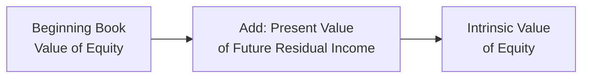

## Introduction

Residual income valuation is one of those models that can feel a bit confusing at first. After all, many of us learned early on about “book value” being an accounting artifact—something mostly backward-looking. But the reality is that book value can serve as a powerful foundation if we properly incorporate future earnings in excess of the firm’s cost of equity. In this section, we’ll talk about how residual income (RI) starts with book value, why the accounting numbers matter, and how to integrate or reconcile these with other valuation approaches such as dividend discount models (DDM), free cash flows (FCF), and price multiples. We’ll also highlight how intangible assets, off-balance-sheet items, and “clean surplus” violations can cloud the story.

Sometimes, I like to think of residual income from my time analyzing start-up companies—where the book value was minimal, but the potential to generate future returns above a certain hurdle rate was huge. That experience really drove home the message: if you’ve got a solid baseline (book value) and you can identify how much the firm will earn over and above its cost of equity, that clearly turbocharges your valuation models.

## Foundational Formula: Residual Income and Book Value

Residual income valuation leverages an intuitive formula. It says the value of a company’s equity (V₀) is basically today’s book value, plus the present value of all the future residual incomes. Mathematically, you often see:

$$
\text{Value}_0 = \text{Book Value}_0 \;+\; \sum_{t=1}^{\infty} \frac{\text{RI}_t}{(1+r)^t}
$$

Where:  
• Book Value₀ is the firm’s current accounting equity or shareholders’ equity.  
• RIₜ = (Return on Equity - Cost of Equity) × Book Value of Equity at t–1.  
• r is the required return on equity (or cost of equity).

Why do we even start with Book Value₀? Well, the logic is: if the company never earns anything above its cost of equity, then, in theory, the market value would just remain equal to its current book value. That’s because any future net income would just cover investors’ required return—leading to zero residual income. So, Book Value₀ is a natural anchor.

Here’s a quick conceptual flowchart of how the model builds upon book value:

## Book Value vs. Market Value

### Accounting Book Value

Book value of equity is what you see on the balance sheet. It is the sum of all assets minus liabilities, all measured at historical costs (adjusted for depreciation, intangible write-downs, and so on). When you peek at the shareholders’ equity section, you often find line items such as common shares at par value, additional paid-in capital, retained earnings, accumulated other comprehensive income, etc.

A couple of points worth remembering:
• Book value is determined by accounting standards (GAAP or IFRS), which may not fully capture intangible resources.  
• It tends to be backward-looking, insofar as it reflects historical transactions and valuations.  

### Market Value

Market value, on the other hand, is the “live” value that investors are willing to pay for a piece of the company. It’s the share price multiplied by the number of outstanding shares. This one is forward-looking, driven by investor sentiment, growth expectations, and risk perceptions. If the market believes the company is going to generate returns well in excess of its cost of equity, the stock price might be way above book value.

In practice, if you open up any major financial website and see the market cap, that’s your quick read on market value (though in more advanced applications, you might also adjust for convertible securities, stock options, etc.).

## How Residual Income Bridges the Gap

Now, the essential idea is that if the firm’s return on equity (ROE) is exactly r (the cost of equity), there is no “excess” return. The value is Book Value₀. Done. But if the firm is generating supercharged ROE above its cost of equity, we tack on additional present value from those future economic profits. They’re called “residual” because they’re left over once you’ve compensated shareholders for the risk they’re taking.

This bridging mechanism shows how residual income picks up what simple book-value-based methods miss. Book value alone can’t project the incremental return above or below the cost of equity. If we see that the company’s consistent ROE is, say, 12% and the cost of equity is only 9%, we might expect positive residual income each year—and in turn, a premium over the current book value.

## Relation to Other Valuation Measures

### Residual Income vs. Dividend Discount Models (DDM)

DDM focuses on dividends—essentially the shareholder’s direct cash flow. If you recall from earlier chapters in this volume (Chapters 6 and 7), the idea is to discount all future dividends back to the present. However, it doesn’t directly address the notion of whether management is generating returns above or below the cost of equity (though obviously, if the company has higher net income, it can choose to distribute more dividends).

In a sense, DDM is entirely about the cash distributions to the shareholder, while residual income is about the incremental return over the required rate. Both can theoretically yield the same intrinsic value under certain assumptions (like “clean surplus” accounting and stable payout policies).

### Residual Income vs. Free Cash Flow (FCF) Methods

Free cash flow (FCFF or FCFE) valuations revolve around operating cash flows after necessary capital expenditures. FCFF is for the whole firm (i.e., you then subtract out debt value to get equity), while FCFE is more directly for equity holders. The free cash flow approach ties the business’s fundamentals to the actual cash generation, factoring in capital spending, changes in working capital, and so on.  

Residual income, by contrast, starts with accounting measures (net income, book value) and explicitly incorporates how much net income surpasses the return expectations of equity holders. Where FCF might highlight period-by-period liquidity, RI zeroes in on period-by-period value creation relative to the cost of capital.  

### Residual Income vs. Price Multiples (P/E, P/B, etc.)

Price multiples like P/E, P/B, P/S (price-to-sales), and EV/EBITDA are popular because they’re quick and easy. You can gauge how the market is pricing one company relative to its peers, based on some fundamental metric. The main drawback is that multiples don’t directly tell you if the firm’s ROE is above (or below) the required return. If a firm has a high P/B ratio, that might indicate optimism about future residual income—but it doesn’t quantify how much.  

Hence, price multiples give a snapshot of relative valuation. Residual income methodology, on the other hand, takes a more fundamental stance: If the returns are higher than the cost of equity, a premium over book value is justified; if they’re lower, the stock might actually trade below book value.

## The Role of Intangible Assets and Off-Balance-Sheet Items

Let’s say you’re analyzing a technology company that invests heavily in software development, brand building, or intangible processes that standard accounting either expenses immediately or partially capitalizes at questionable amounts. In those cases, the official “book value” might severely underestimate the real intangible capital the firm has built up. So, if the firm is using intangible assets effectively (leading to high returns on equity), you can expect a consistent positive residual income.  

Similarly, if there are off-balance-sheet items such as operating leases or special-purpose entities, the book value might not capture assets or liabilities that belong (functionally) to the firm. As a result, the official figure you see on the balance sheet could be missing important pieces of the puzzle. When applying a residual income model, it’s worth considering adjustments that effectively “put back” relevant intangible assets or obligations that are artificially excluded by the official accounting.

## Clean Surplus Violations and Their Impact

A key assumption in standard residual income valuation is the “clean surplus relationship,” which basically says:

• Changes in shareholders’ equity from one period to the next come from net income and subtracting dividends.  
• There shouldn’t be any direct charges or credits to equity that bypass the income statement.  

In real-world accounting, though, we see some items recorded in “Other Comprehensive Income” or as direct adjustments to equity. Examples might include certain foreign currency translation adjustments, remeasurement of pension funds, or derivative gains/losses. If those big items bypass net income, your net income no longer fully reflects the change in your balance sheet equity.  

If the model is ignoring these items, you might misjudge the actual economic performance. A persistent gap between what you record in net income and the actual changes in shareholders’ equity means you no longer have a “clean” surplus. So, you’ll want to keep an eye on those adjustments or restate them in your residual income model if possible.

## Practical Illustration

Imagine a company called Insight Innovations, with a current book value of $200 million. Its cost of equity is 10%, and it’s consistently generating ROE of 13%. If we assume this ROE premium is sustainable, you’d forecast a stream of residual income each year (3% of book value, or $6 million in year 1, not accounting for growth in BV). Discount that stream over the relevant horizon, and add it to the $200 million base. That’s your rough intrinsic equity value.

Of course, you’d refine that for growth, changing capital structures, intangible expansions, and so forth. But it shows how book value anchors your valuation, while residual income captures the excess.  

## Common Pitfalls and Challenges

• Ignoring Off-Balance-Sheet Items: If your book value is missing leased assets, intangible investments, or major liabilities, you might misstate residual income.  
• Misidentifying Cost of Equity: Over- or underestimating r can dramatically alter your forecast of residual income.  
• Clean Surplus Violations: Failing to adjust for items that bypass net income can distort your numbers.  
• Over-Relying on Historical ROE: Past performance might not persist. Management changes, competition, or regulation could shift future returns.  

## Best Practices for Application

• Perform a Detailed Accounting Analysis: Adjust the balance sheet to ensure book value is as “clean” and complete as possible.  
• Forecast Realistically: If you expect a company to grow intangible assets significantly, reflect that in your future book value estimates.  
• Cross-Check with Other Models: Compare your residual income results with DDM, FCF, and multiples. A big discrepancy can be a sign to investigate further.  
• Watch for Macroeconomic or Industry Shifts: If the industry faces regulatory or technological upheaval, even your best estimates of future residual income might need updating.

## Conclusion

Residual income starts with a firm’s book value—often underrated as an “old accounting artifact.” But here’s the key insight: if you can identify the portion of the firm’s earnings that surpasses the required rate of return on equity, you can estimate how much value the company is building above its baseline. As with any method, residual income is most effective when you keep an eye on the underlying accounting assumptions, intangible assets, and off-balance-sheet exposures. And, of course, it’s wise to corroborate your findings with other approaches—DDM, FCF, or outright market multiples—to ensure you’ve built a robust view of the firm’s intrinsic value.

## References and Further Reading

• Palepu, Krishna G., Paul M. Healy, and Erik Peek. “Business Analysis & Valuation.”  
• Bernhard, Felicitas, et al. “Rethinking the Balance Sheet—Clean Surplus and Residual Income.”  
• Robinson, Thomas R. “International Financial Statement Analysis (CFA Institute Investment Series).”  
• CFA Institute Program Curriculum. Various volumes pertaining to Equity and Financial Statement Analysis.  

## Test Your Knowledge: Residual Income and Book Value Fundamentals



### Which statement best describes the role of book value in residual income valuation?

- [ ] It is always higher than market value.  
- [x] It serves as the baseline to which the present value of residual income is added.  
- [ ] It includes all off-balance-sheet items.  
- [ ] It is rarely used in equity valuation.  

> **Explanation:** Book value is used as the starting point (baseline) in residual income models, reflecting the accounting equity on the balance sheet. The total company value is book value plus any present value of economic profits (residual income).

### In theory, if a firm’s ROE equals its cost of equity, what is the expected residual income?

- [ ] Greater than zero.  
- [ ] Less than zero.  
- [x] Zero.  
- [ ] Cannot be determined.  

> **Explanation:** Residual income is (ROE – cost of equity) × book value. If ROE = cost of equity, the difference is zero, so there is no residual income.

### Which of the following is a typical clean surplus violation?

- [ ] Recognition of all leases on the balance sheet.  
- [x] Foreign currency translation adjustments directly to shareholders’ equity.  
- [ ] Dividends paid out of net income.  
- [ ] Failure to adjust for intangible assets.  

> **Explanation:** When certain gains or losses bypass the income statement and go directly to equity (e.g., some FX translation gains/losses), that’s a clean surplus violation.  

### Compared to price multiples, residual income specifically:

- [x] Incorporates whether returns exceed the cost of equity.  
- [ ] Provides only a historical cost perspective.  
- [ ] Focuses solely on dividends paid.  
- [ ] Ignores the firm’s book value.  

> **Explanation:** A key advantage of residual income is assessing how much the firm’s returns surpass the required return. Multiples do not directly address that.

### Which of the following typically causes book value to understate a firm’s true economic capital?

- [x] Large intangible investments in R&D that are expensed.  
- [ ] Significant dividend payments.  
- [x] Use of operating leases instead of capital leases.  
- [ ] All intangible assets fully capitalized on the balance sheet.  

> **Explanation:** R&D expenses reduce net income immediately and are not capitalized in many jurisdictions, causing understated book value if those intangibles are valuable. Also, operating leases are often off-balance-sheet items, further understating liabilities/assets.

### Why might residual income be negative for certain rapidly growing firms?

- [x] They incur high startup costs and lower initial returns on equity than the cost of equity.  
- [ ] They have too much book value.  
- [ ] They are paying too many dividends.  
- [ ] They are not publicly traded.  

> **Explanation:** Early-stage or rapidly growing firms might have substantial costs (e.g., R&D, market expansion) that depress returns on equity, making ROE lower than the cost of equity.

### What is a key difference between free cash flow valuation and residual income valuation?

- [x] Residual income starts with accounting earnings and book value, whereas FCF centers on periodic cash flow.  
- [ ] FCF is typically used only for private firms.  
- [x] Residual income always requires dividends to be paid.  
- [ ] FCF ignores net income entirely.  

> **Explanation:** Their foundational difference is that residual income models revolve around accounting data (net income and book value), while FCF focuses on the cash available (after operational and capital needs).

### A company’s market value is different from its book value primarily because:

- [ ] Book value always violates the clean surplus relationship.  
- [x] The market factors in expectations of future earnings in excess of the cost of equity.  
- [ ] The book value includes intangible assets more efficiently.  
- [ ] Investors prefer companies trading at a price below book value.  

> **Explanation:** Market value generally reflects forward-looking estimates of how profitable a company will be relative to its cost of capital, whereas book value is an accounting number reflective of past transactions.

### Which items might bypass the income statement but still affect shareholders’ equity?

- [ ] Stock dividends and share repurchases.  
- [ ] All intangible asset expenditures.  
- [x] Certain pension adjustments or FX translation gains/losses recorded in other comprehensive income.  
- [ ] Common stock issuances.  

> **Explanation:** Gains/losses related to certain hedges, foreign exchange adjustments, or pension remeasurements often go directly to equity via other comprehensive income, creating clean surplus issues.

### True or False: If a clean surplus relationship is violated, residual income models can never be used.

- [x] True  
- [ ] False  

> **Explanation:** Strictly speaking, residual income models require a clean surplus relationship to be most accurate. If that relationship is violated and unadjusted, the residual income approach becomes unreliable. One can, however, make accounting adjustments to restore the relationship.


