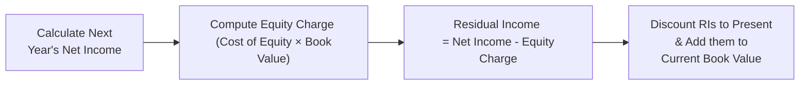
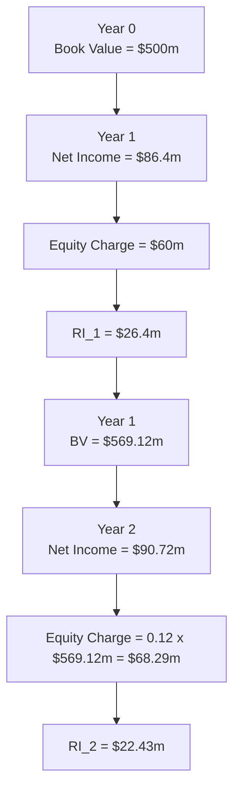

## Introduction

Residual income (RI) valuation models provide a framework for understanding how a firm’s intrinsic value can be viewed as the sum of its book value and the present value of all future residual incomes. They can be powerful tools to see if a company’s current market price stacks up against its fundamental value buzz. But I’ll admit it: the first time I saw the formula, I remember thinking, “Isn’t this just another variation of discounting future cash flows?” Well, it is and it isn’t. The unique angle here is that you start with an accounting measure—book value—and then layer in “residual” earnings based on the cost of equity.

What follows is a scenario-based practice vignette for a basic residual income calculation. We’ll walk through the conceptual underpinnings, drop in a few personal insights (I’ve definitely made mistakes in these calculations once or twice), and show you how small changes in growth or discount rates can reshape your entire analysis. Let’s get started.

## Key Concepts in Residual Income

Residual income can be broadly expressed using the following formula:


\text{RI}_t = \text{Net Income}_t \;-\; r_e \times \text{Book Value}_{t-1}


Where:
• \\(\text{RI}_t\\) is the residual income in year \\(t\\).  
• \\(\text{Net Income}_t\\) is the firm’s expected net income in year \\(t\\).  
• \\(r_e\\) is the firm’s cost of equity (often computed using CAPM or a build-up approach).  
• \\(\text{Book Value}_{t-1}\\) is the beginning-of-period book value of equity.

If the net income a firm generates exceeds the charge (i.e., equity charge) that shareholders demand, that excess is “residual income.” The company is producing returns above its cost of capital, and that’s good news for valuation.

Let’s use the following Mermaid diagram to visualize the process:



## The Vignette: NeoFlex, a Mid-Cap Technology Firm

Imagine—well, it might not be too hard to imagine—a mid-cap tech company called NeoFlex. They’ve been pivoting into AI-based solutions, their net income is fairly stable, but they’re aiming for moderate growth. We have the following information:

• Current Book Value of Equity (\\(BV_0\\)): \$500 million  
• Current Net Income (\\(NI_0\\)): \$80 million  
• Expected Growth of Net Income (Year 1): 8%  
• Stable Long-Term Growth After Year 1: 5%  
• Cost of Equity (\\(r_e\\)): 12%  
• Dividend Payout: 20% of net income each year  

### A Quick Refresher on the Dividend Payout

When a company pays dividends, the book value for the next period is adjusted by net income minus dividends. Because the payout ratio is 20%, the rest (80%) is retained and presumably plowed back into the firm to generate future growth. Over time, we track how these items play out.

## Step 1: Estimating Next Year’s Residual Income

First, we want next year’s net income. Next year is projected to grow by 8%:


NI_1 = NI_0 \times (1 + 0.08) = 80 \times 1.08 = \$86.4 \text{ million}


The equity charge for year 1 is:


\text{Equity Charge}_1 = r_e \times BV_0 = 0.12 \times \$500 \text{ million} = \$60 \text{ million}


So, the residual income for year 1:


\text{RI}_1 = NI_1 \;-\; \text{Equity Charge}_1 = 86.4 - 60 = \$26.4 \text{ million}


Just like that, you can see NeoFlex’s next year’s net income is well above the equity cost, meaning the firm is generating positive residual income.

## Step 2: Assessing Growth and Future Residual Incomes

After year 1, the company’s net income grows at 5% indefinitely (according to the scenario). Because a portion of net income (80%) is retained, the book value will keep inching upward, leading to incremental changes in the equity charge. For a simple approach, though, we might assume that the book value grows proportionally with net income (especially over a long horizon), or we calculate each year’s opening book value more precisely:


BV_1 = BV_0 + (NI_1 - \text{Dividends}_1)



\text{Dividends}_1 = \text{Payout Ratio} \times NI_1 = 0.20 \times 86.4 = \$17.28 \text{ million}



BV_1 = 500 + (86.4 - 17.28) = 500 + 69.12 = \$569.12 \text{ million}


We’d continue that logic to get \\(BV_2\\), \\(BV_3\\), etc. Meanwhile, net income for year 2 would be:


NI_2 = NI_1 \times (1 + 0.05) = 86.4 \times 1.05 = \$90.72 \text{ million}


But let’s not get lost in the weeds. The essential question remains: do these incremental net incomes keep generating positive residual income over time, and if so, how do we discount them back to the present?

## Step 3: Discounting Future Residual Income and Adding to Book Value

The typical residual income valuation formula can be summarized as:


\text{Value}_0 = BV_0 + \sum_{t=1}^{\infty} \frac{RI_t}{(1 + r_e)^t}


So we take each year’s residual income, discount it at 12%, and add the present value to today’s book value of \$500 million. When the growth rate is lower than the cost of equity (5% < 12%), the present values converge. 

If you wanted all the details in a more mechanical sense, it might look like this in Python:

```python
r_e = 0.12
BV = 500.0
net_income = 80.0
growth1 = 0.08
growth_long_term = 0.05
payout_ratio = 0.20

ri_values = []
present_values = []
num_years = 5  # Suppose we do a 5-year forecast + terminal assumption

for t in range(1, num_years + 1):
    if t == 1:
        net_income *= (1 + growth1)
    else:
        net_income *= (1 + growth_long_term)
    equity_charge = BV * r_e
    ri = net_income - equity_charge
    # discount residual income t years back
    pv_ri = ri / ((1 + r_e) ** t)
    ri_values.append(ri)
    present_values.append(pv_ri)
    
    # update Book Value for next period
    dividends = net_income * payout_ratio
    BV += (net_income - dividends)

valuation = 500 + sum(present_values)
print(f"Estimated Value: ${valuation:,.2f}")
```

In practice, we often use a continuing, perpetual formula for the tail end beyond our forecast horizon. If the stable long-term growth is \\(g\\) and cost of equity is \\(r_e\\), the continuing RI can be capitalized as:


\frac{RI_{n+1}}{r_e - g}


…and you discount that terminal value back as well.

## Step 4: Clean Surplus Considerations

In a perfect world, net income and dividends are the only changes to book value—i.e., the “clean surplus.” But let’s say you discover intangible write-offs that bypass net income or some foreign currency translation losses that are recognized only in Other Comprehensive Income (OCI). You’d then need to adjust your net income to reflect the “dirty surplus” elements. If the problem specifically states anything about intangible or off-balance-sheet items, you either incorporate them into net income or adjust your book value at the appropriate times. But if no details are given, you can safely assume the clean surplus relation holds. 

## Step 5: Interpret the Intrinsic Value

Let’s say your sum-of-the-present-value-of-RI plus current BV ends up at \$750 million. If NeoFlex’s market capitalization is only \$680 million, there’s a decent chance the stock is undervalued. Or maybe it’s overvalued if the number you get is below the market cap. That’s the essential question you need to answer: does the “fair” or intrinsic value of the firm exceed or lag behind the actual market?

## Impact of Small Changes

We can’t stress enough: small changes in your discount rate or growth assumptions can create big shifts.

– If \\(r_e\\) changes from 12% to, say, 11.5%, the difference might sound minuscule, yet the present values can balloon.  
– If your net income growth is just 6% instead of 5%, that’s a 20% relative increase in the growth rate for that stable phase, and that can push your valuation up.  

That’s why you want to run scenario and sensitivity analyses. I remember messing up a decimal in the growth input—turning 5% into 50%—and the resulting valuation was so large that it was obviously out to lunch. Always double-check your decimals, exponents, and your cost of capital entries.

## Best Practices Using Residual Income Models

• Normalize Metrics: Ensure net income is truly representative of ongoing operations. One-time gains or losses can skew your base.  
• Confirm Growth Assumptions: Be realistic. For a mature industry, a perpetual growth rate above 6% might be tough to justify.  
• Cross-Check Book Values: Watch how dividends are subtracted out of book value. Over time, the book value is often your anchor in the RI approach.  
• Compare Against Other Measures: DDM or FCFE valuations can complement RI. It can really open your eyes if the valuations converge or diverge.  
• Adjust for “Dirty Surplus” Items: If you see large foreign currency translation adjustments, pension cost remeasurements, or intangible write-offs that bypass net income, factor them in.  

## Example Table: Multi-Year Residual Income Computation

Below is a simplified sample of how you might table out the calculations for the first two years:

| Item                                   | Year 0           | Year 1                                | Year 2                                     |
|----------------------------------------|------------------|----------------------------------------|--------------------------------------------|
| Beginning Book Value (\$ millions)     | 500.0            | 500.0                                  | 569.12*                                    |
| Net Income (\$ millions)              | 80.0**           | 86.4 (80 × 1.08)                       | 90.72 (86.4 × 1.05)                        |
| Dividends (\$ millions) (20% payout)  | –                | 17.28                                  | 18.14                                      |
| Equity Charge (\$ millions)           | –                | 60.0 (0.12 × 500)                      | 68.29 (0.12 × 569.12)                      |
| Residual Income (\$ millions)         | –                | 26.4 (86.4 – 60.0)                     | 22.43 (90.72 – 68.29)                      |
| Ending Book Value (\$ millions)       | 500.0            | 569.12 (500.0 + 86.4 –17.28)           | 641.70 (569.12 + 90.72 – 18.14)            |

* Computed as 500 + (86.4 – 17.28).  
** This is the “current” net income (not used in the next year’s RI except to grow to 86.4 in Year 1).

Notice how the equity charge changes each year as book value changes. Residual income can either climb or slip, depending on the growth in net income relative to the growth in the equity charge.

## Quick Mermaid Diagram of the Multi-Year Flow



## Wrapping Up: The Residual Income Valuation

To wrap it all together, you’d discount each RI at 12%, sum them up, and then add \$500 million (the original book value). That final figure is your “intrinsic” estimate. Compare it to the actual market value or price. If your final number is higher, it might signal that the market is placing too low a value on the company’s ability to generate returns above its cost of equity. If it’s lower, the market might be overly optimistic about the firm’s prospects.

## Practical Tips for the Exam

• Time Management: On the exam, you’ll see a small table of data— be sure to label your cost of equity, net income, and book value carefully.  
• Vignette Cues: The prompt might subtly point to a dirty surplus item. Don’t ignore intangible write-offs or translations!  
• Easy Points: The question asking for next year’s RI is usually straightforward. Don’t overcomplicate it—stick to the formula.  
• Sensitivity: If they ask a “what if” question—like “what if cost of equity changes to 10%?”— be prepared to redo the discount factor quickly in your head (or on your approved calculator).  
• Show Your Steps: In a real practice environment, or in your personal note-taking, detail your steps. This helps catch silly arithmetic slip-ups.

## References and Further Reading

• Pinto, Jerald E., Elaine Henry, Thomas R. Robinson, and John D. Stowe. “Equity Asset Valuation, 4th Edition.”  
• Henry, Elaine, and Thomas R. Robinson. “Analysis of Equity Investments: Valuation.”  
• Penman, Stephen H. “Financial Statement Analysis and Security Valuation.”  

They offer deeper insights, more advanced examples, and nuanced discussions about dirty surplus issues, intangible assets, and other real-world complexities.

## Test Your Knowledge: Basic Residual Income Calculations



### Underlying Logic of Residual Income
- [ ] Residual income is simply the firm’s net EBITDA in any given year.
- [x] Residual income is net income minus the equity charge.
- [ ] Residual income focuses on operating costs and excludes labor costs.
- [ ] Residual income only applies if dividends are zero.

> **Explanation:** The fundamental idea is that residual income equals net income minus (cost of equity × beginning book value).

### Calculating Equity Charge
- [ ] Cost of equity divided by net income.
- [x] Cost of equity multiplied by beginning book value of equity.
- [ ] Next year’s dividends multiplied by cost of equity.
- [ ] The change in book value over time.

> **Explanation:** The equity charge is the cost of equity times the beginning book value of shareholders’ equity for that period.

### Significance of a Positive RI
- [x] It implies the firm generates returns above its required cost of equity.
- [ ] It indicates the firm has no need for external financing.
- [ ] It means dividends are necessarily increasing.
- [ ] It ensures the firm’s share price will rise immediately.

> **Explanation:** Positive RI means the firm’s net income surpasses the equity charge, typically a sign of value creation.

### Long-Term Growth vs. Cost of Equity
- [ ] If long-term growth equals cost of equity, residual income is maximized.
- [ ] If long-term growth < cost of equity, residual income turns negative.
- [x] If long-term growth < cost of equity, the residual income’s present value converges over time.
- [ ] If long-term growth > cost of equity, the model always breaks down immediately.

> **Explanation:** As long as growth is less than the cost of equity, the present value of residual income over many years converges to a finite sum.

### Clean Surplus Relationship
- [ ] Exists when net income includes stock splits directly in revenue.
- [x] Exists when changes in book value are driven only by net income minus dividends.
- [ ] Is violated if the firm issues new shares.
- [ ] Occurs only if intangible assets are zero.

> **Explanation:** The clean surplus states that ending book value = beginning book value + net income – dividends, absent any bypass events in “Other Comprehensive Income.”

### Year 1 Residual Income for NeoFlex
- [ ] RI1 = 80 – 12% × 500
- [ ] RI1 = 80 × 1.08 + 500
- [x] RI1 = (80 × 1.08) – (500 × 0.12)
- [ ] RI1 = 80 + (500 × 0.08)

> **Explanation:** Next year’s net income is 80 × 1.08, and the equity charge is 500 × 0.12.

### Impact of Dividend Payout on Book Value
- [ ] High dividend payouts increase the book value.
- [ ] Dividend payout has no effect on future book value in RI models.
- [x] Payout reduces the amount reinvested, thus lowering future book value growth.
- [ ] Payout ratio is irrelevant when computing residual income.

> **Explanation:** Dividend distributions directly reduce the firm’s retained earnings and hence slow the growth in book value.

### Terminal Value in RI Valuation
- [ ] There is no terminal value concept in residual income models.
- [ ] It is computed as (Book Value ÷ cost of equity).
- [ ] Terminal value is computed by dividing residual income by growth.
- [x] Terminal value can be estimated as RI in the next period divided by (r_e – g), then discounted back.

> **Explanation:** We often handle the tail end of an RI model by using the perpetuity approach of capitalizing the stabilized residual income.

### Interpretation of Valuation
- [ ] If RI-based value is higher than market price, the firm is clearly insolvent.
- [ ] If RI-based value is lower, the firm is never profitable.
- [ ] The model doesn’t allow you to compare with market price.
- [x] If RI-based estimate is higher, the firm could be undervalued.

> **Explanation:** The logic is to see if the firm’s fundamental intrinsic value indicated by residual income is above or below the market’s valuation.

### True or False: Residual Income Equals Dividends per Share
- [ ] True
- [x] False

> **Explanation:** Residual income and dividends are distinct. Dividends represent the actual cash payout, whereas RI is earnings above the equity charge.


