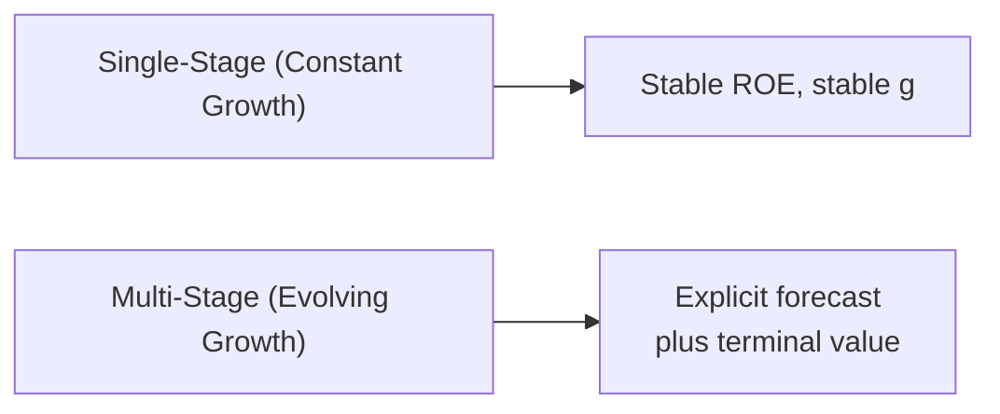

## Understanding Residual Income

Residual income (RI) is often described as what’s left over after covering the shareholder’s “cost of equity.” In more formal terms, residual income for a given period is:


\mathrm{RI}_t = \mathrm{Net~Income}_t - r \times \mathrm{Book~Value}_{t-1}


Here, r is the cost of equity, capturing the return investors expect for the risk they’re taking. If a firm generates net income above that required return, it has “residual” gains that boost intrinsic value.

I remember the first time I applied an RI model. Honestly, I was helping a friend evaluate a small chain of coffee shops—quite the local hotspot. You’d think coffee shops would be all about fancy cappuccinos, but the residual income approach gave us an insider’s look at how they produced returns beyond shareholders’ expectations. That’s the magic of RI: it peels away the fluff and focuses on value created or destroyed relative to equity capital.

## Single-Stage Residual Income Model

A single-stage residual income model assumes that growth (in earnings, payouts, and book values) continues at a constant rate forever. This approach is straightforward—though it can be a bit of a stretch for rapidly changing or newly public companies.

When we say “single-stage,” we often assume:

• A stable return on equity (ROE).  
• A stable retention rate (or a stable payout ratio).  
• A constant growth rate (g).  
• A constant cost of equity (r).

Under these assumptions, the intrinsic value of equity today can be approximated by:


V_0 = B_0 + \frac{(ROE - r)\,B_0}{(r - g)}


• \\( B_0 \\): Current book value per share.  
• \\( ROE \\): Return on equity.  
• \\( r \\): Cost of equity.  
• \\( g \\): Perpetual growth rate of residual income.

Essentially, \\(B_0\\) is the baseline value (the book value of equity right now). The fraction \\(\frac{(ROE - r)\,B_0}{(r - g)}\\) captures the present value of all future residual income, assuming it grows at a constant rate g.

### Simple Numeric Example

Suppose:

• \\( B_0 = 100 \\)  
• \\( ROE = 12\% \\)  
• \\( r = 10\% \\)  
• \\( g = 4\% \\)

Using the single-stage formula:

1. Calculate the equity “spread”: \\( ROE - r = 0.12 - 0.10 = 0.02 \\) (2%).  
2. Multiply by the current book value: \\( 0.02 \times 100 = 2 \\).  
3. Divide by \\((r - g)\\): \\( 0.10 - 0.04 = 0.06 \\).  
4. Therefore, the present value of future RI = \\( \frac{2}{0.06} = 33.33 \\).  
5. Add \\( B_0 \\): \\( 100 + 33.33 = 133.33 \\).

So the total estimated intrinsic value is approximately 133.33 per share. Notice how a modest 2% spread can lead to significant added value when g is near r.

### Best Situations for Single-Stage

• The firm is mature, with stable earnings growth and a predictable payout policy.  
• The industry has reached relatively steady competition—like many utilities or established consumer staples.  
• Analyst resources are limited, and a rough but quick measure is needed.

## Multi-Stage Residual Income Model

Life is rarely that simple (or constant). Firms face evolving competitive pressures, shifting capital structures, and changes in product demand. That’s where the multi-stage RI model shines.

In a multi-stage approach, you forecast residual income explicitly for several years—maybe a high-growth phase—then apply a continuing or terminal value for the stable phase afterward. Conceptually, you split the valuation timeline like so:

1. High-Growth Phase: Forecast residual income year by year, when ROE and growth may be relatively high.  
2. Transition Phase: Gradually settle into a more modest ROE and growth.  
3. Stable/Continuing Phase: Assume a constant (or near-constant) growth in perpetuity, similar to the single-stage model.

Mathematically, the multi-stage formula extends the summation of discounted RI terms and then attaches a terminal value. Typically, you’ll see something like:


V_0 = B_0 + \sum_{t=1}^{T} \frac{\mathrm{RI}_t}{(1+r)^t} + \frac{\mathrm{TV}_T}{(1+r)^T}


where:


\mathrm{RI}_t = E_t - r \times B_{t-1}


TV\\(_T\\) is the terminal value at the end of year \\(T\\) based on a single-stage formula or another assumption of stable growth:


\mathrm{TV}_T = \frac{\mathrm{RI}_{T+1}}{r - g_{\mathrm{stable}}}


### Visual Flow

Below is a simple Mermaid diagram illustrating how single-stage and multi-stage concepts branch out. It’s a bit of a minimalist view, but it highlights the differing perspectives:



### Practical Multi-Stage Example

Imagine a tech company in its early growth years. Suppose:

• For the first 3 years, ROE is 18% and grows quickly. After that, it stabilizes to 12%.  
• The cost of equity (r) is 10%.  
• Book value is 100 initially.  
• We project net income, book value, and use these to calculate residual income year by year for three years. Then, from year 4 onward, we assume a stable scenario.

Let’s illustrate a hypothetical (simplified) forecast snippet:

Year 1:  
• Book value at the start: 100.  
• Projected net income: 18.  
• Equity charge: \\(0.10 \times 100 = 10\\).  
• RI = \\(18 - 10 = 8\\).  
• Present Value of RI: \\(\frac{8}{1.10}\approx 7.27\\).  
• End-of-year book value: \\(B_1 = 100 + (18 - \text{dividends})\\). Suppose a 0% payout to fuel growth, so \\(B_1 = 118\\).

Year 2:  
• Book value at the start: 118.  
• Net income: \\(\text{ROE} \times 118 = 0.18 \times 118 \approx 21.24\\).  
• Equity charge: \\(0.10 \times 118 = 11.8\\).  
• RI = \\(21.24 - 11.8 \approx 9.44\\).  
• Present Value of RI: \\(\frac{9.44}{1.10^2} \approx 7.80\\).  
• End-of-year book value: \\(B_2 = 118 + (21.24 - 0) = 139.24\\).  

Continue similarly for Year 3. Then at Year 4, we assume the firm’s ROE transitions to 12%, with a stable growth of, say, 4%. You’d compute the terminal value and discount it all back. It can be a bit tedious by hand, but that’s precisely why we rely on either spreadsheets or quick Python scripts.

#### Quick Python Example

Below is a tiny illustration of how you might sum up the residual incomes in Python:

```python
import math

r = 0.10  # cost of equity
initial_book = 100
ROE_high = 0.18
years_high = 3
ROE_stable = 0.12
g_stable = 0.04

book_value = initial_book
pv_ri = 0
for t in range(1, years_high+1):
    net_income = ROE_high * book_value
    equity_charge = r * book_value
    ri = net_income - equity_charge
    pv_ri += ri / ((1 + r) ** t)
    book_value += net_income  # assume zero dividend for simplicity

ri_year4 = (ROE_stable * book_value) - (r * book_value)
tv = (ri_year4 * (1 + g_stable)) / (r - g_stable)  # continuing value from year 4 onward
pv_tv = tv / ((1 + r) ** years_high)

value_est = initial_book + pv_ri + pv_tv
print(f"Value Estimate: {value_est:.2f}")
```

Depending on your numbers, this yields a certain total value that might exceed what a single-stage model would project for a fast-growing tech firm. The multi-stage approach better captures the spike in early years.

## Choosing Between Single-Stage and Multi-Stage

Sometimes you might say, “Uh, sure, but which one do I pick?” The choice often depends on how stable the firm’s operations are:

• If the firm’s in a stable industry with consistent margins (like some big consumer goods or utilities), a single-stage model can be perfectly fine.  
• If the firm’s still navigating big expansions or reorganizations—like biotech exploring new patents or a social media startup scaling user base—a multi-stage model is usually more realistic.

## Key Assumptions and Consistency

Regardless of the model you choose, be consistent:

• Align your ROE, cost of equity, and growth rate assumptions.  
• Don’t assume a 20% ROE forever if your cost of equity is just 8% with a stable economy—this could lead to overvaluing.  
• Carefully reflect new capital injections or share buybacks in book value forecasts.  
• Revisit inflation assumptions, especially if you’re modeling over many years.  

## Sensitivity Analysis

RI models can be sensitive to small changes in:

• The cost of equity (r).  
• Growth rate (g).  
• ROE estimates.

Try tweaking each assumption by, say, ±1% to see how drastically the final valuation changes. If a slight change in r or g leads to wild swings, it’s a good clue that your modeling or assumptions may be too aggressive or uncertain.

## Common Pitfalls and Best Practices

• Overly Optimistic Growth: Especially in multi-stage models, it’s tempting to assume high growth for too long.  
• Ignoring Off-Balance-Sheet Items: Make sure your book value is correct—underestimating liabilities can inflate your numbers.  
• Mishandling Terminal Value: Terminal value can make up a big chunk of total value. Small errors can be huge in final valuations.  
• Mistimed Residual Income Calculations: Watch out for whether you’re using beginning-of-period vs. end-of-period book values consistently.

## Exam Tips and Wrap-Up

• Practice setting up different growth phases carefully. The exam will likely give you data for multiple periods and test your ability to forecast net income, book value, and RIs step by step.  
• Keep your timeline clear—mixing up year-end or year-beginning can lead to confusion.  
• Label each step in calculations so you can easily check your work.  
• Watch for hidden data in vignettes, like an upcoming expansion or a share repurchase. Those details might impact your book value or cost of equity.  
• Time constraints matter: master the quick approach for single-stage on stable companies, but be ready to pivot to multi-stage logic if the vignette indicates variable growth.

Residual income valuation is incredibly powerful. It complements other equity models (like FCFE or Dividend Discount Models) by focusing on how net income surpasses (or falls short of) the equity cost. In a sense, it’s all about whether the firm creates genuine economic profit for its shareholders.

## References and Further Reading

• CFA Institute Level II Curriculum (Residual Income Readings)  
• Damodaran, A. (2012). “Investment Valuation: Tools and Techniques for Determining the Value of Any Asset.”  
• Koller, T., Goedhart, M., & Wessels, D. (2020). “Valuation: Measuring and Managing the Value of Companies.”  
• NYU Stern’s website (Real-world data sets and modeling examples): http://pages.stern.nyu.edu/~adamodar/

---

## Test Your Knowledge: Single-Stage vs. Multi-Stage Residual Income Models



### A company’s residual income for a year is best described as:
- [ ] Net Operating Profit After Taxes (NOPAT) minus Weighted Average Cost of Capital times total capital
- [x] Net Income minus the cost of equity charge on the beginning book value
- [ ] Net Income plus dividends paid
- [ ] Free Cash Flow minus taxes

> **Explanation:** Residual income is net income minus the cost of equity multiplied by the beginning book value of equity.  

### Which of the following conditions supports using a single-stage RI model?
- [ ] Rapidly changing business model with uncertain margins
- [ ] Company about to embark on a major acquisition
- [x] Stable growth rates, constant ROE, and predictable payout
- [ ] Extraordinary items and one-time events each quarter

> **Explanation:** A single-stage RI model is more appropriate for firms in a stable environment with predictable growth and payout patterns.  

### According to the multi-stage RI approach, the terminal value (TV) is usually computed:
- [ ] At the beginning of the high-growth phase
- [ ] Using the free cash flow to equity after Year 1
- [ ] Using a negative growth rate for perpetuity
- [x] After explicitly forecasting RI for several years, then applying a stable growth assumption

> **Explanation:** In the multi-stage model, you forecast a series of RI values, then you apply a continuing value for the stable growth phase.  

### An analyst observes Company X’s cost of equity is just slightly higher than its ROE. Under a single-stage RI framework, the firm’s value premium (over book value) would likely be:
- [ ] Very large
- [x] Negative or very small
- [ ] Equal to net income
- [ ] Indefinite and rapidly growing

> **Explanation:** If ROE is less than or near the cost of equity, residual income is low or negative, so the premium over book value is small or negative.  

### When performing a multi-stage RI analysis, which one of these steps is critical?
- [x] Projecting book value changes each year to incorporate net income and dividends
- [ ] Ignoring the cost of equity in later years
- [ ] Using the same net income figures for all years
- [ ] Keeping net income fixed for the terminal value

> **Explanation:** You must adjust book value each year based on net income and dividends to properly calculate residual income.  

### If you see the phrase “equity charge” in a residual income context, it specifically refers to:
- [ ] Dividends paid to common shareholders
- [x] The cost of equity multiplied by the beginning book value
- [ ] The amount of interest on long-term debt
- [ ] Operating margin multiplied by total equity

> **Explanation:** Equity charge is the cost of equity times the beginning book value of equity.  

### Which statement is the most likely limitation of the single-stage RI model?
- [ ] It allows negative growth rates
- [x] It assumes constant growth indefinitely, which might be unrealistic for many firms
- [ ] It overcomplicates residual income calculations
- [ ] It always ignores the payout ratio

> **Explanation:** Single-stage models assume a stable long-term growth rate forever, which may not reflect reality for firms in dynamic industries.  

### In a multi-stage RI model, the firm’s final continuing value is based on:
- [ ] ROE entirely ignoring the cost of equity
- [ ] Net income plus capital expenditures
- [x] Residual income in the terminal year (or the following year) capitalized using a stable growth formula
- [ ] Dividends and share repurchases only

> **Explanation:** The terminal value is based on a perpetuity formula of the residual income at the end of the forecast horizon, assuming some stable growth.  

### How does a higher cost of equity (r) generally affect residual income valuation?
- [ ] Increases the present value of all future residual income
- [ ] Leaves the value unaffected
- [x] Reduces the present value of forecasted RI and can lower the firm’s total valuation
- [ ] Eliminates terminal value

> **Explanation:** A higher discount rate reduces the present value of future residual income, often decreasing overall valuation.  

### A significant advantage of the multi-stage RI method compared to single-stage is:
- [x] It can capture different growth phases before settling to a stable phase
- [ ] It requires fewer assumptions about growth in the near term
- [ ] It’s simpler to implement with minimal data
- [ ] All companies must use a multi-stage approach under IFRS

> **Explanation:** Multi-stage models are flexible enough to incorporate an initial high-growth or transitional phase before assuming a stable long-term growth rate.  


