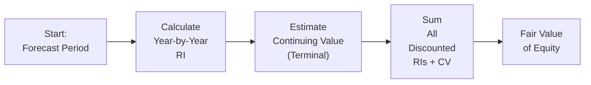

## Overview
Residual income (RI) valuation is all about capturing how much economic profit (i.e., returns in excess of the cost of equity) a company generates. But here’s the thing: once you’ve modeled all those annual projections out five or ten years, you still have a lot of value left to account for. That’s where continuing residual income—or terminal value—comes into play. It’s easy to think, “Hey, we’ve covered five years. Shouldn’t that be enough?” But if the company is still thriving and generating above-average returns beyond year five or six, we have to capture that. 

Anyway, let’s walk through the concept of continuing residual income, chat about how we estimate that terminal value, and then tie it all together with a quick example. We’ll finish with some key best practices, a practical hint or two, and a short quiz. Sound good?

## The Concept of Continuing Residual Income
Continuing residual income refers to the chunk of a company’s RI that continues beyond the explicit forecast period. Let’s say you’ve already forecasted annual RI for five years. You probably suspect the company’s going to stick around after that, right? It’s not like the lights go out when your spreadsheet says Year 6. More likely, the firm will either keep generating some level of excess return or settle into a “normal” equilibrium where ROE equals the cost of equity. 

In residual income terms, we measure:
• Residual Income (RI) for each forecast year → Summed up as the “explicit” forecast period.  
• Continuing Residual Income → Captures everything beyond the last explicitly forecasted year.

This continuing portion is typically discounted (like any future cash flow) back to present value, producing a terminal (continuing) value that we can plop into our model. And that’s a big chunk of how the final equity value is determined.

## Terminal Value in Residual Income Valuation
The phrase “terminal value” is just fancy talk for the present value of any expected abnormal earnings or residual income after you finish your explicit period forecasts. Since the CFA curriculum emphasizes that abnormal returns can fade over time—thanks to competition, new entrants, or just the diminishing advantage of a firm’s product or service—your estimate of terminal value should reflect how quickly that advantage disappears (if it does at all).

It’s not uncommon for the terminal value in a residual income model to represent more than half of the total valuation. If you have a high-growth or high-ROE company, it could be even more. So the method you use to estimate this continuing value can drastically change your final valuation.

## Approaches to Estimating Terminal Value
Three popular approaches to estimate continuing residual income (and thus terminal value) are:

1. Constant Growth Approach  
2. Multiple-Based Approach  
3. Fade Rate or Persistence Factor Approach  

### The Constant Growth Approach
One of the simplest ways to handle terminal value is to assume that after your explicit forecast, the company’s residual income grows at some constant (and typically small) rate, g, forever. So if RIₙ₊₁ is the first year’s residual income after your forecast period and r is your cost of equity, then the continuing value (CV) at time n is often estimated as:


\text{CV}_n = \frac{RI_{n+1}}{r - g}


Then you discount CVₙ back to the present at the cost of equity. Of course, it’s crucial that your assumed g < r. Otherwise, your denominator becomes very small or even negative, leading to an unrealistic (or infinite!) valuation.

### The Multiple-Based Approach
Sometimes, we don’t trust a single constant growth assumption—maybe the company’s in a cyclical industry, or we feel more comfortable with market comparables. Let’s say we use a price multiple, like P/E, to anchor our continuing value. The basic idea is:
• Forecast some measure of earnings or book value in the terminal year.  
• Multiply by a justified multiple (like an industry-average P/E or price-to-book).  

For instance, if you’re comfortable believing that in Year 5, the firm’s book value is B₅, and you see that comparable companies usually trade around, say, 1.5× book value, then you might estimate:


\text{CV}_5 = 1.5 \times B_5


Again, you’d discount that CV₅ back to the present. Make sure the multiple is plausible, consistent with your growth and return assumptions, and that the comparable set (or the multiple derived from it) remains valid for your company’s future profile.

### The Fade Rate or Persistence Factor Approach
A more nuanced way incorporates a “persistence factor,” often denoted ω, representing how quickly or slowly abnormal returns fade to zero or a normal level. If the firm’s abnormal returns are expected to fade gradually, you’d set ω in a range of (0,1). A higher ω means it retains its excess returns for a longer time (maybe due to patents, brand power, or so forth).

The commonly referenced Ohlson model for residual income uses a persistence factor to model how each year’s RI continues into the future. In practice, analysts often choose ω by:
• Looking at how other companies in the same industry see their returns revert.  
• Evaluating the competitive moats or regulatory protections that might hinder or accelerate fade rates.  

If a firm is especially vulnerable to competition, you’d make ω small because you expect its residual income advantage to disappear quickly.

## Example: Building a Multi-Stage Residual Income Model
Let’s do something simple, just enough to show how the continuing value is added in.

1. Forecast Period (Years 1 – 5):  
   • Book value at Year 0: $100.  
   • Cost of equity (r): 10%.  
   • Assume the firm generates RI of $12, $10, $8, $6, $4 in each of the next five years.  

2. Terminal Year Calculation:  
   Suppose we assume that after Year 5, the residual income stabilizes at $3 in Year 6 and grows 2% per year thereafter. That’s our constant growth assumption.  
   So, the continuing value at the end of Year 5 would be:

   
   \text{CV}_5 = \frac{RI_6}{r - g} = \frac{\!3}{0.10 - 0.02} = \frac{3}{0.08} = 37.50
   

3. Present Value of Forecasted RI (Years 1 – 5):  
   Discount each RI by (1 + 0.10)^t. For instance:  
   
   \text{PV of RI in Year 1} = \frac{12}{(1+0.10)^1} = 10.91\text{ (approx.)}
     
   You’d do this for each year’s RI and sum them.  

4. Present Value of CV₅:  
   
   \text{PV of CV}_5 = \frac{37.50}{(1+0.10)^5} = \frac{37.50}{1.61} \approx 23.27
   

5. Total Residual Income Value Add:  
   Add together all the PVs of forecasted RIs plus the PV of CV₅. Let’s call that sum $49. (Just an example number after you add 10.91 + 9.09 + 6.02 + 4.10 + 2.48 + 23.27, or something along those lines.)

6. Total Equity Value = Current Book Value + Sum of RI Value Add:  
   = $100 + $49 = $149.  

Of course, I might have some rounding or small mistakes in the arithmetic, but you get the picture. The big lesson is how that continuing value piece (CV) chunk can be quite large. In fact, about $23 of that $49 in total RI additions come from continuing value alone!

## Diagram: Visualizing the Steps
Below is a simple Mermaid flowchart (hey, I remember stumbling upon Mermaid diagrams once and thinking, “What in the world?” But it’s super handy!) that outlines the steps in a multi-stage residual income model:

## Key Best Practices and Pitfalls
• Stay Realistic on Growth. It’s tempting to assume high growth forever, but that can break your model quickly if g ≥ r.  
• Reconcile the ROE and Cost of Equity. If your final-stage ROE is still significantly above r, you’re implying an unrealistic perpetual competitive advantage.  
• Cross-Check with Multiples. Sometimes, the continuing value from a constant growth approach is out of line with real-world valuation multiples.  
• Avoid Double Counting. If you’re using a multiple-based approach for the terminal value, ensure you’re consistent about the definition (enterprise value vs. equity value, EBIT vs. net income, etc.).  
• Continuity in Assumptions. You can’t have your last forecast year show a 20% ROE and then instantly say your perpetual ROE is 10% the next year without a transition. That’s where fade rates help.  
• Sensitivity Analysis. Even small changes to the cost of equity or the growth rate can cause big swings in terminal value. Tread cautiously.  

## Practical Considerations and Real-World Scenarios
In actual practice, you might see a firm with:
• Patent-Driven Returns. Large pharmaceutical or tech companies can maintain abnormal returns until their patented drug or software is off-patent. This is a scenario for a higher persistence factor.  
• Regulatory Protections. Utilities might have stable returns for a while, but regulation also caps them.  
• Emerging Markets. Growth can be higher, but so is the required rate of return, plus volatility might be extreme.  

I recall once, a colleague insisted that a telecom company would keep a 25% ROE for 15 consecutive years. Sounded amazing but lacked competitive realism. In your exam (and in real life), you want to make sure your fade assumptions are aligned with the market’s competitive dynamics.

## Conclusion
Continuing residual income is just the leftover sauce at the end of your RI forecast—only it’s not a footnote. It usually contributes a sizable share of the valuation. Be precise about your assumptions, stay consistent with near-term forecasts, check with common sense and comparables, and remember that the cost of equity and growth interplay can drastically reshape a firm’s continuing value. 

At the end of the day, if you feel your terminal value is overshadowing everything else, just step back, trust your gut, and see if your assumptions pass the laugh test. If they do, fantastic. If not, maybe it’s time to revisit the fade rate, the cost of equity, or your unstoppable growth assumption.

## References
• Penman, S. (2012). Financial Statement Analysis and Security Valuation.  
• Damodaran, A. (2012). Online resources on terminal value: http://pages.stern.nyu.edu/~adamodar/  
• CFA Institute Level II Curriculum (Advanced Equity Valuation Topics)  

---

## Test Your Knowledge: Continuing Residual Income & Terminal Value



### Which best describes “continuing residual income” in a valuation model?

- [ ] The first forecast year’s net income.
- [x] Residual income expected after the explicit forecast horizon.
- [ ] The difference between free cash flow and net income.
- [ ] The initial book value multiplied by the cost of equity.

> **Explanation:** Continuing residual income refers to abnormal returns beyond the final year in the explicit forecast period.  

### In a residual income model, what is the main purpose of the persistence factor (ω)?

- [ ] To determine the dividend payout ratio.
- [x] To model how quickly or slowly abnormal returns fade.
- [ ] To measure the company’s payoff from intangible assets.
- [ ] To set a target ROE for the next fiscal period.

> **Explanation:** The persistence factor (ω) captures how quickly a firm’s abnormal returns revert to normal. A higher ω implies a longer persistence of excess returns.  

### If you assume a constant growth of continuing residual income with RIₙ₊₁ of $4, r of 12%, and g of 4%, which is the simplest calculation of continuing value at time n?

- [x] 4 / (0.12 – 0.04) = $50
- [ ] 4 / (0.12 + 0.04) = $22.22
- [ ] 4 × 0.04 / 0.12 = $1.33
- [ ] 4 / 0.04 = $100

> **Explanation:** The constant growth formula for terminal value is RIₙ₊₁ / (r – g). So you get 4 / 0.08 = 50.  

### Which statement is FALSE regarding the multiple-based approach to terminal value?

- [ ] It often uses a market-based multiple like P/E or P/B.
- [ ] It requires a relevant, comparable set of companies.
- [ ] It should discount the multiple-based terminal value.
- [x] It cannot be used if the firm has any abnormal returns.

> **Explanation:** You can use a multiple-based approach for terminal value whether or not the firm has abnormal returns. The approach simply uses an exit multiple applied to a financial metric, then discounts that figure back.  

### A company has a book value per share of $40 at the end of its explicit forecast period. If the analyst expects the firm to sell for 1.8× its book value at that time, how would you estimate terminal value using a multiple approach?

- [ ] (40 × 1.8) / (r – g)
- [ ] 40 × 0.8
- [ ] 40 / 1.8
- [x] 40 × 1.8 = $72

> **Explanation:** The terminal value under a multiple-based approach is simply the expected multiple times the relevant metric (in this case, book value). So 40 × 1.8 = $72.  

### Which of the following best reflects a high persistence factor (close to 1.0)?

- [x] The firm maintains excess returns longer, indicating strong competitive advantages.
- [ ] The firm’s ROE is below cost of equity immediately.
- [ ] The firm’s cost of equity is approaching 0%.
- [ ] The firm’s residual income is assumed to be negative in perpetuity.

> **Explanation:** A high persistence factor suggests that abnormal returns fade very slowly, consistent with strong competitive attributes.  

### Which approach to terminal value is most likely to assume a stable ROE eventually converging to the cost of equity?

- [x] Fade rate or persistence factor approach
- [ ] Multiple-based approach using revenue multiples
- [ ] Single-stage DDM
- [ ] Dividend payout ratio approach

> **Explanation:** The fade rate or persistence factor approach typically models how ROE moves closer to the cost of equity over time, reflecting diminishing competitive advantage.  

### In the Ohlson residual income framework, which item is typically subtracted to compute annual residual income?

- [x] The equity charge based on book value × cost of equity.
- [ ] The firm’s dividend payments made that year.
- [ ] Depreciation expense.
- [ ] The cost of debt times total assets.

> **Explanation:** Annual residual income = Net Income – (Book Value × Cost of Equity).  

### True or False: A multiple-based approach to terminal value should never be used in combination with a discounted residual income approach.

- [ ] True
- [x] False

> **Explanation:** You can definitely combine them. You compute residual income for the explicit period and then apply a multiple to some metric (like year-end book value or earnings) to get a final terminal value estimate.  

### Regarding continuing residual income, which statement is most accurate?

- [x] It often represents the majority of a firm’s total equity value in high-growth scenarios.
- [ ] It usually reflects only the next two years of abnormal returns.
- [ ] It is deducted from the final valuation to avoid double-counting.
- [ ] It is never discounted since it is assumed to be earned in perpetuity.

> **Explanation:** In many high-growth valuations, the terminal value (continuing RI) constitutes more than half of the total present value.  


