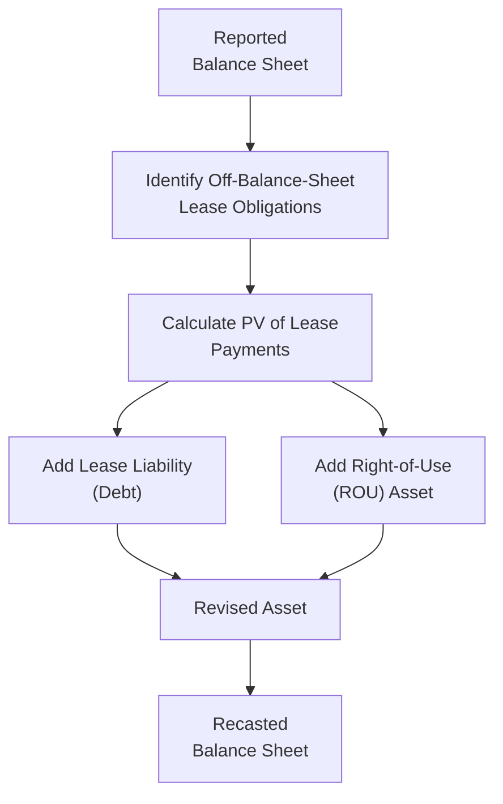

## Introduction

Well, if you’ve ever tried to value a company using residual income and felt a gnawing sense that something about the balance sheet just didn’t add up, you know exactly why we need to talk about off-balance-sheet items. These little hidden surprises—like operating leases, special purpose entities (SPEs), intangible assets not recognized in the standard accounts, or certain derivative exposures—can wreak havoc on your calculations. And in the context of residual income, which relies so heavily on an accurate measurement of book value and net income, ignoring them can lead to some pretty big miscalculations.

In this discussion, we’ll explore how to recast financial statements to reflect a company’s true economic standing. We’ll also see how these adjustments flow through into key metrics like return on equity (ROE) and residual income itself. And yes—trust me, we’ll definitely talk about best practices, common pitfalls, and the step-by-step process to help you feel more confident doing this on exam day (and in real life).

## Why Recasting Off-Balance-Sheet Items Matters

The residual income valuation framework hinges on the relationship:

Residual Income = Net Income − (Required Return on Equity × Beginning Book Value of Equity)

If the “Book Value of Equity” is incomplete or inaccurate (due to missing liabilities, unrecorded assets, or misclassified expenses), your residual income measure can be pretty far off. Maybe you end up overestimating ROE, or maybe your net income is understated or overstated because of how certain expenses (like operating lease rent) appear on the income statement. The big takeaway: adjusting for off-balance-sheet items often results in an increase in both assets and liabilities, which in turn affects net income, equity, and obviously your final valuation number.

## Key Off-Balance-Sheet Items

Let’s walk through some of the most common off-balance-sheet items you might encounter. The goal here is to get a sense of why each one matters, and how to handle it in a recast.

### Operating Leases
Under older standards (pre-IFRS 16 and pre-ASC 842 in US GAAP), companies were allowed to treat certain leases as “operating leases” and keep them off the balance sheet entirely. You’d only see a rent expense on the income statement each period. But in economic reality, these are financing arrangements, especially if the leases are long-term and the lessee is effectively controlling the asset. So, you wind up “capitalizing” them—recording a lease liability and a corresponding “right-of-use” asset—to reflect the present value of those future lease commitments.

### Special Purpose Entities (SPEs)
Sometimes a company transfers assets or liabilities to a separate entity (the SPE). The classic example is a securitization vehicle for mortgages or receivables. If not consolidated, the main company’s balance sheet can look a lot slimmer than its true economic position. Part of adjusting involves evaluating whether the sponsoring firm effectively “controls” the entity. If it does, you should bring the SPE’s assets and liabilities onto the main balance sheet. This can impact your calculations for equity, debt, and net income (especially if the SPE’s losses or gains should be consolidated).

### Employee Benefit Obligations
Sometimes pension or postretirement benefit liabilities only show up in the footnotes, especially if they’re severely underfunded. Failing to include them means ignoring a significant piece of the company’s future obligations. So, we might have to adjust the equity downward to reflect those additional liabilities, or restate the cost in net income to reflect the real economic cost of providing benefits.

### Derivative Exposures
Ever popped open a financial statement to see a note that says, “The notional amount of derivatives outstanding is $X billion,” but you only see a tiny derivative asset or liability on the balance sheet? That’s because the statement is typically showing fair value. If the derivative is significantly leveraged or if there are certain off-market terms, you may find that the fair value recorded on the balance sheet doesn’t fully capture the potential exposures. In practice, you’d evaluate what the derivative might do for net income or equity under different market conditions, possibly adjusting your forecasted variability for net income or the potential for future liabilities.

### Intangible Assets, Goodwill, and R&D
This is a sticky one. Certain intangible assets aren’t recognized if they’re internally generated, such as brand value or ongoing R&D. Even if recognized, intangible assets might be lumped into goodwill or identified intangible line items. On the flip side, if the intangible asset is genuinely an economic resource, ignoring it means understating both assets and equity (and possibly messing up the net income if it generates future revenue streams).

### Contingent Liabilities
Contingent liabilities—like pending litigation or regulatory fines—may sit entirely off the balance sheet if the outcome is “possible” but not “probable” or the amount is not reasonably estimable. Nonetheless, from a valuation standpoint, we often try to incorporate an expected or probability-weighted cost. If the risk is substantial, ignoring it can drastically inflate your equity or misrepresent net income.

## Recasting Step-by-Step

Let’s say you have to recast a company’s balance sheet to reflect operating leases as debt. The general steps:

• Identify: Find all relevant disclosures in the footnotes (lease commitments, maturity schedules, discount rates).  
• Capitalize: Calculate the present value of remaining lease payments as if the lease were a financed asset purchase. You add the right-of-use asset to the asset side and the corresponding lease liability to the liabilities side.  
• Adjust Net Income: Instead of showing the full lease payment as an operating expense, you’ll typically show interest expense on the newly recognized debt portion and amortization of the leased asset. This changes your EBITDA, operating income, and sometimes net income.  
• Update Equity: If there’s an immediate impact on retained earnings (for instance, from reclassification or from a reevaluation of prior expenses), you adjust equity as needed.  
• Recalculate Ratios: This is crucial for your residual income model. Your revised equity, net income, and interest expense can alter ROE, WACC, and even certain coverage ratios.  

Of course, you’d then replicate the same general approach for other items. For employee benefits, for instance, you might incorporate any underfunded portion into liabilities and reduce equity by that same amount. For intangible assets, you’d need to examine if recognized intangible assets are fairly valued, or if an unrecognized intangible is substantial enough to factor into the valuation.

## Integrating Adjustments into Residual Income Models

Recasting gets you to a more economically valid book value of equity. Then, you incorporate that recast figure into your residual income formula:

Residual Income = Adjusted Net Income − (Required Return × Adjusted Equity)

A big reason this is so critical: The residual income approach is sensitive to small changes in ROE assumptions or the book value. If your net income is suddenly adjusted to reflect the new interest expense from capitalized leases, your ROE will shift. Perhaps your equity base goes up or down. These changes can directly influence whether you see a positive or negative residual income in each forecast period.

### Adjusting ROE After Recasting

Let’s imagine your original statements show:
– Net Income: \$100 million  
– Book Equity: \$1,000 million  
– ROE = 10%

Now suppose you identify an off-balance-sheet operating lease that, once capitalized, increases assets and liabilities by \$200 million. After the recast, let’s say net income drops (due to a shift from rent expense to higher depreciation and interest) to \$95 million, but your total equity is also revised. Maybe you find that the opening equity stays roughly \$1,000 million because you recognized a leased asset offset by a lease liability. However, if, for instance, past lease expenses had been understated, you might reduce retained earnings by \$10 million. So your “corrected” equity is \$990 million.

Then the new ROE is about 9.6% (i.e. \$95 / \$990). While that doesn’t seem like a massive difference, over multiple periods in a discounted residual income framework, the sum of the differences can be significant and might materially change your valuation conclusion.

## Example of Operating Lease Capitalization

Let’s illustrate with a super-simplified approach. Suppose Company A has:

• Annual operating lease payment: \$50 million (for 5 years)  
• Discount rate for the lease: 6%

You find in the footnotes that these are the only lease commitments. You want to capitalize them as if they’re financed purchases. The present value (PV) of an annuity of \$50 million for 5 years at 6% is something like \$210.35 million (exact figure depends on your exact discounting approach).

So, you’d add roughly \$210 million to both assets and liabilities. You’d reduce the operating expense by \$50 million each year and instead record interest expense plus depreciation. The interest expense in the first year is (6% × \$210 million) = \$12.6 million, plus, say, straight-line depreciation of \$42.07 million (the PV divided evenly over 5 years). That sums to \$54.67 million—slightly higher than the \$50 million in rent. Over time, the interest expense will decrease as you “repay” the liability portion, so total expense might end up fairly close to \$250 million in present value terms. But the timing and classification of the expense changes, meaning net income, operating income, and EBITDA shift in ways you need to carefully reflect in your forecast.

## Best Practices and Common Pitfalls

• Always Document Assumptions: Central to your credibility—as well as to compliance with the CFA Institute Code and Standards—is to clearly outline how you arrived at each adjustment. If you’re capitalizing a lease, show your discount rate, lease payment schedule, and the math.  
• Don’t Just Stop at the Balance Sheet: The recast has a ripple effect on the income statement (interest, depreciation vs. rent) and possibly on the cash flow statement (classifying lease payments as financing outflows rather than operating outflows).  
• Watch Out for Double Counting: If the financial statements already partially incorporate certain intangible assets or lease liabilities, be careful not to double-count them.  
• Evaluate Materiality: If an off-balance-sheet item is trivial relative to the company’s size, a full-blown recast may not be worth your time. But do keep exam context in mind—if the item appears in a vignette, it’s probably relevant.  
• Weighted-Average Cost of Capital (WACC) vs. Required Return on Equity (r): Analyze how the capital structure might shift after the recast. If newly recognized debt significantly alters the firm’s leverage, that might also affect the cost of equity.  

## Visualizing the Adjustment Process

Below is a simple Mermaid diagram that shows how we might recast an operating lease onto the balance sheet:

The final step (G) is your recasted balance sheet that accurately reflects the lease asset and lease liability.

## Conclusion

I remember the first time I tried to do a recast: I got so lost in the footnotes that I considered ordering myself a double espresso somewhere around midnight. But after you walk through it a few times—looking up those lease tables, discounting each payment, adjusting net income, checking how the changes flow through the statements—it starts to feel much more approachable. And, from a valuation perspective, the payoff is huge because you’re capturing the real financial picture.

On the Level II exam, you might see a vignette with tricky footnotes about convertible leases or intangible assets that have an indefinite useful life. The key is to read carefully, recast systematically, and incorporate your revised figures into the residual income model. Document your assumptions, watch out for double counting, and you’ll be in good shape. 

Remember, the main reason we’re doing all of this is to avoid an artificially inflated (or deflated) equity figure, which can ruin your entire calculation of residual income. So, give off-balance-sheet items the attention they deserve, because you don’t want those hidden liabilities to come back and bite you—or cause you to misprice a stock you’ve worked so hard to analyze.

## Final Exam Tips

• Master the Footnotes: The exam will often hide or bury the info you need in footnotes or disclosures. Go straight to those sections for data on leases, guarantees, or litigation.  
• Use Your Time Wisely: If an off-balance-sheet item is obviously material and the question points to it, do the recast. If it looks immaterial and the question text doesn’t address it, you may not need to chase it.  
• Practice Real Examples: Download some actual financial statements (e.g., older statements pre-IFRS 16) and try capitalizing the operating leases yourself. That real-world experience is gold.  

## References and Further Reading

• White, G., Sondhi, A., & Fried, D. (2003). “The Analysis and Use of Financial Statements.”  
• IFRS 16 and ASC 842 lease accounting standards.  
• CFA Institute Level II Curriculum (Financial Statement Adjustments), particularly the sections on residual income and accounting adjustments.  

## Test Your Knowledge of Off-Balance-Sheet Adjustments



### In the context of residual income valuation, which of the following best describes the main reason to recast operating leases onto the balance sheet?

- [ ] To reduce the company’s return on capital for tax purposes  
- [x] To ensure that both assets and liabilities are accurately represented  
- [ ] To eliminate the need to calculate interest expense  
- [ ] To inflate EBITDA artificially for short-term reporting gains  

> **Explanation:** Capitalizing operating leases provides a more accurate reflection of the firm’s assets and liabilities, which in turn affects book value of equity, net income components, and thus residual income.

### When recasting operating leases, how is the company’s net income typically affected?

- [ ] Net income remains unchanged  
- [x] Net income might change due to a shift from rent expense to depreciation and interest  
- [ ] Net income always increases because lease payments are no longer recognized  
- [ ] Net income always decreases because the capitalized lease liability forces a higher interest cost  

> **Explanation:** Capitalizing an operating lease typically replaces rent expense with depreciation and interest, which may increase or decrease net income depending on the lease’s terms, timing, and discount rates.

### Which statement is most accurate regarding special purpose entities (SPEs)?

- [ ] SPEs always appear on the parent company’s balance sheet by default  
- [ ] SPEs typically reduce consolidated equity once recognized on the balance sheet  
- [x] If the sponsoring firm effectively controls the SPE, its assets and liabilities should be consolidated  
- [ ] SPEs usually have no material impact on the parent company’s leverage  

> **Explanation:** If the main company controls the SPE (e.g., retains most benefits and risks), IFRS and US GAAP require that entity to be consolidated, thus affecting assets, liabilities, and potentially equity.

### In adjusting for pension obligations that are off-balance sheet or underfunded, what is the typical impact on the firm’s equity?

- [ ] Equity typically doesn’t change because benefit obligations are recognized in income  
- [x] Equity is usually reduced by the underfunded amount  
- [ ] Equity is inflated because future benefit assets are recognized  
- [ ] There is no effect on residual income calculations  

> **Explanation:** Underfunded pension obligations imply an additional liability that reduces equity. That reduction in equity can lower ROE and residual income.

### Which of the following intangible assets are most likely to be excluded from a firm’s reported balance sheet, potentially requiring off-balance-sheet adjustments?

- [ ] Goodwill from an acquisition  
- [ ] Trademarks with finite lives  
- [x] Internally generated brand value and research and development (R&D)  
- [ ] License agreements with definitive, contract-based value  

> **Explanation:** Internally generated brand value and ongoing R&D often do not meet the capitalization criteria, so they remain off-balance-sheet, requiring analysts to consider adjustments for a more accurate valuation.

### A company has contingent liabilities for two lawsuits. One is probable and estimable at $20 million. Another is possible but not probable, also estimated at $20 million. According to standard accounting:

- [ ] Both liabilities should be recorded on the balance sheet  
- [x] Only the probable and estimable liability is recorded on the balance sheet  
- [ ] Only the possible but not probable liability is recorded on the balance sheet  
- [ ] Neither liability is disclosed in financial statements  

> **Explanation:** If a contingent liability is both probable and measurable, it is accrued on the balance sheet; if only possible, it is disclosed (unless immaterial), but not accrued.

### After capitalizing operating leases, which metric is most likely to increase?

- [ ] Net income in all future periods  
- [x] EBITDA  
- [ ] Interest coverage ratio  
- [ ] Residual income in all future periods  

> **Explanation:** When you capitalize operating leases, rent expense is replaced by depreciation and interest. Because depreciation and interest are typically excluded from EBITDA, EBITDA often goes up (while interest expense may rise, affecting coverage ratios).

### When adjusting a firm’s residual income valuation model to include off-balance-sheet items, which of the following is the most likely immediate effect on a firm’s residual income if significant operating leases are capitalized?

- [ ] Residual income will not change, because it involves only equity, not debt  
- [ ] Residual income automatically increases because equity is bigger  
- [x] Residual income could rise or fall depending on how net income and required returns change  
- [ ] Residual income always decreases because of higher interest expense  

> **Explanation:** The effect on residual income depends on whether the new interest expense and adjusted net income offset the changes in book equity, as well as changes in the required return on equity due to leverage shifts.

### Which of the following is a common pitfall when recasting off-balance-sheet items?

- [ ] Documenting adjustments with clear references  
- [ ] Updating the cost of equity based on changed leverage  
- [x] Double-counting liabilities or assets already reflected in the statements  
- [ ] Double-checking the lease discount rate and maturity  

> **Explanation:** One of the most frequent errors is accidentally counting the same liabilities or assets twice, especially when partial or incomplete disclosures already exist in the financials.

### True or False: Goodwill, once booked, must be amortized annually on the income statement, affecting net income and residual income.

- [ ] True  
- [x] False  

> **Explanation:** Goodwill is not amortized under IFRS or US GAAP; it is only tested for impairment. This can affect net income if an impairment is recorded, but there’s no annual amortization flow.


