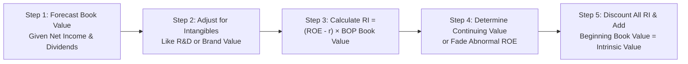

## Overview

Sometimes, when you’re neck-deep in the middle of a tough practice exam, you’ll look at a question about residual income and think, “Um…didn’t I just master dividend discount models and free cash flow calculations? Why is this so complicated?” Well, a residual income (RI) model can indeed get tricky, especially if the exam vignette throws you a curveball: intangible brand assets, partial-year net income, advanced lease obligations, or capitalized R&D. But don’t worry. By the end of this, you’ll feel much more comfortable applying the RI method under messy, real-world conditions.

The big draw of using residual income is that it directly measures how much additional return over the cost of equity the firm generates per period. You start with the book value of equity as the baseline, then layer on any “extra” return. However, that extra return (i.e., ROE less the required rate of return, r) can shift from forecast to forecast—especially if the firm has intangible assets or short-term unsustainable competitive advantages.

This article walks you through a hypothetical multi-stage scenario that might appear in a CFA Level II item set. We’ll cover step-by-step forecasting of book value, intangible adjustments, the continuing value approach, and discounting. We’ll also talk about potential traps like ignoring comprehensive income or forgetting that intangible brand assets might not be in the balance sheet. Finally, we tie everything together with a quick practice example and highlight best practices.

## Key Steps in a Complex Residual Income Valuation

### Forecast the Book Value of Equity

The first move is always to roll forward the firm’s opening book value of equity (B) each year. Typically, you’ll see:

• Beginning Book Value (B₀)  
• Net Income (NI)  
• Dividends (D) or Share Repurchases (SR)  
• Possibly adjustments for intangible R&D capitalization or brand intangible assets

This forecasting sometimes extends for four or five years—enough to capture the near-to-medium-term growth. Watch out for partial-year adjustments (e.g., if the exam states only half the year’s net income accrues because the transaction happened mid-year). The resulting year-end book value for each period sets the stage for the next period’s beginning book value.

Formally, the update for year t might look like:

Bₜ = Bₜ₋₁ + NIₜ − Dₜ − SRₜ

But if intangible capitalizations or restatements exist, you often add them to Bₜ (since you’re effectively shifting from expensing intangible outlays to capitalizing them as an asset that sits on the balance sheet).

### Adjust for Intangibles and Operating Lease Obligations

In many actual exam vignettes—or real-world scenarios—the intangible assets a firm creates (especially R&D or brand equity) are only partially recognized under standard accounting. You might have to capitalize certain R&D outlays if the problem instructs that the technology has a multi-year benefit. Or you might have to treat operating leases more like debt. These adjustments can affect both the book value of equity and your measure of net income (or comprehensive income).

• R&D Capitalization: If you’re told that 60% of R&D spending is beneficial over three years, you might shift that portion from an immediate expense to an amortizable intangible asset on the balance sheet. Net income ticks up (because you’re not expensing everything right away), but amortization expense creeps in.  
• Lease Obligations: Converting operating leases to capital leases often boosts debt but may also adjust your net income. Remember, we’re focusing on the equity portion, so sometimes you’re just adjusting your balance sheet, which in turn can shift your calculation of ROE if you recast net income.  
• Brand Intangibles: If the company invests heavily in brand recognition, some problem statements might ask you to treat brand spending as an intangible asset. This can be subtle—just be sure to follow the instructions in the vignette.  

### Estimate Residual Income Each Year

Residual income for year t is commonly expressed as:

$$
\text{RI}_t = (\text{ROE}_t - r) \times B_{t-1}
$$

where:  
• ROEₜ is the expected return on equity in period t, often taken from forecasted net income / beginning book value.  
• r is the cost of equity (or “required rate of return”).  
• Bₜ₋₁ is the beginning-of-period book value of equity.

If ROE is above the cost of equity, you get positive residual income. Conversely, if ROE dips below cost of equity, that year’s RI is negative, reducing the firm’s overall intrinsic value. On the exam, watch carefully for separate net income vs. “comprehensive income” line items. Sometimes you need to incorporate other comprehensive income swiftly into your ROE calculations.

### Determine a Continuing Value Using a Fade or Declining ROE Assumption

Not all item sets will use a “forever” approach. Often, you’ll see a multi-stage residual income model that assumes:

• Stage 1: High growth or high ROE (exceeding r) for a few years.  
• Stage 2: A fade or transition period, where the ROE slides gradually down to the cost of equity or normal levels.  
• Stage 3: The firm’s ROE converges to r, at which point no further residual income is expected.  

That “fade” is a standard way to incorporate the fact that extremely high ROEs eventually attract competition. You might see a formula for continuing value (CV) at the end of the final year of explicit forecasts:

CV₄ = (RI₅ / (1 + r)¹) + (RI₆ / (1 + r)²) + … or, if the problem states that beyond year 5 the abnormal ROE fully fades, the continuing value can be zero.  
In other scenarios, you might see a single-lump approach for terminal residual income if the problem says the firm’s abnormal ROE remains constant in perpetuity (less common in advanced vignettes). Whichever method is used, pay special attention to the instructions—CFA vignettes love testing your ability to read carefully.

### Discount Residual Income Flows to the Present

Finally, sum up the present values of all forecasted RI from each year plus the present value of any continuing value. Then add the beginning book value of equity. Alternatively, some approaches incorporate the firm’s current book value as a starting point for year 1’s residual and thus you only need the present value of the RI streams.

Putting it all together, the total intrinsic value of equity might look like:

$$
V_{0} = B_{0} + \left[ \sum_{t=1}^{T} \frac{\text{RI}_t}{(1 + r)^t} \right] + \frac{\text{CV}_T}{(1 + r)^T}
$$

**But** if your model defines B₀ for the date you’re making the valuation and the next period’s residual income starts in year 1, that’s typically how it goes. Just keep consistent with the problem statement.

## Common Pitfalls and Traps

### Mismatch Between Net Income and Comprehensive Income

A classic exam trick: the vignette might show a net income of $100 million, but then a footnote states there’s $8 million in foreign currency translation losses that reduce comprehensive income. If the problem specifically instructs to use comprehensive income for your ROE calculation, be sure to incorporate it. Otherwise, you inflate your forecast and, in turn, your residual income.

### One-Time or Restructuring Items

If you see that the company has recognized a large one-time charge that severely dents net income (and hence reduces ROE sharply in that year), confirm whether the charge is truly non-recurring. If it is, you might adjust your year’s income upward so it reflects “normalized” performance. Alternatively, if the remodeling or restructuring is repeated every year (some firms restructure constantly), it’s not truly one-time, so you keep it.

### Unsustainable Short-Term Returns

You might see a firm that posts a 30% ROE thanks to very high brand loyalty or hot technology. The exam might prompt you to keep that 30% for the first two years, but then fade it down to 12% by year five. Resist the temptation to give that abnormal ROE in perpetuity unless that’s the instruction.

### Partial Year Adjustments

If the exam says that a share repurchase or intangible adjustment happens mid-year, you might only record half the effect for that period. This can be easy to forget.

## Illustrative Example

Let’s build a small scenario to make these points more concrete. (Yes, you might see something even more extensive in the real exam, but this is a good taste.)

**Company Profile**  
• Beginning Book Value of Equity (B₀): $500 million.  
• Cost of Equity (r): 10%.  
• Forecasted Net Income for Years 1–5 (before intangible adjustments): $55m, $65m, $75m, $82m, $88m.  
• Dividends each year: 40% of net income.  
• R&D Capitalization: The firm invests $10 million per year in a new brand intangible. The problem states that 50% of that R&D should be capitalized and amortized over five years.  

#### Step 1: Adjust Net Income

Each year’s net income includes 100% expensing of R&D. But we’re told we should only expense 50%. That means:
- Net income is currently understated by 50% of the $10m → $5m.  
- We must remove that $5m from the expense line and record an amortization for prior-year intangible capital.  

For the first year, let’s assume no intangible from previous periods. So Year 1 net income is adjusted upwards by $5m:  
Year 1 net income = $55m + $5m = $60m.  

In Year 2, we do it again. But now we also have to subtract the amortization for the intangible recognized in Year 1. Let’s keep it straightforward: The intangible recognized in Year 1 is $5m. Spread over five years → $1m amortization per year. So:  
• Remove 50% of the new R&D from expense (+$5m).  
• Subtract 1 year’s amortization from last year’s intangible (−$1m).  
Year 2 net effect = +$4m.  
Hence, adjusted net income in Year 2 = $65m + $4m = $69m.

We repeat for subsequent years, each time layering in new intangible recognized, plus all the intangible amortization from prior years.

#### Step 2: Forecast Book Value

Year 1:
• Beginning B₀ = $500m  
• Adjusted NI₁ = $60m  
• Dividend = 40% of $60m = $24m  
• Book Value End of Year 1 (B₁) = 500 + 60 − 24 = $536m  

We should also add the intangible recognized as an asset. We capitalized $5m. Book value increases by $5m more if it wasn’t part of net income. But in many vignettes, net income is already after intangible or we do a plug method. Let’s assume we incorporate that intangible inside net income adjustments so that B₁ is $536m (this approach can vary).

Year 2:  
• B₁ = $536m  
• Adjusted NI₂ = $69m  
• Dividend = 40% × $69m = $27.6m  
• B₂ = 536 + 69 − 27.6 = $577.4m  

We also add the portion of intangible capital from year 2. The new intangible recognized in year 2 is “capitalized” at $5m again, so B₂ might be $582.4m if we treat that intangible as incremental. The exact approach depends on how you integrated intangible into net income. The key is to be consistent.

#### Step 3: Calculate Residual Income

For year 1:

$$
\text{ROE}_1 = \frac{\text{Adjusted NI}_1}{B_0} = \frac{60}{500} = 12\%
$$

Then:

$$
\text{RI}_1 = (\text{ROE}_1 - r) \times B_0 = (0.12 - 0.10) \times 500 = 0.02 \times 500 = \$10\text{m}
$$

Year 2:

$$
\text{ROE}_2 = \frac{69}{536} \approx 12.87\%
$$

$$
\text{RI}_2 = (0.1287 - 0.10) \times 536 \approx 0.0287 \times 536 \approx \$15.4\text{m}
$$

And so on for years 3, 4, and 5. Keep track each time. You’d discount these values back at 10%.

#### Step 4: Determine Continuing Value and Discount

Suppose the vignette states that after year 5, the firm’s ROE will converge from 12% down to 10% over years 6–7, and then remain at 10%. So effectively, by year 8, there’s no more abnormal ROE, meaning no more residual income. So we might do a multi-year fade approach. Each year’s abnormal ROE shrinks.  

Once we have all the forecasted RIs, we discount them:

V₀ = B₀ + ∑(RIₜ / (1 + r)ᵗ)

If the question instructs that you add the continuing value in year 5, you do so. Or if the fade ends by year 7, you incorporate it there based on the specific data given.

## Diagram of the Multi-Stage Process

Below is a simple flowchart showing the key steps to help you visualize:

## Practical Exam Advice

• Read the footnotes carefully: The “Exhibit 2” or “Note 3” typically hides intangible capitalization or partial-year instructions.  
• Double-check you’re using the right measure of income. If the question says “Use comprehensive income,” do it.  
• Watch out for a mismatch if the problem only caps half-year dividends or half-year net income.  
• Always confirm whether continuing value is needed and how the problem wants you to handle the fade.  
• Keep an eye out for share buybacks. Those reduce the equity balance but also reduce share count, which can raise or alter ROE.

## Conclusion

Residual income is a powerful approach, especially in advanced valuation scenarios where intangible assets, partial-year changes, and brand adjustments are front and center. While it can seem complicated at first, the key is systematically walking through your steps in the right order. And if you’re anything like me, once you see residual income in a more “messy” setting a few times, it starts to click. The trick is to practice, practice, practice—both with actual exam item sets and with real-world examples if you have them.

Remember, the end game is to arrive at an intrinsic equity value that integrates how much the firm’s ROE surpasses its required rate. If brand power or unique technology leads to sustained ROE above the cost of equity, that adds real intangible value. If that advantage fades, your continuing value might be smaller. Once you know where to look (and what to watch out for), you’ll be well on your way to nailing these advanced residual income vignettes.

## References and Further Reading

• Official CFA Institute Mock Exams and Item-Set Practice  
• KPMG, Deloitte, EY, PwC Technical Guides on Intangible Asset Valuation  
• Academic Papers on Brand Valuation and Intangible Capital (see SSRN.com for studies)  
• CFA Institute Curriculum on Equity Valuation, Level II Residual Income Topics  

## Practice Questions: Complex Residual Income Scenario



### In a multi-stage residual income model, what happens when the firm’s expected ROE equals its cost of equity?

- [ ] Residual Income is calculated as (ROE – r) × net income.
- [ ] Residual Income is positive and grows in perpetuity.
- [x] Residual Income is effectively zero.
- [ ] ROE and net income are not used in residual income calculations.

> **Explanation:** When ROE matches the cost of equity, the difference (ROE – r) is zero, so residual income is zero.

### A vignette shows net income of $50 million but states that “other comprehensive income” includes a $5 million FX translation loss. The question asks you to use comprehensive income for your ROE calculation. What do you do?

- [x] Subtract $5 million from net income to get $45 million for your ROE calculation.
- [ ] Add $5 million to net income to get $55 million.
- [ ] Use $5 million as a separate line item when computing ROE.
- [ ] Ignore the $5 million because it’s non-operating.

> **Explanation:** Comprehensive income is net income minus $5 million for the FX translation loss. So, you’d use $45 million as the income figure in the denominator of ROE.

### Which of the following is the best rationale for capitalizing a portion of R&D expenditures in a residual income context?

- [x] R&D often creates multi-year benefits, making immediate expensing distort the true economic book value.
- [ ] R&D is only recognized as expense when the technology is fully launched.
- [ ] Capitalized R&D can always be written off at the firm’s discretion.
- [ ] R&D is usually ignored when calculating net income for RI.

> **Explanation:** Capitalizing R&D in the context of residual income ensures that multi-year benefits are reflected in both book value and net income over time, providing a better economic measure than pure expensing.

### A company reports a $200 million beginning book value of equity. Its forecasted net income is $30 million, and dividends are $12 million for the year. The cost of equity is 10%. If the firm’s year-end book value is $218 million, how would you calculate residual income for this year?

- [ ] (ROA – cost of equity) × $200 million
- [x] (ROE – cost of equity) × $200 million
- [ ] (ROE – cost of equity) × $218 million
- [ ] (ROE – r) × [average equity of $209 million]

> **Explanation:** Typically, residual income uses the beginning book value, so you’d compute ROE as ($30 / $200), then apply (ROE – 10%) × 200.

### A question says that a firm’s abnormal high ROE of 25% is expected to fade evenly to 10% by year 5, then remain at 10%. Which statement accurately describes the continuing value at year 5?

- [ ] You continue using 15% abnormal ROE after year 5.
- [ ] The abnormal ROE is zero in year 5.
- [ ] The cost of equity is also 25%, so continuing value is zero.
- [x] By the end of year 5, the ROE is 10%, which matches the 10% cost of equity, so the abnormal return after year 5 is zero.

> **Explanation:** If ROE fades to the cost of equity by the end of year 5, the difference (ROE – r) is zero in perpetuity, so no continuing abnormal returns remain, and the continuing value from residual income is zero.

### Which is a common trap when using the residual income approach in a multi-stage scenario?

- [ ] Forgetting to discount the residual income streams.
- [ ] Adding brand intangibles to the firm’s liabilities.
- [ ] Ignoring net income altogether.
- [x] Using a single net income figure without checking if you need comprehensive income or adjusting for intangible investments.

> **Explanation:** Often, an exam item set includes footnotes about intangible R&D or brand capital that requires you to adjust net income. Failing to do so is a frequent pitfall.

### In the residual income method, which formula properly incorporates the “book value” in the overall valuation?

- [ ] V₀ = Σ(FCFE / r) – B₀
- [ ] V₀ = Σ(DDM / (1 + r)ᵗ)
- [x] V₀ = B₀ + Σ[RIₜ / (1 + r)ᵗ]
- [ ] V₀ = B₀ – Σ[RIₜ × (1 + r)ᵗ]

> **Explanation:** The most common layout is the firm’s current book value of equity plus the present value of future residual incomes.

### A firm’s net income rises by $2 million after you shift part of its operating leases to capital leases. What is the primary effect on residual income calculations?

- [ ] Residual income always decreases because intangible adjustments reduce net income.
- [x] Residual income may rise because adjusted net income is higher, increasing ROE over the same book value.
- [ ] Residual income is unaffected by operating lease reclassification.
- [ ] Book value declines dramatically, so ROE typically falls.

> **Explanation:** Converting operating lease expense partly into depreciation + interest may lift net income. A higher net income over the same beginning book value typically increases ROE, thereby boosting residual income if ROE > r.

### A brand intangible adjustment of $10 million is capitalized and then amortized over 5 years. How should this be reflected in your residual income approach?

- [x] Increase book value by $10 million initially, then reduce net income each year by the annual amortization amount.
- [ ] Treat the $10 million as an immediate expense and ignore synergy benefits.
- [ ] Only adjust intangible assets when the brand is fully amortized.
- [ ] Recognize half of the $10 million as intangible and half as goodwill impairment.

> **Explanation:** You capitalize the $10 million, so your book value rises. Then you systematically expense (amortize) that intangible over its 5-year life, reducing net income accordingly in each of those years.

### True or False: If a company repeatedly recognizes large “one-time” restructuring charges, you should probably ignore these charges in your residual income model.

- [x] True
- [ ] False

> **Explanation:** If restructuring charges occur every year, they are not truly “one-time.” You might adjust net income to reflect a more sustainable long-term pattern, meaning you don’t just ignore the charges—but you do question whether they really are “one-time.” If they’re repeated, they might just be the firm’s routine practice.


