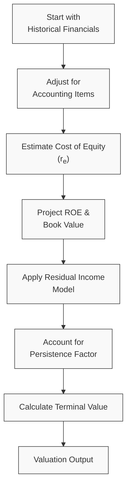

## Overview

Residual income valuation is often praised because it explicitly considers the cost of equity and emphasizes the generation (or destruction) of shareholder value. But let’s be honest: implementing residual income (RI) models in practice can be a bit of a headache. I once worked with a biotech startup that had intangible assets left and right, no profitability in sight, and book values scattered across footnotes. If you think plugging those numbers into a spreadsheet is straightforward—well, you might be in for a surprise.

In this section, we zoom in on the key challenges and limitations you’re likely to face when using residual income methods. We’ll explore the pitfalls of messy accounting data, the uncertainty around forecasting the persistence of excess returns, the swings introduced by cyclical or volatile return on equity (ROE) assumptions, and more. Finally, we’ll walk through some practical tips, a short example snippet, and references for further reading.

## Sensitivity to Complex Accounting Adjustments

Residual income starts with the idea that a company’s “true economic profit” must surpass its required cost of equity. To measure this, you combine book values and net income in a formula that often looks like:


\text{RI}_t = \text{Net Income}_t - r_e \times \text{Book Value}_{t-1},


where rₑ is the required return on equity (or cost of equity).

But here’s the snag:

- Book value (BV) can be manipulated by accounting policies, capitalizing vs. expensing intangible assets, or even differences in GAAP vs. IFRS treatments.  
- Income numbers might include non-recurring items, goodwill impairments, and other tricky adjustments.

If your net income is inflated (say, due to a one-time gain on asset sales), your residual income figure for that period will be unrealistic. Similarly, if your book value is understated because of conservative accounting or intangible assets that don’t show up on the balance sheet, the computed residual income might be misleading.

### Why It Matters
If you ignore these distortions, well, you might end up overvaluing (or undervaluing) a company by a wide margin. I recall a case—this was back when I was still getting the hang of advanced financial modeling—where we forgot to adjust for a big intangible asset write-off in the previous years. Our residual income model was telling us the company was generating huge economic profits. In reality, an earlier write-down had artificially deflated book value, artificially elevating the RI measure.

### Addressing the Issue
Regularly adjust the book value and income for non-recurring items, intangible assets, and any differences between economic and accounting depreciation. If you’re analyzing a cross-border company, be mindful of local GAAP vs. IFRS. Check if the firm’s policies require R&D to be booked as an expense (frequent in IFRS), which reduces BV on the balance sheet but might understate intangible asset value.

## Estimating Persistence of Excess Returns

Residual income models often project “excess returns,” or returns above the cost of equity, over multiple periods. The million-dollar question: How long can a company sustain these “excess” returns?

Most frameworks introduce a persistence factor, \\(\omega\\), which represents how quickly residual income fades. For instance, you might use something like:


\text{RI}_t = (\text{ROE}_t - r_e) \times \text{Book Value}_{t-1}.


As time goes on, the assumption is:


\text{ROE}_{t+1} = \omega \times \text{ROE}_t + (1 - \omega) \times r_e,


where \\( 0 \leq \omega \leq 1 \\). Here, a high \\(\omega\\) means a slower fade of abnormal returns, implying that the company maintains its competitive advantage for longer. But overestimating \\(\omega\\) can blow up your terminal value. We’ve all been there—maybe you look at a successful tech firm and assume it’ll dominate forever... only to realize competition can come out of nowhere. This optimism bias can be lethal in a valuation model.

### Best Practices
- Use fundamental industry research to test how quickly new entrants can erode margins or how changing consumer preferences can shift the game.  
- Check the corporate lifecycle stage (see “Corporate Lifecycle” in the glossary). A mature firm typically has lower \\(\omega\\) than an early-growth firm with patents or unique intangible capital.  
- Apply scenario analysis for your fade rate. Run at least three scenarios: one with a quick fade, one with a moderate fade, and one that’s more extended, then decide on a final perspective.

## Volatile ROE and Growth Assumptions

Residual income often deals directly with a company’s ROE. But not all ROEs are created equal—some industries, like automobiles or commodities, experience seismic cyclical shifts. An oil producer might post a super-high ROE in times of elevated crude prices, then plummet when prices bust.

If your base-case forecast relies on stable or consistently growing ROE, you might be ignoring the cyclical nature of the business. Now, yes, you can attempt smoothing or “normalization.” But how do you do that?

- You might average cyclical earnings over a full cycle (say, 5 to 10 years).  
- Consider macroeconomic drivers like demand cycles, commodity price trends, and regulatory changes.  
- Incorporate partial adjustments if you suspect a short-term anomaly.

### A Quick Numerical Perspective
Imagine a commodities producer shows 25% ROE this year because of a surge in commodity prices. Its usual return in a “normal” year might be 10%. If you anchor your entire residual income model to 25%, you might produce an overly optimistic valuation unless you blend in the possibility of reversion to 10%.

Below is a tiny Python snippet illustrating how one might do a simple cyclical-smoothing approach:

```python
import numpy as np

historical_roes = [25, 20, 15, -5, 8, 10, 12]

average_roe = np.mean(historical_roes)
print("Cyclical Average ROE: {:.2f}%".format(average_roe))

weights = [0.1, 0.15, 0.2, 0.15, 0.15, 0.15, 0.1]
weighted_roe = np.average(historical_roes, weights=weights)
print("Weighted ROE: {:.2f}%".format(weighted_roe))
```

We can then use either `average_roe` or `weighted_roe` in our residual income model to account for cyclical fluctuations. This approach, while simple, can help you avoid the trap of basing your entire forecast on an exceptionally good (or bad) year.

## Data Availability and Reliability

Analyzing residual income for smaller or private firms is where things get tricky—like rummaging in the dark for your car keys. You might not have consistent book values or fully audited statements. Footnotes might be incomplete, or intangible assets might be absent from the statements altogether.

- **Private Firms:** Harder to get timely data, and your cost of equity might be a guess based on, say, a build-up approach or limited comps (see Chapter 14 on Private Company Valuation).  
- **Emerging Markets:** Even if public, they can have less stringent reporting standards. You could find IFRS is “adopted” but with major carve-outs.  

### Strategies for Handling Limited Data
1. **Cross-verification**: Try to get multiple data sources: industry trade journals, local rating agencies, or third-party analysts.  
2. **Sensitivity analysis**: Especially relevant if you’re missing entire chunks of data. Let’s say you have no idea how much intangible value or R&D is off the books—do a scenario with zero intangible value, one with moderate intangible value, and one with an extremely high intangible value.  
3. **Explicit disclaimers**: If you’re presenting your valuation to a client, highlight that the data is incomplete, and the residual income results could change if new information surfaces.

## Subjectivity in Intangibles

One of the biggest critiques of residual income is that it relies heavily on the book value, but intangible assets (like brand strength, intellectual property, or, you know, that intangible “Pixie Dust” some tech companies thrive on) might not appear on the balance sheet at fair value—if at all. Traditional accounting can systematically understate intangible assets, especially in R&D-heavy, brand-driven, or technology-based industries.

### Impact on Valuation
If intangible assets are mostly off the books, your book value is understated, inflating the difference \\((\text{ROE} - r_e)\\) in your residual income calculation. The model will show a company generating “abnormal profits” when in reality, it’s just that you’re not capturing the intangible asset on the balance sheet.

#### Example
Consider a pharma company that invests heavily in R&D every year—these costs are expensed under IFRS. Over time, that means a chunk of the intellectual property (new drug patents, specialized human capital) is never capitalized. So, your net income might be artificially low in early years (due to R&D expense), and your book value might be understated. If the firm’s future earnings spike when a drug is approved, you might observe significant “residual income,” but part of it is just the reflection of intangible assets that never lived on the balance sheet.

## Additional Considerations with a Mermaid Diagram

Below is a simplified diagram that shows how these challenges fit into the typical residual income valuation process. The flow might help visualize where each limitation hits you:



At each node, you have to ask: “Is my data correct? Are my assumptions stable? Did I handle cyclical or intangible factors?” If the answer is “Not sure,” you’ll want to refine or re-run your model.

## Time Horizon Risk

Residual income models can run out 5, 10, or even 15 years in the future—perhaps combined with a terminal value. Well, guess what: the further you go, the murkier your crystal ball becomes. Market disruptions, new entrants, changes in consumer behavior, and unforeseen regulations can drastically alter your earnings and book value. This is sometimes known as “time horizon risk.”

You might do your best with macroeconomic forecasts or do a top-down approach (see Chapter 26 on Macroeconomic Analysis). But it’s wise to remind yourself that the greatest error can creep in from the final few forecast periods where the residual income might be a large part of the total valuation.

## Glossary Highlights

- **Corporate Lifecycle:** Firms typically move through start-up, growth, maturity, and decline phases. Early-growth and mature phases may differ in how long they sustain their ROE above rₑ.  
- **Accounting Conservatism:** Reporting standards deliberately leaning toward underreporting assets and overstating liabilities. This can lower book value and inflate residual income.  
- **Cyclical Industry:** Industries like commodities or automobiles with extreme earnings fluctuation in response to macroeconomic cycles.  
- **Time Horizon Risk:** The longer the forecast horizon, the more potential for large divergences from your original estimates.

## Practical Tips and Next Steps

1. **Combine Approaches:** Never rely on a single method. Cross-check with a discounted cash flow (FCFE or FCFF) or with market-based multiples for sanity checks.  
2. **Revisit Terminal Value:** The terminal value can balloon if you assume high ROE persistence. Consider a truncated horizon or a lower \\(\omega\\).  
3. **Sensitivity Analysis:** Toward the end of your modeling, systematically vary your cost of equity, growth rates, and intangible asset assumptions to see how your valuation changes.  
4. **Focus on Footnotes:** Often in the footnotes of financial statements, you’ll find intangible asset write-offs, capital vs. operating lease details, or revenue recognition quirks.  
5. **Realistic vs. Perfect:** Embrace imperfection. A residual income model will never be “perfect.” Document the limitations in your final report.

## References and Further Reading

- Pratt, S. (2008). “Valuing a Business: The Analysis and Appraisal of Closely Held Companies.”  
- Academic research on earnings persistence and residual income models in The Accounting Review or Journal of Finance.  
- CFA Program Level II materials on advanced valuation pitfalls (particularly relevant if you want more vignettes or practice questions).  

## Test Your Knowledge: Challenges and Limitations in Residual Income Valuation



### Which of the following statements best describes a major limitation of residual income (RI) models?

- [ ] RI models are not suitable for companies that pay dividends.
- [ ] RI models ignore the firm’s cost of equity in valuation.
- [x] RI models can be affected by accounting adjustments to book value and net income.
- [ ] RI models typically understate intangible asset values since cost of equity is overstated.

> **Explanation:** A major limitation of RI models is the sensitivity to book value and net income, which can be distorted by a firm’s accounting policies.

### How does underreporting intangible assets due to accounting conservatism typically affect a residual income calculation?

- [x] It can inflate the calculated residual income by understating book value.
- [ ] It always leads to a lower residual income.
- [ ] It has no effect on residual income as long as ROE is accurate.
- [ ] It only affects companies in cyclical industries.

> **Explanation:** Underreporting intangible assets lowers reported book value, which can artificially increase the differential (ROE - rₑ), thus inflating residual income.

### A company in a highly cyclical industry forecasts an ROE of 25% for next year due to elevated commodity prices. Over a full cycle, the ROE is closer to 10%. What is the best practice for handling these fluctuations when using a residual income model?

- [ ] Use the 25% ROE in perpetuity and ignore cyclical impacts. 
- [ ] Switch from RI to a purely market-based multiple approach.
- [x] Apply a normalized ROE approach or weight the historical average over a full cycle.
- [ ] Assume the ROE will drop to zero immediately.

> **Explanation:** The best practice is to recognize that cyclicality affects ROE over the long term. Normalizing the ROE or weighting an average is typically more accurate than using a peak or trough figure.

### Which factor is most important when estimating a persistence factor for excess returns?

- [x] How long the firm can maintain its competitive advantage in the market
- [ ] The firm’s bond ratings
- [ ] The difference between free cash flow and free cash flow to equity
- [ ] The current inflation rate

> **Explanation:** The persistence factor reflects how long a company can sustain returns above its cost of equity, which is largely about competitive advantage longevity.

### What is one recommended approach to mitigating the “time horizon risk” in residual income models?

- [ ] Forecast residual income only for current year and ignore the future.
- [ ] Use a negative persistence factor.
- [x] Apply scenario analysis, especially for later years.
- [ ] Set growth to zero after the first year.

> **Explanation:** Because forecasts further out become less certain, scenario analysis helps account for unexpected changes later in the forecast horizon.

### In practice, which item would most likely require careful adjustment to the company’s book value in a residual income model?

- [ ] Depreciation of fixed assets
- [ ] Normalized working capital
- [ ] Management salary expenses
- [x] Off-balance-sheet intangible assets

> **Explanation:** Off-balance-sheet intangible assets are often unrecognized in book value. Adjusting them can be critical in obtaining an accurate measure of the firm’s book value for RI.

### When applying a multi-stage residual income model, if you assume a high persistence factor (ω is close to 1), what potential valuation outcome might you see?

- [ ] The model will ignore any intangible assets.
- [ ] The computed valuation will always be lower than market-based multiples.
- [ ] The firm’s book value calculation will not matter.
- [x] The terminal value might become disproportionately high.

> **Explanation:** A high persistence factor extends the period over which the firm’s ROE exceeds rₑ, inflating the long-term residual income and therefore the terminal value.

### Which of the following is a likely consequence of ignoring cyclical volatility in ROE forecasts within a residual income model?

- [ ] Overestimating the firm’s intangible asset value
- [x] Overstating or understating the valuation if the current ROE is abnormally high or low
- [ ] Consistent undervaluation regardless of the business cycle
- [ ] Underreporting the firm’s cost of equity

> **Explanation:** In cyclical industries, a short-term spike or dip in ROE can mislead the valuation if you assume it persists, leading to over- or underestimating long-term value.

### A firm operating in an emerging market might pose what primary challenge for a residual income valuation?

- [ ] Extreme reliability of book value 
- [ ] Lower discount rates due to stable politics
- [x] Limited or inconsistent financial statements that distort book value or net income
- [ ] A guaranteed higher ROE

> **Explanation:** Emerging market firms frequently face inconsistent financial reporting standards, making it difficult to reliably measure book value and net income.

### True or False: Residual income valuation is generally immune to the effects of intangible asset underreporting.

- [ ] True
- [x] False

> **Explanation:** Residual income valuation can be significantly skewed if intangible assets are off the balance sheet and not included in the book value measure.


