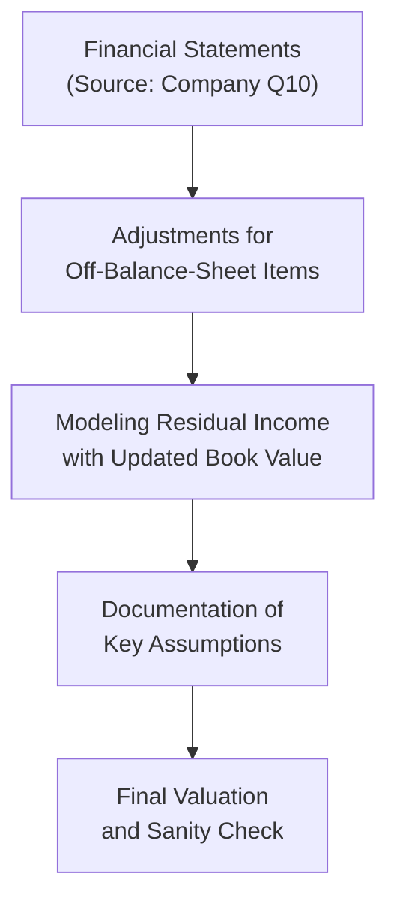

## Introduction
Well, here we are, ready to wrap up our journey into the advanced corners of residual income valuation. When we say "best practices in implementation," we mean all the nitty-gritty details that come after the theory—like cross-verifying results, testing assumptions, maintaining robust documentation, and collaborating with colleagues to ensure you haven't overlooked anything. I once worked on a residual income model for a tech startup, only to discover (far too late!) that I'd forgotten to factor in newly granted patents. Trust me, you don't want to be caught off guard by intangible assets that can change the story entirely.

Residual income valuation is powerful precisely because it links accounting measures of equity (book value) and the generation of economic profit over time. But let's be honest: it can also get complicated. Whether it's adjusting off-balance-sheet items, factoring in intangible assets, or aligning cost of equity assumptions with real market data, there's a lot that can go astray. That’s why we’re talking best practices—so we keep everything consistent, transparent, and up to date.

Below, we’ll explore how to blend residual income with other valuation techniques, how to run scenario and sensitivity analyses, how to maintain evergreen assumptions, and how to document everything meticulously (so you can sleep at night!). We’ll also discuss peer review and real-world examples that show you how professionals implement these concepts every day.

## Combining Residual Income with Other Approaches
Residual income valuation (RI) isn’t meant to exist in a vacuum. One of the core best practices is cross-verifying your RI results with other models—like the Dividend Discount Model (DDM), Free Cash Flow to Equity (FCFE), or market multiples (see Chapters 6, 7, 8, 9, and 10 for details). Why? Because each approach has unique assumptions, data requirements, and sensitivity to market inputs. If two or three methods point in the same direction, you gain valuable confidence that your analysis is on solid ground.

Let’s use a fictional example: say you’re valuing Ginkgo Group, a midsized biotech company. You’ve modeled Ginkgo’s residual income based on projected Return on Equity (ROE), adjusting for recent R&D outlays that may not immediately show up in the income statement. But you’re unsure if the cost of equity is fully reflecting Ginkgo’s heightened clinical trials risk. If you also run a two-stage DDM that uses a realistic growth rate for its prospective dividends, or if you compute FCFE flows after factoring in the large capital expenditures for lab expansions, you’ll get alternate vantage points. Convergence of these results says, “Hey, maybe the cost of equity you used is plausible.” Alternatively, major discrepancies might nudge you to reevaluate your assumptions. 

Here’s a simplified flowchart illustrating the cross-verification process:

The idea is to run your residual income model, run a separate DDM or FCFE approach, and see how each model handles intangible assets, cyclical profits, or near-term vs. long-term growth. Discrepancies force you to ask, “Did I handle intangible asset valuation properly in the residual income approach?” or “Is my cost of equity too aggressive?”

## Incorporate Scenario & Sensitivity Analysis
Um, let's be real: we deal with a lot of assumptions in residual income frameworks, including near- and long-term ROE trajectories, cost of equity, accounting adjustments, intangible asset treatment, and more. A small shift in any one of these can produce a drastically different valuation. That’s why scenario and sensitivity analysis are absolutely essential.

• Scenario Analysis: Develop distinct worlds—like a best-case “booming economy” scenario with high consumer confidence, a base-case scenario that’s closer to consensus growth expectations, and a worst-case scenario reflecting an economic downturn or adverse regulatory changes. For each scenario, reevaluate your assumptions:

  – ROE ramp-up or decline rates  
  – Cost of equity reflecting changed market risk premiums  
  – Treatment of intangible assets in an industry under more or less regulation  

In many professional settings, analysts assign probabilities to each scenario to estimate an expected valuation. For instance, if your worst-case scenario yields an RI-based target price of USD 40 per share, the base case yields USD 60, and the best case yields USD 80, you might arrive at an expected price around USD 62 if you believe the base case is around 50% likely, best case is 30% likely, and worst case is 20% likely.

• Sensitivity Analysis: This process is a bit narrower. Instead of changing multiple variables at once, you vary one input at a time (e.g., cost of equity) while holding everything else constant. You might discover that a 200-bps increase in your required return on equity lowers your valuation by 25%, which can be a sobering statistic if you’re recommending the stock to your portfolio manager.

For a quick example:

KaTeX formula for a single-period Residual Income:


\text{RI}_1 = (ROE - r) \times B_0


Where:
- RI₁ = Residual income in period 1  
- ROE = Return on Equity for the period  
- r = Cost of equity  
- B₀ = Beginning book value of equity  

Vary r up or down by a percentage point, and watch that final RI-based valuation shift. This helps you figure out which assumptions are the real pivot points in your analysis.

## Regularly Revisiting and Updating Key Assumptions
Let’s face it: the world changes, markets oscillate, and corporate strategies evolve—sometimes faster than we’d like. I remember once building a residual income model for a consumer goods firm, only to have them pivot to a direct-to-consumer digital platform two quarters later. All those sales assumptions? Poof, out of date. And that intangible asset component? Suddenly central to the valuation because brand-building efforts moved to an online influencer strategy.

The moral of the story: don’t set your model in stone. Revisit your assumptions when significant external events occur (such as big macro shifts, interest rate changes, new trade regulations) or internal changes happen (like new product lines, acquisitions, or C-suite turnover). Align the cost of equity with updated market data, reexamine intangible asset valuations, or revise growth expectations. If you only update your residual income model annually—even though the company just changed its entire capital structure—your analysis might be missing a huge piece of the puzzle.

## Documentation & Transparency in Modeling
You’ve probably heard the old adage: “If you can’t explain something simply, you don’t understand it well enough.” This is especially true for residual income valuation. Let’s say you have a 30-tab spreadsheet that calculates everything from free cash flow projections to intangible asset allocations. If it isn’t documented, you run major risks:

- You might make a tweak that breaks a formula.  
- Other analysts can’t follow your logic, meaning collaboration and peer review suffer.  
- In the frantic lead-up to an investment committee presentation, you have no quick reference for how you derived your cost of equity or intangible asset adjustments.

So, it’s a good idea to keep a “Model Notes” tab or an embedded section in your analytics software. Outline your key assumptions and input sources—like where you got the discount rate or how you allocated intangible assets to the balance sheet. Reference footnotes for changes you made after some new corporate filing. And if your model references external libraries (maybe a Python script for Monte Carlo simulations?), track that too.

A typical approach might look like:

Being transparent doesn’t mean giving away proprietary secrets. Rather, it ensures that any qualified reviewer can retrace your steps, replicate your results, and offer constructive feedback.

## Peer Review: The Collaborative Edge
Okay, let's talk about sharing. It’s tempting to build your model in isolation—sometimes we want to protect our “baby,” right? But if there’s one lesson from the real world, it’s that fresh eyes will save you from mistakes. Or at least keep them to a minimum.

• Peer review is essential. You want a colleague, manager, or perhaps someone from a different department to “stress test” your assumptions. An example: You might have capitalized R&D incorrectly for a pharmaceutical firm’s intangible assets, or you might have overlooked certain high-risk financing that’s stashed somewhere in the footnotes. Another analyst with fresh eyes can catch these issues.

• Professional feedback fosters better accuracy. If you’re making big off-balance-sheet adjustments—like valuing brand intangible assets or adjusting for pension obligations—having a second opinion is gold. Your peer might say, “You estimated the brand asset’s economic useful life at 20 years, but shouldn’t we mirror it with the industry average of 10 years?” This simple question can lead you to more realistic, grounded inputs.

## Practical Real-World Example
Imagine you’re valuing Nova Foods, a fast-growing meal-delivery company that invests heavily in brand awareness. Nova’s intangible assets (brand and technology) don’t neatly appear on the balance sheet. If you treat these intangible investments as period expenses, your ROE might look artificially low. So, you adjust the income statement by capitalizing part of the marketing spend to get an economic measure of intangible assets, which inflates book value a bit.

Then you compute Nova’s residual income using an ROE that more accurately represents the firm’s brand-building efforts. The result is a fair value estimate of, say, USD 55 per share. But just to be sure, you also run an FCFE model that yields USD 52. Then a market multiple approach suggests the firm might be worth around USD 58. Because your results are relatively consistent, you feel comfortable recommending your estimate around the mid-50s.

Next, your colleague reviews your intangible asset life assumption—she notices you used a 15-year depreciation schedule for brand value, but the industry typically uses 10 years. You revise that assumption, which lowers the brand’s intangible value, but not drastically, so your final price moves a bit to USD 54. That’s a classic example of how peer review refines your approach.

## Final Thoughts for the Exam
• Don’t forget cross-model validation. Residual income is potent, but it’s also reliant on multiple assumptions.  
• Run scenario analyses and single-variable sensitivities for the major drivers like ROE, cost of equity, intangible asset life, or off-balance-sheet obligations.  
• Stay current. If your target firm undergoes a big strategic pivot, reflect that in your model.  
• Document everything—especially for the exam, clarity in approach can lead you to answer item set questions more effectively.  
• Lean on third-party input. Even in exam practice, talk through your assumptions with peers or mentors.  

By staying flexible, transparent, and open to constructive criticism, you stand a much better chance of delivering an accurate, persuasive valuation opinion. And for the exam context, remember that you’ll often see vignettes referencing intangible assets, adjusted book values, or multiple growth phases. Keep your residual income fundamentals handy—particularly how to separate the calculation of continuing residual income from near-term forecasts—and watch carefully for required rates of return or special items hidden in the vignette footnotes.

## Additional References
- CFA Institute Level II Curriculum Readings on multiple valuation approaches  
- NACVA (National Association of Certified Valuators and Analysts) for advanced guidelines on intangible asset valuation  
- ASA Business Valuation Standards for professional valuation benchmarks  
- AICPA standards on valuation and financial statement adjustments  

## Test Your Knowledge: Residual Income Valuation Implementation Best Practices



### In combining residual income valuation with other approaches, which statement is most accurate?
- [ ] Residual income is conclusive and does not require verification with other models.  
- [x] Residual income results should be cross-checked with other models (e.g., DDM, FCFE, multiples) to increase confidence.  
- [ ] Scenario analysis replaces the need for cross-verification.  
- [ ] Market multiples cannot be used with residual income models.  

> **Explanation:** Best practice dictates that you compare and contrast the outputs of the residual income model with other valuation techniques to ensure consistency and reliability.

### Which of the following best describes the main benefit of scenario analysis in residual income valuation?
- [ ] It helps standardize cost of equity across industries.  
- [x] It allows an analyst to understand how different future states (e.g., best case, worst case) affect valuation outcomes.  
- [ ] It eliminates the need for sensitivity analysis.  
- [ ] It makes intangible assets more predictable.  

> **Explanation:** Scenario analysis changes multiple variables at once to project how the valuation might shift under various market or firm-specific conditions.

### What is a key reason to regularly revisit and update the assumptions in a residual income model?
- [ ] Stock prices are always rising.  
- [x] Corporate strategies and market conditions evolve, potentially invalidating old assumptions.  
- [ ] Once set, ROE assumptions rarely change.  
- [ ] Peer review compensates for outdated assumptions.  

> **Explanation:** Business strategies, interest rates, consumer demand, and industry landscapes shift, making it crucial to keep your model’s inputs fresh and accurate.

### Why is transparency often considered critical in residual income modeling?
- [ ] To hide proprietary assumptions from competitors.  
- [x] It ensures others can replicate and verify the model’s inputs and calculations.  
- [ ] Because regulations mandate adding dummy variables to the model.  
- [ ] Because residual income is more transparent than other methods by default.  

> **Explanation:** Documenting each step, assumption, and data source allows for effective collaboration and verification, reducing errors.

### What is a primary benefit of peer review in implementing a residual income valuation?
- [ ] It eliminates the need for intangible asset adjustments.  
- [x] It brings fresh perspectives to catch errors or oversights in assumptions and calculations.  
- [ ] It replaces the need for scenario or sensitivity analysis.  
- [ ] It allows you to bypass cost of equity determination.  

> **Explanation:** Peer review provides an independent check. Colleagues may spot mistakes or unrealistic assumptions, boosting the reliability of your final valuation.

### In a sensitivity analysis, an analyst primarily:
- [x] Varies one assumption at a time (e.g., cost of equity) to see how valuation changes.  
- [ ] Applies identical changes to all assumptions to find a single best-case scenario.  
- [ ] Relies on probabilistic weights for multiple future outcomes.  
- [ ] Ignores intangible asset adjustments for simplicity.  

> **Explanation:** Sensitivity analysis focuses on isolating the impact of changing one key input at a time, highlighting how sensitive the outcome is to each variable.

### If two different valuation models yield significantly different results for the same stock, a best practice would be to:
- [ ] Immediately discard the residual income approach.  
- [x] Investigate which assumptions differ and refine inputs or estimates as necessary.  
- [ ] Assume the higher valuation is correct.  
- [ ] Assume the lower valuation is correct.  

> **Explanation:** When different models disagree, the discrepancy prompts you to re-check assumptions and refine inputs, potentially leading to a more consistent and accurate valuation.

### In the context of intangible assets, a crucial step in residual income modeling is:
- [ ] Ignoring intangible assets since they are not on the balance sheet.  
- [ ] Treating all intangible assets as expenses in the period incurred.  
- [x] Capitalizing relevant intangible expenditures to reflect their contribution to economic value.  
- [ ] Eliminating the effect of intangible assets to avoid overvaluation.  

> **Explanation:** Properly identifying and capitalizing intangible assets can reveal the real drivers of ROE and the true economic book value.

### For a company undergoing a significant strategic pivot (e.g., adopting a direct-to-consumer business model), the analyst should:
- [x] Reevaluate both near-term and long-term assumptions in the residual income model.  
- [ ] Keep existing assumptions to maintain data consistency.  
- [ ] Discontinue using the residual income model.  
- [ ] Use only the baseline scenario for future periods.  

> **Explanation:** A strategic pivot often changes revenue mix, cost structure, or intangible asset significance, so the model must reflect these new realities.

### Residual income valuation’s reliance on book value means:
- [x] The evolution of book value must be tracked carefully, including any adjustments for intangible assets.  
- [ ] Book value remains constant over time.  
- [ ] Intangible assets are never capitalized.  
- [ ] The model does not need cost of equity.  

> **Explanation:** Residual income depends significantly on the progression of book value, which can shift due to intangible asset recognition, share repurchases, or other accounting changes.


