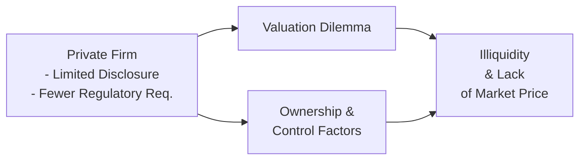

## Introduction
Valuing private companies can often feel like trying to solve a puzzle with half the pieces hidden under the rug. You might have done a quick search for a firm’s stock price—only to realize, “Well, there isn’t one, since it’s private.” At Level I, we touched on the fundamentals of valuation, mostly for public names. But here at Level II, we take a deeper dive into the nuances of private company valuation.

This section tackles those specifics: you’ll see how missing or incomplete market data affects your risk assessments, learn about illiquidity’s role in discount rates, discover how family ownership changes everything, and get a sense of how strategic versus financial buyers approach private-company deals. And if you’ve ever wondered whether it’s worth paying extra for control—hello, control premiums—or getting a discount for owning a minority stake, we’ll solve that riddle, too. Let’s jump right in.

## Limited Availability of Market Data
One of the biggest eye-openers when you first evaluate private companies is the near-total absence of real-time market data. You don’t have a handy quote to check. There’s no ticker symbol. So how do you set a benchmark? You might rely on:

• Industry-specific multipliers or reference points (from comparable public companies).  
• Proprietary transaction databases (which may capture prior private deals but often with incomplete details).  
• Broker estimates, private equity reports, or anecdotal evidence from business brokers and local networks.

But let’s face it, you’ll rarely have data as robust or transparent as you would from a publicly traded firm. This often introduces much higher information asymmetry: the seller usually knows the business intimately, while the buyer has to scramble to piece together third-party references or partial data to confirm the valuation story.

### Information Asymmetry and Its Consequences
Information asymmetry can put you, as an analyst or investor, on your toes. Sellers can be selectively forthcoming—perhaps not lying outright, but they might omit or gloss over negative details. Conducting thorough due diligence (e.g., background checks, deep financial statement analysis, interviews with former employees) becomes essential. This is way more intensive than glancing at a public company’s SEC filings or official announcements.

## Impact of Illiquid Shares
Another biggie is liquidity—or more precisely, the lack of it. Let’s be honest: buying private equity stakes can feel like stepping into quicksand. If you ever need to exit your position, you might not have a convenient buyer. It’s not like logging into your brokerage platform and hitting “Sell.” That limited liquidity translates into a higher risk profile.

### Introducing the Illiquidity Premium
As you factor risk into your discount rate, an illiquidity premium often gets stacked on top. In the classic build-up method, you might see something like:

$$
r = r_f + \beta \times \mathrm{ERP} + \mathrm{Size\ Premium} + \mathrm{Company\ Specific\ Premium}
$$

For private firms, that “company-specific premium” can include illiquidity, key-person risk, and other items. If you recall from Chapter 3 (Return Concepts and Required Rates of Return), we typically talk about the equity risk premium or size premium. But for private firms, the “company-specific premium” can be more significant, reflecting illiquidity, questionable governance, or uncertain growth potential. And obviously, the narrower the investor base, the more pronounced the discount an investor might demand.

## Differences in Disclosure and Reporting
Public firms in most jurisdictions must issue quarterly and annual reports, with independent audits and mandatory disclosures. Private companies, on the other hand, don’t always face the same regulatory bar. Many of them only produce statements once a year—sometimes even less often. Audits might be done by smaller local firms with varying degrees of thoroughness.

### Practical Challenges
• Financial statements might be on a cash basis or might not comply with IFRS or US GAAP.  
• Adjustments like owner’s compensation (sometimes inflated or minimized for tax reasons) can skew the financial picture.  
• Liabilities or commitments might not be fully recorded on the balance sheet.

That’s why a big chunk of private valuation work focuses on recasting or normalizing financial statements. You might rummage through year-end statements and think, “Wait, the business shows almost no profit, but it’s actually paying the founder a salary that’s twice market rates.” So you add that back to gauge the economic reality. This is also where the so-called “deep due diligence” or “off-the-record” checks come into play. You might speak with the firm’s suppliers, former employees, or even try to confirm if those intangible assets or off-balance-sheet items are accounted for correctly.

## Ownership Structure and Key-Person Risk
It’s also super common for private companies to have founder-led or family-run business structures. This can influence everything—from governance style to performance incentives. For instance, a company might revolve around one individual (the founder), who holds the intangible knowledge, key customer relationships, or operational secrets in their head. What happens if that person walks away?

### Key-Person Risk
The potential departure or incapacitation of a central figure can be devastating in a private environment—more so than in a well-diversified public corporation. Analysts often incorporate a “key-person discount” or a personalized due diligence step focusing on, say, the founder’s health or the CFO’s track record. While that might feel slightly invasive, it’s crucial because the entire valuation could hinge on the presence of one person’s reputation or skill set.

## Strategic vs. Financial Buyers
Another area that sets private firms apart is the nature of potential buyers. In the public markets, you have a wide array of investors, from day traders to pension funds, all trading shares throughout the day. With private firms, buyers and sellers often come in two main flavors:

1. Strategic Buyers: Such as a competitor, a large corporation, or a firm looking for synergies. They might pay extra because acquiring a private firm helps them expand their market share or integrate a new technology.  
2. Financial Buyers: Such as private equity firms, venture capitalists, or high-net-worth investors seeking returns. They’re less interested in strategic fit and more focused on the future cash flows and eventual exit multiples.

### Valuation Impacts
• A strategic buyer may value the company more for synergy reasons—sometimes justifying that elusive “control premium.”  
• A financial buyer sees the deal as a standalone investment. If the synergy potential is low, expect a lower purchase price relative to a strategic buyer’s offer.  

Hence, the same private company might yield vastly different valuations depending on who’s at the negotiation table.

## Control Premiums, Minority Discounts, and Liquidity Discounts
In private company settings, the capital structure and ownership claims can be less standardized than in public firms. So you often see specific adjustments to reflect the economic reality of those claims, including:

• Control Premium: This is an extra amount a buyer might pay for the privilege of calling the shots—particularly relevant if they’re acquiring a majority stake.  
• Minority Discount: If you’re buying a stake that has no voting power, or if you can’t outvote the founder’s preference shares, the market might apply a discount.  
• Liquidity Discounts: Even if you end up with a chunk of shares, remember, you might not be able to exit quickly. That, again, depresses the price relative to equivalent shares in a publicly traded company.

All these discounts and premiums often arise simultaneously, which can be complex. For instance, you might see an apparently generous purchase multiple at first. But only after closer inspection do you realize it combines a minority discount plus an added illiquidity factor. Knowing how these are applied and in what order can be essential when you’re calculating the final value of your stake.

### Quick Mermaid Diagram
Below is a simplified visual flow on how certain aspects funnel into private-company valuation complexities:

## Best Practices in Conducting Private Valuations
Valuing a private company requires a blend of art and science. Here are a few best practices:

• Cross-Verify Financials: Don’t rely on a single year or a single source. Whenever possible, ask for multiple years of financials, see if they align with tax returns, and request management to clarify anomalies.  
• Normalize or “Recast” Earnings: Adjust for non-recurring expenses, above-market compensation paid to owners, or personal expenses that may be flowing through the business.  
• Interview Key Stakeholders: Nothing beats direct discussions with management, employees, suppliers, and (occasionally) customers. You’ll find out quickly if the story management tells is consistent across all fronts.  
• Apply Multiple Methods: Triangulate between discounted cash flow (FCFE/FCFF approaches), market multiples (like EV/EBITDA or P/E from similar public companies), and even transaction multiples from comparable private deals.  
• Factor in Red Flags: Overemphasis on “projections,” reliance on intangible or speculative assets, and constant deferral of critical questions. These are all signals that you might need a higher discount rate or a more conservative approach.  

## Exam Tips and Pitfalls (Level II Focus)
• Vignette Setup: You’ll often see item-set questions where the private-company data given is inconsistent or incomplete. Don’t be surprised if you have to recast the financial statements before applying your valuation model.  
• Linking to Risk Concepts: Keep in mind how CAPM (or the expanded CAPM) might incorporate a size premium or an illiquidity premium. You might be asked to recognize the correct components in a cost of equity calculation.  
• Identifying Ownership Distinctions: Expect multiple-choice items that test your knowledge of how control premiums or minority discounts should be applied. Be sure to read carefully whether the buyer has control.  
• Ethical/Professional Considerations: Gathering private data can border on the personal. The CFA Institute Code of Ethics requires you to be professional, maintain confidentiality, and rely on honest data collection.  

## Glossary
• Illiquidity Premium: The additional return demanded by investors for holding an asset that lacks a readily available market for sale.  
• Key-Person Risk: The risk that arises when a company heavily depends on a single individual (often a founder).  
• Control Premium: The premium paid to gain control of a firm’s strategic and operational decisions.  
• Minority Discount: The discount applied to a fractional ownership stake without voting or controlling influence.  
• Family-Owned Business: A firm in which a controlling stake is owned by one or more family members, often influencing governance and culture.  
• Information Asymmetry: A situation where one party, such as the seller, holds more critical information about a firm than potential buyers.  
• Strategic vs. Financial Buyer: Different buyer types, one seeking strategic benefits and the other focusing on investment returns.  
• Private Placement: The sale of securities to a select group of investors—often used by private firms to raise capital.

## References & Further Reading
• CFA Institute Level II Curriculum: Private Company Valuation.  
• Damodaran, A. (2012). Investment Valuation: Tools and Techniques for Determining the Value of Any Asset.  
• Pratt, S. P. (2013). Valuing a Business: The Analysis and Appraisal of Closely Held Companies.  
• “Key Person Risk in Private Firms” by Deloitte Insights:  
  https://www2.deloitte.com  

--------------------------------------------------------------------------------

## Test Your Knowledge: Unique Features of Private vs. Public Companies



### 1. Which of the following factors most commonly leads to higher discount rates when valuing private companies?

- [ ] Lower operating costs compared to public companies.  
- [x] Lack of liquidity and reduced access to market data.  
- [ ] More active trading for private shares.  
- [ ] Greater regulatory oversight than public companies.  

> **Explanation:** Private companies generally suffer from illiquidity and sparse market data, forcing investors to demand higher returns to compensate for greater uncertainty and difficulty in exiting the investment.

### 2. When a buyer acquires a majority stake in a private company to control strategic decisions, the extra compensation they pay above the fair market value of a minority stake is known as:

- [ ] Illiquidity discount.  
- [ ] Minority discount.  
- [x] Control premium.  
- [ ] Company-specific premium.  

> **Explanation:** A control premium is paid by a buyer to obtain controlling interest in a company, granting the power to set strategy, appoint leadership, and direct operations.

### 3. A family-owned business expects to raise capital by issuing new equity privately. Which statement is most likely true regarding market data?

- [ ] Market data are easy to obtain because of comprehensive regulatory requirements.  
- [x] Market data are often limited, necessitating reliance on private transaction databases.  
- [ ] Family-run businesses are usually listed on major stock exchanges.  
- [ ] Detailed performance metrics are publicly disclosed quarterly.  

> **Explanation:** Most private firms, including many family-owned businesses, are not required to publicly report detailed financials. Analysts often resort to private databases or industry multiples to approximate valuation.

### 4. What is the most direct impact of key-person risk in private company valuations?

- [ ] Reduced operating expenses.  
- [x] Higher structural or “company-specific” risk premium.  
- [ ] Lower beta coefficient.  
- [ ] Elimination of the minority discount.  

> **Explanation:** If a single individual is critical to the business, that dependency increases the company’s inherent risk, typically reflected in a higher discount rate.

### 5. Which of the following best describes strategic buyers in the context of private company valuation?

- [ ] Investors primarily interested in short-term trading gains.  
- [ ] Enthusiasts of minority stakes and passive investments.  
- [ ] Specialists who accept deeper due diligence burdens.  
- [x] Acquirers seeking synergies or complementary assets, potentially paying a higher price.  

> **Explanation:** Strategic buyers, such as competitors or firms in the same industry, often pay more since they can integrate the acquired business for added synergistic benefits.

### 6. Applying a minority discount when valuing a stake in a private firm is most appropriate when:

- [ ] The buyer is acquiring over 50% of the total shares.  
- [ ] The buyer has legal control to appoint top management.  
- [x] The buyer lacks voting control or operational decision-making power.  
- [ ] Management has refused any form of due diligence.  

> **Explanation:** Minority discounts stem from an investor’s inability to influence corporate decisions and require a discount to compensate for that lack of control.

### 7. Which of the following best illustrates information asymmetry in private company valuation?

- [ ] The buyer shares its due diligence findings with the seller.  
- [x] The seller conceals certain financial obligations not recorded on the balance sheet.  
- [ ] Regulatory filings by the seller publicly disclose all details.  
- [ ] Both buyer and seller using the same comparable firms.  

> **Explanation:** Information asymmetry occurs when the seller holds back significant data or discloses partial information, creating an unbalanced negotiation environment.

### 8. Suppose you are valuing a private company led by a single founder who manages operations, marketing, and finance. Which additional premium may be appropriate to add to the discount rate?

- [ ] Market beta premium.  
- [x] Key-person risk premium.  
- [ ] Government policy premium.  
- [ ] Minority ownership premium.  

> **Explanation:** Heavy reliance on one individual substantially heightens the operational and financial risk. Analyses often add a key-person premium to the discount rate.

### 9. For a private firm with fewer regulatory requirements, what is a common outcome when performing a valuation?

- [ ] Reduced need for due diligence.  
- [ ] Publicly accessible data on liquidity.  
- [ ] Uniform compliance with IFRS or US GAAP.  
- [x] Potentially incomplete or inconsistent financial statements.  

> **Explanation:** When private firms lack rigorous disclosure obligations, financial statements may be prepared inconsistently and contain personal owner adjustments.

### 10. True or False: Strategic buyers usually value a private company lower than financial buyers because they focus primarily on short-term returns.

- [x] True  
- [ ] False  

> **Explanation:** Actually, this is a trick statement. The question states “Strategic buyers… value a private company lower…” is typically false. Strategic buyers often pay more than financial buyers due to potential synergies. Therefore, the statement as presented (“Usually value a private company lower… because…short-term returns”) is indeed false.  


