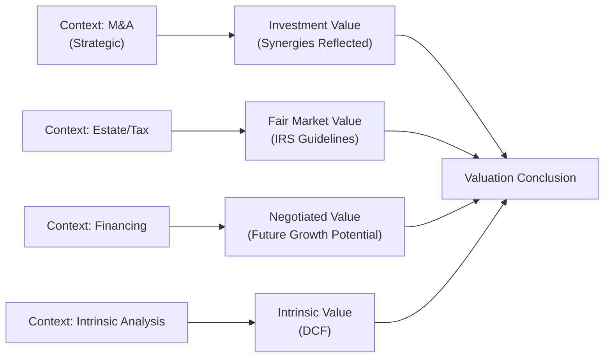

## Overview

When people first jump into valuing a private company, they sometimes get a bit intimidated. Publicly listed corporations have well-known share prices flashing across ticker screens every day, but a private company? That’s a different story. There’s no readily available share price, fewer regulations around disclosures, and often a lot of emotional attachment if the business has been in the family for decades. Private valuation can feel murky, yet it’s an essential skill for many finance professionals. This section explores why private company valuations are done in the first place, how context shapes the analysis, and what investors (and regulators) expect from these reports.

In Section 14.1, we introduced the unique features of private companies—ranging from limited disclosures to restricted liquidity. Here, we’ll focus on a vital piece of the puzzle: understanding specific purposes and contexts. A valuation prepared for a merger might look very different from one done for a spouse’s estate planning or for setting the price in a buy-sell agreement. Each context can swing your assumptions and methods substantially.

## Mergers and Acquisitions

Mergers and acquisitions (M&A) often get the spotlight in discussions about private company valuation—well, because the stakes can be huge. If a strategic buyer wants to acquire a small manufacturing firm, they might place a premium on potential cost savings or synergies. Let’s say this small firm’s product lines would dovetail nicely with the buyer’s existing brand portfolio—suddenly, the target can be worth more to that buyer than to anyone else. This is where concepts like “investment value” and synergy come into play.

• Negotiated Transactions and Fair Price: When two parties sit down to hash out a deal, each brings their own valuation perspective. The seller might be enamored with intangible brand equity, while the buyer might see logistical synergies that reduce overhead. The resulting sale price might differ significantly from a bare-bones “fair market value,” and the buyer might justify paying more because of strategic advantages.

• Multiple Methods: In M&A contexts, you’ll often see discounted cash flow (DCF) analysis combined with market multiples. Buyers want to see whether the target’s current owners have “normalized” their earnings or if there are hidden liabilities or benefits (like underutilized assets). The valuation date—often tied to a letter of intent or final closing—must be crystal clear to both parties.

## Capital Raising or Investor Entry

A private company looking to attract venture capital or private equity is also a frequent setting for valuation. You know, it might be a promising start-up that needs growth capital. Or maybe a family-run business wants to expand operations and seeks an external investor.

• Equity Stake and Negotiations: Potential investors usually want a piece of the action, but they also want to mitigate risk. They’ll ask for a thorough analysis of cash flows, risk factors, and strategic opportunities. This negotiation process can lead to valuation "haircuts" if the company’s risk profile seems high.

• Differences from M&A: Unlike a full-blown acquisition, capital raising often values the business as a going concern, focusing on future potential. But the same fundamentals—like analytics of revenue growth, cost structure, and discount rates—still apply. Only now, the post-money vs. pre-money conversation becomes critical. That’s because the percentage ownership an investor ends up with is heavily driven by the negotiated valuation.

## Estate Planning and Taxation

Ever hear about families that hold onto a company for generations, only to face monumental estate taxes when an owner passes away? Valuation for estate planning can be both emotional and complicated.

• Regulatory Standards: In the U.S., for instance, the IRS wants valuations that follow specific guidelines. IRS Publication 561 discusses how to value different kinds of property for tax purposes; it’s not exactly nighttime reading, but abiding by it is essential to avoid disputes or penalties. Internationally, the rules can vary, but the principle is the same: legitimate, supportable valuation that can withstand scrutiny.

• Gift and Estate Taxes: Sometimes owners gift shares to relatives, or shares pass via inheritance. The “fair market value” standard typically applies, meaning you assume a willing buyer and seller with reasonable knowledge of the facts, neither under compulsion to act. Discounts for lack of marketability or minority interests may reduce the stated value—but only if they’re justified.

• Emotional Factors: Estate valuations can get personal. Owners might have built the business from scratch and believe it’s worth more than the “official” analysis shows. Clear communication about the scope of work and the standard of value is vital to avoid misunderstandings.

## Owner Exit and Succession Planning

Succession planning is often overshadowed by day-to-day operations, and some business owners push it off until it’s almost too late. But when the time comes—maybe an owner is retiring or passing the baton to the next generation—valuation is key.

• Buy-Sell Agreements: Private companies often have buy-sell agreements that define how ownership shares are transferred if an owner departs, becomes disabled, or even passes. These agreements usually specify the valuation methodology—like an adjusted book value or a third-party appraisal. The problem? If the method is outdated or never updated, the resulting valuation can be way off base.

• Family Business Dynamics: Let’s say you’ve got siblings who are all partial owners, and one wants out. That can be tricky if the business’s cash flows are lumpy or if intangible assets (like a brand reputation) aren’t easily quantifiable. A thorough, professionally prepared valuation helps ensure fairness and avoid legal battles.

## Financial Reporting

Some private companies use IFRS or U.S. GAAP voluntarily or because they have external stakeholders—banks demanding audited statements, or institutional investors who want transparency.

• Goodwill Impairment: For businesses that have grown by acquisition, you may have intangible assets and goodwill on the balance sheet. IFRS and GAAP require periodic impairment tests. Determining “recoverable amount” or “fair value less costs of disposal” can demand a formal valuation.

• Share-Based Compensation: If private companies grant stock options or other equity-based compensation, they need to value those shares or options. Public companies rely on market prices. Privates rely on formal appraisals to comply with accounting rules.

## Differences in Standards and Approaches

Valuations done for legal or tax reasons can diverge from those done for transactions. For instance:

• Tax and Legal Valuation: Might heavily emphasize formal definitions of “fair market value,” especially for estate or gift tax. Documentation is rigorous, often referencing local regulations and requiring explicit disclaimers.

• Transaction Valuation: Might lean more on “investment value,” factoring in synergies for a specific buyer. The price could be higher or lower than a general “market” approach, based on strategic motivations or intangible assets.

In short, context can shift your assumptions about discount rates, forecast horizons, or even risk premiums. You’ll want to be sure you’re matching the right standard of value to the job at hand.

## Fair Market Value vs. Investment Value vs. Intrinsic Value

These three concepts can lead to wildly different outcomes:

• Fair Market Value: The hypothetical exchange price between a willing buyer and seller, both reasonably informed and not under compulsion. Common in estate/tax contexts.

• Investment Value: The value of the business to a specific buyer or investor, considering strategic synergies or unique circumstances. This is where you might see a manufacturing firm pay a premium for a complementary product line.

• Intrinsic Value: Often used by analysts who discount future cash flows to get a “true” economic worth, irrespective of market conditions or synergy. This concept frequently appears in theoretical valuations, but in practice, synergy or control ability might cause actual transaction prices to deviate from pure intrinsic values.

When performing an analysis, identify which standard is required. Otherwise, you risk confusion, or worse, incorrect valuations that could get you in trouble if used for formal or legal processes.

## Considering Synergy Potential and Strategic Buyer Motivations

M&A deals or partial equity sales that involve strategic buyers often revolve around synergy potential. Maybe the buyer wants to integrate supply chains, cross-sell products, or unify brand identity. Or they might see cost reductions through shared technology platforms. As a result, what looks like a so-so business to a random buyer might be a gold mine to a strategic acquirer.

Synergies can be subtle, too. Let me share a real-life story—well, in simplified form. A friend helped value a small tech firm known for highly specialized enterprise software. On paper, the company’s stand-alone projections were, frankly, average. But once you factored in the acquiring firm’s distribution channels and brand presence, the combined entity could scale up faster. So the acquisition price turned out far higher than a “fair market value” approach alone might suggest. Always ask yourself: “How could the target be worth more when combined with another business?”

## The Importance of the Valuation Date

If a major business event—like launching a new product line or losing a key customer—occurs just after the valuation date, do you include that event or not? The short answer: typically, no, if you’re aligning to legal or regulatory guidelines. The idea is to reflect conditions “known or knowable” as of that date. This is crucial in estate valuations, where the date might be the day of passing for the owner. Or for M&A, the date might be pinned to the letter of intent or a specific contractual milestone. So be on guard for events that straddle that line. Document them carefully, clarifying whether they’re included in your forecasts or considered post-valuation developments.

## Documentation Best Practices

In private valuation engagements, there’s often more at stake than just a number. It’s about trust, especially if relatives or longtime partners are involved. Keep your processes transparent.

• Engagement Letters and Scope of Work: Before you begin, define exactly what you’re doing—and what you are not doing. Are you just offering a high-level estimate? Or a full-blown coverage with site visits and management interviews?

• Disclaimers: If you rely on client-provided financial statements, say so. If your valuation is not an audit, disclaim it clearly. Disclaimers protect you and help manage client expectations.

• Data Preservation and Support: Keep your working papers. If the valuation is challenged (for example, by tax authorities), you’ll need to show how you arrived at your numbers.

## Local Laws, Regulations, and Best Practices

Laws vary widely across jurisdictions. In some places, valuations might need to be performed by an accredited professional. In others, the courts might lean on established valuation guidelines from recognized international organizations like the IVSC (International Valuation Standards Council).

• U.S. IRS Regulations: In estate tax or gift tax contexts, the IRS mandates following certain definitions of “fair market value.” They may not accept valuations that deviate from established guidelines or that improperly apply discounts for lack of marketability or control.

• IFRS and International Valuation Standards: As cross-border investment becomes more common, some private companies adopt IFRS-based financial statements. Also, many valuations are performed in line with the International Valuation Standards (IVS), especially if the business assets lie across different countries.

## A Quick Formula Refresher on Valuation

Many private company valuations ultimately boil down to the concept of discounting future cash flows. Although the precise approach can vary (FCFF, FCFE, or a capitalized cash flow method), it can look something like:


\text{Value}_0 = \sum_{t=1}^{n} \frac{\text{FCFE}_t}{(1+r)^t} \;+\; \frac{\text{Terminal Value}}{(1+r)^n}


Where:  
• FCFE = Free Cash Flow to Equity in period t.  
• r = the discount rate, often derived from CAPM or a build-up approach considering size premiums, company-specific risks, etc.  
• Terminal Value = an estimate of the value at the end of the forecast horizon.

In private valuations, the discount rate (r) might be higher than for a comparable public firm because private firms often have greater risk, lower liquidity, or both. Be prepared to defend every assumption you make—especially in contexts like estate tax or M&A negotiations.

## Visualizing Valuation Contexts

Below is a simple Mermaid flowchart that shows how different contexts can lead to differences in standards of value:

## Key Takeaways

• Every valuation has a purpose. M&A, estate planning, capital raises—each demands its own approach and set of assumptions.  
• Regulatory and legal contexts can constrain or shape your methodology. Always identify which standard of value applies.  
• Synergy is a game-changer. Strategic buyers might pay more than a “fair market value” basis would suggest.  
• The valuation date matters. Determine exactly which events are “known or knowable” on that date.  
• Maintain impeccable documentation. Engagement letters and disclaimers help protect you and clarify your role.  

## Glossary

• Fair Market Value: The price at which property would change hands between a willing buyer and seller, neither being under compulsion and both having reasonable knowledge of the facts. Often used for estate and tax contexts.

• Investment Value: The value of an asset to a particular owner (or prospective owner) based on individual investment requirements, expectations, and potential synergies.

• Estate Tax Valuation: A process used to value a decedent’s assets (including private businesses) to determine tax liabilities. Strict standards often apply to these valuations.

• Succession Planning: The process of identifying and developing new leaders or owners who will replace current or departing owners—especially relevant in family businesses.

• Scope of Work: A formal description in a valuation engagement letter outlining what’s included and excluded in the analysis, ensuring clarity about deliverables and responsibilities.

## References & Further Reading

• IRS Publication 561: U.S.-specific guidance on business valuations for tax purposes.  
• “International Valuation Standards” by the International Valuation Standards Council (IVSC).  
• “Valuation for M&A: Building Value in Private Companies” by Frank C. Evans and David M. Bishop.  

## Test Your Knowledge: Purposes and Contexts for Private Company Valuation



### Which of the following statements best describes why a different valuation method might be used for an M&A deal compared to an estate valuation?

- [ ] Estate valuations are typically higher than M&A valuations.
- [x] M&A valuations may reflect synergies and strategic buyer considerations, while estate valuations usually aim for a fair market value standard.
- [ ] M&A valuations always use a cost approach, while estate valuations rely on a market approach.
- [ ] Estate valuations ignore marketability discounts, whereas M&A valuations incorporate them.

> **Explanation:** In M&A, synergies or unique strategic benefits can justify a higher price than the fair market value standard typically used for estate valuations.

### What distinguishes “fair market value” from “investment value” in private company valuation?

- [ ] Fair market value always exceeds investment value.
- [x] Fair market value uses a hypothetical buyer and seller, whereas investment value considers that specific buyer’s synergies or unique situation.
- [ ] Investment value is mandated by tax authorities, while fair market value is used for M&A deals.
- [ ] Both terms have the same definition in practice.

> **Explanation:** Fair market value generally assumes a hypothetical exchange, while investment value is what a particular buyer might pay based on their own strategic requirements.

### In estate planning contexts, why is the valuation date particularly critical?

- [x] Because events after the owner’s date of death are typically excluded from the valuation if they were not “known or knowable” at the time.
- [ ] To ensure the buyer can claim synergy-based premiums.
- [ ] It helps the company remain profitable.
- [ ] It is not relevant, as the average stock price is always used.

> **Explanation:** The valuation date often aligns with legal requirements, such as the date of death, and excludes subsequent events that were not reasonably foreseeable at that date.

### A strategic acquirer might pay more than fair market value for a private company primarily because:

- [ ] They always have excess capital.
- [x] They anticipate synergies or cost savings by combining operations.
- [ ] They want to help the seller reduce taxes.
- [ ] Fair market value never accounts for tangible assets.

> **Explanation:** Strategic buyers often include synergy or cost-savings assumptions in their valuations, raising the effective purchase price above a stand-alone fair market value estimate.

### Which scenario best exemplifies a valuation performed for financial reporting purposes?

- [x] Annual goodwill impairment analysis under IFRS.
- [ ] Valuing a family business for a sibling buyout.
- [ ] Negotiating a venture capital investment term sheet.
- [ ] Estimating synergy value for a proposed merger.

> **Explanation:** Goodwill impairment testing for IFRS or U.S. GAAP is a common financial reporting valuation context that requires regular re-assessment of intangible assets.

### Why might a private equity investor emphasize future growth potential during a valuation?

- [ ] They believe historical earnings are a perfect proxy for value.
- [ ] They are trying to reduce the company’s stated value for tax reasons.
- [x] They plan for an eventual exit strategy and want to capture significant upside.
- [ ] Fair market valuation methods forbid them from doing so.

> **Explanation:** Private equity investors often look ahead to an exit event, focusing on a company’s growth potential and eventual return on investment, which can heavily influence the valuation approach.

### When valuing a private company for owner exit and succession planning, which factor is commonly accounted for?

- [x] Buy-sell agreements that might define a specific approach or formula.
- [ ] Daily stock ticker prices to confirm the market trend.
- [ ] Guarantee of future synergies with any acquirer.
- [ ] Public guidelines requiring a pure CAPM discount rate.

> **Explanation:** Many private companies have a buy-sell agreement that outlines how shares will be priced upon an owner’s exit. That approach often incorporates specific valuation formulas or third-party appraisals.

### What is the primary reason documentation is so important in private company valuations?

- [x] To maintain transparency, clarify assumptions, and protect both valuator and stakeholders if questions arise.
- [ ] It increases the numerical value of the company.
- [ ] It is mandated by IFRS that every private company keep 100 pages of documentation.
- [ ] It helps avoid synergy-based premiums.

> **Explanation:** Private valuations can be contentious or scrutinized by tax authorities, so thorough documentation ensures credibility and clarifies how conclusions were reached.

### A valuation primarily used to inform a new venture capital investment in a private company typically focuses on:

- [ ] Diminishing the perceived growth to get a better share price for the company’s founder.
- [x] Projected cash flows, growth potential, and an appropriate (often elevated) discount rate due to startup risks.
- [ ] Solely the comparable transaction method.
- [ ] Strict adherence to estate tax guidelines.

> **Explanation:** Venture capitalists often emphasize projected future performance, applying a higher discount rate due to the risk profile and uncertain growth prospects of early-stage companies.

### True or False: “A valuation prepared for a specific buyer may differ from fair market value due to strategic factors like synergies.”

- [x] True
- [ ] False

> **Explanation:** When valuing a private company for a strategic buyer, synergies or special strategic considerations can lead to a higher or different price than a more generic “fair market value.”


