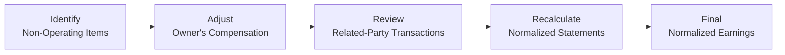

## Introduction

So, I’ve got a quick story about a family-owned bakery I once looked at—lovely folks, absolutely top-notch pastries, but their income statement was, um, chaos. Half the time, they’d bought personal groceries on the company credit card. The other half, they’d rent baking equipment from a cousin’s business at a fraction of prevailing market rates. Ever seen that in your practice? Happens more often than we’d like to admit! Whether it’s personal travel charged to the business or “friendly” transactions with relatives, private firms tend to have these twists and turns.

Why does this matter? If you’re trying to value a private company—think about a potential merger or just setting a sale price—you need an objective, reliable view of economic performance. This means taking financial statements that were never really meant for third-party scrutiny and, well, “cleaning them up.” That’s exactly where adjustments to financial statements and normalized earnings come in. Let’s dive in, discuss the essential concept of normalization, and explore how we can remove “noise” from financials so the result better approximates truly sustainable operating performance.

## Why Many Private Companies Need Adjustments

For private entities—like small family-run shops or closely held companies—financial statements aren’t always standardized in the same way as big, publicly traded firms. Owners may use company resources for personal expenses, or they might compensate themselves in unusual ways, such as very high salary or below-market rent. You know how it goes: “I’m the owner, so I pay myself what I want.” That’s totally normal. But from a valuation perspective, those decisions can distort reported earnings.

Normalized (or “cleaned up”) statements show what the company’s earnings would look like if it were run strictly as a stand-alone, profit-maximizing venture. They also reflect how a third-party buyer might reasonably operate the business in future. The objective is to eliminate or recharacterize non-operational items and discretionary expenses and recast them in a more standardized, consistent manner.

## Identifying Non-Operating and Non-Recurring Items

A big part of the normalization process involves digging around for non-operating or non-recurring items. This can require detective work—often you’ll flip through ledger entries or footnotes, searching for odd or lumpy transactions that just don’t match the usual run of business. Ask yourself: “Would this item appear if an unrelated owner were running the show with typical industry practices?”

Common examples include:

• Personal Expenses: Season tickets to a sports team, personal auto lease, or private club memberships.  
• Legal Settlements: One-time litigation events unrelated to core operations.  
• Insurance Windfalls: Gains from unusual claims, say a hurricane payout.  
• Asset Sales or Disposal: Gains and losses that only happen once (like selling an old factory).  

By removing these items, you’re attempting to present a “steady state” level of performance. Essentially, you’re saying: This is what the business looks like year in, year out, minus those quirks or random events.

### Example: Removing a One-Time Legal Settlement

Suppose a small construction company had to pay a $100,000 legal settlement for a dispute involving an old project. That’s a real cost, and it absolutely affects net income in the period it was paid. However, it’s not necessarily reflective of what normal, go-forward operations will look like. So, in normalization, you’d add this back as a one-time expense. Of course, you’d document exactly what you did, so there’s transparency.

## Owner Compensation Adjustments

In private firms, it can be tricky to figure out how to handle owner compensation. The business owner may pay themselves excessively high salaries or, conversely, might underpay themselves. Neither approach is “correct” for normalized valuation. Instead, you want to replace the reported compensation figure with a more standard, market-based compensation that a third-party manager would receive in an arm’s-length arrangement.

### Why Bother With Adjustments?

Think about it this way: if the current owner is paying themselves $500,000 per year for running a small janitorial service that otherwise would pay a professional manager $150,000, the firm’s reported net income is artificially low—because that extra compensation is more like a distribution of profits than an actual business expense. An investor looking to buy the firm wouldn’t necessarily expect to continue paying $500,000, so that difference—$350,000—gets added back to normalized earnings.

On the flipside, the owner could be underpaying themselves, which inflates net income. In that case, you’d reduce the reported earnings to reflect a realistic salary. The important principle is: determine a fair market value for the managerial role, then adjust the financial statements accordingly.

### Example: Market-Aligned Salary

Imagine a specialty retail store whose owner pays themselves $80,000 in annual compensation. If a typical manager in that role would cost $120,000, you’d reduce normalized earnings by $40,000. That’s because a new operator would probably have to pay the market rate.

## Dealing With Related-Party Transactions

Related-party transactions can be messy. Private companies may rent property from a family member at rates that are below (or above) market. Or they might buy inventory from a sibling’s company at a special discount. All these distort real business costs.

The best practice is to treat these arrangements like they were negotiated at arm’s length. If the company is paying $2,000 per month in rent for a space that would usually cost $5,000, you up the rent expense to the market level of $5,000. This reduces net income but yields a more credible reflection of how an outside investor would experience costs.

### Disclosures and Documentation

Accountants often highlight related-party transactions in the footnotes. It’s wise to read those (really carefully!) and consider whether the amounts match general industry data. If not, you’d adjust accordingly. The same is true if the transaction is artificially deflated or inflated.

## Normalizing Expenses: Common Targets

Private companies sometimes carry operating expenses that deviate from standard industry practice, especially if they’re family-run or have low governance. Here are some usual suspects:

• Rent or Lease Costs: As discussed, if you rent from a relative at an unrealistic rate, correct it to a market rate.  
• Management Fees: A holding entity might charge centralized management fees to the subsidiary. You might find that these fees are artificially low or high. Rescale them to what similar outside management services would cost.  
• Insurance: You may see insufficient or excessive insurance coverage. If the firm is over/under-insured, you can adjust the cost to align with typical coverage ratios in that industry.  

Ultimately, you want to see if the business is paying for more (or less) than the typical amount of overhead, and then tweak that number. It’s a balancing act: each adjustment should be consistent with the going-forward scenario.

## Addressing Cyclical and Seasonal Industries

Some industries, like agriculture or tourism, have big cyclical or seasonal swings. A single year’s data can become misleading if that year happened to be a “peak” or “trough.” So, you might use a multi-year average—maybe three-year or five-year average adjusted earnings—to factor out these ups and downs. You could also do a weighted average if recent performance is more relevant but still want to incorporate older data.

### Example: Weighted Averages for a Cyclical Manufacturer

Let’s say a small steel fabrication firm experiences a strong business cycle every four to five years. Using a trailing three-year average might reasonably capture normal results, but you’d still watch for outliers. If two of the years had unusual capital expenditures or extreme margin improvements, you’d need to separate one-off effects from any genuine cyclical uptrend.

## Professional Judgment and the Risk of Bias

Here’s the sticky part: these adjustments require a healthy dose of professional judgment. After all, deciding which expenses are truly “non-recurring” can be subjective. Two advisors might interpret the same transaction differently. This is particularly sensitive because owners might want to minimize taxes yet maximize business valuation—go figure. Or the sellers might argue that everything is normal, while the buyers claim a lot of income is artificially inflated.

The best approach? Err on the side of transparency. Document your reasoning clearly:

• Why you treated a given expense as non-recurring (or recurring).  
• How you arrived at market-based levels for owner compensation.  
• What data sources you used to set the “fair” related-party transaction rates.  

That way, a third party—like a potential buyer, appraiser, or auditor—can follow your logic.

## Maintaining an Audit Trail

You absolutely want an audit trail, even if you’re not performing a formal audit. That means you tie every single adjustment back to the original financial statements. Let’s say you add back a discretionary expense of $15,000 from a single ledger entry. Note the date, the nature of the entry, and precisely how you adjusted it. This helps prevent double-counting or forgetting an offset somewhere else.

Below is a basic process flow you might use:

It might look simple here, but in practice, each of these steps can involve lengthy analysis. Make sure your notes detail what was changed, where the numbers came from, and any key assumptions.

## Putting It All Together: A Quick Illustrative Example

Let’s do an extremely simplified set of numbers. Suppose you have ABC Co., a private family-owned business. Their current net income for the year is $500,000. You discover the following:

• The owner pays themselves $300,000, but market data says a similar job would command $150,000.  
• The company had a $40,000 gain from selling old, idle equipment.  
• The company paid $24,000 of personal expenses for the owner’s family travel.  
• The rent paid to the owner’s uncle was $12,000 below standard market rent.  
• A $50,000 “one-time” legal settlement artificially depressed net income.

Let’s see how to adjust:

1. Reduce owner compensation to $150,000 → This reduces the expense by $150,000 and raises net income by $150,000.  
2. Remove the $40,000 gain from selling old equipment → This lowers net income by $40,000.  
3. Eliminate the personal expenses ($24,000) → Add those back to net income.  
4. Increase rent expense by $12,000 → Net income goes down by $12,000.  
5. Add back the one-time legal settlement of $50,000 → Net income goes up by $50,000.

Revised net income calculation:

• Original net income: $500,000  
• Add back half of owner’s salary ($150,000) → $650,000  
• Subtract equipment sale gain ($40,000) → $610,000  
• Add back personal expenses ($24,000) → $634,000  
• Subtract additional rent ($12,000) → $622,000  
• Add back legal settlement ($50,000) → $672,000  

Hence, the normalized net income is $672,000 instead of $500,000. That’s a pretty significant swing—showing you just how important normalization can be in a private-company valuation. Of course, each line item needs thorough documentation so external parties can see why your normalized figure is valid.

## Conclusion and Key Takeaways

• Private company statements often contain personal or discretionary expenses, along with irregular transactions.  
• Normalization is all about removing these distortions, so you get a more realistic gauge of operating performance.  
• Adjusting owner compensation to a fair market value is often one of the biggest changes.  
• Related-party transactions must be scrutinized to ensure they reflect arm’s-length terms.  
• If the business is cyclical or highly seasonal, consider using multi-year or weighted averages to smooth out extremes.  
• Proper documentation and an audit trail are crucial for credibility.  
• Above all, remain transparent and reasonable, as these adjustments can be subjective and open to dispute.  

Normalizing earnings is a central pillar in private company valuation. If you ever find yourself sifting through a messy set of financials—like that family-run bakery I mentioned—just remember: your ultimate goal is to figure out what the business truly earns on a sustainable basis, outside the quirks and personal preferences of ownership.

## References & Further Reading

• Guide to Financial Statement Analysis (AICPA)  
• Corporate Finance and Valuation by Robert Parrino and David Kidwell  
• Valuation Handbook – Guide to Cost of Capital, Duff & Phelps  

## Evaluate Your Mastery: Adjustments and Normalized Earnings



### Which statement best describes the purpose of normalizing a private company’s financial statements?

- [ ] To enhance the firm's tax benefits by recognizing additional expenses.
- [ ] To obscure personal expenses embedded in the financial statements.
- [x] To remove non-recurring, discretionary, and non-operational items, revealing sustainable earnings.
- [ ] To comply strictly with IFRS or US GAAP disclosure requirements.

> **Explanation:** Normalization removes items that do not reflect the business’s ongoing performance (like non-recurring and personal expenses) so that valuation reflects sustainable results.

### A private company’s owner has drawn a salary 60% above what a typical market-rate manager would earn. In normalizing earnings, how should this be treated?

- [ ] No adjustment is needed because owner compensation is discretionary.
- [x] The owner’s compensation is reduced to the market rate, increasing net income.
- [ ] The excess salary must be capitalized as goodwill.
- [ ] The difference is removed entirely from the financials with no disclosure.

> **Explanation:** Overly high owner compensation is typically reduced to a fair market rate. The net income is subsequently increased by the difference between the actual compensation and the market-based compensation.

### Which of the following is most likely to be classified as a non-operating or non-recurring item?

- [ ] The monthly lease payments for a company warehouse.
- [ ] Salaries for your key sales reps.
- [ ] Yearly advertising expenses consistent with industry norms.
- [x] A one-time legal settlement for a patent infringement lawsuit from 10 years ago.

> **Explanation:** A one-time legal settlement from a past dispute is a prime example of a non-recurring cost unrelated to normal operations.

### If a private company is renting warehouse space from the owner’s brother at half the typical market rate, how should an analyst adjust for valuation purposes?

- [ ] Increase rent expense to match market rates, thereby reducing normalized earnings.
- [x] Increase the reported rent expense so it reflects arm’s-length terms.
- [ ] Decrease the reported rent expense to align with competitor data.
- [ ] No adjustment is needed, because the transaction is legal.

> **Explanation:** Related-party rent is usually adjusted to what an independent landlord would charge. This lowers net income if the current private arrangement is discounted.

### Which of the following items would best be considered discretionary and, therefore, a candidate for normalization?

- [ ] Depreciation on core manufacturing equipment.
- [x] Billings for the owner’s personal gym membership.
- [ ] Interest expense from a long-term bank loan.
- [ ] Operating lease expense for the store location.

> **Explanation:** Personal gym memberships for an owner are not true business expenses and are typically removed when normalizing earnings.

### True or False: Adjusting owner’s compensation is only necessary when the pay is above market, not when it’s below market.

- [ ] True
- [x] False

> **Explanation:** Owner’s compensation can be too high or too low. Both situations must be corrected to a fair market value so net income is not understated or overstated.

### When dealing with a cyclical industry, which normalization approach can capture a more representative earnings figure over time?

- [ ] Only using the most recent year’s earnings.
- [ ] Taking an average of the peak and trough years exclusively.
- [x] Using multi-year averages (e.g., 3–5 years) or weighted averages.
- [ ] Valuing each year separately and ignoring cyclical swings.

> **Explanation:** In cyclical businesses, multi-year or weighted averages help smooth out ups and downs, providing a more stable approximation of ongoing earnings.

### If a private company experienced a large insurance settlement gain from a rare event, how is this typically treated in normalized earnings?

- [ ] The amount is included in perpetuity to boost the firm’s value.
- [ ] The settlement is capitalized onto the balance sheet as intangible value.
- [ ] The entire settlement is recognized as if it will recur annually.
- [x] The settlement is viewed as non-recurring and removed from normal operations.

> **Explanation:** Non-recurring gains, such as an unusual insurance payout, are excluded from normalized earnings to prevent inflating the firm’s valuation.

### In the normalization process, what is the most important reason for maintaining a thorough audit trail of all financial statement adjustments?

- [ ] It prevents the possibility of any legal action against the firm.
- [ ] It allows the accountant to remove or ignore transactions whenever preferred.
- [ ] It ensures that IFRS guidelines are automatically satisfied.
- [x] It ensures transparency, lets third parties validate the changes, and reduces the risk of double-counting.

> **Explanation:** A well-documented audit trail builds trust, clarifies your assumptions, and avoids confusion when external parties (like investors or auditors) examine your valuation work.

### True or False: Adjustments to financial statements for normalized earnings are entirely objective with no element of judgment.

- [ ] True
- [x] False

> **Explanation:** Determining which items are truly discretionary or non-recurring often involves subjective judgment and can differ between analysts.


