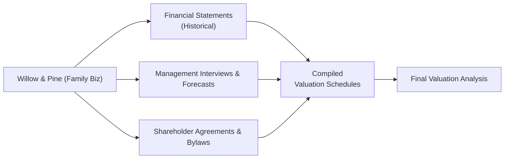

## Introduction

Imagine this scenario: You’ve just arrived at the office of Willow & Pine, a mid-sized family-owned business that’s excited (and maybe a bit nervous) about bringing on external investors. The founder (let's call him Mr. Hirsch) is preparing to sell a minority stake in the firm, but after a few minutes chatting, you realize they only have partial financial records readily available. On top of that, management casually mentions that some of the company’s expenses might be “mixed” with personal spending. Uh oh. Right away, you can see why private company valuation often involves more detective work than public company valuations.

In this short piece, we’ll explore the critical steps in setting up a private-company valuation vignette, focusing on identifying and collecting the right information. We’ll look at what data you need, how to spot areas that might be incomplete, and how to gently press management for clarifications. It’s all about building a comprehensive “data request list” that ensures you don’t overlook something vital. Because, you know, sometimes that one missing transaction can unexpectedly swing an entire valuation.

## Outlining the Scenario

Willow & Pine is generating moderate annual revenue and is actually quite profitable—at least on paper. Mr. Hirsch and his immediate family built the company from scratch, focusing on specialty woodworking tools. They’re famous in certain circles (like custom furniture makers), so there’s a lot of intangible value in the brand. However, the financial statements (and how those statements are prepared) may not always reflect the true economic reality.

• They have one in-house accountant who also doubles as Mr. Hirsch’s personal assistant.  
• Financial statements sometimes get prepared by an external CPA “when needed.”  
• The business has never had an external audit.  
• Management’s forecasts? They’re sketched out on spreadsheets that are “kind of up to date.”

Your objective is to figure out exactly what data is available, what’s missing, who is responsible for each piece of the puzzle, and how to systematically request it.

## Key Data You’ll Typically Request

When you step into a private company valuation, it’s best to start with a methodical approach. Laying out your “data request list” prevents confusion later—and gives you a strong tool for clarifying the scope of your analysis. Here are some of the items you generally want to gather:

• Historical Financial Statements (5+ Years)  
  - Income statements, balance sheets, and cash flow statements for multiple periods.  
  - Getting five years (or more) of statements can help identify longer-term trends and any cyclical patterns.  
  - Watch for statements prepared on a cash basis vs. accrual basis—private firms sometimes switch methods mid-stream, which is, well, complicated.

• Management’s Internal Forecasts and Budgets  
  - A forward-looking perspective is essential for valuation, but private firms might have informal or incomplete projections.  
  - Verify that the assumptions behind those forecasts are consistent with historical performance or realistic growth opportunities.  
  - Pay attention to single critical staff members (like Mr. Hirsch) who might strongly influence sales and cost estimates.

• Family-Related or Personal Expenses  
  - This is a big one. Sometimes private company owners run personal costs through the business (e.g., paying for a family vacation out of the business checking account).  
  - Investigate large “miscellaneous” or “administrative” expense lines for potential personal components.  
  - Politely ask about one-time personal expenses or related-party transactions that might distort the profit figures.

• Shareholder Agreements, Bylaws, or Partnership Interests  
  - Understanding the ownership structure is crucial. Are there silent partners? Are there special share classes?  
  - Identify any restrictions on transfer of shares or mandatory buyout provisions.  
  - These documents might reveal potential future obligations or guarantees.

• Loan Covenants and Off-Balance-Sheet Obligations  
  - Confirm any debt agreements, lines of credit, or third-party guarantees.  
  - Be sure there aren’t hidden liabilities (like a personal guarantee the owner signed for a supplier).  
  - Off-balance-sheet items can alter the risk profile significantly (e.g., unrecorded leases, pending litigation, or side deals).

## Questioning Management & Key-Person Dependencies

Let’s say you’re investigating whether Mr. Hirsch’s presence drives the bulk of the company’s sales. If he’s both the top product innovator and the main salesperson, that’s a huge key-person dependence. What happens if he steps away? Potential investors might worry that revenue will plummet if Mr. Hirsch stops delivering personal attention to top clients.

• You might ask:  
  “Who are your top five clients, and how did you establish those relationships?”  
  “Which employees are responsible for product development? Are there any transitions planned?”  

• If you hear something like, “Well, we don’t really track brand loyalty, but people know me on a first-name basis,” that suggests intangible goodwill that might not outlive a founder’s exit.

## Spotting Potential Red Flags

In private company valuation, it’s not unusual to spot irregularities that raise questions. Some red flags to keep on your radar:

• Large Fluctuations in Expenses  
  - If last year’s administrative expenses doubled compared to prior years but revenue was flat, that might signal unrecorded personal costs or poorly allocated overhead.

• Significant Related-Party Transactions  
  - Maybe the company buys supplies from another family-owned entity. Are prices at arm’s length?  
  - Or the business rents facilities from a building owned by Mr. Hirsch’s brother-in-law at below-market rates. This can artificially inflate or deflate the company’s reported profitability.

• Undocumented Loans  
  - Private owners might lend personal funds to the company or vice versa with no clear contract.  
  - This can muddle the balance sheet and mask real liquidity risks.

• Missing Permissions or Licenses  
  - If the business operates in a regulated space (like certain manufacturing processes), you’ll want to confirm that the required licensure is valid and up to date.

## Structuring the Data for Valuation

Once you know the data you need, you’ll want to organize it into a set of worksheets or summary schedules for further analysis. Typical examples include:

• Revenue & Expense Trend Report  
  - Break down top-line sales by product category or major customers for each year.  
  - Summarize major expense categories and note any spikes or anomalies.

• Ratio Analysis Worksheet  
  - Common-size income statements and balance sheets to see if the expense structure is consistent over time.  
  - Compare industry benchmarks if available (sometimes tricky for niche businesses).

• Adjustments & Normalizations  
  - List items that might need adjusting, like owners’ salaries that exceed or fall below market rates.  
  - Flag personal expenses that are run through the business and correct them to reflect a more accurate profit measure.

• Disclaimer Page  
  - Anything uncertain or impossible to verify should get documented here.  
  - For example: “We have not verified actual amounts for unrecorded liabilities or personal transactions.”  
  - Emphasize these disclaimers to limit exposure and highlight potential sources of error in the valuation.

Below is a simple conceptual diagram that demonstrates how information flows from the family-owned business to your structured compilation:

## Using a Data Request List

Professionals often share an explicit document with the client listing every piece of data they require. This helps set clear expectations and ensures that both parties remain organized. A typical data request list might look like this:

• Five years of audited or unaudited financial statements (Income Statement, Balance Sheet, Cash Flow)  
• Latest internal forecasts, budgets, and strategic plans  
• Comprehensive list of any personal or family-related expenses run through the company  
• All corporate governance documents (shareholder agreements, minutes of board meetings, partnership arrangements)  
• Details on debt obligations, loan covenants, and off-balance-sheet commitments  
• Information on any related-party transactions (e.g., property leases, family members on payroll)  
• Employment contracts or key-person insurance policies for top management  
• Major customer contracts or distribution agreements  
• Historical capital expenditures and ongoing capital requirements  
• Any relevant intellectual property rights, patents, or brand assets  
• Organizational chart with roles and responsibilities  

It’s perfectly normal that your list might evolve. Hey, sometimes you uncover a new arrangement (like the founder personally guaranteeing the bank loan with their house) you weren’t even aware existed until a side comment in conversation.

## Emphasizing Disclaimers

When pieces of information are missing or appear unreliable, disclaimers become your friend. Document them carefully so there’s no confusion regarding the reliability of your analysis. For instance:

“Assumption: The lease arrangement between Willow & Pine and the Hirsch family property is at fair-market rent. This assumption is based solely on management’s representation and has not been independently verified.”

This kind of disclosure can really help you if, weeks later, you discover the rent arrangement was at a fraction of normal market rates.

## Conclusion and Best Practices

Valuing a private business is often as much about data-gathering and building trust with management as it is about applying valuation formulas. In many family-run enterprises, the lines between “business” and “personal” spending can be blurry. Your job is to methodically peel away those layers to see what’s truly happening under the hood.

• Be thorough yet diplomatic when requesting clarifications, especially around personal expenses.  
• Anticipate that older documents might not be well-organized or might be missing.  
• Compile all received information into clearly labeled schedules, noting assumptions.  
• Identify red flags early and address them with management so you can mitigate issues before they morph into major valuation obstacles.

With all that in place, you’ll be well on your way to creating a thorough and defensible valuation for any private enterprise. And for Willow & Pine, they’ll either complete that minority sale or attract an investor with eyes wide open. That’s a win-win, right?

## Glossary

• Vignette-Style Question: An exam-style format presenting a case scenario with multiple data points, followed by questions testing analytical skills.  
• Family-Owned Enterprise Context: A scenario where interpersonal family relationships may shape the flow of information, requiring more sensitivity and discretion.  
• Data Request List: A comprehensive document or checklist outlining all required financial, operational, and legal information needed for thorough analysis.  
• Red Flag: An alert or warning sign indicating potential issues, inaccuracies, or risks within the data or operations.

## References & Further Reading

• “Equity Investments” within official CFA Institute materials (especially private company valuation case studies).  
• Harvard Business Review Case Studies on Private Company Operations.  
• “Advanced Private Equity Term Sheets and Series A Documents” (National Venture Capital Association).  

---------------------

## Test Your Knowledge: Key Private Company Data Collection Quiz



### 1. Which of the following BEST explains why five or more years of historical statements are preferred when analyzing a private company?

- [ ] To simplify and speed up the valuation process.  
- [x] To observe financial performance trends and cycles over an extended timeframe.  
- [ ] Because private companies are required by law to share five years of data.  
- [ ] To ensure personal expenses can be easily hidden.  

> **Explanation:** Longer historical data sets help detect patterns, significant shifts, and cyclical trends—particularly important in private companies that may have irregular normalizations or personal expenses woven in.

### 2. In evaluating key-person risk at a family-owned business, which question would be MOST effective in uncovering areas of potential over-reliance on the founder?

- [ ] “How many years of experience does your founder have?”  
- [x] “Who is responsible for building and maintaining relationships with top customers?”  
- [ ] “What software do you use for your accounting?”  
- [ ] “How many shareholders are currently in the business?”  

> **Explanation:** The question targeting relationships with top customers helps identify whether the founder is the primary driver of sales and growth, revealing potential dependence risk.

### 3. Which of the following might signal a RED FLAG when analyzing private company expenses?

- [ ] Consistent costs for legal services each year.  
- [x] A sudden, unexplained tripling of “miscellaneous expenses.”  
- [ ] Minimal changes in inventory methods.  
- [ ] Gradual increase in utility costs over time.  

> **Explanation:** A spike in “miscellaneous” expenses without reasonable justification often indicates possible personal expenses or misallocations that need deeper investigation.

### 4. Why is it important to request documents like shareholder agreements or bylaws during a private company valuation?

- [ ] They provide evidence of management’s day-to-day reliability.  
- [x] They clarify ownership rights, potential restrictions, and buy-sell provisions that can impact valuation.  
- [ ] They detail the founder’s personal net worth.  
- [ ] They explain historical expense fluctuations.  

> **Explanation:** Shareholder agreements typically define who controls what, whether certain triggers grant ownership shifts, or if there are forced liquidity events. These factors can significantly affect valuation outcomes.

### 5. Which item is LEAST likely to appear on a typical data request list for a private company valuation?

- [ ] Historical financial statements.  
- [x] Competitors’ proprietary data.  
- [ ] Loan covenants with banks.  
- [ ] Internal management forecasts.  

> **Explanation:** Competitors’ proprietary data wouldn’t ordinarily be available. Private firms can look to industry benchmarks, but that’s not “internal data” you’d expect from the subject company.

### 6. When you discover an undocumented loan from the owner to the company, what should you do NEXT?

- [x] Seek clarification on key terms and confirm the interest rate, repayment schedule, and reason for the loan.  
- [ ] Assume it is immaterial and ignore it.  
- [ ] Immediately classify it as personal expense.  
- [ ] Report the business for financial misconduct.  

> **Explanation:** A standard procedure is to clarify repayment terms and gather official documentation (if any). Undocumented loans significantly impact both liabilities and the fair value estimate.

### 7. What is the BEST way to handle potentially unverifiable data in private company valuation?

- [ ] Use the data without adjustment, trusting management’s word.  
- [ ] Omit all questionable data from the valuation.  
- [x] Include disclaimers in the valuation report and note assumptions about incomplete data.  
- [ ] Report inaccurate data to regulatory authorities.  

> **Explanation:** Valuing private companies often involves incomplete or questionable info. Documenting assumptions and disclaimers reduces the risk of misrepresentation and clarifies data limitations.

### 8. In the context of family-owned businesses, why might related-party transactions require additional scrutiny?

- [x] They may not reflect true market rates and can skew profitability estimates.  
- [ ] They are typically subject to extra taxes and fees.  
- [ ] They rarely affect the company’s valuation.  
- [ ] They are usually documented uniformly in all scenarios.  

> **Explanation:** Related-party transactions can be above or below market rates, resulting in misleading reported expenses or revenues. Investigating these ensures more accurate normalization of financials.

### 9. If a family-owned firm’s founder stores personal vehicles and boats on the company’s premises at no apparent cost, which ratio would MOST likely be impacted?

- [x] Profit margin ratios, due to understated warehouse or insurance costs.  
- [ ] Liquidity ratios, because it affects accounts receivable.  
- [ ] Turnover ratios, because vehicle depreciation is recorded under office expenses.  
- [ ] Return on equity, because intangible assets are misallocated.  

> **Explanation:** Personal assets stored on business premises for free could result in understated storage or insurance costs, artificially inflating profit margins.

### 10. True or False: It’s acceptable to rely solely on a single-year forecast if the rest of the financial data is missing or unclear.

- [ ] True  
- [x] False  

> **Explanation:** One year’s forecast alone provides insufficient basis for a robust valuation, especially in a private setting where trends, normalizations, and potential adjustments often matter more than a single-period estimate.


