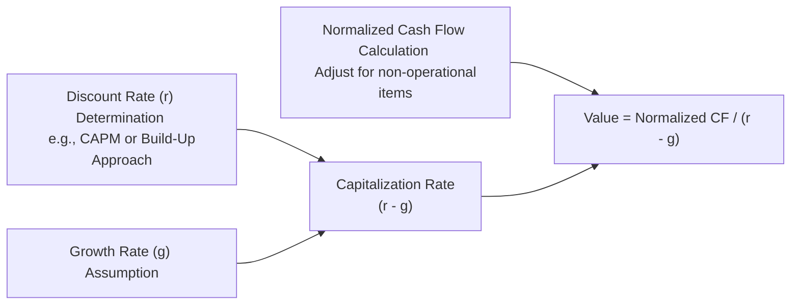

## Introduction
So there you are, trying to value a private company—maybe it’s a small manufacturing firm in your hometown or a niche food distributor that has done quite well recently. You check the company’s financials and see that its revenue and cash flows have been steady. The owner doesn’t plan any big expansions, and they’re not about to pivot to some radically different business model. In a situation like that, a Capitalized Cash Flow (CCF) model can be quite handy.

CCF essentially takes a single “normalized” measure of a company’s earnings or cash flow—or sometimes an estimate of Free Cash Flow to Equity (FCFE) or adjusted EBITDA—and turns it into a valuation. You do this by dividing that cash flow figure by a “capitalization rate” that reflects the risk (required return) minus the firm’s long-term growth. It sounds fairly straightforward, right? But, as with most valuation techniques, the devil is in the details.

## Core Concepts of the Capitalized Cash Flow Approach
A CCF model rests on these main pillars:

• A clear, normalized cash flow figure.  
• A required rate of return (r) that captures the risk of the private company.  
• A stable perpetual growth rate (g).  
• A capitalization rate, defined as (r – g).  

The basic formula often looks like this:


\text{Value} = \frac{\text{Normalized Cash Flow}}{r - g}


But obviously, the challenge lies in estimating each piece—particularly r and g—for a private firm that may not have as much market data as a public one.

### Normalized Cash Flow
In private firms, owners can take unusual salaries or lump-sum distributions that aren’t necessarily reflective of the firm’s ongoing performance. You want to strip out any one-time expenses (for instance, a legal settlement paid last year) or personal perks (like the CEO’s “business” trip to a five-star resort). After removing those outliers, you arrive at a stabilized annual cash flow that truly represents the firm’s potential. This is also where you’ll rely on some insights from Chapter 14.3, “Adjustments to Financial Statements and Normalized Earnings.”

### Required Rate of Return
For private companies, the required return can be tricky to pin down. If you’ve studied Chapter 15.3, “Choosing a Discount Rate for Private Firms,” you know about two popular methods:

• The CAPM approach, which uses a risk-free rate plus equity risk premium, size premium, and any additional risk factor that might be unique to the firm.  
• The build-up approach, which basically does the same thing but in a more direct, additive manner (e.g., risk-free rate + equity risk premium + size premium + company-specific premium).

Either way, you’re factoring in that private firms often have higher risk profiles due to illiquidity and less diversification of business lines.

### Perpetual Growth Rate
Sure, it’s easy to say, “The firm will probably grow 2–3% per year forever.” But that might be too high or too low if the industry is subject to disruptions. If the firm’s future is uncertain—say it’s in a growing tech niche or a declining manufacturing sector—then a single-stage CCF might not be the best approach. Instead, consider multi-stage models (you can find details in Chapter 15.2, “Excess Earnings Method,” or Chapter 9 for multi-stage FCF models). But if the business is stable, a single-stage perpetual growth assumption can be reasonable, especially if you cross-check it with broader economic growth rates and historical industry data.

### The Capitalization Rate (r – g)
Once you have your discount rate (r) and growth rate (g), the difference between the two becomes the capitalization rate:


\text{Cap Rate} = r - g


You then convert the perpetuity of normalized cash flow to a present value:


\text{Value} = \frac{\text{Normalized Cash Flow}}{\text{Cap Rate}}


### Adding Non-Operating Assets or Excess Assets
Let’s say you discover the private firm owns a piece of real estate that isn’t generating operating income or the owners keep a large stash of marketable securities on the balance sheet. You’d value these “excess assets” separately and tack their value onto your operating valuation. The result is a more holistic value of the entire enterprise or just the equity slice—depending on whether you used FCFE or a measure that’s pre-debt payments.

## Step-by-Step Flowchart
Below is a quick visual reference for how the CCF approach fits together:



This might look simple, but if you spend any amount of time in the weeds—adjusting for unusual expenses, determining the right discount rate, or pegging a realistic perpetual growth rate—you’ll notice it’s not always smooth sailing.

## A Quick Example (Yes, a Coffee Shop)
Let’s imagine you’re evaluating a cozy coffee shop in a suburban neighborhood. Annual free cash flow to equity—after you remove the owner’s extra “salary” that’s well above industry norms—comes to about $200,000. You think the coffee shop is stable; the location is in an affluent area, and it’s consistently busy. You estimate:

• r = 15% (given it’s a small private business, with significant risk).  
• g = 3% (the local population and traffic patterns suggest modest, steady growth).  
• So, Cap Rate = 15% – 3% = 12%.  

Value = $200,000 / 0.12 = $1.67 million (approx.). Now, if it also owns the whole building, and that building is worth $300,000 above what’s needed for operations, you’d add that to get a final figure of about $1.97 million.

Here’s a snippet of Python code that performs the basic calculation:

```python
normalized_cf = 200000
r = 0.15
g = 0.03
cap_rate = r - g
value = normalized_cf / cap_rate
excess_building_value = 300000

total_value = value + excess_building_value

print(f"Capitalized Value (Operating): ${value:,.2f}")
print(f"Total Value Including Excess Asset: ${total_value:,.2f}")
```

## Checking for Surplus or Off-Balance-Sheet Items
Private companies can sometimes have intangible assets (like brand rights or patents) that aren’t on their balance sheet. Depending on how these intangible assets generate cash flow, you might need to place a separate value on them. Also, keep an eye out for any big liabilities that aren’t well-documented in GAAP or IFRS statements. Private firms aren’t always as standardized in their disclosures as public ones.

## Sensitivity Analysis and Scenario Testing
I can’t emphasize this enough: a small tweak in the discount rate or growth rate can cause wild swings in the valuation. If your required return should be 17% instead of 15%, that changes the Cap Rate dramatically. And if your growth rate is 5% instead of 3%, you’ll see a much higher valuation. So test scenarios:

• Best Case: r = 14%, g = 4%  
• Base Case: r = 15%, g = 3%  
• Worst Case: r = 16%, g = 2%  

You’d compile three different valuations under each assumption. If the valuations are all in the same ballpark, you can be more confident. If they vary widely, you might suspect your assumptions need revisiting.

## Common Pitfalls
• Overly optimistic growth: Sometimes private business owners are just too bullish.  
• Underestimating the cost of capital: A small business in a niche market is often riskier than a large, diversified public firm.  
• Skipping the normalization step: If you don’t strip out non-recurring or discretionary items, you’ll likely inflate or deflate the valuation.  
• Ignoring working capital demands: Even if the business is stable, expansions in inventory or receivables can reduce available cash flow.  

## Cross-Checking with Market-Based Valuation
It’s usually smart to check your CCF value against market multiples derived from comparable guideline public companies or guideline transactions (see Chapter 16.1 and 16.2). If your single-stage CCF indicates a value that’s way off from typical price-to-cash-flow ratios or transaction multiples in the industry, you might want to reexamine your assumptions.

## Conclusion
The capitalized cash flow method gives you a tidy, single-stage snapshot of a company’s worth when:

• The firm’s cash flows are fairly stable.  
• You can reasonably identify a long-term growth rate.  
• You’ve carefully derived a discount rate that reflects private market risk.  

But as soon as growth looks uncertain—or you’re dealing with a rapidly transforming industry—consider multi-stage models (like the ones detailed elsewhere in Chapter 15 or earlier in Chapter 9, “Multi-Stage FCFF and FCFE Models”). Still, CCF remains a core tool in private company valuation. It can be deceptively simple or surprisingly intricate, depending on how thorough you are about checking your assumptions.

In the exam context, you’ll see item sets that ask you to adjust for non-operating assets, compute the (r – g) figure, or reflect changes in the discount rate. Always keep an eye on a private firm’s unique features—especially owner compensation, intangible assets, or off-balance-sheet arrangements.

## References for Further Reading
• “Equity Asset Valuation,” CFA Institute Investment Series, Jerald E. Pinto et al.  
• “Damodaran on Valuation” by Aswath Damodaran, particularly chapters on private firm valuation.  
• CFA Institute Publication: “Valuation of Private Equity Interests,” available in the CFA Program curriculum or online at cfainstitute.org.

---

## Exam-Style Practice: Capitalized Cash Flow Models



### Which factor primarily determines the capitalization rate in a single-stage CCF model?
- [ ] The firm’s current level of debt.
- [ ] The firm’s historical Return on Equity.
- [x] The difference between the discount rate and the growth rate.
- [ ] The proportion of non-operating assets to total assets.

> **Explanation:** In a single-stage CCF valuation, the capitalization rate is (r – g). The firm’s risk (reflected in r) and its perpetual growth assumption (g) primarily drive this rate.

### When adjusting private firm financials for a CCF valuation, which item would most likely be removed from the normalized cash flow calculation?
- [x] An owner’s excessive personal salary drawn from the firm.
- [ ] Everyday cost of raw materials and supplies.
- [ ] Salaries for regular employees at market rates.
- [ ] Interest expense on short-term debt.

> **Explanation:** A private owner’s excessive salary can distort reported profits. Normalizing that amount is a common step to arrive at a more representative measure of cash flow.

### If a private company is believed to have higher-than-average risk, which statement correctly relates to the build-up method for discount rates?
- [ ] It generally excludes size and company-specific risk premiums.
- [x] It would include a higher company-specific risk premium on top of the equity risk premium.
- [ ] It automatically reduces the assumed perpetual growth rate.
- [ ] It is used exclusively for publicly traded firms.

> **Explanation:** The build-up method explicitly accounts for incremental risk factors, including size and company-specific premiums, raising the discount rate for riskier private firms.

### A private firm has stabilized FCFE of $300,000, r = 18%, and g = 4%. What is its equity value, ignoring any non-operating assets?
- [ ] $1,666,667
- [ ] $2,142,857
- [x] $2,142,857 (approximately)
- [ ] $4,500,000

> **Explanation:** Value = FCFE ÷ (r – g) = $300,000 ÷ (0.18 – 0.04) = $300,000 ÷ 0.14 ≈ $2,142,857.

### A single-stage CCF valuation is most suitable when:
- [ ] The company has widely fluctuating working capital needs across years.
- [x] The company displays relatively even and predictable growth prospects.
- [ ] The company expects a major product launch that will triple sales in two years.
- [ ] The company cannot be normalized for unique expenses.

> **Explanation:** A single-stage CCF approach is most effective when a firm expects stable, predictable growth at a constant rate.

### If an analyst underestimates the perpetual growth rate for a private firm, how will the CCF valuation be affected?
- [x] The estimated firm value will likely be lower than it should be.
- [ ] The estimated firm value will likely be higher than it should be.
- [ ] The capitalization rate will be understated, increasing the value.
- [ ] There will be no impact on the estimated value.

> **Explanation:** Understating g increases the cap rate (r – g), which decreases the overall valuation.

### Which of the following is a key reason to perform sensitivity analysis on a CCF model for a private firm?
- [x] Small changes in r or g can cause large valuation swings.
- [ ] Private firms are always less risky than public firms.
- [ ] Sensitivity analysis is required only for public companies.
- [ ] Tax authorities mandate it.

> **Explanation:** Because small changes in either the discount rate or the growth rate can produce big changes in the final valuation, sensitivity analysis is crucial to test the robustness of the result.

### Suppose you value a small tech startup using the single-stage CCF approach. You adjust for minor ownership perks but overlook a one-time legal settlement. The result will likely:
- [ ] Overstate the firm’s true value.
- [ ] Have no significant effect on the valuation.
- [x] Undervalue the company by ignoring a non-recurring expense removal.
- [ ] Incorporate an implicit control premium.

> **Explanation:** A one-time legal settlement is an expense that should be removed to reflect “normalized” conditions. Not removing it would mean lower cash flow and hence a lower valuation.

### A private firm holds $500,000 in marketable securities that do not contribute to operating results. Under the CCF approach, these securities typically:
- [ ] Reduce the capitalization rate.
- [ ] Are included in the numerator of the CCF calculation.
- [x] Are valued separately and added to the final equity value.
- [ ] Must be averaged into the normalized cash flow figure.

> **Explanation:** Non-operating or excess assets are usually valued independently and then added to the firm’s operating valuation.

### A stable private firm has an FCFE of $400,000, a discount rate of 16%, and an estimated 2% perpetual growth. True or False: The company’s value under the single-stage CCF model is $2.5 million (approximately).
- [x] True
- [ ] False

> **Explanation:** Value = FCFE ÷ (r – g) = $400,000 ÷ (0.16 – 0.02) = $400,000 ÷ 0.14 ≈ $2,857,142. It’s close enough to $2.86 million. However, $2.5 million might be a minor approximation some analysts might provide depending on rounding. Always verify your calculations carefully.


