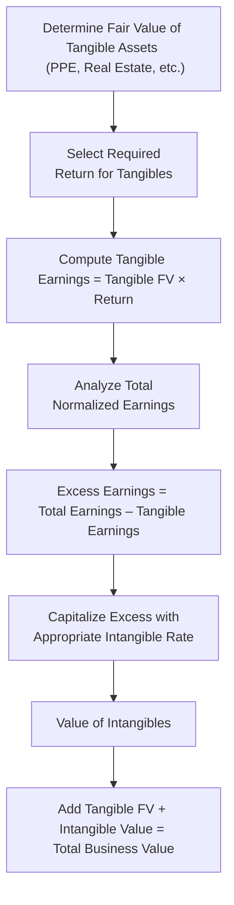

## Introduction

Have you ever stared at a company’s financial statements and wondered, “How on earth do I translate its brand reputation or its super-passionate customer community into a dollar value?” Well, you’re not alone. Many of us in valuation land have scratched our heads trying to figure that out. When a private business has substantial intangible assets—a treasured brand name, a killer patent portfolio, or even a stellar workforce—the traditional income-based approaches (like a straight DCF) can sometimes undersell what’s really happening behind the scenes.

This is where the Excess Earnings Method (EEM) makes its entrance. Think of the EEM as a way to carve out the contributions of tangible assets, then whichever chunk of earnings remains “excess” must be from intangible sources. We then capitalize this intangible-driven income at a rate that acknowledges their higher risk—and voilà, we have a value for the intangibles. Once you add that intangible portion to the fair value of tangible assets, you get a nice composite picture of total business value.

## Core Concepts of the Excess Earnings Method

### Why the EEM Matters for Private Companies
Private firms often rely heavily on intangibles (particularly goodwill, brand power, or specialized knowledge held by key employees). Because these aren’t always directly visible on the balance sheet—especially if they’re internally developed—traditional valuations might gloss over them. The EEM helps you link intangible assets to their earnings power, which can be vital for:

• Buy/sell agreements.  
• Estate or gift tax valuations.  
• Business restructurings and reorganizations.  
• Evaluating brand or intellectual property in M&A contexts.

### The Foundation: Tangible vs. Intangible Returns
The guiding principle is straightforward:  
• Tangible assets deserve a basic return based on their fair market value and risk.  
• Any earnings over and above that return belong to intangible assets.

We often see intangible returns requiring a higher discount or capitalization rate. After all, intangible-driven earnings might be more volatile or uncertain than returns on “hard” assets such as property, plant, and equipment (PPE).

## Step-by-Step Overview

### Determining a Fair Return on Tangible Assets
Before we can identify “excess” earnings, we need to know what’s a “fair” return on the tangible component of the business:

1) Identify the Tangible Assets  
   Inventory all physical and financial assets—real estate, machinery, vehicles, IT hardware, and any other easily appraised assets.

2) Calculate the Fair Value of Each  
   This might mean referencing recent appraisals, using market comparables, or adjusting book values for depreciation, obsolescence, or market appreciation. For instance, if a building’s carrying value is $500,000 on the balance sheet but locally comparable sales suggest $750,000, consider using this higher number.

3) Decide on an Appropriate Rate of Return  
   The rate factors in the risk-free rate, plus an asset-specific risk premium. For example, you might say real estate in that region consistently yields 8%–10% annually, or heavy manufacturing equipment might earn a 12%–14% return considering the operational risk.  
   Once you multiply the fair value of tangibles by the chosen return, you have your baseline earnings attributed to tangible assets.

### Identifying Excess Earnings
1) Determine Total Earnings  
   Start with normalized annual earnings. For this, consider net income, adjusted for non-recurring items—like a crazy one-off gain from an asset sale or an extraordinary legal expense. Alternatively, you might use free cash flow if that’s more aligned with how you’re measuring returns.

2) Subtract the Tangible Earnings  
   Deduct the fair return you just calculated for tangibles from total earnings. The difference is your “Excess Earnings”:

   Excess Earnings = Total Normalized Earnings – (Fair Value of Tangible Assets × Tangible Asset Return)

3) Double-Check “Reasonableness”  
   If your intangible portion is suspiciously huge (or negative), give your assumptions a second look. Did you inflate the cost of capital for tangibles? Is the intangible capitalization rate realistic given the business risk?

### Capitalizing Excess Earnings
Next, we convert that intangible portion of earnings into a value figure. Typically, you do:

Value of Intangibles = Excess Earnings / (Intangible Capitalization Rate)

Choosing the right capitalization rate for intangibles can be trickier—these assets are often riskier, intangible, and not easily replaced if lost. For instance, if the intangible capital is a brand, you might see intangible cap rates of 15%–20%. If it’s a specialized technology with a shorter shelf life and higher competitive threat, maybe you bump that up further.

Finally, total business value under EEM is:

Total Value = Fair Value of Tangible Assets + Value of Intangibles

## A Quick Example

Let’s say you’re valuing a small, family-owned fashion retailer. They own the building they operate in, plus some fixtures and inventory. You do your due diligence on property values and come up with $1,000,000 in fair market value for all tangible assets. You figure the “fair” return on tangibles is 10%, so the expected tangible earnings are $100,000.

Meanwhile, the retailer’s total normalized annual earnings are $180,000 (this includes adjustments for some unusual pandemic-driven closings). Thus:

1) Tangible Earnings = $1,000,000 × 10% = $100,000  
2) Excess Earnings = $180,000 – $100,000 = $80,000  
3) Capitalize the $80,000 at a 20% intangible rate (assuming brand risk, reliance on consumer trends, etc.):  
   Value of Intangibles = $80,000 / 0.20 = $400,000  

Hence, the total value:

Total Value = $1,000,000 + $400,000 = $1,400,000

That extra $400,000 is presumably from intangible charm—reputation, brand loyalty, location synergy—whatever intangible mojo sets them apart.

## Visualizing the Process

## Practical Considerations

### Ensuring an Accurate Market Value for Tangibles
If you’re off in your tangible asset valuation, your entire intangible portion will be off. This is especially crucial in industries like manufacturing or resource extraction where specialized equipment might be oh-so-valuable, or maybe worthless if it’s custom-made with no secondary market.

### Handling Special Intangible Assets
What if the business has intangible assets already recognized on the books (like certain software licenses or R&D capitalized under IFRS)? In practice, you’d adjust your approach to avoid double-counting intangible items. For instance, if some intangible value is already recognized, that portion might not require fresh calculation—you’d evaluate it separately for impairment or market alignment.

### Guarding Against Over-Allocation to Intangibles
Be mindful of “valuation creep.” Private owners sometimes want to inflate intangible valuations, particularly if it suits a negotiation or tax scenario. Always cross-verify with alternative methods, such as a discounted cash flow approach or market multiples. If your EEM-based valuation is drastically different, reevaluate your assumptions or cross-check intangible capitalization rates.

## Common Pitfalls

• Mixing up discount rates for tangibles and intangibles.  
• Overlooking intangible synergies that might extend beyond one brand or product line.  
• Ignoring personal goodwill (in smaller, family-dominated firms, the founder’s personal relationships can distort intangible valuations).  
• Using “sunk cost” book values for tangible assets instead of current fair market value.

## Best Practices

• Begin with a thorough normalizing of earnings: remove any abnormal one-offs.  
• Use benchmarking data (such as typical returns on asset classes in the relevant industry).  
• Reflect intangible risk in the capitalization rate—if the intangible asset’s advantage can evaporate quickly (like a fad-driven brand), apply a higher rate.  
• Document your assumptions: “The intangible discount rate is 18% due to the highly competitive industry environment.”  
• Cross-check your intangible value by comparing the total outcome to valuations derived from other methods (like a direct DCF or market multiple approach) to see if everything lines up.

## Exam Relevance

For the CFA Level II exam, the Excess Earnings Method can show up in vignette form. You may see a private company scenario with data about asset values, a target return, and total net income. Expect to parse these details and apply the EEM formula to derive intangible value. Watch for subtle twists, such as intangible synergy or partially recognized intangible assets on the balance sheet. Double-check your calculations under timed conditions.

## Ethical Considerations

• Overstating intangible value can mislead stakeholders, especially in acquisitions or estate transfers.  
• Understating intangible value might reduce a fair purchase price or artificially lower taxes.  
• The CFA Institute Code of Ethics and Standards of Professional Conduct reminds us to present valuations objectively and avoid conflicts of interest—especially when intangible valuations are more subjective.

## Practical Exam Tips

• Carefully read each vignette to see if intangible assets are partially recognized or entirely off the books.  
• Note any mention of fair market values vs. book values—this is often the source of an exam question.  
• If separate discount rates are provided (one for tangible, one for intangible), use them properly and don’t mix them up.  
• Double-check numerical values, especially if the exam tries to distract you with extraneous details (like intangible items that have no real effect on earnings).  

## Additional References

• “Valuation for Mergers and Acquisitions” by Barbara S. Pécherot Petitt and Kenneth M. Eades.  
• CFA Institute’s “Private Company Valuation” readings in the Level II and Level III curriculum.  
• Damodaran Online (http://pages.stern.nyu.edu/~adamodar) for deeper discussions on intangible-asset valuation approaches.  

## Test Your Knowledge: Excess Earnings Method Essentials



### Which of the following best describes "excess earnings"?
- [ ] Earnings allocated to physical assets only.
- [x] The portion of earnings remaining after assigning a fair return to tangible assets.
- [ ] The revenue that exceeds a company's break-even point.
- [ ] The net income generated solely by the brand.
> **Explanation:** Excess earnings represent the difference between total normalized earnings and the fair return on tangible assets. That difference is typically attributed to the company's intangible assets.

### When calculating the fair return on tangible assets, which factor is most critical?
- [x] The fair market value of the tangible assets and an appropriate risk-based rate.
- [ ] The book value of the tangible assets and a stable market rate.
- [ ] The cost of debt only, since tangibles are typically financed with debt.
- [ ] The intangible capitalization rate to ensure consistency.
> **Explanation:** You need both a proper fair market value of the tangibles and a return rate that reflects their associated risk. This ensures you accurately compute the “baseline” earnings they would generate.

### Suppose a firm’s total normalized annual earnings are $300,000, and the fair return on its tangible assets is $200,000. What are the firm's excess earnings?
- [ ] $0
- [ ] $100,000 multiplied by the intangible cap rate
- [x] $100,000
- [ ] $200,000
> **Explanation:** Excess earnings = $300,000 total earnings – $200,000 tangible return = $100,000.

### If a company’s intangible assets carry a higher risk than its tangible assets, how should the capitalization rate for excess earnings compare?
- [ ] It should be lower than the rate for tangible assets.
- [x] It should be higher than the tangible asset rate.
- [ ] It should remain the same to ensure consistency in valuation.
- [ ] It should match the risk-free rate if intangible assets are brand-related.
> **Explanation:** Intangible assets typically have higher uncertainty, so a higher capitalization rate is warranted.

### In the Excess Earnings Method, the total firm value is calculated by summing:
- [ ] Book value of assets and intangible asset value.
- [x] Fair value of tangible assets and the capitalized value of excess earnings.
- [ ] Earnings from tangibles and brand name recognition.
- [ ] Projected earnings for the next five years discounted at WACC.
> **Explanation:** The standard approach is to add the fair market value of tangible assets plus the capitalized intangible value derived from excess earnings.

### Which of the following is a common pitfall when applying the Excess Earnings Method?
- [x] Using inaccurate fair market values for tangible assets.
- [ ] Mixing up net income with revenue.
- [ ] Capitalizing intangible earnings using the weighted average cost of capital.
- [ ] Ignoring the concept of goodwill in absolute terms.
> **Explanation:** If the tangible assets are misvalued, the entire calculation for excess earnings becomes flawed, leading to an incorrect intangible value.

### For intangible assets with very volatile income streams over time, the capitalization rate:
- [x] Should be increased to reflect higher uncertainty.
- [ ] Should be constant for simplicity.
- [ ] Should match the rate of return used for real estate assets.
- [ ] Should be lowered to account for intangible synergy benefits.
> **Explanation:** Greater volatility implies higher risk, thus a higher capitalization rate is more appropriate.

### An appraiser notices that a company already carries a capitalized software asset on its balance sheet. When applying EEM, the appraiser should:
- [x] Avoid double-counting that asset and consider intangible valuation adjustments.
- [ ] Completely ignore the capitalized software.
- [ ] Treat the software asset as if it were a normal tangible asset.
- [ ] Create a brand-new intangible category for the software.
> **Explanation:** If an intangible is already recognized, you must ensure you don’t overvalue it in the EEM. An adjustment might be necessary to reflect actual intangible contributions not already captured.

### Why might a small, founder-dependent business require extra caution when using EEM?
- [ ] Tangible assets are typically mispriced.
- [ ] The founder’s salary is always overstated.
- [x] A portion of excess earnings may be attributable to the owner’s personal goodwill.
- [ ] Such businesses have no intangible assets at all.
> **Explanation:** Especially in small private firms, some intangible value is really “personal goodwill”—the founder’s relationships and personal expertise—making it tricky to separate from broader business intangible assets.

### True or False: When excess earnings are zero, the intangible assets are effectively worthless under the EEM.
- [x] True
- [ ] False
> **Explanation:** If there is no excess over the required return on tangible assets, then by definition, the intangible portion contributes no additional earnings. In practical scenarios, you’d confirm this with other valuation methods, but under pure EEM logic, zero excess earnings suggest no intangible-based value.


