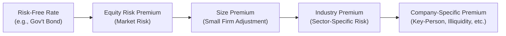

## Introduction

Deciding on the right discount rate when valuing a private company is rarely as straightforward as plugging numbers into a standard CAPM formula. You know how it goes in real life—private businesses usually come with a greater dose of risk: reliance on one superstar founder, narrower customer bases, limited liquidity, and so on. So if you’re thinking, “Hmm, a plain old CAPM approach might not fully capture all that,” you’re spot on.

This section explores those extra layers of risk and shows how analysts typically account for them, particularly within the income approach to valuation. Although we’ll spend much of our time on the all-important Build-Up Method, we’ll also check out how a traditional CAPM approach often needs to be expanded for private firms. By the end, you’ll (hopefully) feel confident about selecting discount rates for private businesses—whether you’re doing a straightforward capitalized cash flow model or a multi-stage DCF.

## The Need to Adjust for Private Firm Risks

Private firms directly expose investors to several risks that public companies don’t face as severely:

• Illiquidity Concerns: Because private shares can’t be quickly offloaded on a major stock exchange, there’s a higher required return to compensate for that illiquidity.  
• Key-Person Dependency: Often, the business revolves around an owner or a small group of people. If they leave—or get burned out—the business can collapse in a heartbeat.  
• Ownership Concentration: A handful of customers might account for most of the revenue. Or a single product line might be the company’s entire bread and butter.  
• Smaller Scale: Size definitely matters in risk. Smaller companies often face a tougher time accessing capital or sustaining large downturns.

In short, that discount rate needs to be higher to reflect these hidden (or not-so-hidden) red flags. If you forget to layer in these extra risk premiums, you could dramatically overvalue the company.

## CAPM-Based Approaches for Private Firms

Sure, the CAPM approach was originally intended for publicly traded securities (where you can observe betas, etc.). But in private valuations, you can still do the following, with some modifications:

• Start with a Risk-Free Rate (usually a long-term government bond maturity).  
• Add the Market Equity Risk Premium (ERP).  
• Estimate or proxy a Beta for the private firm using comparables.  
• Add a Size Premium if the firm is substantially smaller than typical public peers.  
• Layer in a Company-Specific Risk Premium (CSRP) to capture unique exposures like key-person risk, illiquidity, or unusual product concentration.

Sometimes you’ll see Beta replaced by “fundamental betas” or “synthetic betas” derived from industry proxies, but the rest of the approach remains similar. For example, let’s say you’re valuing a niche craft brewery run by a single founder. If the public comparables (large beer companies) have a Beta of around 1.0, you might pin the private brewery’s Beta slightly higher or add a fatter CSRP, because the small, private company partly depends on that single founder for marketing, operations, and growth impetus.

## The Build-Up Method

Because private companies often lack observable market betas, a lot of practitioners go with the Build-Up Method. Essentially, you start at a base risk-free rate and then add incremental premiums for each risk factor you identify:

• Risk-Free Rate: Typically a long-term government bond yield.  
• Equity Risk Premium (ERP): The average additional return demanded by equity investors over Treasury bonds.  
• Size Premium: Sourced from historical data (e.g., Duff & Phelps or Ibbotson SBBI) to reflect the higher risk of small firms.  
• Industry Premium: Sometimes pulled from industry-specific data if it exists.  
• Company-Specific Premium: This is a catch-all for unique attributes—like reliance on one superstar salesman or concentration in a single geographic region.

### Common Magnitudes

• Risk-Free Rate might be around 2–5% historically (though this can jump around with macroeconomic conditions).  
• Equity Risk Premium can range 4–6% in many markets.  
• Size Premium can range from 1% to 5% or more (some extremely small microcap data suggests even higher).  
• Company-Specific could add, say, 2–5% again, depending on that firm’s special vulnerabilities.

Putting it together, a final discount rate can easily fall between 10–20+% for a small, private enterprise. It occasionally creeps even higher—especially if the business is in a volatile niche.

## Cross-Checking Discount Rates

Once you compute a final discount rate, it’s helpful to do reality checks:

• Compare to Observed Private Transactions: If you have access to data on recent acquisitions or equity stakes in similar private companies, see if your discount rate lines up.  
• Compare to Public Businesses: If your private discount rate is suspiciously close to a large public competitor’s cost of capital, you may be missing a chunk of private risk premium.  
• Adjust for Economic Environment: In high-inflation or high-volatility periods, discount rates can shift quickly.

Also, consider that private deals often hinge on relationships, negotiation power, and synergy potential. So the “observed discount rate” might not always be purely an objective reflection of risk.

## Capitalized Cash Flow vs. Multi-Stage DCF

No matter which discount rate you pick, it’s going to have a big effect on final valuation, especially if you’re using an income-based approach:

• Capitalized Cash Flow Method: Here, you assume a single measure of normalized cash flow grows at a stable rate forever. So you typically pick a single, constant discount rate.  
• Multi-Stage DCF: If the firm is in a development stage or you expect shifting risk profiles, you might vary the discount rate by projection phase. For instance, maybe a 15% rate applies for the first few uncertain years, stepping down to 12% once the firm matures.

I once worked on valuing a small publisher that planned to shift its revenue mix from an older print catalog to fully digital products. During the transition, the company faced multiple expansions, rebranding, and additional marketing outlays—essentially higher risk. To reflect that, we assigned a higher discount rate in the early years. But as the digital strategy stabilized, we tapered it closer to industry averages.

## Common Pitfalls

• Underestimating the Size Premium: People sometimes think small shops are less risky if they’ve been around a while or if the owner is “smart.” But from a market perspective, smaller is riskier.  
• Forgetting Key-Person Risk: If a huge chunk of sales depends on personal relationships, the discount rate must capture that.  
• Relying Too Heavily on Public Betas: Public betas are useful reference points, but the real-world operational risk of a private company can be dramatically higher.  
• Failing to Scrutinize Industry Data: “Industry premium” might be inconsistent or dated. Make sure you’re using up-to-date, reputable sources.

## Mini Case Example

Let’s take a fictional example—Ben’s Gourmet Baklava, a small pastry business relying heavily on local clientele and famous for its unique Middle Eastern desserts. Owner Ben is the star, and the brand is intimately linked to him being on site daily.

• Risk-Free Rate: 4% (10-year government bond).  
• Equity Risk Premium: 5% (for the broad equity market).  
• Size Premium: 3% (small local business).  
• Industry Premium: 1% (baked goods category sees moderate volatility).  
• Company-Specific Premium: 3% (Ben’s brand revolves around him personally, so key-person risk is high).

When we add these up, we get 4% + 5% + 3% + 1% + 3% = 16%. That might feel high, but we have to remind ourselves: this is a small, closely held operation with big reliance on one person. And that’s exactly why we add those premiums.

## Best Practices and Critical Thinking

• Document All Assumptions: Regulators, auditors, or clients will want to see why you picked each premium.  
• Use Multiple Sources: Ibbotson SBBI, Duff & Phelps Valuation Handbook, or other empirical studies.  
• Make It Empirical: If possible, gather private deal multiples or discount rates of similar businesses.  
• Update for Market Conditions: If interest rates rise significantly, rework your discount rate accordingly.  
• Don’t Overcomplicate: Especially for stable small firms with well-known local markets, keep your approach systematic, but don’t weigh down your analysis with excessive (and perhaps spurious) detail.

## References for Further Study

• Duff & Phelps Valuation Handbook: Offers size and industry premium data, widely used in practice.  
• Ibbotson SBBI Yearbook: Historical risk premiums for bonds, stocks, and different asset classes.  
• CFA Institute Materials: Look for readings in “Equity Valuation” and “Alternative Investments” for advanced coverage on private and illiquid investments.  
• “Valuing a Business” by Shannon P. Pratt and Alina V. Niculita: Classic reference for general private valuation approaches.

## Practice Questions: Choosing the Right Discount Rate in Private Valuation

Below are some sample exam-style questions to help you test your understanding of discount rate determination for private firms. Practice these, and you’ll be better prepped for the complexities of private valuation scenarios on exam day.

## Test Your Knowledge: Discount Rate Essentials for Private Firms



### Which of the following is the primary reason a private firm’s discount rate is generally higher than a similar public firm’s?

- [ ] The public firm has weaker internal controls.  
- [ ] The public firm typically faces fewer regulations.  
- [x] The private firm has higher illiquidity and key-person risk.  
- [ ] The private firm has greater international diversification.  

> **Explanation:** Private companies often lack liquidity, rely heavily on a small number of owners or key staff, and cannot access wider public capital markets. These factors contribute to a higher discount rate.

### An analyst is valuing a small private enterprise and uses the CAPM approach. The beta is derived from public peers. Which additional premium is most essential to recognize private-specific risks?

- [ ] Beta premium  
- [x] Company-Specific Risk Premium  
- [ ] Valuation premium  
- [ ] Investment premium  

> **Explanation:** A Company-Specific Risk Premium (CSRP) is added to account for risks not captured in a market beta, such as owner dependence or limited customer base.

### When calculating a discount rate via the Build-Up Method, which of the following is not typically included?

- [ ] Risk-free rate  
- [x] Currency conversion premium  
- [ ] Industry premium  
- [ ] Equity risk premium  

> **Explanation:** The Build-Up Method rarely features a specific currency conversion premium. It does include the risk-free rate, equity risk premium, industry premium, size premium, and potentially a company-specific risk premium.

### If a private firm heavily depends on one executive who owns 80% of the equity and single-handedly manages operations, which premium is most critical to reflect this unique situation?

- [x] Company-Specific Risk Premium  
- [ ] Market equity premium  
- [ ] Industry premium  
- [ ] Risk-free rate increment  

> **Explanation:** Key-person risk belongs under the Company-Specific Risk Premium. It’s one of the most direct ways to capture that vulnerability.

### In a multi-stage DCF for a private company, when might an analyst consider using different discount rates in different periods?

- [x] When the company’s risk profile changes over time  
- [ ] When government bond yields are stable  
- [x] When specific operational phases differ in uncertainty  
- [ ] Never—discount rates must remain constant  

> **Explanation:** Risk can evolve, especially if the company transitions from a startup phase to a mature stage. It’s completely reasonable to alter the discount rate to match varying risk levels over time.

### Suppose an analyst uses the following inputs for a Build-Up Method: 3% risk-free rate, 5% equity risk premium, 2% size premium, 1% industry premium, and 4% company-specific premium. What is the resulting discount rate?

- [x] 15%  
- [ ] 14%  
- [ ] 13%  
- [ ] 16%  

> **Explanation:** Summing them up = 3% + 5% + 2% + 1% + 4% = 15%.

### Which scenario below best illustrates the significance of an industry premium?

- [x] A biotech firm with higher regulatory and research risks than a retail shop  
- [ ] A single-person accounting practice located in a suburban neighborhood  
- [x] A steel manufacturer with extreme cyclical demand  
- [ ] A money market fund in a stable interest rate environment  

> **Explanation:** Certain industries, such as biotech or cyclical industries, warrant an additional premium due to specific, systematic risks inherent to their operations (e.g., FDA approvals, commodity price swings).

### Which source is frequently used for deriving size premiums in private valuations?

- [ ] Gordon Growth Model  
- [x] Duff & Phelps Valuation Handbook  
- [ ] Short-term Treasury bills  
- [ ] Nonparametric market analysis  

> **Explanation:** The Duff & Phelps Valuation Handbook provides empirical data regarding size and industry risk premiums. Ibbotson SBBI is also commonly referenced.

### If an analyst notices that the discount rate for a private company is only slightly higher than that for a large publicly traded competitor, what should the analyst most likely do next?

- [x] Revisit assumptions for missing private-related risks  
- [ ] Conclude that the private firm is unusually safe  
- [ ] Remove the risk-free rate from the calculation  
- [ ] Disregard the current discount rate estimate  

> **Explanation:** If the private discount rate is suspiciously low, an analyst should re-check for omitted or underweighted private risks such as liquidity or key-person dependency.

### In general, does adding a size premium to the discount rate assume that smaller firms are riskier?

- [x] True  
- [ ] False  

> **Explanation:** Yes, smaller firms typically face greater variability in revenues, limited access to capital, and fewer resources—hence size premium adjusts for that increased risk.


