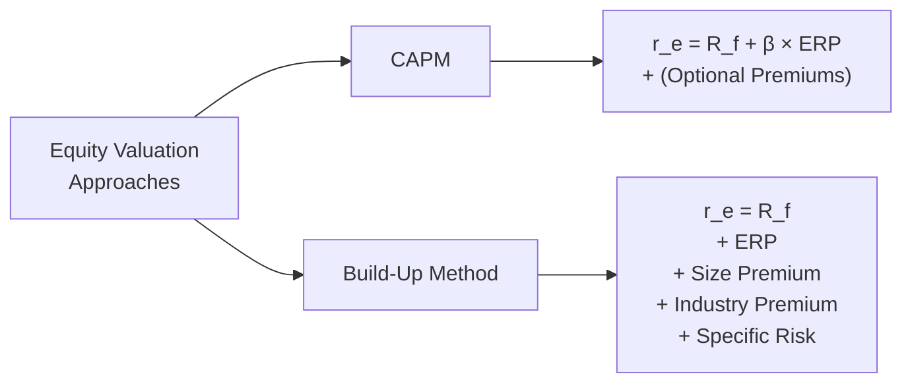

## Introduction

If you’ve ever found yourself staring down the barrel of a private company valuation and wondering, “Hmm, should I go with the tried-and-true CAPM or the more direct build-up approach?”—you’re definitely not alone. Especially in the CFA Level II context, the exam loves to test your ability to pick the right technique to nail down the cost of equity for that family-owned bakery or the niche manufacturing firm that has half of its revenue from a single giant customer.

In short, we have two main ways to find the cost of equity:

• CAPM (Capital Asset Pricing Model): Rigorously ties required return to market risk (systematic risk).  
• Build-Up Approach: Adds various “premium layers” on top of a risk-free rate.

Below, we’ll walk through a concept-by-concept discussion, highlight exam-friendly shortcuts, sprinkle in a few personal experiences, and provide a vantage point for both methods. And yes, we’ll throw in a little practice scenario to bring these ideas to life.

## Quick Refresher on CAPM and Build-Up Approach

### CAPM at a Glance

CAPM says:


r_\text{equity} = R_f + \beta \times \text{(Equity Risk Premium)} + \text{Other Premiums}


Where:
• \\( R_f \\) is the risk-free rate.  
• \\( \beta \\) measures how the stock’s returns move relative to the overall market.  
• Equity Risk Premium (ERP) is what investors demand over the risk-free rate to compensate for market risk.  
• “Other Premiums” might include small-cap premium, industry premium, or some measure of extra risk for private firms.

Traditionally, CAPM is big in public equity analysis because you can find betas for a comparable set of public companies. But with private firms, especially if they’re smaller or they have unique risk factors, CAPM alone can end up missing a chunk of risk. That’s where we start tacking on “company-specific risk premiums” or “customer concentration premiums.”

### Build-Up Approach in a Nutshell

The build-up approach stacks up the required rate of return from various blocks. We generally start with the risk-free rate, then tack on the broad equity risk premium, the size premium, and so forth. If you want a simplified formula:


r_\text{equity} = R_f + \text{ERP} + \text{Size Premium} + \text{Industry Risk Premium} + \text{Company-Specific Premium}


The build-up approach can be especially practical for private firms with limited market data. Rather than rummaging around for a good “beta,” you can just gather typical premiums from market-based research (think Duff & Phelps or Ibbotson data) and then layer them.

## Visualizing CAPM vs. Build-Up

Below is a quick Mermaid diagram to illustrate how these two frameworks might differ in structure:



Notice how CAPM focuses on β (beta) as the multiplier for market risk, while the build-up method just enumerates each risk factor one by one.

## Embracing the Vignette Format

In the CFA Level II exam’s item-set (vignette) questions, you might be handed a scenario like this:

• The analyst calculates cost of equity using CAPM:  
  – \\( R_f = 2.0\% \\) (maybe a long-term Treasury yield)  
  – \\( \beta = 1.2 \\) (from a set of guideline public companies)  
  – Equity Risk Premium = 5%  

So you do:


r_\text{equity,\ CAPM} = 2.0\% + 1.2 \times 5\% = 2.0\% + 6.0\% = 8.0\%


• They also mention that the firm is small (with less than \$50 million in revenue). Perhaps the data says the size premium is 3%.  
• They mention that 40% of total revenue comes from a single key customer. Some might add a 2% to 3% premium.  
• They reference an industry risk premium (based on the firm’s specialized product line) of 1.5%.

Then your build-up method might look like:


r_\text{equity,\ build-up} = 2.0\% + 5.0\% + 3.0\% + 1.5\% + 2.5\% 
= 14.0\%


Now you see the difference: 8.0% from a plain-vanilla CAPM vs. 14.0% from a full build-up. The exam might ask: “Which approach is more appropriate for this private company?” or “Reconcile the difference in discount rates, or pick which discount rate is best used in your final valuation.”

## Why You Might Use One Over the Other

• CAPM can be handy and academically grounded, but it relies heavily on accessing a meaningful beta that’s representative of the private firm’s systematic risk. If your private firm is in a stable industry with many good public comps, CAPM might be just fine—though you’ll still have to plug in an extra premium for the firm-specific risk.  
• The build-up approach is often simpler if you’re dealing with no easy comps or if the firm’s risk profile is unusual (e.g., founder is about to retire, heavily concentrated customer base, or a brand that depends on a single influencer).  

In practice, you might run both approaches to see if they yield consistent or drastically different results. Then you adjust or reconcile the final discount rate with your best judgment.

## Practical Example with Python

Let’s say you want to compute the discount rate using the build-up approach for a private company with the following parameters:

- \\( R_f = 3\% \\)  
- Equity Risk Premium = 6%  
- Size Premium = 2.5%  
- Industry Risk Premium = 1.5%  
- Company-Specific Premium = 3.0%  

In Python code:

```python
risk_free = 0.03
equity_risk_premium = 0.06
size_premium = 0.025
industry_premium = 0.015
company_specific_premium = 0.03

cost_of_equity = (
    risk_free
    + equity_risk_premium
    + size_premium
    + industry_premium
    + company_specific_premium
)

print(f"Cost of equity (Build-Up) = {cost_of_equity*100:.2f}%")
```

When you run this, you’ll get:

Cost of equity (Build-Up) = 14.50%

That’s a straightforward build-up calculation. With CAPM, if you were to use a public comparable beta (let’s imagine 1.1), you might do:


r_\text{CAPM} = 3\% + 1.1 \times 6\% \approx 9.6\%


Then you’d step back and think, “Ah, a 9.6% discount rate might not be enough to cover the extra operational or key-person risk.” That’s the moment where you add an extra 2–3% to account for the unsystematic (private) risks not captured in CAPM, inching it closer to the 14.5% from the build-up approach.

## Common Mistakes and Pitfalls

• Mixing up risk premia: Some candidates inadvertently add an Industry Risk Premium inside the CAPM beta or double-count it. Make sure each premium is only counted once.  
• Using a risk-free rate inconsistent with the cash flow horizon: If your valuations rely on a long-term projection, it’s typically better to use a long-term government bond yield.  
• Overlooking “key-person” risk: For many private firms, the brand or the relationships are intimately tied to the founder or a small group of managers. If that risk isn’t captured in beta, you’d better explicitly account for it elsewhere.  
• Overstuffing the discount rate: Sometimes it’s tempting to throw every conceivable risk into the discount rate, resulting in an improbably high required return. If you’re adding a 5% premium for “new CFO risk,” be sure you’re not layering redundant “management risk” again.  
• Underestimating private firm risk: On the other hand, ignoring firm-specific risk altogether can drastically undervalue a company’s real vulnerability. 

## Vignette-Tailored Exam Strategies

• Carefully read question prompts: They often set up data with partial or contradictory info. For example, maybe they give you a standard CAPM formula but also hint at a concentration risk. That’s your cue to add an extra premium if you choose CAPM.  
• Double-check the definitions: Are you asked for FCFE-based discount rates? That typically means cost of equity. If the question references FCFF, you might be dealing with WACC. Make sure you keep your approach consistent with the given cash flows.  
• Watch for “plug-in” mistakes: The exam might give you a risk-free rate in decimals (0.03) and an equity risk premium in percentage points (6%). Or they might provide monthly figures. Always unify your math.  
• Reconcile if needed: If the item-set asks, “Why does the build-up approach yield a higher discount rate than CAPM?” you can mention the explicit firm-specific premium that is often missing from a plain CAPM.  

## Additional Considerations

• **Systematic vs. Unsystematic Risk**: CAPM primarily captures systematic (market) risk. For a private company, you’ve got a lot more unsystematic exposures. The build-up approach highlights that.  
• **Customer Concentration**: This is a big deal in real life. If one or two clients represent 60% of your revenue, you’d want a jacked-up discount rate because losing that customer is catastrophic.  
• **Post-Valuation Worksheets**: I’ve personally found it helpful to maintain a step-by-step “worksheet” that clarifies each risk premium or discount factor. That way, if you do end up with an oddly high or low discount rate, you can see at a glance which premium might be out of whack.  

## Further Reading and References

• CFA Program “Equity Investments” curriculum for Level II, focusing on “Private Company Valuation” and “Cost of Capital” chapters.  
• “Investment Valuation” by Aswath Damodaran—has entire sections devoted to CAPM, alternative models, and the build-up approach.  
• SSRN or ResearchGate—search for “private company discount rate,” “size premium research,” or “build-up method vs. CAPM.” You’ll find plenty of empirical papers analyzing real data for small and midsized private firms.

Try to practice those item-set vignettes and see which approach resonates better given the data. The exam is less about memorizing formulas and more about applying the right technique in the right context.

## Practice Questions: CAPM vs. Build-Up Approach for Private Companies

Below is a set of item-set style questions to help you test your knowledge and exam readiness.

## CAPM vs. Build-Up Approach Practice Quiz



### The discount rate under a plain CAPM approach for a stable private firm appears noticeably lower than a build-up approach. Which factor most likely explains the larger discount rate difference?

- [ ] Beta in the CAPM approach remains too high for a stable private firm.  
- [x] The build-up method explicitly includes additional risk factors such as small size or key-person risk.  
- [ ] CAPM fails to include the equity risk premium.  
- [ ] The risk-free rate used in CAPM is always higher than that used in the build-up method.

> **Explanation:** The build-up method specifically adds a premium to account for unique private firm risks, such as small size, key-person risk, and concentrated customers—risks that a plain CAPM might not fully capture.


### A private company has the following data: Risk-free rate = 3%, Beta = 1.2, Equity Risk Premium = 5%. Using CAPM, what is the cost of equity without any additional adjustments?

- [ ] 6.0%  
- [ ] 7.2%  
- [ ] 8.0%  
- [x] 9.0%

> **Explanation:**  
> CAPM = 3.0% + (1.2 × 5.0%) = 3% + 6% = 9%.

---

### If you suspect that a privately held manufacturing firm’s concentrated customer risk is not captured by beta, which method (or adjustment) is most appropriate to reflect that specific risk in the discount rate?

- [ ] Use a lower risk-free rate.  
- [x] Add a specific premium in a build-up approach or augment CAPM with a firm-specific risk factor.  
- [ ] Use a smaller equity risk premium.  
- [ ] Choose a public firm’s beta as a direct substitute.

> **Explanation:**  
> Concentration risk is unsystematic and typically not captured by beta. You’d add a separate premium in the build-up approach or tack on a company-specific risk premium when using CAPM.

---

### An analyst calculates a 14% cost of equity via the build-up approach but only 10% via CAPM. The main reason for the difference is likely to be:

- [ ] The difference in the risk-free rates used between the two approaches.  
- [x] Additional adjustments for small size and company-specific risk in the build-up approach.  
- [ ] Errors in calculating the ERP for CAPM.  
- [ ] Overestimation of beta.

> **Explanation:**  
> The build-up approach often includes explicit increments for small size, key-person dependence, or other private-company risk exposures that are not captured by a plain CAPM formula.

---

### Which of the following is an example of systematic risk that would be captured by a properly measured beta in CAPM?

- [ ] Losing a major client to a competitor.  
- [ ] A key founder suddenly retires.  
- [x] A broad economic recession.  
- [ ] A patent litigation issue unique to the firm.

> **Explanation:**  
> Systematic risk affects the entire market (e.g., a broad recession). Firm-specific events (e.g., losing a major client or patent litigation) are unsystematic, not captured directly by beta.

---

### In a typical exam vignette, if you see an explicit mention of “customer concentration risk,” how should you factor this into a discount rate for a private company?

- [ ] Increase beta by the proportion of sales from the key customer.  
- [x] Add a firm-specific premium separate from the market risk.  
- [ ] Reduce the risk-free rate to reflect the increased risk.  
- [ ] Exclude an equity risk premium entirely.

> **Explanation:**  
> Customer concentration is a classic example of unsystematic risk. You’d add a premium specifically for it.

---

### When reconciling CAPM and build-up estimates, which of the following is an appropriate approach?

- [x] Evaluate if any unique risks have been left out of CAPM and adjust accordingly.  
- [ ] Always take a simple average of both discount rates.  
- [ ] Discard the build-up result if it’s 200+ basis points higher.  
- [ ] Ignore the cost of equity from CAPM in private valuations.

> **Explanation:**  
> Reconciling calls for reviewing the assumptions. If CAPM is missing some risk factors, you’d add them, or confirm if the build-up has redundancies.

---

### In a build-up approach, which premium is typically used to reflect the broad market return above the risk-free rate?

- [ ] Company-specific premium  
- [x] Equity risk premium  
- [ ] Size premium  
- [ ] Industry premium

> **Explanation:**  
> The equity risk premium (ERP) is the added return demanded by investors for taking on market (systematic) risk in equities relative to a risk-free asset.

---

### According to the build-up approach, if the risk-free rate is 2%, the equity risk premium is 5%, the size premium is 2.5%, and the company-specific premium is 3%, what is the required return on equity?

- [ ] 9.0%  
- [ ] 10.5%  
- [ ] 11.5%  
- [x] 12.5%

> **Explanation:**  
> Summation of all included risk: 2% + 5% + 2.5% + 3% = 12.5%.

---

### True or False: CAPM accounts for all risks, both systematic and unsystematic, that a firm faces.

- [x] False  
- [ ] True

> **Explanation:**  
> CAPM accounts for systematic (market) risk. Unsystematic (unique) risk is assumed to be diversified away for public companies, but private firms often need an extra premium to capture those firm-specific risks.


