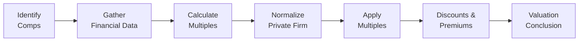

## Overview of GPCM

Have you ever bought a used car and tried to figure out a fair price by comparing it to other, similar cars on the market? Well, if so, you’ve just dipped your toes into the logic used in the Guideline Public Company Method (GPCM). The GPCM basically says: “Look at how the stock market values public firms that resemble your private firm, and use that as a compass for valuing your target private company.” Simple in theory, but, as you probably suspect, there’s a bit more nuance involved when it comes to adjusting for differences in capital structure, growth prospects, or the fact that private company shares aren’t readily tradable.

Below, we’ll break down the main steps, tips, best practices, and common pitfalls for applying GPCM. While this approach feels straightforward, it demands significant judgment when you’re deciding which public companies are truly “comparable” and how to tweak financial data so it’s apples-to-apples.

## Identifying and Selecting Comparable Companies

The first step in the GPCM is choosing a set of “guideline public companies” (a fancy phrase for public firms you believe are sufficiently comparable to your private target). Typically, you look for companies in the same or closely related industries with:

• Similar product lines or services  
• Relatively comparable size (revenue, assets, or employees)  
• Resembling capital structures and profitability  
• Industry growth rates that align with your target  
• Geographic overlap (if relevant)

This stage can get messy. For instance, we once had a private client that specialized in artisan food production. We ended up referencing larger publicly traded snack makers but had to adjust because our client was more of a niche, local player. So, you might not find a “perfect” match: The key is selecting companies that allow you to do a reasonable apples-to-apples comparison once you factor in normalization adjustments.

## Gathering Financial Data and Calculating Multiples

After you’ve selected 5–10 (or however many) guideline companies, the next step is to gather essential financial data. Common metrics include:

• Revenue  
• EBITDA (Earnings Before Interest, Taxes, Depreciation, and Amortization)  
• Net Income (often used for P/E multiples)  
• Book Value of Equity  
• Operating Cash Flow

You can then establish the relevant multiples for each public firm. Some of the most commonly cited multiples in practice include:

• Price-to-Earnings (P/E)  
• EV/EBITDA (Enterprise Value-to-EBITDA)  
• Price-to-Book (P/B)  
• Price-to-Sales (P/S) (especially if the company is not profitable)  
• Price-to-Cash Flow  

You might pick a single multiple, or you might evaluate multiple yardsticks to get a more holistic view. P/E is historically popular because it’s easy to follow and understand, but folks sometimes prefer EV/EBITDA for capturing the value of both debt and equity, making it better at comparing firms with different capital structures. Meanwhile, P/B can be relevant for certain financial or asset-intensive sectors.

### Trailing vs. Forward Multiples

Be mindful of whether you’re dealing with trailing multiples (based on the last 12 months’ results) or forward multiples (based on next year’s forecasts). If your private firm shows a strong upward trajectory in earnings, you might rely more on forward multiples. But keep in mind that forward estimates—particularly for a private entity—are more uncertain and typically require robust forecasting.

## Normalizing the Private Company’s Financials

This part is critical, so let’s emphasize it: your private target might have a host of “quirks” that can distort any direct comparison with a public entity. For instance, the owners might pay themselves above-market salaries or skip paying certain discretionary expenses. Or the firm might have had a big, one-time legal settlement last year. That’s where normalization comes in.

• Remove one-time (non-recurring) charges or income (e.g., lawsuits, major asset sales).  
• Adjust the owner’s compensation to align with market-based pay levels.  
• Re-state items if there are accounting differences (e.g., IFRS vs. US GAAP).  
• Exclude extraordinary events that don’t reflect ongoing operations.

The idea is to reflect a “steady state” of operations and ensure the private company’s numbers look somewhat like those of the public comps. It’s easy to stumble here because adjusting too aggressively can introduce subjectivity. You’ll need meticulous documentation showing how and why you made each normalization decision.

## Applying Multiples to the Private Company

Once your financial data is squeaky clean, you apply the guideline multiples to your private firm’s normalized results. Often, this is done by:

• Selecting a high valuation multiple (e.g., the 75th percentile among the comps).  
• Selecting a median value.  
• Selecting a low valuation multiple (e.g., the 25th percentile).  

Then multiply those multiples by your private company’s figure for the corresponding metric. For example, if the median EV/EBITDA multiple is 7.5× and your private firm’s normalized EBITDA is $10 million, you might estimate an enterprise value (EV) of $75 million. Of course, you can refine your approach by weighting certain comps differently, or by excluding outliers. In practice, you often end up with a range, rather than a single figure.

## Adjusting for Discounts and Premiums

Here’s where private-company valuation can get intriguing. Publicly traded shares are liquid, but private shares are not. Therefore, if you treat the private firm’s equity as if it were fully marketable, you might overvalue it.

### Discount for Lack of Marketability (DLOM)

• Illiquidity: Private shares can’t be sold as easily or quickly as public shares.  
• Empirical Evidence: Research tries to measure this discount by comparing restricted stock or pre-IPO shares to freely trading shares.  
• Typical Range: DLOM can vary widely, from under 10% to 30% or more, depending on the circumstances.

### Control Premium or Minority Discount

• Control Premium: If you’re valuing a controlling stake, you might pay extra for the ability to direct the firm’s strategic decisions.  
• Minority Interest Discount: If you’re valuing a small non-controlling stake, that share of the firm might be worth less because you do not hold voting control.

### Other Factors

Beyond marketability and control, you might need to reflect any additional risk your private firm faces relative to its public peers—like relying heavily on a few customers or lacking stable access to capital markets.

## Process Flow Diagram

Below is a simplified diagram of the GPCM process:

## Practical Example

Imagine you have a private manufacturing company called HammerTime Tools, which produces specialized hardware for the industrial sector. You identify five publicly traded companies with similar product lines, similar target customers, and revenues ranging from $80 million to $150 million. The median EV/EBITDA multiple among those five is 8×.

• HammerTime’s “raw” EBITDA last year was $10 million, but you discover $1 million was a one-time litigation cost. So, the normalized EBITDA is $11 million.  
• By applying the 8× multiple to $11 million, you get an enterprise value of $88 million.  
• You note the average DLOM for a private manufacturing firm of this size is around 15%. After subtracting this discount, your adjusted valuation might drop to around $75 million.  
• If you’re valuing a controlling interest, you might add a control premium of, say, 10% (though that can vary widely). This makes the final valuation around $82.5 million.  
• In the exam, you might have to walk through calculations step by step, watch out for whether they want minority or controlling positions, and see if they mention a DLOM in the vignette text.

## Common Pitfalls and Considerations

• Overadjusting: Stripping out every possible “unusual” item can sometimes sanitize the data too much and risk ignoring real business fluctuations.  
• Mismatch in Growth Prospects: If your comps typically enjoy higher (or lower) revenue growth than your private company, you might need to refine your approach.  
• Capital Structure Differences: If the private firm has a drastically higher debt ratio, it might be risky to rely on a multiple that doesn’t capture leverage well (like P/E).  
• Small Sample Size: Sometimes, few public firms truly look like your target. You may have to cast a wider net or consider alternative approaches.  
• Overreliance on A Single Multiple: Relying on just P/E or just EV/EBITDA can blind you to important differences in working capital, capital expenditures, or intangible assets.  
• Ignoring Market Sentiment: If public comps are in a “hype cycle” or battered by negative market sentiment, the multiples might be temporarily inflated or suppressed.

## Exam Tips

• When you see a vignette referencing comps, first check whether they mention which valuation metrics the client or analyst wants to use—P/E, EV/EBITDA, etc.  
• Watch for red flags in the text—like a large one-time expense, or the owner’s pay being suspiciously high or low. Expect the problem to require normalizing that.  
• Pay particular attention to any mention of the stake type (controlling versus minority). This detail triggers the possibility of applying a control premium or minority discount.  
• Practice quick and accurate multiple calculations. The exam often tests your ability to identify the correct multiple in the data and apply it properly.  
• If you see references to “liquidity discount” or “marketability discount,” be ready to apply a DLOM to your final equity value.

## Final Thoughts

The Guideline Public Company Method offers a tangible way to root your valuation in what the real world is willing to pay for similar public companies. But, particularly in private-company analysis, you will need healthy doses of judgment, adjustments, and a firm understanding of how discounts and premiums factor in. Enough disclaimers and warnings aside, GPCM remains a go-to method for investment bankers, valuation consultants, and equity analysts worldwide—due largely to the accessibility and transparency of market data for publicly traded comparables.

And while we’re on disclaimers—no method is perfect. It’s often best practice to cross-check with at least one other approach, like a discounted cash flow (DCF) or transaction-based method. Doing so can reveal inconsistencies or confirm your results. 

Remember: The exam might throw you a curveball, but the fundamental steps remain the same—pick comps carefully, normalize diligently, apply relevant multiples, and adjust for private-company specifics.  

## Test Your Understanding of the Guideline Public Company Method



### Assuming you have identified a set of comparable public firms, which metric is most relevant to normalizing a private firm’s owner compensation?

- [ ] EBITDA from the comparable companies
- [x] Standard labor cost for a similar role in the industry
- [ ] Reported net income of the private firm
- [ ] The average board compensation across the industry

> **Explanation:** Owner’s compensation needs to be compared with a fair market salary for a similar role in the industry in order to normalize the income statement appropriately.

### When applying the Guideline Public Company Method, which of the following best describes the reason for using a control premium?

- [ ] It accounts for the fact that private firms often have less cash on hand.
- [ ] It offsets the discount for lack of control in public firms.
- [x] It reflects the additional value associated with having full decision-making power.
- [ ] It mirrors standard practice to inflate prices before presenting valuations.

> **Explanation:** A control premium captures the increase in value attributable to having control over decisions like dividend policy, capital structure, and operational strategies.

### In the GPCM, which scenario might warrant a higher-than-average discount for lack of marketability (DLOM)?

- [x] A private company operating in a very niche segment with limited secondary market demand.
- [ ] A private company with a large, diversified customer base and strong cash flows.
- [ ] A company planning an IPO within the next six months.
- [ ] A private firm that pays a consistent dividend.

> **Explanation:** A niche private firm with limited secondary market demand faces greater illiquidity risk, justifying a higher DLOM.

### A valuation analyst finds the median EV/EBITDA multiple of comparable public firms to be 9×. The normalized EBITDA for the private firm is $5 million. What is the implied Enterprise Value (EV)?

- [ ] $9,000,000
- [ ] $14,000,000
- [ ] $40,000,000
- [x] $45,000,000

> **Explanation:** Multiply the multiple (9×) by the private firm’s EBITDA ($5 million) to get $45 million in implied EV.

### Which of the following is the most important reason for normalizing the private firm’s financial statements in a GPCM analysis?

- [ ] Reducing accounting complexity
- [ ] Complying with local tax regulations
- [ ] Facilitating the integration with IFRS
- [x] Achieving comparability with the public guideline companies

> **Explanation:** Normalization makes the private firm’s statements more comparable to those of the guideline public companies. This is crucial for a clean multiple application.

### A private firm with $20 million in equity value is compared to guideline public firms that have shares which trade freely on the open market. If the DLOM is estimated at 20%, what is the implied equity value after applying the discount?

- [x] $16 million
- [ ] $20 million
- [ ] $24 million
- [ ] $4 million

> **Explanation:** A 20% discount on $20 million reduces the value by $4 million, leaving $16 million.

### An analyst is considering the capital structures of guideline companies. When might the use of EV/EBITDA be more appropriate than P/E in a GPCM valuation?

- [x] When the comparable companies have materially different levels of leverage.
- [ ] When the private company is more profitable.
- [ ] Whenever the private company has negative net income.
- [ ] When the guideline companies all use the same interest rate.

> **Explanation:** EV/EBITDA captures both debt and equity in the valuation, making it more suitable when leverage levels differ significantly among comparable firms.

### Which scenario would require a minority discount in the GPCM?

- [ ] A scenario where the private firm is also publicly listed.
- [x] A scenario where an investor is only buying a small, non-controlling stake.
- [ ] A scenario where the private firm has a controlling shareholder already.
- [ ] A scenario involving investment bankers merging two large public corporations.

> **Explanation:** A minority discount is applied when the stake being valued does not confer voting control over the target.

### If a private company’s normalized net income is $2 million and the relevant guideline P/E ratio is 15×, what is the implied equity value for the private company before considering any discounts or premiums?

- [ ] $2 million
- [x] $30 million
- [ ] $13 million
- [ ] $17 million

> **Explanation:** Multiplying $2 million in net income by the 15× P/E ratio yields an implied equity value of $30 million before adjustments.

### True or False: GPCM is always sufficient on its own to value a private firm accurately.

- [x] True
- [ ] False

> **Explanation:** While GPCM can provide a market-based anchor, it often requires supplementary methods (like a DCF) for a comprehensive view. However, some practitioners rely solely on GPCM when they strongly trust the comparables and adjustments.



## References and Further Reading

• CFA Institute, “Equity Asset Valuation.”  
• Damodaran, A., “Damodaran on Valuation: Security Analysis for Investment and Corporate Finance.”  
• Pratt, S. P., “Valuing a Business: The Analysis and Appraisal of Closely Held Companies.”  
• Various academic articles on discounts and premiums, especially related to private-company transactions.  
