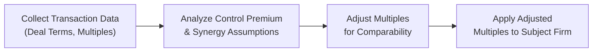

## Overview and Key Concepts

The Guideline Transactions Method (GTM) is a market-based approach to valuing private companies. It uses real, observed data—prices actually paid for comparable businesses in mergers and acquisitions (M&A)—to determine an appropriate multiple for your target private firm. This approach is often a go-to when an industry is flush with recent and relevant deals, but it’s not without its challenges.

Some folks like to compare GTM with the Guideline Public Company Method (GPCM), which relies on trading multiples of publicly listed firms. However, GTM zeros in on transaction multiples (e.g., EV/EBITDA, Price-to-Sales) derived from completed deals, and these often include a control premium. That’s crucial if you’re valuing a minority (non-controlling) stake—because you might need to dial down the resulting multiples so as not to overvalue your private firm.

I recall a time—well, it was at a former advisory gig—when I was valuing a mid-sized consumer goods manufacturer. We found three recent buyout transactions with sky-high EV/EBITDA multiples. At first glance, it looked like the subject firm was worth a fortune. But then we discovered the acquirers were paying top dollar in hopes of large synergy savings and grabbing control. Without adjusting for that synergy, we’d have overstated our client’s business value. So, it’s all about normalizing for factors that may not apply to your subject—like synergy expectations or unique financing structures.

## Data Collection and Transaction Selection

The main building block in GTM is a set (hopefully robust) of recent deals in the same industry as your target private firm. Sources might include:
• Investment banking databases (e.g., PitchBook, S&P Capital IQ, FactSet)  
• Online transaction trackers specific to your industry  
• Regulatory filings (e.g., if a public company is the acquirer, check the 8-K or proxy statement for details)  

When assembling your “transaction universe,” you want deals that mirror your subject company’s:
• Industry vertical (e.g., biotech vs. consumer staples)  
• Size (e.g., revenue and EBITDA levels)  
• Profit margins and capital structure  
• Geographic focus and growth prospects  

Also watch out for the date each deal closed. A transaction from five years ago might not reflect current economics (interest rates, inflation, or industry health). In fast-moving sectors—like tech—transactions go stale quickly.

### Normalizing Financials

Like in other market-based approaches, normalizing the subject firm’s financials is paramount. If you’re using an EV/EBITDA multiple, you typically want to remove one-off costs (e.g., big litigation expenses last year) to get a “steady-state” EBITDA. That said, aim to confirm that the EBITDA reported in your comparable transaction data is likewise normalized. Guidance from the deal announcements, fairness opinions, or data providers often helps, but there’s some subjective judgment in reconciling differences.

## Control Premium vs. Minority Interest

One of the biggest hot-button issues in GTM is recognizing that M&A deals typically reflect a transfer of control. So the multiples being paid often include the price for grabbing the steering wheel. If you’re valuing a control interest in your subject firm, that’s all good—just keep the control premium in place. But if the interest is non-controlling, you should consider an explicit minority discount. This means you’re trimming the high control-based transaction multiple down to a more appropriate level.

### Common Methods to Adjust for Control

1. Direct Minority Discount: Estimate a control premium from empirical studies, then adjust the transaction multiple downward accordingly.  
2. Use Minority Transaction Data (If Available): In rare cases, your transaction data might reflect minority-stake transactions. If so, you may not need a separate control premium adjustment.  

I’ll never forget how my team once discovered we’d used controlling-interest multiples to value a 10% stake. The client was ecstatic about the high price, until we walked them through the downward adjustment. The sigh they let out—well, it was classic. Always be sure to match apples to apples.

## Synergy Adjustments

When Company A acquires Company B, there can be synergy: cost savings, cross-selling, or other strategic benefits that the acquirer fully expects to realize. This synergy can push the transaction multiple above “what the target is inherently worth” on a standalone basis. For valuation purposes, especially if your subject company doesn’t have an equivalent synergy potential, you’d reduce that synergy premium from the multiple.

Here’s the rub: synergy is often intangible, even a bit speculative. Buyers paying top dollar might believe in brand crossovers, distribution expansions, or intangible asset synergies. If none of those apply to your subject’s scenario, ignoring synergy (or removing it) will provide a more accurate valuation. In a test or real-life scenario, expect to see a question that forces you to interpret synergy-laden multiples. You might have a big table of deals, some obviously strategic, others distress sales—your job is to figure out which ones to rely on.

## Strategic Rationale and Market Conditions

It’s also not just synergy driving transaction multiples. The broader M&A cycle can cause prices to spike or crash. For example, during a market bubble, acquirers might overpay under the assumption that “the market’s only headed up.” Or in a downturn, a wave of distressed deals could push multiples unrealistically low. That’s why it’s critical to read the context of each transaction:
• Was it a distressed sale or a forced liquidation?
• Was it from a cash-flush buyer paying a premium for growth?  
• Did regulatory changes or interest rate shifts make the deal more or less expensive?

Tie your transactions back to the macro, political, and market environment. A transaction from the same industry in different business cycles might not be a great match. 

## Step-by-Step Approach

Below is a general flow of how you’d implement a GTM:

As simple as this diagram seems, each arrow hides multiple detailed steps—like verifying normalized EBITDA or analyzing the synergy potential in each transaction. This method is only as good as the data and your ability to interpret subtle differences between deals.

## Example Illustration

Let’s imagine you’re valuing a private manufacturing company—call it MapleTek, which produces custom wooden furniture. You’ve gathered three relevant M&A transactions from the last twelve months of businesses that also manufacture mid-market furniture products.

• Transaction 1: Acquirer (Large design brand) buys 100% of TargetCo at an EV/EBITDA of 9×. The buyer cited synergy from integrating TargetCo’s supply chain and brand portfolio.  
• Transaction 2: Private equity sponsor acquires 80% of OakSource at an EV/EBITDA of 7.5×, with minimal synergy since OakSource has a standalone operation.  
• Transaction 3: Distressed sale of WoodCraft with an EV/EBITDA of 4×, sold due to severe cash flow issues.  

Applying these raw multiples directly would give you a wide valuation range. To refine:

1. Assess synergy potential in Transaction 1. Maybe synergy was significant, so you decide to reduce 9× to ~8× for MapleTek.  
2. Check the nature of Transaction 2. With minimal synergy, 7.5× might be close to MapleTek’s organic multiple.  
3. Distressed sale in Transaction 3? That likely underrepresents typical multiples in a healthy environment, so perhaps you consider it less applicable—still, you might keep it in mind as a low-end scenario.

After adjusting your multiples, you might pick a final range, say 7.5× to 8× MapleTek’s normalized EBITDA. If MapleTek’s normalized EBITDA runs at $10 million, you’d get an enterprise value range of $75–80 million. Then you’d consider whether MapleTek is worth more or less based on intangible brand factors, or if the interest being valued is only minority. If it’s minority, further discount might be warranted.

## Common Pitfalls and Best Practices

### Pitfalls
• Overlooking the Control Premium: Using transaction multiples for a minority interest can overvalue the company if no discount is applied.  
• Neglecting Synergy Impact: Failing to adjust inflated multiples that reflect synergy not available to your subject.  
• Using Stale Data: Old transactions or deals completed under vastly different market conditions can warp your valuation.  
• Blindly Averaging Multiples: If a transaction multiple range goes from 4× to 12×, ignoring the context leads to nonsense results.  

### Best Practices
• Conduct Thorough Due Diligence: Learn the story behind each transaction.  
• Cross-Check with GPCM: Compare your synergy-adjusted multiples to public comparables.  
• Monitor Market Dynamics: Keep an eye on current interest rate trends, economic data, and sector M&A appetite.  
• Involve Industry Experts: Industry insiders can help interpret synergy or strategic rationales more accurately.  

## Link to Other Sections

This method ties closely to:
• Guideline Public Company Method (GPCM) in 16.1 for a cross-check.  
• Adjustments to Financial Statements in 14.3, to ensure your financial baseline is correct.  
• Discounts and Premiums in Private Valuation (Chapter 18), for guidance on minority interest or lack of marketability adjustments.  

## Exam Tips

In the exam vignettes, you might find scattered references to purchase considerations, synergy statements, or buyer motivations. It’s critical to interpret these details correctly. For instance, if all the transaction multiples are a bit high because the buyer specifically leveraged major synergies, that’s your clue to apply a synergy discount. Also watch out for any mention of partial stakes vs. full acquisitions. That’s your nudge to consider control premiums or minority discounts.

Try not to overcomplicate your approach. If the question only provides minimal data, use that data as is (with basic synergy or control adjustments if indicated). The exam typically wants you to demonstrate you know how synergy can inflate a multiple, or how minority stakes differ in value from controlling ones.

## References and Further Reading

• Pratt, S. P. et al. “Guide to Business Valuations.”  
• Damodaran, A. “The Dark Side of Valuation.”  
• Mellen, C. M., & Evans, F. C. “Valuation for M&A: Building Value in Private Companies.”  

---

## Practice Questions: Guideline Transactions Method in Private Valuation



### Which statement best describes the primary objective of the Guideline Transactions Method (GTM)?

- [ ] To compare a private firm’s normalized earnings to publicly traded peers.  
- [x] To derive a valuation multiple from actual M&A deal prices in comparable companies.  
- [ ] To apply discounted cash flow techniques using an industry WACC.  
- [ ] To estimate synergies based on management forecasts.  

> **Explanation:** GTM is about leveraging real, completed M&A data to find an implied valuation multiple from actual acquisitions, not from publicly traded markets or DCF analyses.

### When conducting a GTM valuation for a majority stake, which of the following adjustments is least likely to be required?

- [x] Minority discount.  
- [ ] Synergy reduction.  
- [ ] Normalizing the subject company’s financials.  
- [ ] Checking if transaction data is stale.  

> **Explanation:** A minority discount is usually relevant for minority interests, not majority stakes. For majority valuations, you typically keep the control premium embedded in transaction multiples.

### An analyst is valuing a private company using GTM but suspects the M&A multiples are inflated by synergy expectations. What is the most appropriate approach?

- [ ] Ignore synergy because it rarely affects actual purchase prices.  
- [ ] Increase the applied multiples to reflect synergy.  
- [x] Reduce the selected multiples if no equivalent synergy is apparent in the subject company.  
- [ ] Refuse to use the GTM approach altogether.  

> **Explanation:** Synergy can boost M&A multiples. If similar synergies don’t exist for your target company, you’d typically dial back that portion of the multiple.

### Suppose an analyst has three transactions for comparable companies, each representing control transactions. However, the subject company interest is a 15% stake (minority). Which additional step is most critical?

- [ ] Calculate terminal value.  
- [ ] Eliminate the synergy from each deal.  
- [ ] Remove intangible assets from the transaction data.  
- [x] Apply a discount for lack of control (minority discount).  

> **Explanation:** Because the subject is a minority interest, you have to account for the fact that a controlling premium in those transactions doesn’t apply.

### In practice, which factor would be least relevant when evaluating comparability of past M&A deals for a GTM analysis?

- [ ] Market conditions at the time of each deal.  
- [ ] Company size and growth potential.  
- [x] The target’s preference for a specific brand color in packaging.  
- [ ] acquisition synergy assumptions.  

> **Explanation:** While brand strength could matter, brand color specifics are not typically relevant to pricing multiples. Market conditions, size, and synergy assumptions are key comparability factors.

### True or False: The GTM inherently eliminates the need to normalize a private firm’s financial statements since the transactions are “real deals.”

- [ ] True  
- [x] False  

> **Explanation:** You still need to normalize financial statements to ensure your subject company is comparable to the transaction data. Differences in reporting or one-time items can skew multiples.

### An analyst notes that two deals in the comparable set had mostly stock-based consideration while the third was an all-cash offer. How should this factor into the GTM analysis?

- [x] The deal structure might affect the reported multiples—adjust or interpret with caution.  
- [ ] The use of stock or cash doesn’t affect GPCM or GTM analyses.  
- [ ] All-cash deals should be excluded.  
- [ ] Stock deals suggest synergy was present.  

> **Explanation:** Different payment structures (cash vs. stock) can distort transaction multiples. Often, stock deals might incorporate an expectation of synergy or a different capital cost, so be cautious when comparing.

### Which of the following is the biggest advantage of GTM compared to a purely income-based valuation for private companies?

- [ ] Lower data requirements.  
- [ ] Less need for adjustments related to synergy.  
- [x] Multiples represent real negotiated transaction prices.  
- [ ] Results never require further cross-check.  

> **Explanation:** GTM uses actual deal prices, reflecting what buyers have agreed to pay in the marketplace. This “realness” is often seen as a strong advantage over purely theoretical models.

### How do changes in interest rates generally impact M&A multiples used in GTM?

- [x] Rising interest rates often lead to lower multiples due to higher financing costs.  
- [ ] Interest rates have no bearing on M&A transactions or multiples.  
- [ ] Lower interest rates push multiples down as deals get financed less easily.  
- [ ] Multiples do not fluctuate based on financing conditions.  

> **Explanation:** When financing costs rise, buyers are less inclined to pay top multiples. Conversely, easier credit conditions can support higher prices.

### True or False: In a GTM valuation, if all comparable M&A transactions exhibit strategic synergies, the analyst should necessarily conclude that the subject’s valuation must be drastically lower.

- [x] True  
- [ ] False  

> **Explanation:** Typically, if all comparables were strategic acquisitions with large synergy assumptions, the subject may be worth less on a standalone basis, unless it can achieve similar synergies.  


