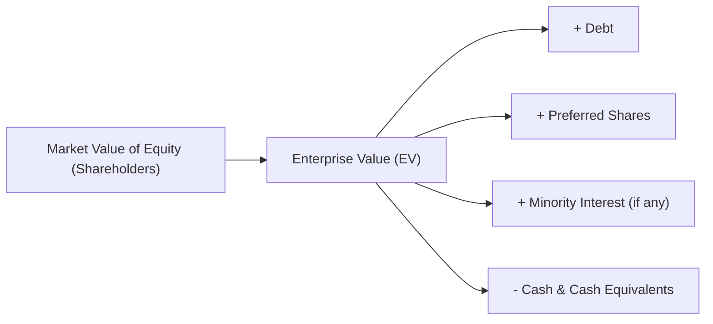

## Introduction 
Valuing a company can sometimes feel like attempting to pick the perfect pizza topping: everyone has an opinion, and there’s rarely a single “correct” answer. In equity valuation, we frequently rely on market-based multiples—ratios that help us compare one firm to another quickly and effectively. But watch out: not all multiples are created equal. Some measure only what equity shareholders receive, while others look at the total “enterprise” value, incorporating debt and cash, too. 

In this section, we’ll explore the differences between equity-based multiples (like Price-to-Earnings, P/E, or Price-to-Book, P/B) and enterprise-value multiples (e.g., EV/EBITDA, EV/EBIT). We’ll see how these concepts apply in practical settings, especially when you’re dealing with private company valuations. You’ll also get a sense of which multiples might be most relevant for minority stakes, controlling acquisitions, or synergy-driven deals. Finally, we’ll sprinkle in some informal musings—stories and tips—that hopefully make this material feel less intimidating.  

## Background on Equity vs. Enterprise Value 
Equity value focuses on what’s attributable to shareholders. It represents the portion of the firm’s value after satisfying all debt holders (and any other claimants). Enterprise value (EV), by contrast, includes both debt and equity but subtracts any excess cash, so—ideally—it provides a more holistic view of the company’s total value. 

In simpler terms:
• Equity value tells you: “How much is the market paying for the company’s equity?”  
• Enterprise value tells you: “How much is the entire business worth, including debt and equity, minus cash?”

If a private company is heavily leveraged or if we anticipate a major shift in its debt structure after an acquisition, enterprise value multiples tend to provide a more stable benchmark across comparable firms.  

Below is a quick visual representation of the difference:



Remember, the exact calculation of EV can vary depending on the source. Some definitions might adjust for minority interests, preferred stock, or convertible debt. When valuing private companies, be especially careful about these items, because private financial statements can sometimes park certain liabilities off-balance-sheet.

## Understanding Equity Multiples
Equity multiples focus on the portion of a firm that belongs to equity holders. That includes:
• Price-to-Earnings (P/E)  
• Price-to-Book (P/B)  
• Price-to-Cash Flow (P/CF)  
• Price-to-Revenue (or P/Sales)  

These ratios are typically easy to calculate for public companies: you have a market price per share, and relevant metrics like EPS or book value per share are (hopefully) accessible. For private firms, it’s trickier because there is, well, no readily observable stock price. Instead, you might rely on appraisals or a negotiation figure to stand in for “price.”  

### Influences on Equity Multiples
It’s worth noting that equity multiples (especially P/E) can get wacky if the firm:
• Has large amounts of debt relative to equity (magnifies earnings volatility).  
• Pays no dividends or reinvests heavily (affecting net income).  
• Has cyclical or inconsistent earnings (making “E” in P/E somewhat unstable).  

As a result, P/E would be strongly affected by a firm’s capital structure, particularly if you’re comparing a highly leveraged target to a competitor that’s nearly debt-free. The presence of high leverage can inflate or deflate net income streams differently, so a direct P/E comparison might not be apples to apples.

## Understanding Enterprise Value Multiples
Enterprise value (EV) is often described as a hypothetical “takeover price”—the total outlay needed to acquire a company outright, pay off its debts, and keep or redeploy its cash. Therefore, EV-based multiples attempt to compare the total operational value of the business, ignoring capital structure differences.  

Common EV-based multiples include:
• EV/EBITDA: The most popular, viewed as a proxy for operational cash flow.  
• EV/EBIT: Focuses on earnings after depreciation & amortization.  
• EV/Sales: Sometimes used for very early-stage or negative-earnings firms.  

### Why Use EV Multiples?
• Better Capital Structure Neutrality: EV-based multiples let you compare a firm with 80% debt to a firm with zero debt without ignoring the financial risk that the first carries.  
• Industry Standard: Many investment banks and private equity firms rely on EV/EBITDA or EV/EBIT, especially for buyouts or synergy-based deals.  
• More Stable: EBITDA is typically less volatile than net income, making EV/EBITDA comparisons steadier across time and business cycles.  

## Practical Application for Private Companies
So, how do these multiples work when you’re valuing a small manufacturing firm or a tech startup that has no market listing? Well, you’ll often do something like the following:

1. Identify Comparable Public Companies (if you can).  
2. Calculate the relevant multiples (P/E, EV/EBITDA, etc.) for these guideline companies.  
3. Apply a discount or premium to reflect the private firm’s size, growth prospects, or risk (the “private company discount” could reflect lack of marketability or smaller scale).  
4. For equity multiples, you might compare the private firm’s net income (or book value) to the “typical” multiple from peers.  
5. For EV multiples, you’ll estimate the private firm’s EBITDA and then multiply by the median or mean EV/EBITDA multiple from peer companies. To get to your target’s estimated enterprise value, you do:

   (Comparable EV/EBITDA Multiple) × (Target’s EBITDA) = Implied Enterprise Value  

   Then you can adjust for net debt if you want just the equity portion.

### Why EV Multiples May Be Preferred 
Especially in negotiations, buyers (like private equity firms) often look at a target’s EV compared with EBITDA or EBIT. After all, if you’re purchasing control, you might plan to restructure the debt or bring new financing. EV-based multiples are more consistent when capital structure changes loom.  

**Exam Tip**: Watch for item-set vignettes that mention changes in leverage or financing. A question might show that the target’s net debt is about to be refinanced, hinting that an enterprise multiple is a superior yardstick to a plain P/E.  

## Industry Preferences
• Tech Startups: Often favor equity multiples tied to revenue (like price-to-sales) because many startups have zero or negative earnings. EV/Sales is also used, but P/S can be slightly easier to explain to early-stage investors.  
• Mature Industrials: Often rely on EV/EBITDA or EV/EBIT multiples. Large capital expenditures mean depreciation patterns can significantly affect net income, so focusing on EBITDA can provide a clearer apples-to-apples comparison.  
• Financial Institutions: Historically, we looked at Price-to-Book. Why? Because banks’ “book” is often close to the fair value of their assets, though that’s changing with evolving regulations.  

## Adjustments for Private Company Valuation
When you’re trying to derive an enterprise value for a private company, be extra thorough in identifying:
• All interest-bearing debt (including lines of credit, capital leases).  
• Potential off-balance-sheet liabilities (operating leases in some IFRS vs. GAAP contexts, special purpose vehicles, or personal guarantees by owners).  
• Cash and equivalents (excluding restricted cash, if it’s truly not accessible).  
• Minority interests that might exist if the private firm owns part of another business.  

These adjustments help you get an accurate measure of EV. If you skip them, you risk underestimating the real cost to acquire the business or overpaying for unknown liabilities.  

## Personal Anecdote: Check for Debt Surprises!
Years ago, I recall helping a friend value her family-owned manufacturing plant. She had no idea her father had personally guaranteed a large portion of the company’s debt. (Classic scenario, right?) That personal guarantee isn’t always on the books in a typical way, but it can drastically change the risk profile. Double-checking these items avoided a big dispute in the eventual sale.  

## Implementation Challenges and Common Pitfalls
• **Comparability Issues**: If the private firm and the comparables have very different capital structures or operational models, multiples alone can mislead.  
• **Negative Earnings**: P/E becomes meaningless if earnings are negative or extremely small. EV/EBITDA might still be valid if EBITDA is positive.  
• **Timing Differences**: Some private firms might be near the end of their fiscal year, while the comparables are mid-year. Adjust or normalize these differences.  
• **Non-Recurring Items**: Large one-time gains or losses (e.g., sale of old equipment) can skew EBIT or net income. You might want to “normalize” these out.  

## Short Example Calculation
Let’s run a quick homegrown example in Python to demonstrate how we might compute a couple of multiples. Suppose we have the following data for a private company:

• Estimated “market” value of equity (based on negotiations) is $800 million.  
• Net debt (interest-bearing debt minus cash) totals $400 million.  
• EBITDA is $100 million.  
• Net income is $50 million (after interest and tax).  
• Current share count is 40 million shares (implies the negotiated equity value is $20 per share).

We can do something like:

```python

price_per_share = 20.0
eps = 50_000_000 / 40_000_000  # Net income / shares
pe_ratio = price_per_share / eps

market_cap = 800_000_000
net_debt = 400_000_000
ebitda = 100_000_000

enterprise_value = market_cap + net_debt
ev_to_ebitda = enterprise_value / ebitda

print("P/E Ratio: {:.2f}".format(pe_ratio))
print("EV/EBITDA: {:.2f}".format(ev_to_ebitda))
```

Running this snippet would yield:
• P/E Ratio = 16.00  
• EV/EBITDA = 12.00  

This reveals that if you look solely at P/E, the company trades at 16× earnings, which might seem high or low depending on comparable companies. Meanwhile, on an EV/EBITDA basis, the firm trades at 12×. If an industry peer group trades at, say, an average EV/EBITDA multiple of 10×, you might argue the firm is somewhat expensive unless it has better growth prospects or intangible benefits.  

## When Might Equity Multiples Be More Suitable?
If you’re a minority investor—like a small VC infusion or an angel investor—who isn’t expecting to change the company’s capital structure or who focuses on the returns to equity only, an equity multiple (like P/E) might match your viewpoint. After all, you only care about the portion attributable to shareholders, not the entire firm.  

## Best Practices
• Always pair your multiple with relevant context: If net income is non-stationary or includes one-off items, consider using EBITDA.  
• For private companies, carefully adjust for all forms of debt. Don’t forget the possibility that new owners might refinance that debt almost immediately.  
• In an exam question, note any mention of capital structure changes or synergy assumptions. That’s usually a nudge to consider EV-based multiples.  
• Prepare to summarize your result and cross-check using different multiples (triangulate with P/E, P/B, or EV/EBITDA) to confirm consistency.  

## Conclusion and References 
Equity-based and enterprise-value multiples are both indispensable to financial analysts, but each has a different angle and captures different risks. Equity multiples are simpler if you only care about the returns going to shareholders. Meanwhile, EV-based multiples provide a comprehensive look at the firm’s finances, factoring in leverage and liquidity. 

Back in Chapter 10, we covered price multiples like P/E and P/B in detail for public equities. And in Chapter 11, we tackled EV/EBITDA and EV/EBIT. Now, applying these concepts to private company valuation merges the best of both worlds—but requires that extra ounce of caution with data gathering and adjustments. 

Additional References:
• Koller, T., Goedhart, M., & Wessels, D. “Valuation: Measuring and Managing the Value of Companies.”  
• CFA Institute Articles on “Selecting Multiples in Private Market Valuation.”  

It can be a bit of an art—just like choosing your pizza toppings. But with enough practice (and due diligence), you’ll find yourself confidently using both equity and EV multiples to arrive at thoughtful, defensible valuations.

---

## Equity vs. Enterprise Value Multiples: Practice Questions



### A private company is considering a leveraged buyout. Which multiple would typically provide a less distorted valuation when capital structure changes are expected?

- [ ] P/E Ratio
- [ ] Price-to-Book
- [x] EV/EBITDA
- [ ] Price-to-Cash Flow

> **Explanation:** EV-based multiples (like EV/EBITDA) are more meaningful when capital structures are likely to change post-acquisition, because they’re relatively neutral to current leverage levels.

### Suppose a private firm has negative net income but positive EBITDA. Which multiple is generally the most appropriate for comparing value across peers?

- [x] EV/EBITDA
- [ ] P/E Ratio
- [ ] Price-to-Book
- [ ] Price-to-Sales

> **Explanation:** If earnings are negative, P/E can’t be used effectively (or yields misleading figures). A positive EBITDA figure allows for EV/EBITDA to be used.

### A minority investor purchasing only a small stake in a private firm is typically more interested in which valuation multiple?

- [x] Equity multiples like P/E
- [ ] EV multiples like EV/EBITDA
- [ ] EV multiples like EV/EBIT
- [ ] EV multiples like EV/Sales

> **Explanation:** A minority investor will focus on the equity portion of returns since they are not in a position to change the firm’s capital structure or influence debt decisions.

### In valuing a private company, an analyst discovers significant off-balance-sheet leases. Which type of multiple will be most affected if these leases are ignored?

- [ ] P/E
- [x] EV/EBITDA
- [ ] P/B
- [ ] Price-to-Sales

> **Explanation:** Off-balance-sheet debt will understate a firm’s true obligations. This omission distorts enterprise value calculations, particularly EV/EBITDA.

### If a firm’s equity trading multiple is much lower than that of its peers, which explanation is LEAST likely?

- [ ] The firm has worse growth prospects.
- [ ] The firm has higher perceived risk.
- [ ] The firm’s P/E ratio is depressed by a one-time charge.
- [x] The firm’s cash balance is included in the enterprise value.

> **Explanation:** A large cash balance directly impacts enterprise value, not the firm’s equity-only multiple. Growth prospects, risk, or unusual charges are more closely tied to a depressed P/E.

### Which of the following statements best explains why investors might prefer EV/EBIT over EV/EBITDA for established manufacturing firms?

- [x] The firm’s depreciation expenses are material and reflect a true economic cost.
- [ ] EBITDA is a better measure in cyclical industries.
- [ ] EBIT requires no adjustments for capital expenditures.
- [ ] Manufacturing firms rarely use depreciation.

> **Explanation:** For capital-intensive businesses, depreciation is a significant expense that can’t be ignored. Focusing on EBIT can produce a more realistic measure of operational performance.

### An analyst is comparing two mature industrial firms: one uses primarily debt financing, the other uses mostly equity financing. Which of the following multiples is generally the fairest comparison?

- [x] EV/EBITDA
- [ ] P/E
- [ ] P/B
- [ ] Price-to-Sales

> **Explanation:** Because EV accounts for both debt and equity, you avoid the distortions caused by different capital structures.

### Which ratio is typically viewed as a closer proxy for operating cash flow?

- [ ] P/E
- [ ] P/B
- [x] EV/EBITDA
- [ ] Price-to-Free Cash Flow

> **Explanation:** EBITDA removes interest, taxes, depreciation, and amortization, making it fairly close to operating cash flow for many firms.

### In a private transaction, a controlling acquirer is most likely to base the negotiated purchase price on which multiple?

- [ ] Price-to-Book
- [ ] Price-to-Dividend
- [ ] P/E
- [x] EV/EBITDA

> **Explanation:** Controlling buyers often focus on the total resources they must commit (i.e., enterprise value), making EV/EBITDA a critical metric.

### True or False: A high equity multiple always indicates a company is overvalued.

- [x] True
- [ ] False

> **Explanation:** A high equity multiple may signal potential overvaluation, but context matters. Growth rate, risk, and peer group comparisons are also essential. On the exam, you should check industry norms and underlying fundamentals before concluding “overvalued.”


