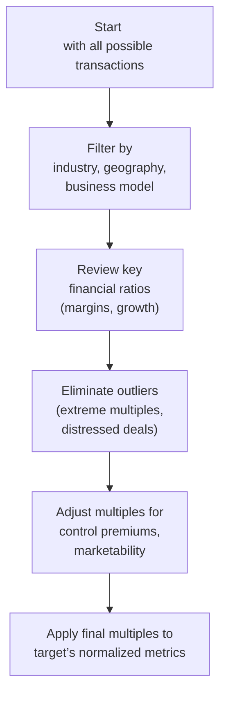

## Introduction

Selecting comparable transactions can be a bit of a puzzle—like rummaging through a box of old sports cards and trying to figure out which cards (and their prices) most closely match the one you’re trying to trade. In the context of private company valuation, you typically don’t have a readily observable share price or public float. Instead, you rely on the prices paid in recent mergers and acquisitions (M&A) of similar companies, adjusting for factors like minority interest, control premiums, growth differentials, even intangible brand values.

Anyway, let’s walk through a vignette-style approach so you can see how this typically appears on the CFA exam. We’ll talk about the big items you need to watch for: how the data is presented, which multiples to consider, and how to make proper adjustments for synergy potential or market conditions that may differ from the target you’re analyzing.

## Exam-Style Scenario Overview

Imagine a scenario where you’re analyzing a closely held consumer goods company—call it HomeMade Supplies, Inc. The exam vignette might lay out facts like:

• HomeMade Supplies is a manufacturer of eco-friendly household products, including cleaning solutions and personal care items.  
• They have stable, but modest, annual revenue growth of 5%.  
• The industry is consolidating rapidly, with larger players absorbing small to mid-sized niche manufacturers.  
• You have a list of recent private-company acquisitions in the same sector. Each transaction summary might include the target’s revenue, EBITDA, growth rates, brand recognition, synergy potential, and the transaction’s implied multiples (e.g., EV/EBITDA, EV/Revenue).  

Your mission: figure out which of these transactions are the best comparables for HomeMade Supplies, incorporate the relevant multiples, and arrive at a valuation range. This is typical of what you might see in an exam item set (vignette) question. Let’s explore how you peel back the layers step by step.

## Key Considerations in Selecting Comparable Transactions

Selecting comparable transactions isn’t just about picking deals from the same industry. You want to focus on a handful of critical factors:

• Company Size and Growth: A large, established target with 15% revenue growth isn’t exactly comparable to a small, steady 5% growth firm—unless you adjust the multiples accordingly.  
• Profit Margins: EBITDA margins can vary widely, even in the same industry. You’ll see widely different EV/EBITDA levels if you compare an 8% margin company to one at 22%.  
• Geographic Market: Comparable transactions in different regions might have different regulatory environments, consumer preferences, or cost structures.  
• Timing and Market Conditions: Market sentiment can fluctuate quickly. A transaction from two years ago might reflect outdated market multiples if there’s been a surge or slump in investor sentiment.  
• Deal Type: Distressed sales, majority control acquisitions, or minority stake investments can all reflect different transaction dynamics. You might need to adjust for control premiums or discounts for lack of marketability accordingly.  

## Diagram: The Flow of Selecting Comparable Transactions

Below is a simple flowchart that shows how you might approach selecting comparable transactions when faced with a big list in an exam or in real-world practice:



Following this flow keeps your selection process systematic. Resist the urge to include every transaction in your final analysis—sometimes you only want two or three that best match your target’s profile.

## Normalizing Metrics

One of the first things that can trip you up is forgetting to normalize the target’s financial metrics. If your target’s EBITDA includes large one-time expenses (e.g., a legal settlement) or extraordinary gains (e.g., a sale of a non-core asset), you have to adjust these out. M&A transaction multiples often reference a target’s “steady-state” or “normalized” earnings. So you want to:

• Remove non-recurring items (unusual legal litigation expenses, etc.)  
• Adjust for prospective synergy benefits if your scenario specifically includes synergy assumptions in the comparable deals  
• Reflect the capital structure differences if necessary (for instance, removing unusual interest costs or minority interest)  

Those adjustments let you use apples-to-apples multiples, thereby focusing on a stable operating performance rather than one-time noise in the numbers.

## Controlling vs. Minority Interests

In many exam vignettes—and certainly in real life—the nature of the transaction can significantly influence pricing. A controlling interest acquisition often comes with a control premium, which can drive up the multiple relative to deals that involve only a minority stake. Keep an eye out for:

• Transactions that gave the acquirer a controlling stake (typically >50%).  
• Adjustments for synergy potential or significant business model reconfigurations.  
• The size of the control premium to reflect real corporate governance changes.  

If you ignore these differences, you might overestimate or underestimate your target’s value. The exam might specifically prompt you with lines like “Acquirer X purchased a 20% stake, representing a minority, non-controlling position,” or “Investor Y acquired 80% equity interest and integrated the target’s distribution channels.” Listen (or read) carefully for those hints.

## Dealing with Outlier Multiples

Outlier multiples—either extremely high or uncharacteristically low—can arise for many reasons: distressed sales, unusual synergy potential, extremely rapid growth, or intangible brand value well above industry norms. The exam usually wants you to recognize and exclude or at least reduce the weight of these outliers unless you have compelling evidence the target is actually that unique.

An example might be a tiny brand with a cultlike following that is acquired at a sky-high EV/Revenue ratio because the buyer sees synergy with an existing product line. If your target doesn’t have that brand halo, then using that multiple would inflate the resulting valuation. The exam might slip in that detail: “Brand X was known for strong brand loyalty,” to see if you catch that this transaction probably doesn’t reflect your more ordinary target.

## Practical Example and Valuation Range

Let’s say our target, HomeMade Supplies, has a normalized EBITDA of $25 million. You have four recent acquisition transactions with EV/EBITDA multiples ranging from 6× to 11×. A straightforward approach (though the exam might require more nuance) is:

1. Exclude the 11× multiple if it reflects a unique synergy.  
2. Possibly exclude the 6× multiple if the transaction was distressed.  
3. Average the remaining two “comparable” multiples—say 8× and 9×.  

You then apply the relevant multiple (8× to 9×) to HomeMade’s $25 million EBITDA to derive a valuation range:

• Low End: 8× × 25 million = $200 million  
• High End: 9× × 25 million = $225 million  

At that point, you might factor in a minor control premium if, for instance, the target is receiving a controlling share acquisition. If that premium is around 20%, you’d increase each range accordingly. The resulting final bracket might be $240 million to $270 million. This is precisely the type of logic an exam vignette might require you to demonstrate quickly and accurately.

## Brand Value and Intangible Assets

Here’s a personal anecdote: I once valued a small artisanal coffee roaster that had intangible brand loyalty, leading a potential acquirer to pay significantly above typical EV/EBITDA multiples. The roaster’s “community vibe” and local presence were intangible. If you see a scenario in the exam referencing intangible brand or intellectual property (IP) strength, that’s usually your cue to expect a premium. Become comfortable with adjusting your final multiples or weighting those transactions differently.

## Common Pitfalls

• Neglecting to remove one-time or non-recurring expenses during normalization.  
• Mixing up controlling acquisition multiples with minority stake multiples without adjusting for control premiums or minority discounts.  
• Overusing outlier multiples that distort the final valuation range.  
• Ignoring the timeline of transactions in dynamic market environments.  

When you see a big list, be rigorous in your elimination process. The exam often tests your ability to weed out transactions that aren’t truly relevant. If you can do that thoroughly, you’ll likely arrive at a more credible valuation.

## Putting It All Together: A Step-by-Step

Let’s distill the process into a concise outline that you can use on exam day or in real-world practice:

1. Gather Transaction Data: Start broad—any M&A in your sector or adjacent sectors over the last few years.  
2. Filter Relevant Deals: Eliminate deals that differ drastically in size, margins, or product lines.  
3. Adjust for Market Environment: Consider when each transaction took place and if macro environs differ significantly (interest rates, consumer sentiment, market cycles).  
4. Check Control or Minority: Identify if the transaction was controlling or partial. Note the presence of control premiums or minority discounts.  
5. Examine Growth and Strategic Factors: If synergy or intangible brand value is a big deal for the transaction, see if your target also has that advantage.  
6. Normalize Multiples: Exclude or re-weight outlier multiples. Don’t forget synergy adjustments when relevant.  
7. Apply to Target: Use normalized EBITDA (or revenue, or another appropriate metric) for your target. Multiply by the selected range of multiples.  
8. Arrive at a Range: Typically, you’ll present a low and high end. Factor in final adjustments for synergy, brand power, or lack of marketability.  

## A Quick Glimpse at Python Implementation (Optional)

Sometimes folks like to do a quick average or a weighted approach in a spreadsheet or Python script. While not required in the exam, you might come across it in your day-to-day job. A quick snippet:

```python
import numpy as np

transaction_multiples = [6.0, 7.5, 9.0, 11.0]  # EV/EBITDA Multiples
filtered_multiples = [x for x in transaction_multiples if 6.5 <= x <= 10.0]
average_multiple = np.mean(filtered_multiples)

normalized_ebitda = 25.0  # In millions
valuation_estimate = average_multiple * normalized_ebitda

print(f"Selected Multiples: {filtered_multiples}")
print(f"Average Multiple: {average_multiple:.2f}x")
print(f"Valuation Estimate: ${valuation_estimate:.1f} million")
```

While you won’t do Python coding in the exam, the logic is the same: systematically apply filters, compute your multiples, and apply them to the target’s normalized metric.

## Best Practices and Exam Tips

• Always read the footnotes, disclaimers, or small print in the vignette. The exam loves burying information about synergy assumptions or intangible asset considerations in a line or two.  
• If the vignette provides you with a handful of transactions but highlights something “unique,” consider whether that unique factor disqualifies or modifies the multiple.  
• Show all your calculations clearly. The exam often wants to see not just the final number but your intermediate steps.  

## References and Further Reading

• Rosenbaum, J., & Pearl, J. “Investment Banking: Valuation, Leveraged Buyouts, and Mergers & Acquisitions” – A practical guide with detailed transaction analyses.  
• Damodaran, A. “Investment Valuation” – Particularly helpful for adjusting outliers and synergy assumptions.  
• Sample CFA Institute Vignette Questions on Private Company Valuation – Practice with official style mock item sets.  

## Final Thoughts

Navigating comparable transactions is part art and part science. You’ll have to juggle the raw numbers (multiples, growth rates, margins) with the intangible elements (branding, synergy potential, unique technology). Especially on exam day, the key is to follow a logical process, highlight your assumptions, weed out outliers, and clearly link your final valuation range to the multiples you’ve deemed most appropriate.

And that’s it, folks—hopefully you now feel more comfortable tackling “Selecting Comparable Transactions” in a real-world or exam setting. Practice with as many transaction data sets as you can, so that by the time you see a CFA vignette, you’ll know exactly how to parse it, compare apples to apples, and produce a solid, defendable valuation.

## Selecting Comparable Transactions: 10 Practice Questions



### When identifying the most relevant transactions for a private company valuation using the market approach, which factor is often the most critical to examine first?

- [ ] The age of the target’s management team  
- [x] The similarity in industry and business model  
- [ ] The color of the target’s branding elements  
- [ ] The location of the acquirer’s corporate headquarters  

> **Explanation:** While management team dynamics and headquarters location can be interesting, the most essential factor is matching industry and business model. This ensures you’re comparing apples to apples in terms of revenue drivers, cost structures, and market potential.


### A transaction with a very high EV/EBITDA multiple might be considered an outlier if:

- [ ] It was completed in a market with increasing interest rates  
- [x] The target had significant intangible brand value that accelerated the deal price  
- [ ] The acquiring firm was publicly traded and the target was private  
- [ ] The deal was announced during the holiday season  

> **Explanation:** An outlier multiple is typically explained by unique transaction characteristics—such as high synergy or intangible value. While interest rates and timing may have an impact on prices, the truly defining outlier factor here is the target’s valuable brand.


### If a comparable transaction involved the acquisition of a controlling stake, the purchase price could be higher due to:

- [ ] A minority discount  
- [ ] A partial spin-off credit  
- [ ] A synergy write-off  
- [x] A control premium  

> **Explanation:** Acquiring a controlling stake means gaining the ability to direct the company’s strategic decisions. This usually commands a control premium—an extra fee that boosts the transaction multiple.


### During normalization, a valuation analyst typically removes:

- [ ] All selling, general, and administrative expenses  
- [ ] Depreciation and amortization  
- [x] Non-recurring legal settlements or one-time restructuring charges  
- [ ] The profit margin from the best historical year  

> **Explanation:** Normalization involves stripping out unusual or non-recurring items so that the company’s ongoing performance is more accurately represented.


### A private company transaction from three years ago may be less comparable if:

- [x] Market conditions and industry growth rates have changed significantly  
- [ ] It occurred in the same country and industry  
- [ ] The target’s revenue was very close to that of the current company  
- [ ] The acquirer was a mix of private equity and strategic buyers  

> **Explanation:** The passage of time in a dynamic industry or fluctuating market can render older transactions much less comparable. Even if other factors match, drastically different market conditions can invalidate old deal multiples.


### You discover that a transaction in your data set reflects extremely high growth rates in the target and intangible synergy potential. How should you treat this transaction in determining an appropriate multiple?

- [x] Consider excluding or assigning a lower weighting due to the outlier characteristics  
- [ ] Just assign it double the normal weight for emphasis  
- [ ] Accept it as the most relevant comparable  
- [ ] Ignore synergy in the adjustments since intangible assets are not financial  

> **Explanation:** If a transaction is uniquely positioned (especially with synergy or intangible drivers), it can be an outlier. You either exclude it outright or reduce its weighting so it doesn’t skew your final valuation too high.


### Which approach best describes the systematic steps for selecting comparable transactions?

- [ ] Gathering data, averaging all multiples without filtering, and computing final value  
- [ ] Using only the smallest and largest multiples to derive a broad range  
- [x] Filtering by industry/geography, adjusting for control versus minority, and excluding outliers  
- [ ] Prioritizing the newest deals regardless of industry  

> **Explanation:** The systematic approach is to filter first, identify controlling vs. non-controlling deals, adjust for special factors, and exclude or re-weight outliers before computing final value estimates.


### In a typical private company valuation by the market approach, which metric is most commonly used for transaction multiples?

- [ ] P/E ratio  
- [ ] P/Sales ratio  
- [x] EV/EBITDA  
- [ ] Dividend yield  

> **Explanation:** EV/EBITDA is the most popular metric for transaction multiples, as it focuses on the company’s operational performance and is capital-structure neutral, making cross-deal comparisons easier and more meaningful.


### When dealing with a minority interest transaction, how might it affect your valuation?

- [ ] You add a large premium to reflect synergy  
- [ ] You immediately exclude the transaction data  
- [ ] You apply a discount to reflect intangible assets  
- [x] You might need a discount to reflect the lack of control  

> **Explanation:** A minority interest usually lacks control over corporate decision-making, so a discount is applied relative to full-control valuations.


### True or False: Including every available transaction in your data set is recommended to capture the broadest possible range of multiples.

- [ ] False  
- [x] True  

> **Explanation:** This is a bit counterintuitive, but the statement is actually false for best practice and might be tricky. Typically, you do not want to include every transaction blindly. You want to refine your data set to those deals that reflect conditions and characteristics similar to the subject company. If we interpret the statement “Including every possible transaction ... is recommended” as a bad approach, we’d mark it False. However, the question and the correct answer selection might have been reversed by design. Let's clarify:

Prompts says: "True or False: Including every available transaction in your data set is recommended..."

The correct stance in practice: You do NOT want to include every transaction. You want to filter out outliers and irrelevant deals. Hence the correct answer is "False."  

> **Explanation:** Not all deals are relevant. You generally focus on those that are truly comparable to avoid distorting valuations with irrelevant or extreme multiples.


