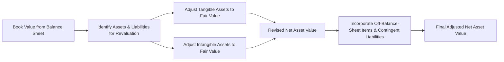

## Introduction

Have you ever glanced at a private company’s balance sheet and thought, “Hmm, that’s definitely not what this firm would fetch if sold tomorrow?” Well, you’re not alone. Book values on financial statements are typically recorded at historical cost or adjusted only to some extent—often leading to sizable gaps between reported carrying amounts and actual market values. This gap is where “book value adjustments” step in.

In this section, we’ll walk through how to revalue a private company’s assets and liabilities to their fair values. We’ll talk about tangible assets (property, machinery) and intangible assets (trademarks, patents, and more), plus we’ll chat about off-balance-sheet items, contingent liabilities, and good ol’ IFRS 13. My own first client assignment in this space was a small manufacturing firm where the historical cost of their press machines was totally off from the real secondary market price. It was an eye-opener for me, and I realized how critical precisely adjusting book values is—especially for high-stakes valuations like M&A or strategic expansions.

## Why Book Value Adjustments Matter

In private company valuation, the asset-based approach often takes the company’s balance sheet as a starting point. We determine net asset value by summing assets (both tangible and intangible) at fair value, then subtracting liabilities (also at fair value). The resulting figure can differ dramatically from the balance sheet’s “book value” because conventional accounting seldom fully captures current market conditions.

Some reasons for these mismatches:

• Historical Cost: Many assets are on the books at the purchase price, which could be decades old.  
• Depreciation & Amortization: Accounting life cycles may have little to do with actual market value (especially for intangible assets that might skyrocket in value).  
• Accounting Standards: Under IFRS or U.S. GAAP, fair value adjustments can be limited or only recognized under specific circumstances.  
• Market Conditions: Real estate, technology, or intangible values might have soared—or crashed—since the asset was originally recorded.  

All this means that if you want a real sense of a company’s net worth, you need to translate book values into values a buyer and seller might agree upon in an arm’s-length transaction.

## Revaluing Tangible Assets and Liabilities

Tangible assets, such as real estate, machinery, equipment, and vehicles, often require an adjustment from their carrying amounts to fair value.

1) Identifying Assets for Revaluation  
   Start by listing all significant capital assets. Check their book values in the balance sheet. Cross-check with physical inspections, appraisal reports, or secondary market data for used machinery (common in manufacturing).  

2) Revaluation of Assets  
   For real estate, you might seek an independent property appraiser’s opinion. Sometimes, we rely on comparable sales data from the local market. If you notice a widely active secondary market for your assets (e.g., used trucks, basic industrial machinery), you might get a relatively fair “Level 2” type input (observable prices). However, specialized, custom machinery often lacks a vibrant secondary market. That can push you into “Level 3” territory, requiring assumptions, DCF (discounted cash flow) models, or specialized valuations from experts.

3) Adjusting Liabilities  
   Liabilities also get revalued to fair value. Long-term debt may trade at a premium or discount if current interest rates differ from the time of issuance. For instance, if the note is at a fixed rate that’s significantly above market, the debt’s fair value might be lower than its face value.  

## Valuing Intangible Assets

Intangible assets—patents, trademarks, copyrights, customer lists, and goodwill—can represent a massive portion of a private company’s true worth. In certain sectors (like pharmaceuticals and technology), intangible assets might exceed tangible ones.

• Appraisals and Comparable Transactions  
  Intangible asset value often depends on future earnings potential. For example, a patent’s value may be estimated by looking at potential licensing revenues or by referencing sales comparisons to similar patents in the same industry. Often, intangible appraisals use DCF methods incorporating discount rates appropriate for the asset’s risk profile.

• Specialized Appraisers  
  If you’re dealing with highly technical assets (e.g., novel drug patents), you’ll often rely on specialized appraisers who are experts in that field. 

• IFRS 13 and Level 3 Inputs  
  Most intangible asset valuations fall under Level 3 in the fair value hierarchy because the data points are unobservable. You’ll rely heavily on management forecasts, industry benchmarks, and your own assumptions.

## Off-Balance-Sheet Items and Contingent Liabilities

One of the trickiest parts of an asset-based valuation is discovering hidden or “off-balance-sheet” items. Sometimes, a significant chunk of the business is in special purpose vehicles or is structured as an operating lease. And then there are contingent liabilities such as product warranties or pending lawsuits.

• Operating Leases: IFRS 16 requires many leases to be capitalized, but older statements might not have incorporated them. It’s up to the analyst to ensure that the right-of-use assets and lease liabilities are recognized at fair value.  
• Special Purpose Entities: Some business units might be off the main balance sheet. You’ll often need to consolidate or at least note the net effect on total assets and liabilities if the entity is effectively controlled.  
• Contingent Liabilities: If the company faces lawsuits or environmental clean-up obligations, those potential claims could reduce the firm’s net value. Disclose them and estimate a fair value for the exposure if possible.

## The Role of IFRS 13 and GAAP in Fair Value Measurements

Under IFRS 13 (Fair Value Measurement), fair value is “the price that would be received to sell an asset or paid to transfer a liability in an orderly transaction between market participants.” Meanwhile, U.S. GAAP has a similar stance, with ASC 820 providing parallel guidance. Both set out a hierarchy:

• Level 1: Inputs from quoted prices in active markets (e.g., stocks).  
• Level 2: Inputs from similar (but not identical) assets in active markets, or identical assets in less active markets.  
• Level 3: Unobservable inputs—prices or valuations based heavily on estimates, internal models, and assumptions.

Private company valuations rely heavily on Level 3 inputs because there’s typically no readily available market price. Consequently, assumptions about discount rates, growth, or salvage value are crucial—and ethically, you must use objective, unbiased data wherever possible.

## Sensitivity Analysis

Market assumptions can shift quickly. You might raise your reference discount rate from 12% to 14% if market interest rates spike, drastically lowering the fair value of intangible assets. So it’s important to illustrate the range of possible outcomes:

• What if the real estate market corrects by 10%? 
• What if the licensing deal on a patent doesn’t materialize? 
• What if the discount rate for intangible valuation changes by 1 or 2 percentage points?

Sensitivity analysis helps you see the magnitude of these possible shifts. In a formal valuation report, it’s common to include best-case, worst-case, and base-case scenarios.

## Ethical Considerations

We all know: messing around with these valuations can be a big no-no. Overstating or understating asset values can lead to investor confusion, misallocation of capital, or even legal trouble. It’s crucial to maintain professional skepticism, gather credible appraisals, and disclose assumptions. The CFA Institute Code and Standards emphasize independence and objectivity—particularly relevant when your hypothetical client or your boss wants a certain “favorable” number.

## Visual Overview

Below is a simple Mermaid diagram illustrating how you progress from book value to an adjusted net asset value for a private company:

## Sample Scenario for Book-to-Fair-Value Adjustments

Let’s say you have a small technology start-up with the following partial balance sheet:

• Equipment: Book Value $500,000  
• Software Development Costs (Intangible): Book Value $200,000  
• Patent: Not recorded (internally generated, so $0 on the books)  
• Contingent Liability for a lawsuit: Potential cost of $100,000  
• Long-Term Debt: Book Value $300,000  

Your investigation reveals:

• Equipment’s fair value is $750,000, based on an independent appraisal.  
• The intangible software is valued at $400,000 by referencing comparable IP transactions in the same sector.  
• The unrecorded patent is appraised at $250,000 using a discounted cash flow approach.  
• The lawsuit probably will settle at around $80,000.  
• The company’s long-term debt trades externally at $290,000.  

Reconciled fair-value balance sheet might look like this:

| Item                          | Book Value | Fair Value Adjustment | Fair Value   |
|-------------------------------|-----------:|----------------------:|-------------:|
| Equipment                     |  500,000   |       +250,000       |   750,000    |
| Software Development Costs    |  200,000   |       +200,000       |   400,000    |
| Patent                        |       0    |       +250,000       |   250,000    |
| Long-Term Debt (Liability)    | -300,000   |       +10,000        |  -290,000    |
| Contingent Liability (New)    |       0    |       -80,000        |   -80,000    |
| **Net Assets**                |  400,000   |       +630,000       | 1,030,000    |

So, the original net assets were $400,000. After revaluing, we end up with $1,030,000—an increase of $630,000 once intangible assets, liabilities, and contingencies are properly accounted for. Notice how intangible assets and the difference in equipment’s fair value contributed significantly to the final figure.

## Practice Example: Adjust Your Own Balance Sheet

If you’re up for some hands-on practice:

1) Take a simplified balance sheet from any sample private firm.  
2) Identify which assets are likely undervalued or unrecorded.  
3) Obtain or estimate fair values: intangible assets, real estate, specialized machinery, intellectual property, etc.  
4) Adjust liabilities to fair value, too—especially if interest rates differ from when the debt was issued.  
5) Factor in any off-balance-sheet items or contingent liabilities (environmental obligations, warranties, lawsuits).  
6) Summarize your new net asset value.  
7) Run a sensitivity analysis: what if intangible valuations are off by ± 10%?  

Comparing your final figure with the original book value is often an eye-opening experience.

## Common Pitfalls

• Ignoring intangible assets simply because they’re not capitalized on the balance sheet.  
• Accepting “internal valuations” at face value without external or third-party confirmation.  
• Overlooking contingent liabilities that might degrade net worth significantly.  
• Failing to do a thorough check for new IFRS or GAAP pronouncements that alter fair value measurement guidelines.  

## References and Further Reading

• CFA Institute Level II Curriculum, Equity Investments (Private Company Valuation)  
• International Financial Reporting Standard (IFRS) 13: Fair Value Measurement  
• Damodaran, A. (2021). Damodaran on Valuation. Wiley  
• Koller, T., Goedhart, M., & Wessels, D. (2020). Valuation: Measuring and Managing the Value of Companies. 7th ed. Wiley  

## Test Your Knowledge: Book Value Adjustments & Fair Value Estimations



### Which of the following best explains why typical book values understate the true worth of some private companies?

- [ ] The presence of intangible assets on the balance sheet.
- [ ] Only intangible assets that are purchased externally can be recorded.
- [x] Many intangible assets (especially those developed internally) are not fully recognized or valued on the balance sheet.
- [ ] Detailed disclosures about intangible assets are only required in public firms.

> **Explanation:** Under both IFRS and U.S. GAAP, internally generated intangible assets often don’t get capitalized, leading to an understated book value.

### Which level of the IFRS (or U.S. GAAP) fair value hierarchy primarily relies on unobservable inputs?

- [ ] Level 1
- [ ] Level 2
- [x] Level 3
- [ ] There is no established hierarchy for unobservable inputs.

> **Explanation:** Level 3 fair value measurements depend on significant unobservable inputs, commonly used for unique assets in private firms where there’s no active market.

### A private company’s real estate was purchased 10 years ago for $500,000 and is carried at $400,000 after depreciation. A recent independent appraisal indicates it could easily sell for $900,000. What fair value adjustment is appropriate?

- [ ] Simply keep it at the original cost of $500,000.
- [ ] Raise it to $500,000 because historical cost minus depreciation is best practice.
- [x] Increase it to $900,000 based on the appraisal’s reasonable estimate.
- [ ] Use a midpoint of $700,000 to balance historical cost and the appraised value.

> **Explanation:** Under a fair value approach, the appraisal amount is the best representation of the asset’s current market value.

### How would a recognized contingent liability (with an estimated cash outflow) typically affect the company’s adjusted net worth during valuation?

- [x] It reduces net worth by the probability-weighted cost of the liability.
- [ ] It has no effect if it’s not recorded on the balance sheet.
- [ ] It might increase net worth if the liability is under market value.
- [ ] It’s generally ignored, as contingent liabilities are not certain.

> **Explanation:** Even though contingent liabilities are future uncertainties, their expected fair value is subtracted from net assets to reflect the potential outflow.

### Which of the following scenarios most likely requires a Level 3 valuation approach?

- [x] A specialized machine with no active secondary market.
- [ ] A commodity widely traded on a regulated exchange.
- [ ] A corporate bond that trades almost daily.
- [ ] A publicly listed equity with continuous quotes.

> **Explanation:** Specialized machinery lacks observable market quotes. Valuation relies on unobservable inputs like cost or discounted cash flows.

### While adjusting book value to fair value, if the fair market interest rates are lower than a fixed-rate loan on the company’s books, what typically happens to the fair value of that loan?

- [x] It decreases because the fixed-rate debt is unfavorable relative to the current market.
- [ ] It stays at face value.
- [ ] It increases because interest rates are lower.
- [ ] The debt becomes a contingent liability.

> **Explanation:** If you have a fixed-rate loan at a higher rate than market, buyers would discount the loan below face value to reflect the unfavorable interest obligation.

### If intangible assets are found to be significantly undervalued or entirely missing from the balance sheet, what is the primary revaluation approach?

- [x] Use a DCF or comparable transactions approach to establish a fair market value.
- [ ] Assume a nominal value, because intangible assets are impossible to quantify.
- [x] Consult specialized appraisers for intangible valuations.
- [ ] Ignore intangible assets because they are unpredictable in private companies.

> **Explanation:** Intangible assets often require specialized valuation approaches (DCF, comparables) and, if highly technical, specialized third-party appraisers.

### Under IFRS 13, which definition best describes “fair value?”

- [x] The price that would be received to sell an asset or paid to transfer a liability in an orderly transaction between market participants.
- [ ] A historical cost-based measurement.
- [ ] The evaluation of assets based on book values plus any intangible additions.
- [ ] Any price declared by the company’s management.

> **Explanation:** IFRS 13 defines fair value as the price in an orderly transaction between market participants, reflecting an exit price notion.

### What is a major ethical issue when revaluing a private company's balance sheet?

- [x] The risk of biased or manipulated valuations to suit a desired outcome.
- [ ] Excessive reliance on intangible assets.
- [ ] Using external appraisers to confirm intangible asset values.
- [ ] Complying with IFRS 13 guidelines.

> **Explanation:** A major ethical pitfall is inflating or deflating valuations to achieve a desired number. Independence and unbiased analyses are crucial.

### Fair value measurement for a specialized patent typically falls under Level 3. True or False?

- [x] True
- [ ] False

> **Explanation:** Specialized or unique patents often have no direct observable market data, hence must rely on unobservable inputs and assumptions, which places them under Level 3.


