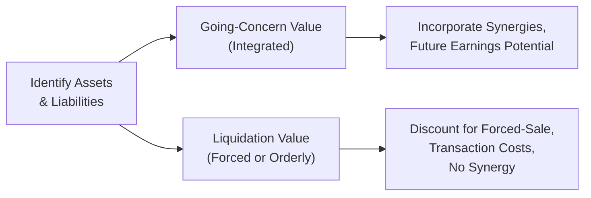

## Overview and Context

When you’re valuing a private company under an asset-based approach, you’re faced with an important judgment call: should you analyze the business as an ongoing enterprise—where it presumably remains afloat for the foreseeable future—or as a candidate for liquidation? You might think, “Well, obviously, if the business is up and running, we assume it stays that way!” But in reality, corporate finance is rarely this straightforward. Sometimes, the business is on shaky ground, or the potential for synergy between assets is questionable, or the entire sector is pivoting in a new direction that older firms can’t match. In these scenarios, it’s often critical to weigh the possibility of liquidation rather than blindly applying a going-concern assumption.

Anyway, let me share a quick anecdote from my earlier days: I once reviewed a small manufacturing firm whose owners insisted that a going-concern valuation gave them a certain level of goodwill and intangible brand equity. But if you visited their actual facility—well, you’d see a place begging for an overhaul. Their major customers had slowly trickled away to more modern competitors. At that point, we had to ask: do we truly see this firm as continuing operations indefinitely, or would a forced or orderly liquidation scenario be more realistic? This debate often arises in exam item sets, especially around distressed or underperforming private companies.

Throughout this section, we’ll break down the nuances of these two valuation methods, show practical examples, and consider the exam-related angles you might face in a CFA Level II setting.

## Distinguishing Going-Concern Value From Liquidation Value

In a private company valuation context, “going concern” often implies we’re valuing assets under the assumption they remain fully integrated within the existing business model. Not only are we looking at tangible items (like machinery or real estate), but we’re also attributing some portion of the firm’s overall intangible value to those assets, such as brand recognition, established customer relationships, and the synergy that arises from combining multiple assets. 

On the flip side, “liquidation value” zeroes in on what you’d receive if you sold each asset individually, typically in a relatively short time window—sometimes urgently (forced liquidation) or more deliberately (orderly liquidation). Liquidation value can be an eye-opener. Especially in a forced-sale situation, asset values may plummet due to:

• Transaction costs (e.g., broker fees, auction fees).  
• Limited buyer interest, particularly in niche assets.  
• The forced-sale or “fire sale” discount, where buyers know the seller is under pressure.  
• Potentially zero or negligible value for intangible assets that don’t have a clear market (e.g., a brand that only works if the business remains intact).

### When to Use a Going-Concern Approach

• The company is profitable or has stable (or potentially improving) cash flows.  
• Management has reasonable plans for expansion, new product lines, or marketing.  
• The overall sector/industry is healthy, and there’s no sign of regulatory hurdles that render operations unviable.  
• The assets’ combined usage is worth more than the sum of the parts (synergy).

### When to Use a Liquidation Approach

• The business is distressed or near insolvency, with low probability of recovery.  
• There are structural changes in the industry making the existing business model obsolete.  
• Creditors or stakeholders want to shutter the firm to recoup investments as quickly as possible.  
• The synergy among the assets is either minimal, non-existent, or negative.

## Key Factors Influencing the Choice

Sometimes analyzing a private firm’s recent trends can be a bit like reading tea leaves: you’re searching for the subtle signals that point toward ongoing operations or approaching dissolution. Here are some common indicators:

• Negative Profitability Trends: Sustained net losses, deteriorating returns on capital, or repeatedly missing debt obligations can push valuations to a liquidation basis.  
• Inability to Service Debt: High leverage and limited refinancing avenues hint that the firm may not be a going concern much longer.  
• Sector or Regulatory Risk: If upcoming regulations or industry disruptions will severely hamper the firm’s core product lines, liquidation valuation might be more realistic.  
• Strategic Management Plans: If management has a robust turnaround strategy (and the resources to execute it), a going-concern approach could be justified. But if not—liquidation stands out.  

## Modeling Going-Concern vs. Liquidation in an Asset-Based Valuation

Let’s outline the conceptual structure behind each approach. The following Mermaid diagram illustrates the difference between going-concern and liquidation valuation steps:

Notice how, under a going-concern scenario, we typically look at how assets (both tangible and intangible) contribute to the future profitability of the firm. We might allocate a portion of intangible value to these assets—like brand significance or intellectual property—and consider how these intangibles mesh with physical capital to generate synergy beyond individual asset sale prices.

With liquidation, the analyst will consider the net proceeds for each asset if sold off. This involves:

1. Cataloging the fair market value of each asset individually.  
2. Subtracting direct liquidation costs (broker fees, shipping, taxes, severance payments).  
3. Adding up the net amount across all assets.  
4. Making an educated judgment on how intangible assets might fare—often they lose value drastically if they are not sold with the rest of the business as a package.

## Practical Examples and Case Illustration

Imagine a private textiles manufacturer, “CottonDynamics.” Over the past five years, their revenue has plummeted, their machinery is old, and the entire textiles industry is rapidly migrating operations to lower-cost regions. Here’s a snapshot of two parallel valuations:

### Going-Concern Analysis  
• The property and equipment might be recorded at some fair market value, expecting they’re used in operation.  
• The brand name “CottonDynamics” might still have some intangible worth based on loyal customers.  
• Management projects new investments to automate production, generating moderate future cash flows.

### Liquidation Analysis  
• The old weaving machines might fetch significantly less than their book value if sold quickly to secondhand-machine dealers.  
• The brand name itself might be worthless unless some competitor sees synergy in acquiring that brand.  
• We factor in severance costs to dismiss employees, taxes on asset sales, and the time horizon for an orderly sale (if feasible).

In real life, we’d do a side-by-side comparison, analyzing:

• Which approach yields a higher (or more realistic) value?  
• Is the firm truly capable of implementing an operational turnaround?  
• How do external market conditions (e.g., competition, labor costs) shape the viability of continuing operations?

## Common Pitfalls

Below are some mistakes analysts often make when straddling these two approaches:

• Overstating Intangibles: If the firm is on the brink of collapse, intangible assets like the brand can vanish or become valueless.  
• Underestimating Liquidation Expenses: Broker fees, severance packages, tax stipulations, and administrative costs can eat up a huge portion of the proceeds.  
• Confusing Orderly Liquidation With Forced Liquidation: An orderly liquidation generally yields higher proceeds, but the timeline might be longer. Failing to clarify which scenario you’re applying can lead to erroneous valuations.  
• Missing Synergies: Sometimes, especially in more stable companies, the synergy among assets is greater than you’d expect. Reducing everything to bare-bones net asset disposal values might drastically undervalue the firm.

## Strategies for Exam Scenarios

In a typical CFA Level II vignette, you may be dealing with a struggling private manufacturer or a specialized tech startup whose main intangible is a set of patents. You’ll often have to:

• Decide whether the company’s problems are short-term or structural and whether it should remain going concern.  
• Evaluate tangible versus intangible worth.  
• Identify direct liquidation costs that might be hidden (like severance or legal fees).  
• Perform parallel valuations—one under going concern, one under liquidation—and then choose which makes more sense given the case details.

It’s super helpful if you look for clues like:

• The firm’s discussions with creditors (debt restructuring or repeated defaults?).  
• The capacity of management to pivot or reorganize.  
• The presence (or lack) of synergy between the firm’s intangible assets and its physical capital.  

Remember, the question might ask for the final value under each scenario or ask you to justify which scenario is more appropriate.

## Best Practices and Implementation Tips

• Gather Detailed Asset Data: Know the market for each asset type, especially specialized equipment.  
• Distinguish Between Forced and Orderly: List your assumptions about the liquidation timeline.  
• Factor in Realistic Synergies: For going concern, always tie intangible assets to actual cash flow contributions.  
• Rigorously Estimate Disposal and Transaction Costs: Overlook these and you’ll get unrealistic net proceeds.  
• Validate the Logical Consistency: Does your final conclusion about liquidation or going concern align with the business narrative (e.g., incompetent management, unstoppable external threats, etc.)?

## Concluding Thoughts

Valuing private companies often means walking a tightrope between an optimistic future and a pragmatic sense of potential failure. The decision to treat the firm as a going concern or to consider a liquidation scenario is not always black and white; it requires balanced judgment, careful reading of the financials, an understanding of the sector’s direction, and a dash of realism. 

In exam settings, you want to show that you can pivot quickly once the facts reveal the business might be nearing the end of its life cycle. Conversely, if the case presents a moderate path to recovery and synergy in the existing operations, you’ll justify a going-concern approach. In short: keep your eyes open for subtle hints and weigh both valuations to identify which is appropriate.

## References and Further Reading

• CFA Institute Level II Curriculum, Equity Investments: “Private Company Valuation”  
• Mellen, C. & Evans, F. (2017). Valuation for M&A: Building and Measuring Private Company Value. 3rd ed. Wiley.  
• FASB Accounting Standards Codification (ASC) 820: Fair Value Measurement  

--------------------------------------------------------------------------------

## Test Your Knowledge: Liquidation Value vs. Going-Concern Value



### A struggling private company with obsolete manufacturing equipment is trying to raise funds by selling part of its operations. Which factor most strongly indicates a liquidation-based valuation might be more appropriate?

- [ ] The company’s brand name has remained highly recognized regionally.
- [ ] Management has introduced a new product development plan.
- [ ] The company recently secured a short-term bank loan at attractive rates.
- [x] The machinery has negligible resale value, and creditors are pressing for rapid recovery.

> **Explanation:** Urgent creditor demands to recover funds and negligible machinery resale value suggest forced liquidation conditions. High brand recognition and new product plans are generally arguments for a going concern, but if creditors are breathing down the company’s neck, liquidation might be imminent.

### In a liquidation scenario, an analyst typically does NOT consider which of the following?

- [ ] Transaction costs and broker fees.
- [x] The synergy value between assets.
- [ ] The potential for intangible assets to lose most of their value.
- [ ] Tax implications of asset sales.

> **Explanation:** Under liquidation, synergy values among assets usually aren’t considered because each asset is sold individually, often piecemeal. Transaction costs, intangible value reduction, and taxes are all relevant.

### A private firm projects consistent, modest future earnings, and its intangible assets (including brand equity) are strong. Which valuation approach is most likely to yield the highest figure?

- [x] Going-concern valuation based on integrated asset use.
- [ ] Liquidation valuation based on forced sale conditions.
- [ ] Asset-based approach adjusted downward for intangible synergy.
- [ ] Comparables approach ignoring intangible assets.

> **Explanation:** If the firm’s intangible brand and synergy remain valuable, a going-concern approach typically yields a higher valuation than forced liquidation. Liquidation typically strips away intangible contributions and synergy.

### What is a key difference between forced liquidation value and orderly liquidation value?

- [x] The time frame in which assets are sold.
- [ ] The type of assets involved.
- [ ] The firm’s ownership structure.
- [ ] The presence of intangible assets.

> **Explanation:** Forced liquidation value generally assumes a rapid, possibly distressed sale, whereas orderly liquidation allows a reasonable time period to find suitable buyers, typically resulting in higher proceeds.

### Which of the following scenarios would most strongly support remaining a going concern rather than proceeding to liquidation?

- [ ] The business has significant overdue tax liabilities and limited liquidity.
- [x] The firm has just secured a large, stable contract with a major client.
- [ ] The main manufacturing equipment is near the end of its useful life.
- [ ] The business has unshakable intangible assets that are untransferable.

> **Explanation:** A large, stable contract with a major client indicates the firm has ongoing revenue potential, supporting the going-concern outlook.

### When converting a going-concern valuation to a liquidation valuation, which cost is MOST likely to be added?

- [ ] Product development costs.
- [x] Severance payments to employees.
- [ ] Ongoing marketing and advertising expenses.
- [ ] Synergies for intangible assets.

> **Explanation:** Liquidation involves shutting down or drastically reducing operations, thus incurring employee severance expenses. Ongoing marketing and synergy are more relevant for a going concern.

### Under the asset-based approach for a private firm, intangible assets in a liquidation scenario are generally:

- [ ] Valued at zero automatically.
- [ ] Aggregated with tangible assets at their accounting book value.
- [x] Valued at a fraction of their going-concern worth unless a buyer specifically demands them.
- [ ] Excluded entirely from consideration in all liquidation analyses.

> **Explanation:** Intangibles often lose significant value under liquidation; however, some fraction might still be realized if a strategic buyer is found. Automatically assigning zero could be too extreme.

### Which aspect specifically differentiates liquidation value from going-concern value?

- [x] The assumption that the firm discontinues operations and sells assets individually.
- [ ] The assumption that every asset is being used in generating future cash flows.
- [ ] The notion that intangible assets appreciate over time.
- [ ] The application of synergy multiples to all tangible assets.

> **Explanation:** Liquidation involves discontinuance and asset-by-asset sales, whereas going concern views assets as integrated to produce future cash flows.

### If you see a valuation analysis where severance costs, broker fees, and shorter time horizons dominate, you are most likely dealing with:

- [ ] A standard going-concern DCF approach.
- [x] A forced liquidation scenario.
- [ ] An orderly equity carve-out plan.
- [ ] An intangible goodwill assessment only.

> **Explanation:** These variables (severance, broker fees, short time horizons) hint strongly at a forced liquidation situation.

### True or False: In a liquidation scenario, brand equity and customer loyalty are generally assumed to retain their original value.

- [ ] True
- [x] False

> **Explanation:** Brand equity and customer loyalty typically lose much or all of their value during liquidation because they cannot be easily transferred independently of the ongoing business model.


