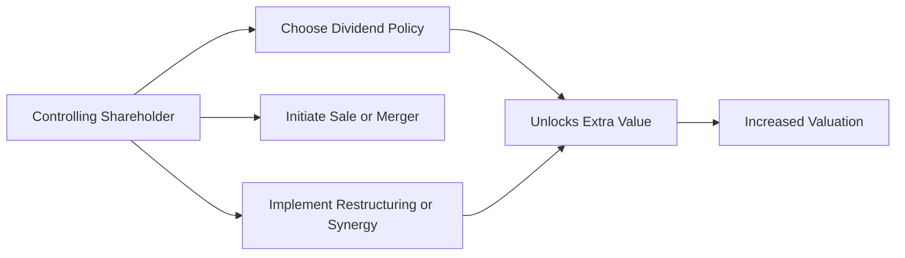

## Overview

Valuing a private company under an asset-based approach can be tricky enough, right? But once you factor in whether the shareholder is controlling or non-controlling, things become even more complex. You’ve got premiums to consider, discounts to apply, and synergy possibilities that might make or break your final valuation. In this section, we’ll talk about Minority vs. Controlling Shareholder Perspectives—why they matter and how to incorporate them into your analysis. I’ll sprinkle a few personal observations along the way to (hopefully) make it more engaging and clear.

## Control and Minority Stakes in Private Companies

When you’re looking at a private company, two people might own shares with completely different levels of power. A majority (or controlling) shareholder can basically influence key strategic decisions—like selling off big assets, merging the firm with a strategic partner, or redirecting dividends toward growth. Meanwhile, a minority shareholder typically sits on the sidelines, without the formal power to drive these decisions (though sometimes they have partial protective rights).

And you know, it can be frustrating to be that minority investor: you can’t force a sale or strategically shift the company’s future. This matters massively for valuation. A seat at the control table often comes with a higher, well, price tag.

### Why Asset-Based Valuation?

Under an asset-based approach, you value a company by taking the fair market value of its assets and subtracting the fair market value of its liabilities. For a private firm, it might be farmland, property, intangible assets, or specialized machinery—whatever goodies the firm owns. Then you say: “If we sold all of these assets off individually, how much would we get—net of liabilities?” But the twist is that, for a controlling stake, you might do more with those assets than a minority holder could. Maybe you’d dispose of non-core assets or reposition them to generate synergy. A minority shareholder usually can’t force those changes, so the per-share value might differ significantly.

## Control Premium: Unlocking Power and Influence

A controlling interest allows you to call the shots: approve mergers, set dividend policy, direct strategic capital allocation, and even replace management. That’s super valuable. In practical valuation terms, we often see a premium—called a “control premium”—added on top of a base value to reflect all that extra control.

Let’s face it: controlling a company sometimes means capturing synergy. For instance, if the controlling owner merges the target firm with another to reduce overhead or combine distribution, that synergy can boost the net present value of future cash flows. A minority shareholder can’t just snap their fingers and make that happen.

Below is a simple diagram to visualize how controlling powers can increase valuation:

Essentially, the ability to navigate major corporate moves without needing approval from larger boards or extra partners drives up the value from the standpoint of a controlling investor.

## Minority Discount (Discount for Lack of Control)

On the flip side, if you’re a minority investor, you might be left wishing you had that power. Because guess what? The market might discount your shares precisely because you can’t unilaterally exercise those juicy rights. If a private company is valued at, say, $50 million total, you cannot just assume 10% of that is worth $5 million. It might be less due to a “lack of control” discount—often called a minority discount.

### Calculating the Minority Discount

The size of the minority discount depends on various factors:

• Governance Rights: Do minority holders have the right to block certain decisions, like asset sales? If so, the discount might be smaller.  
• Voting Provisions: Are there special classes of shares that concentrate voting power in the hands of a controlling block? That raises the discount on minority shares that have limited or no voting.  
• State or Regional Legal Protections: In some jurisdictions, minority abuse is heavily policed, and that can reduce the discount. In other regions, minority protections might be weaker.  

This discount can be expressed as a percentage off the pro-rata value. For example, if the entire corporate equity is logically valued at $100 million, your 10% stake might be worth less than $10 million, maybe $8 million or $9 million, depending on the discount.

## Marketability and Liquidity Discounts

Even if you have control, private-company shares don’t trade on the New York Stock Exchange or the London Stock Exchange. You can’t just snap your fingers and turn those shares into cash. So welcome to the world of “lack of marketability” discounts. These discounts layer on top of, or separately from, the minority discount. The more challenging it is to convert your stake into liquid assets (like sales proceeds), the larger the discount. This affects both controlling and non-controlling stakes, but minority stakes often get a double whammy—small ownership plus illiquidity.

### Common Marketability Factors

• Time to Exit: Are you forced to hold onto shares for five years if you want to get any decent exit price?  
• Transfer Restrictions: Some private firms have shareholder agreements that restrict share transfers.  
• Company Industry and Size: Smaller firms (or those in certain industries) may have fewer prospective buyers, expanding the liquidity discount.

## Synergy and Asset-Based Valuations

When analyzing synergy in an asset-based approach, you typically revalue each asset at fair market value. But if you hold a controlling stake, you can choose to sell underutilized equipment, combine operations with a sister firm, or restructure the entire production process. This can elevate the final net asset value beyond what a minority holder can realize (since minority holders might not have a say in selling that old warehouse).

Imagine a hypothetical scenario:  

• The controlling shareholder sees that a piece of land on the company’s books worth $2 million could immediately be sold on the open market for $3 million, or it could be redeveloped to house a profitable side business.  
• A minority holder who doesn’t have enough votes to push for the land’s sale or repurposing might see that potential value remain locked up.  

Hence, synergy is often realized only with a controlling stake (or at least with strong minority protections and active board representation).

## Practical Illustrations

Let’s walk through a quick example:

• A private manufacturing company has net assets (assets minus liabilities) that, at fair value, total $50 million.  
• A controlling shareholder (say, 60% stake) might manage to drive that net value to $55 million through synergy (like merging warehouses or renegotiating supply contracts). Because they can do that, their 60% stake effectively might be worth 60% of $55 million, which is $33 million, plus an additional control premium if the synergy is not fully recognized in the baseline valuation.  
• Conversely, a minority stakeholder with a 15% stake might see a discount. They might only be able to sell that 15% stake for something like $6 million, representing a combination of a minority discount and possibly a marketability discount.

Now you might think, “Hold on, that’s $33 million + $6 million = $39 million, which doesn’t add up to 75% of the original $50 million.” Exactly—that’s how big the difference can be when you break the company into controlling vs. minority stakes. The synergy or control value sometimes exceeds the naive sum of pro-rata shares. That’s the real world in private-company valuations.

## A Quick Comparative Table

Below is a simple layout of how controlling and minority stakes differ in an asset-based valuation context:

| Factor                          | Controlling Stake                    | Minority Stake                               | Valuation Impact                                  |
|--------------------------------|--------------------------------------|----------------------------------------------|----------------------------------------------------|
| Decision-Making Power          | Full or majority control             | Limited or no influence                      | Higher valuation for controlling stake            |
| Control Premium                | Implied; synergy can be realized     | None; synergy mostly inaccessible            | Control premium added to base valuation           |
| Minority Discount              | Not applicable                       | Yes; discount for lack of control            | Reduces the value of the minority stake           |
| Marketability Discount         | Often smaller (still applies)        | Potentially larger                           | Further reduces final minority valuation          |
| Ability to Restructure Assets  | Broad discretion to unlock value     | Restricted; reliant on controlling decisions | Control can raise net asset value substantially   |

## Best Practices and Common Pitfalls

Sometimes we forget (I know I have) that private-company valuation is not just plugging a P/E ratio or using only DCF. The asset-based approach has subtle intricacies, and you really want to keep these points in mind:

• Don’t Double Count Discounts: If you already accounted for a minority discount, be cautious about stacking an excessive lack of marketability discount. Evaluate them separately but watch out for overlap.  
• Reflect Real Governance Rights: Check the company’s bylaws, local laws, or partnership agreements. Maybe minority stakeholders have more blocking rights than standard.  
• Think About Synergy Realistically: Just because synergy “could” be there doesn’t mean it’s guaranteed. If synergy depends on an improbable market scenario, dial back the premium.  
• IFRS/GAAP Considerations: Under IFRS or US GAAP, intangible assets—like brand names or proprietary technology—might be recognized only if certain criteria are met (e.g., they can be sold separately, or there’s a reliable measurement). Carefully review these rules, since the asset-based approach must incorporate intangible assets properly.  
• Data Quality: Private firms may not have the same level of audited financial statements or robust disclosures as public companies. Trust but verify. If the data is questionable, incorporate a bigger margin of safety.

## A Brief Anecdote

I once worked on a valuation for a family-owned manufacturing business where one sibling controlled 51% of the shares. The younger sibling with 49% had practically no say in day-to-day operations. The controlling sibling had grand plans to redevelop a large piece of surplus land. The younger sibling, who wanted to sell out, realized the buyer wouldn’t pay the same per-share price for 49% because of that lack of control. We had to apply a minority discount and a hefty marketability discount, slicing more than 25% off a simple pro-rata share price. It was a stark, real-life reminder that power in private companies isn’t just about the number of shares but also the rights and privileges attached.

## Conclusion

Minority vs. controlling shareholder perspectives are at the heart of private company valuation—particularly so in the asset-based approach. A controlling stake often includes a premium reflecting the ability to wield significant influence, unlock synergies, and shape the company’s strategic trajectory. Meanwhile, a minority stake typically suffers from discounts for a lack of control and marketability. Knowing how and when to apply these adjustments is a vital skill for any investment professional.

It’s a delicate dance, balancing synergy potential, governance rights, and intangible asset values. But once you understand the interplay among them, you’re far better positioned to produce an accurate, defensible valuation—or succeed in your next item-set question on the exam.

## Test Your Knowledge: Valuing Control vs. Minority Stakes in Private Companies



### A private company is valued based on its net assets at $100 million. Which of the following best describes why a control premium may be applied for a buyer acquiring a majority stake?

- [ ] Because the majority stake avoids any marketability discount.
- [x] Because the buyer can direct strategic business decisions and unlock synergies.
- [ ] Because the buyer automatically merges the company with its own operations.
- [ ] Because the buyer never pays more than fair market value for the assets.

> **Explanation:** A control premium represents the extra value of being able to influence and direct decisions, which presumably can unlock synergies not available to a minority holder.

### A minority shareholder’s valuation discount primarily reflects:

- [x] Their inability to influence major corporate actions.
- [ ] The risk-free rate of return.
- [ ] The buyer’s personal financing constraints.
- [ ] The macroeconomic inflation forecast.

> **Explanation:** A minority discount is partly about the lack of control over decisions such as mergers, dividends, or capital structure.

### What factor typically increases the discount for lack of marketability?

- [x] Fewer potential buyers and restrictive transfer agreements.
- [ ] The ability to force corporate changes.
- [ ] Ownership of special voting shares.
- [ ] An established public market for trading shares.

> **Explanation:** When the path to sell private shares is narrow—due to contractual or legal constraints, or a limited buyer pool—marketability declines, and the discount increases.

### Which statement is most accurate regarding controlling shareholders under the asset-based approach?

- [ ] They are not permitted to liquidate assets freely.
- [x] They can reorganize and dispose of assets to optimize value.
- [ ] They must offer the same price per share to minority holders.
- [ ] They cannot realize synergies in private markets.

> **Explanation:** A controlling shareholder can sell or redeploy assets, potentially raising the company’s total net asset value.

### If a private company’s net assets are valued at $80 million, how might a 10% stake differ from an $8 million valuation?

- [ ] It would automatically be $10 million.
- [ ] Only a marketability discount applies, never a lack of control discount.
- [x] It might be less than $8 million due to a minority discount.
- [ ] It must be exactly $8 million, per standard practice.

> **Explanation:** A minority investor often cannot demand $8 million for a 10% stake; it could be discounted for lack of control (and possibly marketability).

### Which condition would likely reduce the size of the minority discount?

- [ ] Minority stakeholders have no voting rights.
- [ ] The company is in financial distress.
- [x] Governance structures allow minority shareholders to block major decisions or have veto power.
- [ ] The controlling shareholder is known for ignoring other owners.

> **Explanation:** If minority holders can legally or contractually block key changes, their effective control is higher, reducing the discount.

### A controlling shareholder might earn a premium over the base asset valuation chiefly because:

- [ ] They can personally keep all dividends.
- [x] They can implement strategies such as mergers or divestitures to unlock additional value.
- [ ] They do not have to file any financial reports.
- [ ] They always have access to cheaper capital.

> **Explanation:** Gaining control can give the shareholder freedom to make major strategic calls, creating or tapping into synergies above the baseline.

### Why is synergy more related to a controlling stake?

- [ ] Minority stakeholders can always initiate a liquidation.
- [x] Control enables implementing operational changes, mergers, and asset restructuring.
- [ ] Synergy is automatically realized by all shareholders.
- [ ] Synergy only arises in public companies.

> **Explanation:** Most synergies require operational authority, such as consolidating management, redirecting strategy, or combining assets—activities under the controlling shareholder’s power.

### Ownership of intangible assets under IFRS or US GAAP in an asset-based valuation can differ from realized synergy value because:

- [x] Synergy often relies on future strategic actions, while IFRS/GAAP require certain criteria to be met before recognizing intangible assets.
- [ ] GAAP always includes synergy on the balance sheet.
- [ ] IFRS automatically counts synergy as a tangible asset.
- [ ] Private companies are exempt from intangible asset recognition.

> **Explanation:** Synergy value often goes beyond standard accounting requirements, as intangible assets are recognized only if they are separately identifiable, have measurable cost/benefit, etc.

### In valuation of a private company, the statement “the sum of the parts is less than the total enterprise value when ignoring synergy” is:

- [x] True
- [ ] False

> **Explanation:** Synergy can push the total enterprise value above the simple sum of separate valuation components, and controlling interests are in a better position to realize that synergy.



## References

• Pratt, S. (2022). Valuing a Business: The Analysis and Appraisal of Closely Held Companies. McGraw-Hill.  
• Davis, M., & Davis, F. (2021). Quantitative Methods for Business Valuation.  
• CFA Institute Level II Curriculum, Equity Investments – Private Equity and Private Company Valuation  
