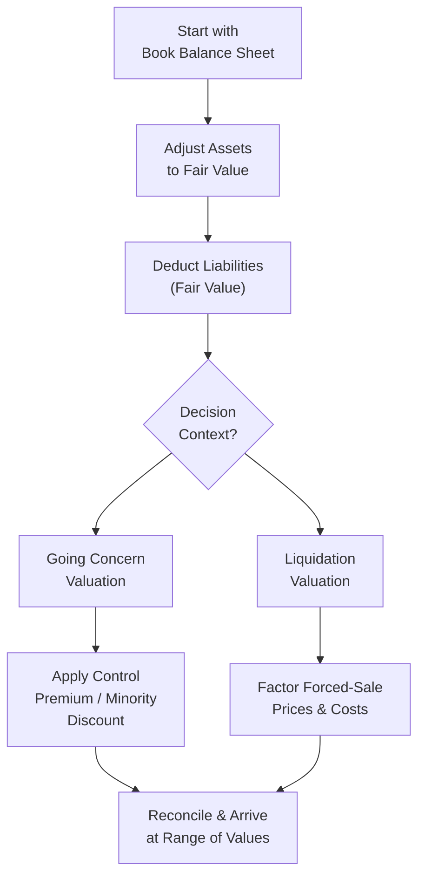

## Vignette Context and Objectives

Sometimes, you stumble upon a private company—maybe a niche technology startup with no public trading history—and you’re asked to whip up an estimate of its value. Because it’s private, there’s no readily available market price, and often, you can’t rely on neat trailing P/E multiples from comparable public companies. So you delve into asset-based valuation.

But wait—asset-based valuation can be complex, especially if you think about intangible assets like brand names, intellectual property, or custom software that might be understated (or absent) on the balance sheet. And what if the company is on the brink of liquidation? Add in the possibility that your client is either a minority shareholder or someone gunning for full control, and you’ve got a recipe for a pretty challenging puzzle.

This vignette highlights how to reconcile asset-based estimates under different premises: going-concern vs. liquidation. Along the way, we’ll address balance sheet adjustments, intangible assets, synergy potentials, and ownership structure. It’s a chance to see how real-world valuation scenarios often combine data points from multiple sources. Here, the line between “strictly academic” and “messy reality” begins to blur.

## Balancing the Balance Sheet: Adjusting to Fair Value

When performing an asset-based valuation, you typically start with the company’s balance sheet. However, the stated book values may not reflect the true “fair value” of each asset or liability. Let’s just say you have a line item like Property, Plant & Equipment (PP&E) listed at historical cost minus accumulated depreciation. Is that anywhere near the market value? Maybe not.

1. Historical Cost vs. Fair Value:  
   • Under most accounting standards, assets can be carried at cost. If the company has held real estate for many years, the market value could be significantly higher than the depreciated carrying amount.  
   • Similarly, intangible assets (like software) might be fully amortized on the books but still have enormous potential market worth.  

2. Example of an Adjustment:  
   Suppose TechX Inc. has intangible software recorded at zero book value (fully amortized under IFRS or US GAAP). However, third-party appraisers estimate that the software’s current fair value is $2 million if sold or licensed to an interested third party. That’s a big difference!

3. Potential Liabilities or Off-Balance Sheet Items:  
   You might find that the company has pending legal claims or intangible obligations (e.g., an unresolved lawsuit for patent infringement). If the balance sheet ignores these, you’ll want to factor them in as possible liabilities at fair value.  

The net result is a more accurate “adjusted shareholders’ equity” figure. That adjusted figure represents the rough baseline from which you can further refine your analysis.

## Going-Concern vs. Liquidation Premise

### Going-Concern Valuation
Under a going-concern assumption, the company is expected to continue operating. That means intangible assets—like a brand name—carry value because they can generate future revenue streams. Also, synergy matters. For example, if a strategic acquirer could integrate TechX’s technology into a broader ecosystem, the intangible assets might be worth more to them than to the open market.

• Leveraging Intangibles: “Brand recognition,” loyal customer relationships, intellectual property—these intangible assets might not show up on the balance sheet at all, or they might be undervalued. Yet, they contribute to the overall value if the business remains operational.  
• Synergy Potential: If a larger competitor sees real synergy in TechX’s proprietary software, the intangible might command a premium beyond typical “fair value.”  
• Adjusted Equity as a Floor: In a going-concern scenario, the adjusted asset-based valuation might serve as a floor—an absolute minimum—because a buyer typically values future cash flows as well.

### Liquidation Valuation
If the company fails to secure next-round financing, or if you suspect that it’s headed toward shutting its doors, the liquidation premise takes over. Here, each asset is assessed based on forced-sale or orderly-liquidation prices, which might be lower—or sometimes higher—than book value, depending on the asset class and market conditions.

• Forced Sale vs. Orderly Liquidation: Forced-sale values can be significantly lower because of time constraints or a distressed environment. An orderly liquidation, on the other hand, might allow for better price realization.  
• Adjacent Costs: Liquidation often involves additional costs (e.g., severance, broker fees, legal expenses). If you’re forced to sell specialized equipment in a niche market, you might have to discount heavily.  
• Cash Burn and Liability Acceleration: Certain liabilities become due sooner in liquidation, which further offsets the gross liquidation proceeds.

## Impact of Ownership Structure: Minorities, Control, and Premiums

Let’s face it: Ownership structure complicates everything. Are you valuing a controlling stake or a minority interest? Control premiums and minority discounts can shift the final valuation dramatically.

• Control Premium: If you’re buying a majority stake, you might pay extra because you get the power to direct the company’s future, forge strategic partnerships, and realize potential synergies.  
• Minority Discount: If you only grab a minority stake, you might pay (or receive, if you’re the seller) less, because you lack certain voting rights and control privileges.  
• Synergy Realization: Typically, synergy is easier to realize if you have effective control. A non-controlling stake might not fully capture synergy benefits, reducing your willingness to pay a premium.

## A Step-by-Step Vignette: TechX Inc.

Below is a condensed scenario for TechX, a private player in advanced data analytics:

• Balance Sheet (simplified, in millions):  
  - Cash: $1  
  - Accounts Receivable (net): $2  
  - PP&E (net): $5 (estimated fair market value: $7)  
  - Software (net): $0 (estimated fair market value by appraiser: $2)  
  - Brand (not on the books): $0 (estimated fair value after brand study: $1)  
  - Total Liabilities: $3 (includes $1 litigation risk not recorded on books but probable)

• Additional info:  
  1. TechX is trying to raise financing and might have to liquidate if the round fails.  
  2. A large competitor, MegaData Solutions, has indicated interest in acquiring TechX for synergy—particularly the software that could integrate with their current platform.  
  3. Current investor holds 40% and sees no immediate liquidity event unless they convert to a controlling position or find a new buyer.  

### Building the Asset-Based Valuation under Going-Concern

1. Adjust to Fair Value (Going-Concern):
   - Adjusted assets = $1 (Cash) + $2 (A/R) + $7 (PP&E) + $2 (Software) + $1 (Brand) = $13  
   - Less total liabilities: Because there’s a $1 probable litigation risk, we add that to the liabilities. So, effective liabilities = $3 + $1 (litigation) = $4  
   - Adjusted shareholders’ equity = $13 – $4 = $9  

2. Considering Control Premium or Synergy:
   - If MegaData Solutions acquires TechX as a going concern, they might pay an additional synergy premium. Let’s guess synergy is $3 above intangible fair value (based on the competitor’s internal estimates of future combined cash flows).  
   - Potential purchase price from a controlling perspective = $9 (adjusted equity) + $3 (control/synergy premium) = $12  

3. Minority Perspective:
   - If you’re only buying 40% with no control, you might discount that $9. For instance, you might see a 20% discount for lack of control and liquidity.  
   - Minority stake valuation = $9 – (20% × $9) = $7.2 as the overall equity value from a minority perspective (the 40% share of it would be 40% × $7.2 = $2.88 for that block).

### Building the Asset-Based Valuation under Liquidation

1. Forced-Sale Values:
   - PP&E might be sold at $5 instead of $7 if time constraints are harsh.  
   - Software might be worthless to a random buyer if the company shutters (although a niche competitor might pay something). Let’s modestly assume forced-sale value: $1.  
   - Brand name might fetch nearly nothing in liquidation. Maybe $0.2 for the domain name or brand licensing rights.  
   - AR might be collectible at a slight discount if you press customers. Let’s call it $1.8.  

2. Adjusting for Liabilities and Liquidation Costs:
   - Let’s add direct liquidation costs of $0.5 (legal fees, severance, etc.).  
   - So, total asset proceeds: Cash $1 + A/R $1.8 + PP&E $5 + Software $1 + Brand $0.2 = $9.  
   - Net after liabilities: $9 – $3 existing liabilities – $1 litigation – $0.5 (liquidation costs) = $4.5.  

3. Reconciling the Results:
   - Liquidation scenario yields about $4.5 in net equity.  
   - Going-concern approach yields $9 (without synergy) or $12 (with synergy premium).  
   - Big difference, right? That’s precisely why context is everything.

## Reconciling the Two: Questions to Ask

1. Does the company have a genuine chance of continuing operations or attracting new funding?  
2. Could synergy from a strategic acquirer (like MegaData) realistically materialize?  
3. Is there an alternative: partial liquidation of non-core assets with a strategic pivot?  

In practice, you don’t just pick one approach. Often you weigh the probabilities, or you might rely on an income-based approach or a market-based approach to sanity-check these asset-based results.  

But especially for the CFA exam context, you want to articulate how each assumption changes the numbers, demonstrate the adjustments to the balance sheet, and finalize a reasoned “range” of values. Then you highlight which scenario is more likely or more relevant to the question’s vantage point (e.g., controlling buyer vs. minority sale).

## Diagram: High-Level Flow of Reconciling Asset-Based Valuations

In this flowchart, we start with a company’s book balance sheet, make adjustments to reflect fair values, then consider whether the company or its assets will be treated as a going concern or subject to liquidation. From there, we factor in the effect of ownership structure—whether a control premium or a minority discount might apply—and conclude with a final range of valuations that require professional judgment to reconcile.

## Practical Tips and Pitfalls

• Don’t Overlook Intangibles: Often the biggest “hidden value” in a private company is intangible—like brand or intellectual property. But always confirm that these intangibles can be monetized (transferable, protective IP rights, etc.).  
• Liquidation Costs Add Up: Be sure to include severance, legal, brokerage, and maybe even environmental cleanup costs when you do a liquidation approach.  
• Document Your Assumptions: In a real case, you might be called to testify about your valuation. If so, you’ll need robust documentation of each assumption.  
• Synergy is Not Guaranteed: Synergy-based premiums can be ephemeral. A competitor might lose interest or find integration too costly.  
• Minority Discounts Vary: They depend on local market conditions, legal protections for minority shareholders, and share liquidity.

## Exam Application and Strategy

In the CFA environment, you’re likely to see an item set with partial data on a private company. Pay close attention to footnotes or side comments about intangible values, synergy potential, or ownership stakes—these typically hold key insights about which approach to prioritize or how to adjust your final number.

• Time Management: The biggest risk is overthinking each step. A bullet-point approach might help in structuring your answer.  
• If They Ask for a Range: Provide both going-concern and liquidation-based estimates, then weigh in on the context.  
• Reference the LOS (Learning Outcome Statements): Keep an eye on the specific tasks—are you asked to do simple arithmetic or to discuss conceptual differences?

## References for Further Exploration

• CFA Institute Level II Sample Item Sets – Private Company Valuation  
• Hitchner, J. (2022). Financial Valuation: Applications and Models. Wiley.  
• Damodaran, A. (2022). “Data Library” – asset and risk premia data, available at http://pages.stern.nyu.edu/~adamodar/  
• The Appraisal Foundation (USPAP): Uniform Standards of Professional Appraisal Practice  

---

## Test Your Knowledge: Reconciling Asset-Based Valuations



### In an asset-based valuation under a going-concern assumption, which of the following is usually TRUE regarding intangible assets?

- [ ] They are always valued at net book value.  
- [x] They may need to be adjusted to reflect market-based or appraised fair values.  
- [ ] They are typically excluded entirely.  
- [ ] They do not affect control premiums.  

> **Explanation:** Under a going-concern assumption, intangible assets are often adjusted to reflect their fair value, which may be higher (or lower) than net book value.

### A private firm’s balance sheet shows PP&E at a net book value of $4 million. An independent appraisal values the PP&E at $6 million. What is the total increase to the firm’s equity if the firm’s liabilities remain unchanged?

- [x] $2 million  
- [ ] $4 million  
- [ ] $6 million  
- [ ] $8 million  

> **Explanation:** If liabilities remain unchanged, increasing PP&E from $4 million to $6 million adds $2 million to the asset side, hence increases equity by $2 million.

### Which scenario would typically result in the LOWEST overall valuation of a private company’s net assets?

- [x] Forced-sale liquidation  
- [ ] Going concern with synergy premium  
- [ ] Going concern without synergy premium  
- [ ] Orderly liquidation  

> **Explanation:** Forced-sale liquidation generally yields the lowest proceeds because assets are sold quickly at distressed prices.

### Which of the following best describes a control premium?

- [ ] An extra premium paid by shareholders who own less than 5% of the firm  
- [ ] A discount applied to reduce valuation in a going-concern scenario  
- [ ] A surcharge representing the inability to influence company decisions  
- [x] An additional amount reflecting the value arising from a controlling stake  

> **Explanation:** A control premium is paid by investors who gain the power to influence company decisions, strategic direction, and realize synergies.

### Which element is MOST likely to be overlooked on the balance sheet of a technology startup?

- [ ] Accounts receivable  
- [ ] Current liabilities  
- [x] Proprietary software or brand intangible  
- [ ] Inventory  

> **Explanation:** Tech startups often have minimal physical assets or inventory. Proprietary software or brand intangible value is usually not fully captured in book value.

### Under which assumption would intangible assets carry the highest potential value?

- [ ] Liquidation sale  
- [ ] Forced-sale scenario  
- [ ] Non-transferable intangible environment  
- [x] Going-concern premise with synergy potential  

> **Explanation:** Going-concern with synergy potential preserves the intangible assets’ future earnings contribution, driving their potential value higher.

### If an investor is acquiring a 10% stake in a private company with a controlling shareholder, which discount is most relevant?

- [ ] Control premium  
- [ ] Synergy premium  
- [x] Minority discount  
- [ ] Marketability premium  

> **Explanation:** A minority discount applies as the investor has limited influence on company decisions and strategic direction.

### When reconciling asset-based valuations, the key question for intangible assets is:

- [ ] Whether intangible assets are always recorded at cost.  
- [x] If and how those intangibles can be monetized outside the company’s current operations.  
- [ ] Whether intangible assets should be reported at liquidation value.  
- [ ] If intangible assets should be netted off against liabilities.  

> **Explanation:** The critical factor is whether intangible assets can be effectively sold, transferred, or leveraged to generate economic benefits.

### In a liquidation scenario, which cost must typically be accounted for in the valuation that might not appear in a going-concern scenario?

- [x] Legal and severance costs  
- [ ] Synergy premiums  
- [ ] Negative working capital adjustments  
- [ ] Depreciation adjustments  

> **Explanation:** Liquidation often involves non-operational costs such as legal, severance, and broker fees that do not normally arise in a going-concern scenario.

### True or False: An asset-based valuation provides the definitive value for private companies and should be used exclusively.

- [ ] False  
- [x] True (This is intentionally incorrect to test understanding!)

> **Explanation:** Actually, asset-based valuation is not the definitive or exclusive approach. It often needs to be reconciled with other methods (e.g., income or market-based) for a well-rounded valuation. Therefore, the correct statement is that asset-based valuation alone is insufficient.


