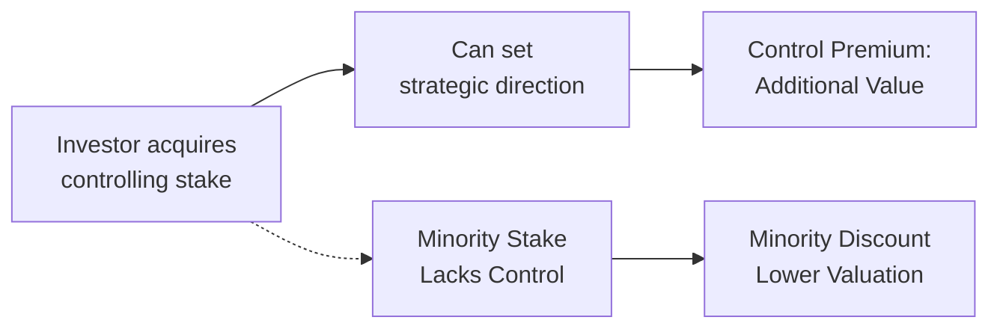

## Definition and Rationale
When someone holds a controlling interest—meaning they can basically call the shots in a company—they often pay a premium above the firm’s base valuation. That extra cost is known as the control premium. Conversely, if you hold just a small stake in a company and don’t get a meaningful say in how it’s run, your position might carry a minority discount. The logic is straightforward: control adds power and potential benefits, while minority positions can limit your influence and reduce your share of any future upside.

I recall chatting with a friend—I’ll call him Dave—who was thinking about investing in a small tech startup. Dave said, “I want 5% of the company because it lowers my upfront cost.” But 5% of a private company, especially one that is founder-led, might not give Dave much authority to influence day-to-day operations. And because he had no desire to be a passive investor for 10 years, his potential exit was uncertain. The discount on his minority stake would reflect the fact that his value from the company might be lower unless the founders or majority holders do something beneficial for all shareholders. That’s basically the real-world story behind minority discounts.  

## Control vs. Minority Position
In a controlling position, you can vote board members in or out, change the dividend policy, or restructure the entire business if you see fit. Such power can create additional value by:

• Realigning strategy and operations.  
• Negotiating new contracts with suppliers or customers.  
• Reorganizing the capital structure.  
• Adding new management or reorganizing entire divisions.  

On the flip side, a minority shareholder typically waits on the controlling parties to implement changes. You might benefit from the controlling shareholder’s decisions, but you also might lose out if they decide on strategies that favor their personal interests—or if they simply lack the skill to enhance the firm’s value. That’s why minority stakes often trade at a discount.

## Factors Affecting Control Premium
The amount of control premium hinges on potential benefits that controlling investors can unlock. Some of the key factors include:

• Synergies: A controlling shareholder can integrate the target firm with existing operations, reduce overlapping expenses, or expand revenue opportunities.  
• Operational Efficiency: Sometimes all it takes is new leadership or strategic focus to boost cash flows and hence the company’s value.  
• Ability to Access Cash Flow: Controlling owners can direct a larger portion of earnings to themselves, for instance via higher dividends or management fees.  
• Regulatory Environment: In jurisdictions where minority protections are weak, controlling shareholders may be able to implement changes without much opposition, enhancing the value of control.  
• Corporate Governance Structures: Poison pills, golden parachutes, or staggered boards can either protect or dilute control—thus affecting the premium.

## Estimating Control Premium
Valuation professionals often rely on precedent transactions or comparable market data to gauge how much more was paid for controlling stakes. Yes, it can get a little tricky. Each transaction is unique, and synergy expectations might be very specific. But some guidelines include:

• Analyzing M&A deals in the same industry: If the typical transaction premium is 20% to 25% above publicly traded share prices, that’s your ballpark figure for potential control premium.  
• Adjusting for Growth and Profitability Differences: Firms with stronger growth potential or higher margins might command bigger control premiums.  
• Factoring in Corporate Governance: Where minority rights are well-protected, the control premium might be smaller because controlling shareholders can’t do whatever they want.  

As an illustration, suppose the fair value of a 100% equity stake in Company X is estimated at $50 million based on traditional valuation methods. If the buyer believes they can generate significant synergy or strategic advantage, they might pay $60 million. The $10 million difference is a 20% control premium.

## Minority Discount Calculation Approaches
If controlling the business is seen to add, say, 20% in extra value, then the implied discount for minority shareholders (who don’t get that extra control benefit) can be substantial.

Market-Based Approach. Analysts look at public share prices for minority stakes and compare them to transaction prices involving controlling stakes. The difference suggests the discount.  

Indirect Approach. If the control premium is CP (in decimal form), the minority discount (MD) might be approximated as:


MD = 1 - \frac{1}{1 + CP}


So if CP = 20% (i.e., 0.20), we get:


MD = 1 - \frac{1}{1 + 0.20} = 1 - \frac{1}{1.20} = 1 - 0.8333 = 0.1667,


or about 16.7%. In practice, you tweak this formula based on specific terms and synergy assumptions, but it gives you an idea.  

Qualitative Assessment. Every private company is different. Maybe the founding family still dictates the direction no matter who else shows up, or maybe some minority shareholders get veto rights. Such differences matter a lot. You need to check corporate governance documents, terms of shareholder agreements, and relevant legal frameworks to see how minority and majority interests actually play out.

## Common Pitfalls and Considerations
It’s easy to fall into a few traps when estimating control premiums and minority discounts:

• Double Counting. Watch out for layering multiple discounts for “lack of control” and “lack of marketability” that overlap. If you’re already applying a discount for being unable to sell your shares easily, that might partially incorporate a minority discount.  
• Overreliance on Averages. We’ve all seen, “The average control premium is 25%.” But you might be ignoring the huge variation across industries, market cycles, or transaction specifics.  
• Legal Environments. In some countries, minority owners have robust protections—making a minority stake more valuable. In other places, controlling owners can do almost anything they want. That difference alone can lead to wildly different discount levels.  
• Mismatch in Synergy Potential. If synergy is unique to the buyer (like a perfect operational fit), using that synergy to justify a universal control premium for all potential buyers can be misleading.

## Practical Applications for Valuation
Valuing a private firm (or a stake in it) often requires you to explicitly address who will hold the shares and what control rights (or lack thereof) come with them. A few pointers:

• Align the Ownership and Valuation Approach: If the buyer is acquiring a controlling stake, factor in synergy and management changes that might raise cash flows—but be realistic.  
• Reference Comparable Deals: If you find a similar transaction where a 60% ownership stake was acquired at a known control premium, that can set an anchor for your analysis.  
• Justify the Discount or Premium: Document the reasons why a minority stake should be valued at a certain discount. If there’s a strategic speech from the CFO describing minority-friendly policies, maybe your discount is smaller.

## Visualizing Control and Minority Concepts

In this diagram, you can see how a controlling stake leads to the potential for added value (control premium), while a minority stake may result in a valuation discount.

## Brief Example
Imagine a hypothetical situation:
• A private manufacturing business is worth an estimated $10 million under a typical discounted cash flow (DCF) model that assumes no changes to how the business is run.  
• A prospective buyer believes that, with control, they can retool the factory, renegotiate supply contracts, and boost annual cash flows by 15%. As a result, they’re willing to pay $11.5 million. The $1.5 million difference is effectively a 15% premium over the base valuation.  
• Now, a minority investor considering a small stake (let’s say 10%) will not be able to implement these improvements directly. They might not even capture the benefits the controlling shareholder expects to create. Hence, they might pay less than their pro rata share (i.e., 10% of $10 million = $1 million). They might, for instance, only pay $950,000 if they feel uncertain about whether the controlling shareholder will follow through.

## Glossary
Control Premium: Additional amount a buyer pays for a stake that grants majority voting or operational control.  
Minority Stake: Ownership that doesn’t provide a controlling influence and is subject to the decisions of the majority.  
Synergies: Operational or financial benefits realized when combining entities or changing management strategy.  
Shareholder Agreements: Documents that clarify the rights, obligations, and responsibilities of different stakeholders.  
Voting Rights: Legal entitlements allowing shareholders to influence key corporate decisions.  

## Best Practices and Exam Tips
• Always read the vignette carefully. If you see an M&A scenario, look for synergy clues, unique buyer synergies, or strong corporate governance details that might reduce minority discounts.  
• Double-check synergy assumptions in item sets. The exam might provide contradictory statements, testing whether you can spot unrealistic synergy optimism.  
• Reference real transaction data or industry best practices when discussing control premiums.  
• Think about the local legal environment. Sometimes the exam might show that minority shareholders have robust recourse, which modifies the needed discount.  
• Practice with the indirect approach to minority discounts (that 1 - 1/(1 + CP) formula) so you can do quick calculations in the exam.

## References and Further Reading
• Pratt, S. P. (2009). “Valuing a Business: The Analysis and Appraisal of Closely Held Companies.”  
• Damodaran, A. (2012). “Investment Valuation: Tools and Techniques for Determining the Value of Any Asset.”  
• KPMG Corporate Finance Publications on control premiums and minority discounts.  
• Journal of Business Valuation and Economic Loss Analysis for empirical evidence on transaction premiums.  
• CFA Institute Level II Curriculum Readings on Private Company Valuation.

---

## Control Premium and Minority Discounts: Practice Questions



### Which of the following best describes a control premium?

- [ ] A decrease in value associated with illiquidity.
- [x] An additional price paid to obtain a controlling stake in a company.
- [ ] A discount applied to a publicly traded minority interest.
- [ ] The discount resulting from a lack of voting rights.

> **Explanation:** A control premium is the extra amount a buyer is willing to pay to gain majority control, enabling the acquirer to direct the company’s operations and strategic decisions.

### A controlling shareholder in a private company most likely benefits from which of the following?

- [ ] The inability to veto board decisions.
- [x] The ability to replace management and set dividend policy.
- [ ] A reduced share of dividends due to control obligations.
- [ ] Paying no taxes on any capital gains achieved.

> **Explanation:** A control position allows the shareholder to shape strategy and determine management policies, including dividends and executive compensation.

### In the context of private company valuation, a minority discount usually arises because:

- [ ] Large shareholders enjoy unlimited liability protections.
- [ ] Minority shareholders have fewer tax advantages.
- [x] Minority shareholders lack the power to influence corporate decisions.
- [ ] Public companies always give better deals to controlling owners.

> **Explanation:** The lack of voting power and strategic influence is the key reason minority positions often sell at a discount.

### Which of the following factors would most likely increase the size of a control premium?

- [x] Strong synergy opportunities for the acquirer.
- [ ] High levels of minority shareholder protections.
- [ ] An economic recession limiting access to capital.
- [ ] A company with stagnant management but no apparent reorganization needs.

> **Explanation:** Substantial synergy potential can drive a higher control premium as controlling owners can more immediately capture value from strategic restructuring or cost savings.

### Assume a controlling interest in a private firm is bought at a price 30% above its fair market value. Using the indirect approach, approximately what is the implied minority discount?

- [x] 23%
- [ ] 30%
- [ ] 17%
- [ ] 26%

> **Explanation:** Minority discount ≈ 1 − 1/(1 + 0.30) = 1 − 1/1.30 = 1 − 0.76923 = 0.23077 ≈ 23%.

### A valuation analyst reviewing a market-based approach to determine the minority discount should primarily focus on:

- [x] Differences in transaction prices paid for controlling vs. non-controlling interests in similar firms.
- [ ] The ratio of preferred dividends to net income.
- [ ] The company’s book value relative to its tangible assets.
- [ ] Weighted average cost of capital from large public corporations.

> **Explanation:** The market-based approach compares transaction data for controlling stakes to transactions for minority stakes, highlighting the price differential.

### One pitfall in valuations involving both a discount for lack of marketability (DLOM) and a minority discount is:

- [ ] Not applying them both at the same time.
- [x] Potentially double-counting the same risk factor.
- [ ] Always summing them to arrive at the final discount percentage.
- [ ] Using them interchangeably, as they are the same concept.

> **Explanation:** Double-counting can occur if the same or overlapping factors reduce valuation through multiple discount applications.

### Which statement about corporate governance and control premiums is correct?

- [ ] Greater governance protections reduce the impetus for a control premium.
- [x] Limited board oversight can increase the perceived value of control.
- [ ] Robust governance norms always eliminate minority discounts.
- [ ] Governance factors have no impact on private company valuations.

> **Explanation:** When governance oversight is weak, controlling shareholders may wield broad power, increasing the value they place on gaining control in the first place.

### When a minority investor negotiates a stake in a private company that expects significant synergy from new management, this minority stake is:

- [ ] Automatically worth more than a controlling stake.
- [x] Potentially significantly discounted since synergy benefits may not flow fully to minority owners.
- [ ] Obligated to receive the same synergy benefits as controlling owners.
- [ ] Not subject to any discount, as synergy benefits increase all shares equally.

> **Explanation:** While synergy can raise overall firm value, minority holders may not have the power to ensure that synergy flows to them, leading to a discount.

### True or False: A strong control premium implies that minority shareholders can expect proportionally higher returns.

- [x] True
- [ ] False

> **Explanation:** In some cases, a strong control premium may reflect large potential increases in overall firm value, which can trickle down to minority shareholders, though not always in proportion to what a controlling shareholder gains. In practice, it depends on corporate governance and synergy allocation.


