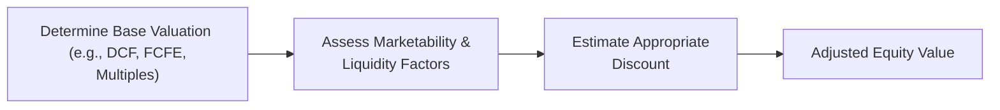

## Understanding the Concepts

Sometimes you look at a private company’s shares and think, “Well, I can’t just jump on an exchange and sell them!” That “inability” or difficulty translates into what we call a marketability or liquidity discount. The two terms sound similar, but they capture subtly different ideas:

• Marketability Discount: Reflects the reduction in value that arises because there’s no ready, active market for the shares.  
• Liquidity Discount: Centers on how easily (and quickly) an asset can be traded without significantly affecting its price.

Picture going to a farmers’ market versus a supermarket. The farmers’ market might only be open once a week and have fewer buyers for a particular vegetable—so you might have to accept a lower price if you need to sell fast. That’s sort of what happens with illiquid or non-marketable shares. 

## Key Distinctions

Marketability, you could say, is about having a “place” or “mechanism” to sell. Liquidity deals more with how easily shares can be converted into cash once that place exists. In private valuations, these two concepts often overlap:

• A share might be considered unmarketable if there’s no public exchange (or an extremely thin market).  
• Even after you find a buyer, it could be illiquid—maybe selling more than a small stake would drive the price way down (or take months to settle).

In practice, analysts often combine these considerations and label them collectively as “illiquidity discounts” or “lack of marketability discounts.” But for sophisticated valuation, especially in a CFA® Level II context, understanding their separate influences can sharpen your analysis.

## Why Discounts Arise

It’s not always fun searching for a willing buyer in a private market. Here are some drivers:

• Absence of a Public Exchange. Private shares lack a formal trading platform like the NYSE.  
• Legal/Contractual Restrictions. Private firms often have shareholder agreements limiting share transfers.  
• Transaction Costs. Selling might involve lawyers, bankers, or extended negotiations.  
• Limited Financial Disclosures. Fewer (or less frequent) reporting requirements can make buyers cautious.  
• Extended Holding Period. Potential investors might need years before any exit (e.g., a buyout or IPO).  

These factors can feel especially daunting if the company’s prospects are uncertain. Uncertainty about the business compels investors to demand a deeper discount to compensate for higher perceived risk.

## Quantitative Approaches

Valuers often want a specific number to tack on (or rather, to subtract) when calculating fair value. Several approaches exist:

### Restricted Stock Studies

Analysts examine restricted shares of public companies. By definition, these restricted shares can’t be freely traded for a certain period, yet they’re still “from” a publicly traded firm with an established price for the non-restricted shares. Researchers look at the difference in share prices of restricted stock vs. freely traded stock—commonly observing discounts ranging from 15% to 25% (or even higher in some scenarios). These studies offer a convenient, if imperfect, real-world proxy for illiquidity.

### Pre-IPO Studies

Pre-IPO studies compare the price at which private shares changed hands just before the IPO to the eventual IPO share price. The difference is then used as an estimate of the discount. If a firm’s private shares are sold at, say, $8 per share in a private round, and then the share price at IPO is $10, the implied discount might be around 20%. Of course, the flurry of IPO activity—and the unique traits of the firm—can skew these figures.

### Option Pricing Models

Sometimes analysts try to model the discount by calculating the cost of hedging illiquid positions. For instance, using options or derivatives (if they existed for that stock or a comparable) to replicate the holding period risk might yield an implied discount. Essentially, you look at how expensive it would be to insure yourself against price swings over the “lock-up.” That cost can reflect the discount required for illiquidity.

One conceptual approach is to treat the non-marketable share like an at-the-money put option on a comparable liquid share. The higher the put’s value, the greater the illiquidity discount, because you’re using that put to offset your inability to sell immediately.

## Qualitative Factors

Quantitative approaches are great, but, you know, real-world private valuations are rarely formulaic. Some critical qualitative factors:

• Company’s Risk Profile: Higher volatility or uncertain cash flows increase the discount, as it’s more painful to be stuck holding something risky.  
• Time Horizon: A quick path to exit (e.g., imminent M&A) might reduce the discount, whereas a private firm with no exit plan in sight can push it higher.  
• Management and Governance Quality: Strong leadership and transparent governance can help mitigate investor concerns and reduce the discount.  
• Market Conditions: Take broader economic and industry trends into account; a tough market can enlarge illiquidity discounts.  

## Integrating into Fair Value

Valuing a private firm often starts with methods you’d use for a public firm—like DDM, FCFE, or multiples—then you must adjust for that dreaded lack of a secondary market. The discount is usually expressed as a percentage of the enterprise or equity value. Something like:

Vᵃdʲ = V * (1 – D)

…where V is your unadjusted value, D is the discount, and Vᵃdʲ is the final, adjusted valuation. The trick is justifying the magnitude of D. In a well-documented valuation report, you’d typically:

1) Reference a recognized empirical study or replicate your own data analysis.  
2) Highlight relevant qualitative factors—like the company’s growth stage and stability.  
3) State assumptions about future exit strategies.  
4) Provide a supporting range (e.g., 15%–25%) and then pinpoint a final figure.  

## Practical Examples

### Private Equity Lock-Up

It’s common for private equity firms to hold significant stakes for several years before any potential sale. That lock-up means funds can’t be fully redeemed if you change your mind in six months. Hence, you see a discount built in from the start.

### Venture Capital Investments

Startups arguably face the largest liquidity discounts. They’re often early-stage, with no guaranteed path to profitability. The discount might be a hefty 30%–50% to reflect both uncertainty and illiquidity.

### Family-Owned Businesses

In a family business, ownership stakes might come with transfer restrictions or complicated buy-sell agreements. Those constraints can bump up the discount. Also, personal relationships and family dynamics might complicate finding a buyer.

## Mermaid Diagram

Below is a simple mermaid diagram illustrating how these discounts fit into a private valuation process:

## Best Practices and Common Pitfalls

• Over-Reliance on A Single Study: Market data shifts over time, so using, say, a 1990s restricted-stock paper without considering current trends can be off-base.  
• Ignoring Qualitative Adjustments: The “why” behind illiquidity is often more important than the raw number.  
• Double Counting: Watch that you don’t apply both a marketability and a liquidity discount for the same phenomenon. In practice, they’re combined or carefully separated to avoid double dipping.  
• Transparent Reporting: Regulators and auditors frown upon “mysterious” 30% haircuts. Clearly document assumptions, references, and your reasoning.

## Short Personal Anecdote

I once helped a friend who owned shares in a promising private tech startup. They believed the shares were worth a fortune—until they attempted to sell them when they had an unexpected financial need. That “fortune” took months to liquidate at a price well below their initial expectation. In truth, the difference was mostly this illiquidity discount at work. You know that sinking feeling you get when you realize you can’t quickly convert an asset into cash? That’s precisely why these discounts exist.

## Exam Relevance and Strategy

On the CFA® Level II exam, you might see scenario-based questions (vignettes) describing how a private firm is valued. You’ll need to:

• Identify possible reasons for illiquidity.  
• Estimate a discount range from given data or from references to restricted stock/pre-IPO studies.  
• Justify adjustments with strong reasoning about risk factors, governance, lock-up periods, etc.  

Remember to connect the discount to the actual final valuation. The exam might even ask you to pick from multiple “fair value” options after applying different discount rates. Stay sharp on the logic—no single formula dominates, but well-explained approaches typically earn higher marks.

## References and Further Reading

• Damodaran, A. (2018). Equity Risk Premiums (ERP): Determinants, Estimation, and Implications.  
• Pratt, S. P., & Niculita, A. (2014). Valuing a Business: The Analysis and Appraisal of Closely Held Companies.  
• American Society of Appraisers (ASA) course materials on measuring marketability and liquidity discounts.  

---

## Test Your Knowledge: Marketability and Liquidity Discounts



### Which best describes the marketability discount?

- [ ] A discount applied to reflect irregular cash flows.  
- [x] A discount reflecting the lack of a private company’s readily available market.  
- [ ] A discount representing a firm’s overall tax burden.  
- [ ] A discount reflecting currency exchange risk.  

> **Explanation:** The marketability discount captures the reduction in value because the shares cannot be easily sold on a lively, well-functioning market.

### Which of the following is a common method to estimate illiquidity discounts?

- [x] Restricted stock studies.  
- [ ] Discounted bond yield comparisons.  
- [ ] Par value multipliers from publicly traded debt.  
- [ ] Weighted average cost of capital analysis.  

> **Explanation:** Analysts frequently use restricted stock studies to gauge discounts, by comparing restricted and freely traded shares of the same company.

### What is one primary driver of liquidity discounts for private companies?

- [ ] Availability of daily price quotes similar to public firms.  
- [ ] Lower cost of capital for private equity.  
- [x] Inability to sell shares promptly without affecting price.  
- [ ] Required distribution payments to private shareholders.  

> **Explanation:** An illiquid asset cannot be quickly converted into cash without a potential price drop or complicated negotiations.

### How does an option pricing model approach measure illiquidity?

- [ ] It uses the difference between callable and non-callable bonds.  
- [ ] It identifies taxes owed upon exercise of employee stock options.  
- [x] It calculates the cost of hedging or insuring a position over a specified holding period.  
- [ ] It examines the difference in yield between government and corporate bonds.  

> **Explanation:** By modeling a put or other derivative hedge for the period when shares can’t be sold, you approximate the cost of illiquidity.

### Which of the following scenarios would most likely increase a private company’s marketability discount?

- [x] The firm’s shareholder agreement strictly limits share transfers.  
- [ ] The firm has multiple exchange listings, including in major markets.  
- [x] The firm’s financial data are complex and infrequently disclosed.  
- [ ] The firm plans an IPO next week.  

> **Explanation:** Both restrictive share transfer agreements and a lack of transparent data tend to increase the perceived cost of illiquidity.

### Why might a qualitative assessment be critical when applying a discount?

- [x] Because not all illiquidity factors can be captured in purely statistical models.  
- [ ] Because discount percentages are entirely random.  
- [ ] Because the time value of money is irrelevant.  
- [ ] Because all private companies have zero liquidity.  

> **Explanation:** Many issues (e.g., governance, management intent, unique risk) don’t appear in cold datasets, so a qualitative lens is vital.

### A venture capital investment in a very early-stage startup often applies a large discount because:

- [x] There is high uncertainty regarding exit timing.  
- [ ] The startup’s shares are typically traded daily.  
- [x] Investors anticipate major risk and locked-up capital.  
- [ ] The startup is financially more transparent than public firms.  

> **Explanation:** VC stakes in early-stage companies involve high risk and long lock-up, so big discounts are standard.

### In valuing a private firm using a DCF approach, how would you typically incorporate a marketability discount?

- [x] Estimate enterprise value or equity value and then subtract a percentage discount.  
- [ ] Add a control premium after discounting cash flows.  
- [ ] Double the projected cash flows.  
- [ ] Only adjust the cost of debt.  

> **Explanation:** Typically, you first find unadjusted value (vcf) and then multiply by (1 – discount) or explicitly subtract the discount.

### What is one potential pitfall in applying both a marketability discount and a liquidity discount?

- [ ] It always understates total value.  
- [x] Double counting the same effects.  
- [ ] It is required by regulation.  
- [ ] It inflates the value of the business.  

> **Explanation:** If marketability and liquidity factors overlap, applying both discounts can lead to an overstatement of the total discount.

### True or False: Pre-IPO studies always match restricted stock study results for discounts.

- [ ] True  
- [x] False  

> **Explanation:** Pre-IPO discounts can diverge from restricted stock study findings due to differences in the timing of IPOs, market cycles, and firm-specific conditions.


