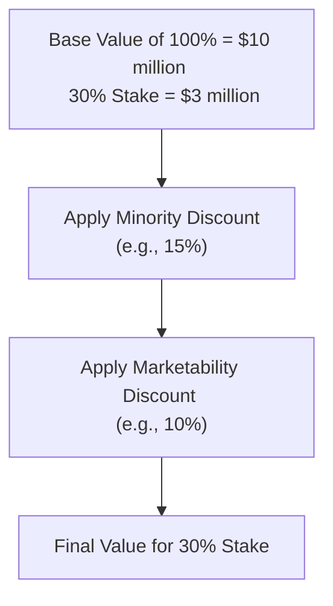

## Setting the Stage

Let’s say you’ve just settled into your seat at a small-town café with your laptop open, ready to tackle the valuation of a long-established, family-owned retail business. Maybe it’s one of those corner shops that have been around since your grandparents were kids. It feels cozy and community-oriented, yet you also see the complexity lurking beneath—especially when it comes time to figure out what a 30% stake is actually worth if a family member decides to sell it.

This scenario is surprisingly common. Families grow, folks retire, and eventually someone wants to cash out. But it’s not as simple as whipping out a stock price from an exchange. Private companies, particularly family-owned ones, have their own unique challenges. Shares might be passed among relatives only. Plus, a 30% share usually doesn’t give you full say in day-to-day operations. All this means we must carefully layer in discounts and premiums to arrive at a fair value. Here, you’ll learn exactly how to tackle that puzzle.

## Understanding the Vignette Scenario

Our vignette features a family-run retail store looking to value a 30% equity stake. The store has stable cash flows, moderate growth, and shares can only be sold to other family members or a small, pre-approved group of outside investors. The big question is: “How much is the 30% stake worth, and what discounts do we need to apply?” 

For reference, you can revisit earlier chapters, like “Private Company Valuation—Foundations” (Chapter 14) and “Discounts and Premiums in Private Valuation” (Chapter 18.1–18.3), where we introduced key concepts behind control premiums, minority discounts, and marketability discounts. Now we get to put it all into practice.

## Key Steps in Applying Adjustments

### Identifying the Base Valuation

Before we even talk about discounts, we need a baseline value for the entire business. You can do this via:

• Income Approach: Discounting future cash flows (a classic DCF method).  
• Market Approach: Using comparable public company multiples or transactions.  

Whether you eventually use net income, EBITDA, or free cash flow, you’ll arrive at some baseline figure that (in theory) represents 100% of the equity value of this family-owned business. Let’s imagine we conclude the total equity is valued at $10 million.

### Control Analysis

Next, let’s dig into control issues. A 30% stake is usually classified as minority: it’s large enough to be influential (especially in a small family business), but it typically does not give you outright control. For instance, you may not be able to singlehandedly make major decisions like declaring dividends or changing the store’s strategic direction. Because of this, the value of a 30% stake is typically less valuable on a per-share basis than if you owned the entire business outright. 

This difference in influence is often captured by a minority discount. If you recall from the earlier sections on “Control Premium and Minority Discounts” (see Chapter 18.1), a minority discount reflects the lack of certain voting or veto rights. 

Common Pitfall: Some folks mistakenly think that a 30% stake is “almost control.” Well, it’s not—unless the corporate bylaws or the shareholder agreement grant 30% owners extraordinary powers. So, be sure to check the governance documents.

### Evaluating Marketability and Liquidity

If you can’t hitch up your shares and sell ’em down at the local stock exchange, there’s a liquidity concern. The more restricted the shares, the bigger the discount. In our vignette, the shares can be sold only to family members or a small circle of pre-approved outside investors. That’s certainly more restrictive than shares listed on a public exchange. On the flip side, it’s not 100% illiquid—there are still potential buyers in the family. So, your marketability discount might be moderate.

Some specialists rely on studies comparing prices of publicly traded shares to shares of restricted stock (which can’t be freely sold). While these studies offer guidance, the ultimate discount remains a judgment call, influenced by the specifics of your company’s governance, growth potential, and the network of possible buyers.

### Combining Discounts and Reconciliation

We typically talk about layering discounts, which can feel a bit like stacking coupons at the grocery store. You might first apply a minority discount (to reflect lack of control) and then a separate marketability discount to account for restricted liquidity. However, watch for double counting if your minority discount already bakes in some aspects of illiquidity.

A common approach is sequential:

(Value of 30% Stake) = (Base Equity Value × 0.30) × (1 − Minority Discount) × (1 − Marketability Discount)

For instance, if the entire firm is worth $10 million, then a 30% stake is $3 million before discounts. Suppose you pop on a 15% minority discount, then a 10% marketability discount. It often looks like this:

Base stake value:  
3,000,000

Minority discount, 15%:  
3,000,000 × (1 − 0.15) = 2,550,000

Marketability discount, 10%:  
2,550,000 × (1 − 0.10) = 2,295,000

Concluded stake value:  
2,295,000

### Visualizing the Layering

Below is a simple depiction of how these discounts might be applied step by step:

Notice how each discount is applied to the reduced value from the prior step, not to the original $3 million all at once (unless you have a valid reason or a different methodology).

### Documenting Rationale

Finally, you need to explain each discount—maybe referencing a specialized study, or the company’s own historical buy-sell transactions, or guidance from professional organizations like AICPA and NACVA. The narrative in your valuation report should make it clear that you’re not just pulling numbers out of thin air. Also detail any assumptions about expected timeframe to sell, the store’s governance structure, family dynamics, and so on.

## Practice Exercises

Below are the exercises mentioned in the scenario. They’ll help cement how to perform these steps under exam conditions or in real-world engagements. Let’s walk through each:

#### Exercise 1

You’ve valued the company’s total equity at $10 million. The stake in question is 30%. You determine a minority discount of 15% based on your analysis of control rights and typical market data.

• First, calculate the pre-discount value of the stake.  
• Then apply the 15% minority discount.  
• Arrive at the value of the stake after that discount is factored in.

Hint: Don’t forget that 30% of $10 million is $3 million regardless of how stable the business is. After applying the 15% minority discount, you should end up with $2.55 million.

#### Exercise 2

Now you want to add another 10% discount for marketability, reflecting the limited pool of buyers. Explain how you’d combine or layer that discount. Show your final figure if you apply the two discounts sequentially. Also consider how the discount might overlap—an extra caution to avoid double counting liquidity issues if they were already partially reflected in your minority discount.

#### Exercise 3

List three non-numeric, qualitative factors about the family-owned retail business that might push your discounts up or down. For example, does the business have:  

• A strong brand name in the community?  
• A reliable, stable group of next-generation owners who want to expand?  
• Family feuds that might stall buyouts or hamper decision-making?

All these “soft” issues can significantly affect your final discount judgments.

## Discussion and Takeaways

As you tackle a family business valuation, keep in mind that you’re dealing with more than just numbers. The subtext—personal relationships, future expectations, potential changes in leadership—all matter. If a retiring family member is highly respected, their departure might even affect market perception within the local community. That intangible can shift the discount dynamic.

Similarly, external market conditions—like whether there’s a small private equity firm in town itching to invest—can narrow or widen your liquidity discount. The key is to remain consistent in your logic and thorough in your documentation. If you apply a discount for one factor, make sure you’re not layering the same factor again under a different name.  

## Best Practices and Pitfalls

• Always read the family charter, shareholder agreements, or operating agreement. Surprises about voting rights or buy-sell provisions can dramatically alter your discount estimates.  
• Avoid double counting. If a portion of illiquidity is built into your minority discount, don’t reapply it in your marketability discount.  
• Get comfortable with data from restricted stock studies or pre-IPO studies, but adapt them to the unique environment of your subject company.  
• Keep an eye on synergy or strategic benefits. Sometimes, a minority stake might carry pseudo-control if it’s the deciding block among fragmented owners.  
• Have a plan for standardizing your discount approach. This fosters consistency across multiple engagements.

## Glossary Refresher

• Internal Shareholder Buyout: When existing shareholders purchase shares from another owner; common in family or closely held corporations.  
• Transfer Restrictions: Legal or contractual limitations on who can buy or sell shares.  
• Layering Discounts: Sequentially applying multiple discounts (e.g., minority, then marketability).  
• Concluded Value: Final arrived-at valuation that you posit in your report.  
• Stakeholder Dynamics: Interpersonal relationships, governance structures, or family politics that can profoundly influence valuation.  
• Exit Strategy: The mechanism or path by which shareholders can divest; important for determining liquidity risk.

## Additional References

• American Institute of CPAs (AICPA): Valuation practice aids and guidelines on private share interests.  
• NACVA (National Association of Certified Valuators and Analysts): Standards and case studies for advanced discount calculations.  
• ASA (American Society of Appraisers): Educational materials on discount layering and methodologies.

## Final Thoughts

Valuing a private, family-owned business may feel challenging, but it’s also deeply rewarding. You’re not just crunching numbers; you’re shaping the financial futures of people who often have an emotional stake in the outcome. Think of the discount analysis as part art, part science. Sure, you ground your approach in recognized methods and empirical studies, but you also need the human touch—understanding the personal relationships, local market conditions, and intangible factors behind these numbers.

With practice—and maybe a little coffee—you’ll get comfortable with layering discounts and making a compelling case for why each step is justified. Now, let’s challenge your knowledge with some practice questions.

---

## Quiz: Mastering Discounts and Premiums In Private Valuation



### When valuing a 30% stake in a private family business, which factor is most likely to justify applying a minority discount?  
- [ ] The company’s high growth prospects  
- [x] The shareholder’s lack of control over business decisions  
- [ ] The company’s brand recognition in the community  
- [ ] The presence of strong sector competitors  

> **Explanation:** A minority discount arises primarily because a 30% stake typically does not confer control over decisions such as dividend payouts, board appointments, or strategic direction.

### Which approach best describes the process of discount layering in private company valuation?  
- [x] Applying each discount in sequence to the adjusted value from the prior step  
- [ ] Summing all discounts and subtracting them at once from the base valuation  
- [ ] Ignoring any overlap between minority and marketability discounts  
- [ ] Utilizing the same discount percentages as in public market valuations  

> **Explanation:** The most common (and recommended) approach is sequential: apply the minority discount first, then apply the marketability discount on the already-reduced value, carefully avoiding double counting.

### Assume a base equity value of $10 million for the entire firm. You decide to apply a 20% minority discount to a 25% stake. What is the value of that stake after the minority discount?  
- [ ] $2.0 million  
- [x] $2.0 million after discounting from $2.5 million  
- [ ] $3.0 million  
- [ ] $1.5 million  

> **Explanation:** A 25% stake is $2.5 million before discounts. Reducing that by 20% yields $2.0 million.

### In assessing a marketability discount for a family-owned firm, which factor would most likely reduce the discount percentage?  
- [ ] Strict transfer restrictions requiring consent of all shareholders  
- [ ] Very low daily trading volumes of the company’s shares  
- [x] Existence of multiple family members eager to buy additional shares  
- [ ] Opaque financial statements with frequent restatements  

> **Explanation:** A robust internal market (family members interested in buying shares) increases liquidity, which generally reduces the marketability discount.

### If an analyst believes some portion of illiquidity is already captured in the chosen minority discount, how should they address the marketability discount?  
- [x] They should adjust the marketability discount downward to avoid double counting  
- [ ] They should completely remove the marketability discount  
- [ ] They should apply the marketability discount on the entire pre-discount value  
- [ ] They should raise the marketability discount to reflect both minority and liquidity issues  

> **Explanation:** When the minority discount partially accounts for illiquidity, the analyst should carefully moderate the subsequent marketability discount to prevent excessive double counting.

### Which of the following might be a qualitative factor that increases a minority discount?  
- [ ] A clear shareholder agreement that grants veto power to the 30% owner  
- [ ] A steady dividend history paid to all shareholders  
- [ ] An established buy-sell agreement offering fair exits  
- [x] Consistent disputes among family members about business direction  

> **Explanation:** Ongoing family disputes can exacerbate the challenges of not having control, making a minority stake less appealing and thus increasing the discount.

### In combining a minority discount (MD) and a marketability discount (MktD), which formula is typically used to arrive at the final stake value (FSV)?  
- [ ] FSV = Base Stake Value × (1 − (MD + MktD))  
- [ ] FSV = Base Stake Value × (MD + MktD)  
- [x] FSV = Base Stake Value × (1 − MD) × (1 − MktD)  
- [ ] FSV = Base Stake Value − (MD × MktD)  

> **Explanation:** The standard layering approach is to sequentially multiply each discount factor in turn: first reduce by (1 − MD), then by (1 − MktD).

### Which document is least likely to influence the choice of a minority discount?  
- [x] A lease agreement outlining rental terms for the building  
- [ ] A shareholder agreement detailing voting rights  
- [ ] A buy-sell agreement specifying share transfer conditions  
- [ ] The company’s bylaws indicating decision-making procedures  

> **Explanation:** Lease terms for the building may affect operating costs or profitability, but they typically do not govern control or ownership rights that lead to a minority discount.

### After reading the family’s shareholder agreement, you find that a 30% owner can block major strategic decisions. Which adjustment is most appropriate?  
- [x] Apply a lower minority discount  
- [ ] Increase the marketability discount  
- [ ] Remove all discounts  
- [ ] Add both a minority discount and control premium  

> **Explanation:** If a 30% shareholder retains significant blocking powers, then the “minority” stake might not be such a disadvantage. This would reduce the magnitude of the minority discount.

### For private valuation purposes, is it true or false that a marketability discount is always applied separately from a minority discount?  
- [x] True  
- [ ] False  

> **Explanation:** While both discounts can be theoretically combined into a single factor, best practice typically involves applying each discount separately and sequentially to maintain transparency and avoid confusion about what portion of the discount addresses control versus liquidity.



---

**Exam Tip:** On the CFA® Level II exam, anticipate item set questions that require you to calculate these discounts quickly. Be ready to explain under which circumstances you would adjust the percentages or layer them differently. Remember: your written explanations or rationale can be just as crucial as the numeric result.
