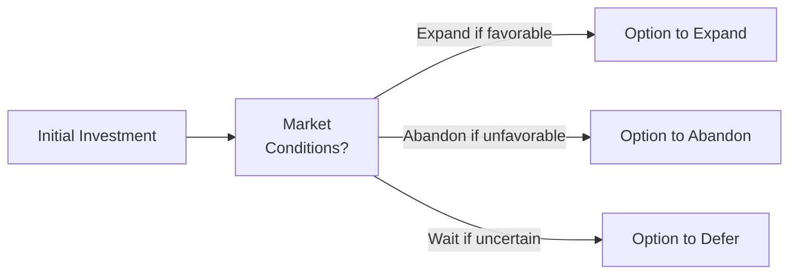

## Understanding Real Options in Equity Valuation

Sometimes, when I was younger and thinking about taking on a summer job, I loved knowing I could back out if something else came along (it really gave me peace of mind). Funny enough, companies do something similar all the time, and finance nerds (like us) call it having a “real option.” Essentially, a real option is the ability—but not the obligation—to capitalize on a strategic decision in the future. It’s “real” because it’s tied to physical or tangible assets (or at least real projects), rather than the abstract underlyings of financial derivative contracts like calls and puts on stocks.

Traditional discounted cash flow (DCF) valuation often overlooks the fact that projects don’t run on autopilot. Management can change direction, expand, abandon, delay, or switch strategies depending on how markets, technology, or other factors evolve. Valuing these flexibilities separately—and then adding them to a baseline DCF—can yield a more accurate measure of a project’s potential. For CFA® Level II candidates, it’s key to understand not only how to identify these real options but also how they might affect the final valuation.

Below, we’ll explore the main types of real options you might see in item sets or exam vignettes: the option to expand, abandon, defer, contract, and switch. We’ll also consider “growth options,” which are essentially stepping stones for additional future opportunities. Each of these can bring extra strategic value—especially in volatile environments where managerial flexibility can pay off big.

## Key Characteristics of Real Options

• Real options often arise in settings of high uncertainty—volatility actually brings opportunity.  
• They differ from financial options in that their underlying asset is usually a company’s project or investment opportunity, not a freely traded security.  
• Data for real options might be less precise than for financial options. Teams may rely more on scenario analysis or conceptual frameworks rather than closed-form option-pricing models.  
• Not all projects have relevant real options. Sometimes the future path is basically fixed. The challenge in exam questions is to spot when real options might exist and articulate how they add to or subtract from project value.

## Common Types of Real Options

### The Option to Expand
An “expand” option gives a firm the flexibility to increase project scope if things look promising. Imagine having a small factory that can be doubled in capacity if product demand exceeds expectations. Instead of committing to a massive production facility right away, the firm invests in a more modest plant but reserves the right (maybe with minimal retrofitting costs) to expand. If the market booms, the company exercises the expansion option.

• Practical Example: A biotech startup invests in a pilot plant to develop a new vaccine. If initial trials are successful, the firm can ramp up to large-scale production.  
• Value Add: The presence of this expand option can significantly boost the overall project value under favorable conditions.

### The Option to Abandon (or Shut Down)
The abandon option (sometimes referred to as an exit option) lets management pull the plug on a project that’s become uneconomic or otherwise unviable. If operating losses continue but you can recover part of the initial investment by selling the facility or pivoting resources, you’ll cut losses. The potential salvage proceeds act like a “residual value,” which might not be recognized in a plain-vanilla DCF that assumes the project runs its entire life.

• Practical Example: A mining operation obtains rights to extract a precious metal. After the deposit begins to yield diminishing returns, management might decide to sell the land (or reassign drilling equipment) instead of continuing to lose money.  
• Exam Bonus Point: If an item set suggests you can bail out at any time, the abandon option probably needs to be factored in.

### The Option to Defer (Timing Option)
Sometimes, companies don’t have to launch a project right away. The option to defer—like waiting to plant seeds until you’re fairly sure the weather’s about to turn—gives management time to gather more data, reduce uncertainty, or wait for better regulatory or market conditions.

• Practical Example: A real estate developer purchases land but defers building a new retail center because consumer spending is low. Once it sees a strong economic turnaround, construction begins.  
• Impact on Value: The higher the uncertainty (volatility), the more valuable a timing option typically becomes, because waiting allows you to avoid downside risk if the environment deteriorates.

### The Option to Contract (Reduce Scale)
A contract option is the reverse of expand. It’s the flexibility to downsize an operation or scale back in response to weaker demand. Think of it as the ability to run a skeleton crew when times are tough to keep the project afloat but minimize losses.

• Practical Example: A manufacturing firm invests in a versatile production line that can scale outputs up or down in response to consumer demand. If the economy tanks, the firm shrinks production.  
• Value in a Nutshell: Contracting saves on operating and capital costs, limiting downside.

### Switching Option (Managerial Flexibility)
Switching options let a company pivot between different operational modes or even different types of inputs. For instance, some power plants can switch between natural gas and fuel oil, depending on relative commodity prices. This optionality can be worth a lot if the prices of inputs fluctuate significantly.

• “Managerial Flexibility” is a broad term—it includes the possibility of changing product mix, reassigning staff, or altering distribution channels.  
• In finance terms, the more uncertain the environment for cost or price, the more a switching option can pay off.

### Growth Options
Growth options are a special breed of expansion option, representing the possibility that an initial project can open doors to entirely new products, geographies, or complementary technologies. It’s like planting a seed that might sprout a whole orchard. If the pilot is successful, the firm invests further or leverages know-how in adjacent markets.

• Practical Example: A consumer electronics manufacturer invests in 5G phone technology. The knowledge acquired might accelerate an entirely new product line a few years later.  
• Exam Tip: Growth options can be some of the hardest to quantify but are incredibly important in industries like biotech, tech, and resource exploration.

## Real Options vs. Financial Options

Unlike a standard call or put, real options’ underlying “asset” is often intangible at first—like the value of future streams of cash flows from a new project. There usually isn’t a neat, up-to-the-minute market price for these intangible assets, which can make precise valuation trickier. You might see a question in the exam referencing the use of binomial trees or a rough Black-Scholes approach to model the real option once you treat the project’s net present value as if it were the “underlying.”

But in practice, many firms use scenario analysis. For instance, you might compute the project’s NPV under best and worst cases, weighting each scenario or layering in the option only under certain conditions. The item set might prompt you to mention that the presence of an option to abandon at minimal cost kills the worst-case scenario, effectively raising your expected project value.

## Identifying and Valuing Real Options

1. Spot the Real Option: Management must identify strategic flexibilities. For example, the ability to wait, expand, or leave. If you see these spelled out in a vignette, highlight them.  
2. Assess Additional Costs: Options aren’t free. The firm might have to pay a premium or invest in up-front costs (like building a slightly more expensive but flexible facility) to keep its options open.  
3. Evaluate Underlying Volatility: The higher the uncertainty in future prices, demand, or technology, the more valuable the real option (generally).  
4. Build a Decision Tree or Binomial Tree: Some advanced questions might show how future states of the world feed into different managerial decisions.  
5. Add the Option Value to Base NPV: A straightforward approach might compute the NPV of the project ignoring flexibility (the “passive” approach), then separately add the value from having that flexibility.

Below is a very basic Mermaid diagram to illustrate how different real options might come into play after making an initial investment. It’s simplified, but it might help you visualize the branching of decisions.

## Best Practices and Common Pitfalls

• Overestimating Value: Sometimes, candidates (and practitioners) get excited about real options and inflate their valuations. Make sure to consider that creating flexibility can come at an extra upfront cost.  
• Underestimating Execution Difficulty: Just because an expansion or abandonment option exists in theory doesn’t mean it’s easy to execute. Regulatory, financial, or operational barriers can reduce the real-world value.  
• Neglecting Volatility: Remember, real option value typically increases with volatility—if the exam question suggests stable, predictable demand, the real option might not be that beneficial.  
• Failing to Incorporate Probability: Real options are worthless if the scenario that triggers their exercise is extremely unlikely. Scenario probabilities matter.  

## Managerial Incentives and Corporate Governance

An important qualitative consideration: do managers have the incentives to exercise the real option in a way that aligns with shareowners’ best interests? Suppose a manager is near retirement and expansions will take years to pay off—maybe they won’t expand even if it’s beneficial to the firm in the long run. On the other hand, a manager might push for an expansion that looks good for their short-term bonus, even though the long-term payoff is questionable. Understanding how corporate governance (board oversight, compensation structure, investor activism) influences real option exercise is crucial for a practical assessment.

## Practical Example: A Tech Startup with an Option to Expand

Let’s say a software firm invests in developing a new platform. The foundation is built to handle 1 million users. However, with a slightly larger initial spend, the software’s architecture can be scaled up to 10 million users cheaply if traction is high. The difference in building a basic platform vs. a more flexible one is an extra $1 million in upfront cost. But if users flock to the platform, the expand option might be worth $3 million in net present value. You can see that the net gain from adding flexibility is $2 million in expected value (though you wouldn’t get that nuance in a standard DCF ignoring manager’s ability to scale).

## Exam Day Tips

• Look for “red flags” in the vignette that talk about “if the project is successful, we can double capacity,” or “we can shut down at any time without penalty,” or “we can defer the start of the project.” Those phrases typically hint at real options.  
• Focus on the direction of how each option might affect a project’s NPV.  
• The question may ask: “Which real option is the most relevant to the scenario described?” or “How does the presence of an abandonment option affect the project’s risk profile?”  
• If a question is purely conceptual, highlight the importance of option value under different levels of uncertainty.  
• If they present partial calculations, be ready to illustrate a scenario approach or mention binomial option pricing for the real project.  

## Further Reading
• CFA Institute, “Equity Investments” in the CFA® Program Curriculum.  
• Copeland, T. and Tufano, P., “A Real-World Way to Manage Real Options,” Harvard Business Review.  
• Damodaran, A., Investment Valuation: Tools and Techniques for Determining the Value of Any Asset.  
• Trigeorgis, L., Real Options: Managerial Flexibility and Strategy in Resource Allocation.

---

## Test Your Knowledge: Real Options in Equity Valuation



### 1. Which of the following statements best describes a real option in the context of capital budgeting?

- [ ] It is a financial option that can hedge against currency risks for the project’s revenue.  
- [x] It is the right, but not the obligation, to take a specific business action (e.g., expand) on a real asset in the future.  
- [ ] It is an obligation to continue a project for its full economic life.  
- [ ] It is the right to purchase shares in the project’s underlying stocks if they exceed a certain price.  

> **Explanation:** A real option gives management the right (but not the obligation) to alter a real investment (e.g., expand, abandon, delay), thus adding flexibility to the capital budgeting process.

### 2. A manufacturing firm invests in a versatile production line that allows it to shift between different raw materials when input prices change. Which type of real option does this scenario illustrate?

- [ ] The option to abandon.  
- [ ] The option to contract.  
- [x] The switching option.  
- [ ] The option to defer.  

> **Explanation:** The ability to shift production inputs in response to changing prices is a classic example of a switching option (managerial flexibility).

### 3. Which factor most directly increases the value of real options?

- [x] Higher volatility of the project’s future cash flows.  
- [ ] Lower interest rates on corporate debt.  
- [ ] Stable output prices.  
- [ ] Lower required rates of return.  

> **Explanation:** Real options gain value when uncertainty (i.e., volatility) is high, because having the flexibility to respond to uncertain future states is more valuable in volatile environments.

### 4. A company invests in a new mining project with the right to shut down operations if commodity prices fall below a certain threshold. This right to stop production and recover some of the planned costs is best described as:

- [ ] The option to expand.  
- [ ] The option to defer.  
- [x] The option to abandon.  
- [ ] The switching option.  

> **Explanation:** The abandon option lets the firm cease operations and recover some of the investment, thus limiting downside risk.

### 5. A tech firm is considering building a cloud computing facility with capacity for 50,000 users, but paying extra now will allow expansion to 500,000 users if demand spikes. Which statement is correct regarding this extra capacity?

- [x] It represents an expansion option that could create additional value if user demand surges.  
- [ ] It is a form of timing option that defers the launch until more data is available.  
- [ ] It offers no incremental value without immediate demand.  
- [ ] It is an abandonment option that limits downside risk if demand is weak.  

> **Explanation:** Paying extra upfront for a design that you can expand later is an expansion option; if actual usage soars, the option adds value.

### 6. In real option valuation, how is the “underlying asset” typically characterized?

- [ ] The market price of a security that tracks industry performance.  
- [x] The present value of expected cash flows from the project.  
- [ ] A basket of currencies reflecting global operations.  
- [ ] The physical location in which the project is undertaken.  

> **Explanation:** When applying option-pricing logic to real assets, the underlying asset is the project’s net present value, not a publicly traded security.

### 7. A company is unsure whether to build a new factory now or wait 12 months for additional regulatory clarity. What type of real option applies here?

- [ ] Abandonment option.  
- [ ] Expansion option.  
- [ ] Contraction option.  
- [x] Timing (defer) option.  

> **Explanation:** The ability to wait for better information—rather than rushing in—is the classic timing or deferral option.

### 8. A biotech firm invests in research on a new medication. If it succeeds, the company can pursue related treatments using the same technology. This scenario is best classified as:

- [x] A growth option, because success in the current project leads to further potential.  
- [ ] A timing option, because the firm can wait until external conditions are perfect.  
- [ ] A switching option, because the technology can shift between multiple therapies.  
- [ ] An abandon option, because the firm can exit if the trial fails.  

> **Explanation:** Further R&D investments or new product lines arising from initial success exemplify a growth option.

### 9. Which of the following is a common pitfall when valuing real options?

- [ ] Factoring in scenario probabilities.  
- [ ] Computing salvage value for an abandoned project.  
- [x] Overestimating the ease or practicality of exercising the option.  
- [ ] Incorporating the cost to buy or maintain the option.  

> **Explanation:** A frequent error is to inflate the value of real options by assuming they can be exercised seamlessly, without any real-world friction (cost, time, or regulatory constraints).

### 10. True or False: In equity valuation, the presence of a real option can only increase the project’s value relative to a standard DCF approach.

- [ ] True  
- [x] False  

> **Explanation:** While real options often boost value by providing upside potential or mitigating downside risk, in rare cases the cost of maintaining or implementing the option might outweigh its benefits, though this is less common. Generally, real options add value, but they do not guarantee an increase if associated costs are too high.


