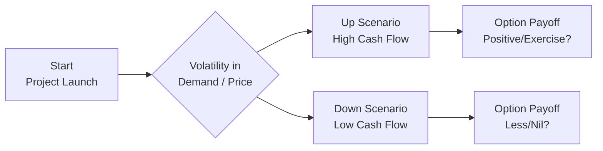

## Introduction
Real options can feel a bit intimidating when you first see them—sort of like peering into a hidden layer of value beyond plain-vanilla project NPV. I remember the first time I tried to value an option to expand a small manufacturing plant. I was perplexed because traditional discounted cash flow (DCF) methods just wouldn’t capture the flexibility to scale production if demand exploded. But real options are those little gems that actually measure how much that flexibility is worth. Anyway, it’s all about adjusting your lens: you’re not just looking at a static project; you’re looking at how management can react to changes in the market. And that’s pretty exciting.

Below, we’ll go through a framework that you can use in your own analyses. The goal is to make it thorough but also straightforward. Think of these steps as a checklist. If you remember these steps and practice them with actual case scenarios, you’ll be in good shape for exam day and for real-world applications.

## Step 1: Identify the Option and Underlying Asset
The first step is figuring out precisely what kind of option you have and what your underlying asset or project is. Are you analyzing an option to expand production (like ramping up a factory line) if demand goes up? Or maybe you’re considering an option to abandon a project if its profitability tanks? Real options come in many flavors—such as expand, contract, delay, abandon, or switch in/out of different technologies.

• Identify the Real Option Type: Expand, abandon, delay, switch, etc.  
• Pinpoint Key Uncertainties: Ask, “What factors determine whether or not this option is in the money?” Is it commodity prices, interest rates, demand, or input costs?

For instance, imagine a gold mining operation with the option to temporarily shut down when prices drop below a threshold. The “underlying asset” is essentially the project’s expected cash flows from operating the mine, while the “option” is the flexibility to halt operations until prices rebound.

## Step 2: Estimate Underlying Asset Value and Volatility
Next up, you need a working estimate of what the project’s current expected value is and how it might fluctuate. You know, any option is more valuable when there’s uncertainty (volatility). If you have no fluctuations in your market, the real option to “expand if prices skyrocket” won’t be worth much.

• Project Value: Start with a DCF approach, forecasting cash flows and discounting them at a rate reflecting the project’s risk.  
• Volatility Estimation: You might look at historical price data, run industry benchmarks, or do a Monte Carlo simulation to approximate volatility. In many real-world cases, we approximate volatility using something like an industry standard or proxy data if we don’t have direct volatility measurements of the project’s own returns.

### A Quick Diagram of the Process
Below is a simple flow diagram that shows how the project’s value might evolve over time, impacting the option payoff:

Visually, you see that if demand or prices go up (node C), the option might be well in the money. If demand or prices go down (node D), the option might have less or no payoff.

## Step 3: Choose a Valuation Model
Once you have the value and volatility pinned down, you decide on which model fits best. Are you dealing with discrete, stage-based decisions? If yes, a binomial (lattice) model might be your friend. If it’s a more continuous, smooth environment, then maybe Black-Scholes-based models are a solid approach. Let’s see the main options:

• Decision Tree / Binomial Model:  
  – Great for discrete intervals (say, after each quarter or year).  
  – You can easily incorporate changes in volatility or risk over time.  

• Black-Scholes Model:  
  – Typically used when exercise can happen at any point in time (continuous execution).  
  – Assumes constant volatility and risk-free rate.  

### Simple Binomial Framework
A binomial framework is often introduced like so:

 p = \frac{e^{r \Delta t} - d}{u - d} 

Where:  
– \\( p \\) is the risk-neutral probability of an up move.  
– \\( u \\) is the up-factor (e.g., 1.2 for a 20% possible increase).  
– \\( d \\) is the down-factor (e.g., 0.8 for a 20% possible decrease).  
– \\( r \\) is the risk-free rate (continuously compounded).  
– \\( \Delta t \\) is the time step length in years.

## Step 4: Risk-Neutral Valuation
Risk-neutral valuation—gosh, that phrase can feel complicated, right? But think of it this way: instead of discounting your expected payoffs by a risk-adjusted rate, you tweak the probabilities so that you can discount at the risk-free rate. The logic behind this is that if all investors are risk-neutral, they’d price assets by just discounting at the risk-free rate. You reflect all risk in the probabilities, not in the discount rate.

• Convert Actual to Risk-Neutral Probabilities: The formula above for \\( p \\) is a standard example.  
• If You Use a Lattice: You can apply the risk-neutral approach at each node.  
• If You Prefer Simpler Approaches: You might incorporate a risk-adjusted discount rate into a simpler tree-based approach. Just ensure internal consistency.

## Step 5: Compute the Option Value
Time to crystallize your results. Typically, you’d do something like:

1. Compute the payoff at maturity or at each decision node in your tree: compare “exercise the option” vs. “do nothing.”  
2. Apply the risk-neutral probabilities to get the expected payoff in each scenario.  
3. Discount back to today at the risk-free rate (or use the risk-adjusted rate if you’re not going full-blown risk-neutral).  
4. Verify that you’re not double-counting any operating cash flows or ignoring additional costs that might come with exercising the option.

Example: Suppose you’re deciding whether to expand your factory if demand is high next year. Using a one-period binomial model, if demand is high, your factory expansion yields an extra value of $2 million. If demand is low, you wouldn’t expand at all, so the payoff is zero. If your risk-neutral probability of a high market is 0.4, then your expected payoff is:


0.4 \times 2,\!000,\!000 + 0.6 \times 0 = \$800,\!000


If your risk-free rate is 5% for one year, the present value of that real option is \\(800,\!000 / 1.05 = \$761,\!905\\). That’s the value that you’d tack onto your base-case NPV from standard DCF.

## Step 6: Integrate the Option Value into Overall Project Valuation
Now that you have the real option’s value, don’t forget to meld it with your project’s base NPV. Typically:

Total Project Value = Traditional NPV + Real Option Value

This means if your standard DCF for the project yielded, say, \$10 million, and your real option is worth \$800,000, the full story might be \$10.8 million in total. Also, you’ll want to do sensitivity analyses here. Because real options are sensitive to volatility assumptions, a minor tweak might change the valuation significantly.

### Sensitivity Analysis
If a small change in volatility from, say, 20% to 30% amplifies your real option value from \$800,000 to \$1,500,000, that’s a big difference. So always look at how robust or fragile your real option value is.

## Step 7: Revisit Managerial Assumptions and Constraints
One of the sneaky pitfalls in real option analysis is ignoring whether or not management actually can or will exercise the option. Sometimes, regulatory constraints or corporate culture tie the hands of decision-makers. Or they might fear cannibalizing other business lines if they expand certain products. 

So you have to confirm that the real option is realistic in practice:

• Confirm Operational Feasibility: Does the technical infrastructure exist to expand or abandon?  
• Address Regulatory or Legal Hurdles: Is a permit needed? Does the expansion break any antitrust laws?  
• Assess Managerial Willingness: Sometimes, managers resist shutting down (“abandoning”) a project due to personal or organizational pressure.

## Step 8: Documentation and Communication
Finally, keep good records. Real option valuation, especially with detailed binomial trees or simulations, can get complex quickly. Organize your assumptions in a structured manner. In a corporate setting, you’ll want a short executive summary that highlights:

• The Real Option’s Rationale and Mechanics  
• Assumptions about Volatility, Costs, and Timelines  
• Strategic Justification: e.g., “We’re capturing upside if the market grows faster than expected.”  
• Numerical Results: The final option value, how it changes under key scenarios

The idea is: If you can explain it clearly to a client or a CFO in a few slides, you likely understand it well yourself.

## Glossary
• DCF (Discounted Cash Flow): A valuation method that discounts future cash flows by an appropriate risk-based rate to get their present value.  
• Risk-Neutral Valuation: A pricing approach where all assets grow on average at the risk-free rate, allowing for a simpler discounting process.  
• Binomial Model (Lattice): A discrete-time framework that models the underlying asset’s up or down movements to value options.  
• Black-Scholes Model: A continuous-time option pricing model that requires constant volatility and risk-free rates, among other assumptions.  
• Monte Carlo Simulation: A computational technique that performs repeated random sampling to generate numerous possible outcomes and estimate expected values.

## References
• Copeland, T., & Antikarov, V. Real Options: A Practitioner’s Guide.  
• Koller, T., Goedhart, M., & Wessels, D. Valuation: Measuring and Managing the Value of Companies.  
• Damodaran, A. “Dealing with Real Options in Valuation,” stern.nyu.edu/~adamodar.  

---

## Real Options Valuation: Practice Questions



### Which of the following describes a key advantage of real options over traditional DCF valuations in project analysis?

- [ ] Real options require fewer input assumptions.
- [ ] Real options rely solely on historical data.
- [x] Real options capture the value of managerial flexibility to respond to market changes.
- [ ] Real options eliminate risk from the valuation.

> **Explanation:** A key advantage of real options is that they incorporate a company’s flexibility to expand, contract, or abandon a project in response to uncertain future market conditions.

### In estimating the value of a real option, which factor typically increases the option’s value holding other variables constant?

- [ ] Low uncertainty regarding project returns.
- [ ] Short time to expiration.
- [ ] High cost of exercising the option.
- [x] High volatility of underlying cash flows.

> **Explanation:** Option value generally increases with volatility, because higher volatility increases the likelihood of significant favorable movements in the underlying asset’s value.

### Under the binomial model for real option valuation, the risk-neutral probability p is calculated by:

- [ ] (d - e^(rΔt)) / (u - d).
- [x] (e^(rΔt) - d) / (u - d).
- [ ] (u - d) / (d - e^(rΔt)).
- [ ] (u + e^(rΔt)) / (rΔt).

> **Explanation:** The correct formula for the risk-neutral probability p is (e^(rΔt) − d) / (u − d). This ensures the underlying value grows at the risk-free rate on average.

### Which real option type best describes a company's ability to stop a project temporarily when market prices become unfavorable?

- [ ] Option to expand.
- [ ] Option to delay.
- [ ] Option to contract.
- [x] Option to temporarily shut down.

> **Explanation:** Temporarily halting operations is effectively a shutdown option, enabling the company to avoid losses during unfavorable conditions until better prices return.

### A company values its base project at $15 million using a standard DCF approach. They calculate an expansion option to be worth $2 million. Which of the following is the project’s total value, assuming these valuations are correct?

- [ ] $13 million
- [ ] $15 million
- [ ] $17 million
- [x] $17 million when adding the embedded option value to the base case

> **Explanation:** Total value is the sum of the base DCF value ($15 million) plus the real option value ($2 million), leading to $17 million.

### In a risk-neutral world, the discount rate used for the expected payoff of the option is typically:

- [ ] The project’s internal rate of return.
- [ ] The firm’s weighted average cost of capital.
- [ ] The risk-adjusted discount rate.
- [x] The risk-free rate.

> **Explanation:** Under risk-neutral valuation, cash flows are discounted at the risk-free rate, with risk being incorporated into modified probabilities, not the discount rate.

### If managers cannot or will not exercise an option for organizational reasons, what is the main impact on the real option’s value?

- [ ] The value remains unchanged as real options are purely theoretical.
- [x] The real option’s value is effectively reduced or may be zero.
- [ ] The real option’s value is transferred to shareholders automatically.
- [ ] The real option’s value increases due to managerial incentives.

> **Explanation:** Real options only have value if they can actually be exercised. If management is unable or unwilling to exercise, the practical value of the option diminishes.

### Which of the following best explains why we perform sensitivity analyses on real option valuations?

- [ ] To eliminate subjectivity in the parameters.
- [ ] To confirm that volatility is irrelevant to real option pricing.
- [x] To see how changes in key assumptions (like volatility) affect the option value.
- [ ] To match the real option value to the underlying DCF’s cost of equity exactly.

> **Explanation:** Real option valuations can be extremely sensitive to assumptions about volatility, costs, or timing, so sensitivity analysis is essential for identifying how these variations influence final results.

### When comparing a binomial (discrete) approach and the Black-Scholes (continuous) approach to real option valuation, which statement is correct?

- [ ] The binomial approach assumes continuous trading of the underlying asset.
- [ ] The Black-Scholes approach is easier to implement with multi-stage decisions.
- [ ] Both methods are guaranteed to yield identical results.
- [x] The Black-Scholes approach is often used when option exercise can happen any time, while binomial is more suited to discrete decision points.

> **Explanation:** Black-Scholes is a continuous-time model that is most appropriate for options that can be exercised at any point, whereas binomial models are a good fit for discrete-step decision scenarios.

### Real option pricing typically:

- [x] Supplements traditional NPV analysis by capturing optionality.
- [ ] Replaces all forms of cash flow forecasting in valuations.
- [ ] Does not consider changes in operational decisions.
- [ ] Ignores volatility in underlying project cash flows.

> **Explanation:** Real options enhance (rather than replace) conventional NPV by incorporating the value of flexibility in decision making, especially when future conditions change.


