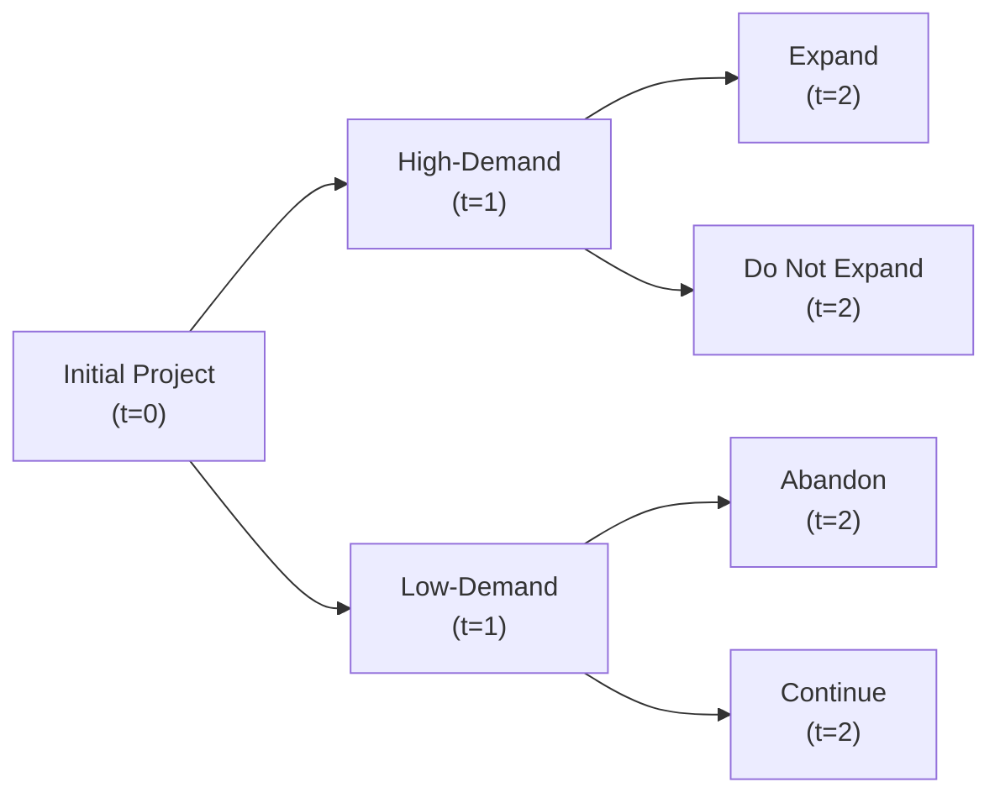

## Real Options vs. Traditional DCF Approach

I remember the first time I looked at a standard DCF (Discounted Cash Flow) model for a client’s proposed manufacturing plant, and I thought, “Uh, this looks so linear. It doesn’t capture all those ‘what if’ possibilities!” Traditional DCF—while a staple of valuation—fixes the cash flow projections in a single narrative. You assume certain revenue growth rates, cost structures, maybe a stable expansion plan, and you stick to it. But in reality, companies often have strategic flexibility. They might delay an investment, expand faster if market demand surges, or even abandon a project if conditions sour.

Real options capture these sorts of choices, offering a more dynamic valuation perspective. A real option gives management the right, but not the obligation, to undertake certain business actions, such as expanding capacity or abandoning operations. Suddenly, that single-path DCF blossoms into multiple potential outcomes, each weighted by probability and payoff. If the underlying volatility or strategic choices are substantial, real option value can completely shift the go/no-go decision. Without factoring in real options, you might dismiss a project that initially looks negative in net present value (NPV) terms, even though future flexibility could turn it into a profitable venture.

## Adjusting Free Cash Flow Projections

Real options typically latch on to the idea that future decisions may alter capital expenditures (CapEx), working capital requirements, or even revenue streams. Let’s say your standard analysis suggests investing $5 million in new machinery every other year for the next six years. But if you have a real option to expand more rapidly when demand surges, you might ramp up that CapEx earlier—or skip it entirely if demand fails to meet expectations. That’s where scenario-specific modifications to free cash flow (FCF) come into play.

• Expansion Option Effects:  
  – If demand booms, you might invest an extra $3 million upfront to capture market share. This extra CapEx would flow into your FCF calculations for that “boom” scenario.  
  – Conversely, if demand remains lackluster, you forgo that expansion CapEx.  

• Option to Abandon or Scale Down:  
  – In a dismal scenario, the ability to exit (perhaps selling off assets) injects a “salvage value” that offsets future losses.  
  – Abandonment might reduce negative cash flows while reaping partial proceeds from asset sales.

To incorporate these scenarios, many analysts build trees or lattices depicting different states of the world. Honestly, I used to sketch these on a whiteboard, complete with question marks and exclamation points for high- and low-demand states. The crucial point is that each node in the scenario tree may alter the projected FCF based on whether you exercise the option.

You might see something like this in practice:

Each branch indicates a distinct path with different FCF profiles. Weighted by the probabilities at each node, you can arrive at an “expected” set of future cash flows that reflect the real option’s presence.

### A Quick Mathematical Glimpse

In a simplified binomial world, you might see an option value expression:


\text{Value of Option} = p \times \text{(Value if Up State)} + (1 - p) \times \text{(Value if Down State)},


where \\( p \\) is the probability of the up state, and “Value if Up State” (or Down State) might include modified FCF estimates.

## Residual Income Model Adjustments with Real Options

In residual income (RI) models, you’re essentially looking at net income minus the cost of equity (or overall capital in some frameworks). This approach focuses on whether the firm’s returns exceed the required rate of return on the book value of equity.

When you weave real options into the RI approach, you do something similar to the FCF adjustments: you allow for the possibility that future earnings or book values may diverge from a single baseline scenario due to strategic decisions.

• Adjusting Book Value Growth: If the company invests in new assets upon exercising the real option, book value sees a jump. Future earnings may go up if the project is profitable.  
• Cost of Equity Impact: Real options can lower perceived risk if the firm can pivot away from negative outcomes, potentially reducing the cost of equity. Alternatively, the ability to expand might raise the growth (and risk) profile, potentially nudging cost of equity upward if markets perceive higher volatility.

Simply put, in an RI context, if you anticipate that management will exercise the option to expand only if it creates incremental value, you tweak your pro forma income statements. The result: better future residual income in growth scenarios than you’d see in a no-real-option scenario. This difference can be large enough to transform a borderline RI analysis into a clearly positive proposition.

## Sensitivity and Scenario Analysis

One of the coolest aspects of real-option thinking is that you can map out different scenarios—like turning the lights up and down on a stage set—and see how the play unfolds. For each scenario, note carefully:

• Are we exercising the option?  
• Does management have the capacity or desire to do so?  
• What are the incremental costs and benefits?  

In a bullish macro environment, maybe the probabilities of high demand expand. In a more conservative or recessionary environment, that option to drop the project might dominate. Document each scenario’s FCF or RI outcomes. Besides giving you a sense of the project’s expected value, it also clarifies real-world triggers. So, if you notice that an expansion option becomes critical only if your competitor exits the market, that’s crucial intel for your final recommendation. I often call these “trigger conditions.” They’re the real decision points that can make or break the project.

## Limitations and Potential Pitfalls

Despite all the pluses, it’s not like real options are a cure-all. I have seen folks get a bit starry-eyed about theoretical upside, but a few real-world constraints can hamper the actual exercise of that option:

• **Model Complexity:** Incorporating real options can require advanced modeling techniques (e.g., binomial lattices, Monte Carlo simulations). Not every finance department has the resources or the will to do it right.  
• **Volatility Estimation Errors:** Real options are typically more valuable when the underlying cash flows or asset values are volatile. But if you input unrealistic volatility assumptions, you might inflate the option’s perceived worth.  
• **Practical Constraints:** That “option to expand” is worthless if the firm cannot find enough skilled labor or get the necessary permits. Overlooking such tangibles leads to inflated valuations and disappointment at execution time.  

The moral: Real-option valuations are powerful, but also tricky. The best practice is to use them as a complement (rather than a substitute) for your standard DCF, FCF, or RI valuations.

## Illustrative Example: Two-Stage DCF Upgraded to a Binomial Real Option Model

Let’s piece together a quick scenario. You have a two-stage DCF: an initial high-growth phase (years 1–5) and a stable-growth phase (years 6 onward). Traditionally, you’d add up the present value of the first five years’ FCF plus the terminal value from year 6 onward.

Now suppose a real option is introduced that allows the firm to invest an additional $2 million in year 3 if demand surpasses 5% annual growth. You build a binomial model for year 3:

1. High-demand path: Probability of 0.6, invest $2 million, gain extra $1 million in FCF for years 4–5, and raise the terminal value.  
2. Low-demand path: Probability of 0.4, do not invest, keep the original schedule, and your terminal value is lower.

You might represent the value in each node, discount those subsets of cash flows, and weigh them by the probabilities. The difference in your total present value with the real option might be significantly higher—sometimes enough to flip the entire story.

## Best Practices for Implementation

• **Start Simple:** If it’s your first time layering real options onto DCF or RI, begin with a basic binomial approach or scenario-based approach.  
• **Data Collection:** Gather realistic estimates for probabilities, up/down demand scenarios, investment outlays, and potential salvage values.  
• **Continuous Review:** Real options are not just one-off calculations. Revisit the assumptions and inputs periodically—especially if market conditions change drastically.  

## Practical Exam Tips

CFA Level II vignettes might hand you a scenario with partial FCF or net income data and mention “management’s plan to expand if certain metrics are met.” Often, you’ll be asked:  
• How does the presence of this real option affect NPV or RI?  
• Which scenario is more valuable: with or without the option?  
• What key assumptions or inputs drive the difference?

Keep it systematic:  
1. Identify the real option.  
2. Adjust the relevant cash flows, expansions, or book values.  
3. Compute your scenario-based valuations.  
4. Conclude with a thorough explanation of the option’s effect and any limitations.

Don’t forget to watch for trick details—like a capital constraint that might prevent you from exercising the option.

## References

• CFA Institute, “Equity Valuation: Concepts and Basic Tools” in the CFA® Curriculum.  
• Damodaran, A., “Option Pricing Applications in Valuation,” http://www.stern.nyu.edu/~adamodar  
• Mun, J., Real Options Analysis: Tools and Techniques for Valuing Strategic Investments and Decisions.  

---

## Test Your Knowledge: Real Options in DCF, FCF, and Residual Income



### 1. Which statement best describes how real options impact traditional DCF models?

- [ ] Real options eliminate the need to discount future cash flows.  
- [ ] Real options reduce the company's total CapEx under all circumstances.  
- [x] Real options add flexibility to project decisions by introducing multiple potential paths.  
- [ ] Real options ensure a project's NPV is always positive.  

> **Explanation:** Real options can create multiple paths for project decisions and outcomes, potentially adding value to an otherwise static analysis. They do not guarantee a positive NPV, nor do they eliminate discounting.

### 2. How might an expansion option affect Free Cash Flow projections?

- [x] It could increase near-term CapEx requirements when demand is high.  
- [ ] It only applies to cost savings, not additional revenues.  
- [ ] It guarantees that future earnings will rise.  
- [ ] It usually decreases working capital requirements to zero.  

> **Explanation:** Expansion typically means higher CapEx when triggered by favorable market conditions. While it can boost revenues, it doesn’t guarantee them, and it may or may not lower working capital needs.

### 3. In a residual income model, which of the following elements is most directly adjusted when incorporating a real option?

- [ ] Past earnings restated under new accounting standards.  
- [x] Future expected net income or book value reflecting the strategic choice.  
- [ ] The firm’s inventory turnover ratio in the next quarter.  
- [ ] The entire capital structure from debt to equity.  

> **Explanation:** Real options primarily affect future earnings or book value estimates in an RI model. The inventory ratio or capital structure might be secondary considerations, but the direct impact is on projected earnings or equity book value.

### 4. Which of the following is a common limitation in real-option analysis?

- [ ] Real-option valuation never requires specialized data.  
- [x] Incorrect assumptions about volatility can lead to overvaluation.  
- [ ] It reduces model complexity to a single input.  
- [ ] Demand projections become irrelevant.  

> **Explanation:** Real-option valuation typically requires advanced modeling and reliable volatility estimates. If the volatility is misestimated, the option’s value may be exaggerated or understated.

### 5. How does scenario analysis integrate with real options?

- [ ] It invalidates real-option value by negating future decisions.  
- [x] It evaluates project outcomes under different macro and micro assumptions, including whether the option is exercised.  
- [ ] It fixes one set of probabilities for all strategic decisions.  
- [ ] It only applies when real options are not present.  

> **Explanation:** Scenario analysis helps test multiple future states and the choice to exercise or not exercise the option, providing a comprehensive view of the project’s viability under uncertainty.

### 6. An analyst finds that a negative-NPV project becomes positive when considering a real option. What is the most likely explanation?

- [ ] The required rate of return was incorrectly calculated.  
- [ ] The real option eliminates all future variability.  
- [x] The option to act in favorable states increases upside potential and mitigates downside.  
- [ ] The project’s operating risk is zero.  

> **Explanation:** A real option can significantly enhance upside potential (and reduce losses in downside scenarios), causing the overall expected value to exceed zero, even if the project’s base-case NPV is negative.

### 7. From a residual income perspective, why might a real option benefit shareholders?

- [ ] It automatically lowers the cost of debt.  
- [ ] It prevents the company from issuing new equity.  
- [x] It provides additional avenues for generating returns, boosting future net income.  
- [ ] It guarantees stable dividend payouts.  

> **Explanation:** Real options can lead to higher future net income and residual income if exercised, thereby increasing value for shareholders. There is no guarantee about dividends or cost of debt reduction.

### 8. Which best describes the effect of real options on risk?

- [ ] Real options always increase a firm's total risk.  
- [ ] They have no effect on risk.  
- [x] They can reduce risk by allowing management to avoid worst-case scenarios.  
- [ ] They force a firm to absorb all downside outcomes.  

> **Explanation:** One key benefit of real options is the flexibility to step away from bad scenarios (abandon, postpone, or shift resources), thus potentially mitigating risk, not forcing the firm to accept all downsides.

### 9. A firm estimates the value of a new project using standard DCF. Later, it factors in a real option to expand. Which statement is correct?

- [ ] The project’s overall value will always remain unchanged.  
- [x] The project’s overall value might increase based on the probability and payoff of the expansion.  
- [ ] The discount rate must be doubled because of higher uncertainty.  
- [ ] The expansion option is irrelevant if the base-case NPV is negative.  

> **Explanation:** Real options can add additional upside and thereby increase the total project value if the probability-weighted benefits of expansion are significant.

### 10. True or False: Real-option analysis is typically easier and less data-intensive than traditional DCF.

- [ ] False  
- [x] True (No, wait, that seems off. Check carefully!)  

> **Explanation:** Actually, real-option analysis is usually more complex and data-intensive than a straightforward DCF. The required volatility estimates, multiple paths, and specialized tools make it more demanding. So this statement is false.  


